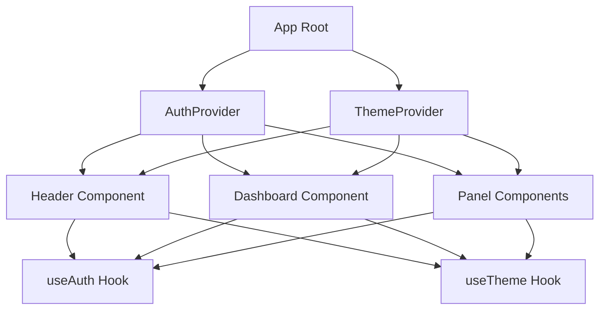
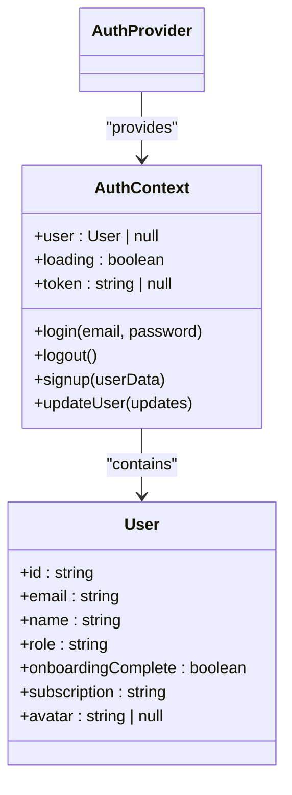
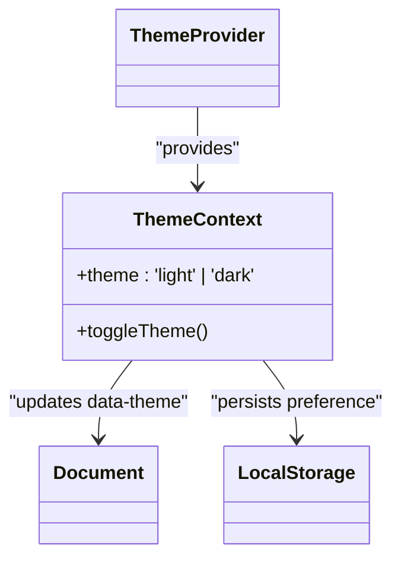
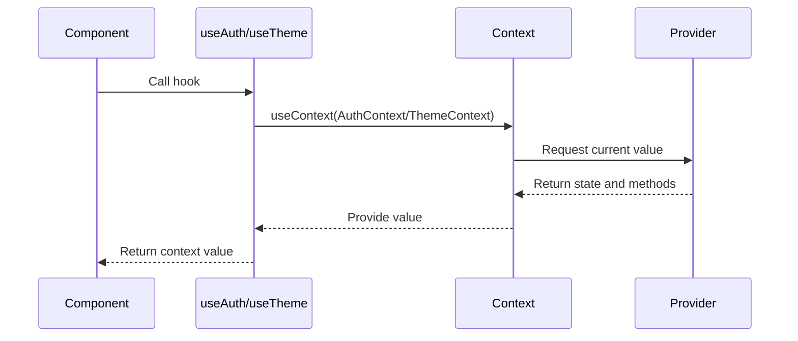

# State Management

<cite>
**Referenced Files in This Document**   
- [AuthContext.jsx](file://ui/AuthContext.jsx)
- [ThemeContext.jsx](file://ui/ThemeContext.jsx)
- [App.tsx](file://ui/App.tsx)
- [marketplace-ui/src/contexts/AuthContext.jsx](file://marketplace-ui/src/contexts/AuthContext.jsx)
- [marketplace-ui/src/contexts/ThemeContext.jsx](file://marketplace-ui/src/contexts/ThemeContext.jsx)
- [marketplace-ui/src/App.tsx](file://marketplace-ui/src/App.tsx)
- [pay-ui/src/contexts/AuthContext.jsx](file://pay-ui/src/contexts/AuthContext.jsx)
- [pay-ui/src/contexts/ThemeContext.jsx](file://pay-ui/src/contexts/ThemeContext.jsx)
- [pay-ui/src/App.tsx](file://pay-ui/src/App.tsx)
</cite>

## Table of Contents
1. [Introduction](#introduction)
2. [Context-Based State Management Pattern](#context-based-state-management-pattern)
3. [Core State Providers](#core-state-providers)
4. [Consuming and Updating State](#consuming-and-updating-state)
5. [Performance Considerations](#performance-considerations)
6. [State Persistence Strategies](#state-persistence-strategies)
7. [Debugging State Issues](#debugging-state-issues)
8. [Context vs Local State Guidance](#context-vs-local-state-guidance)

## Introduction
Azora OS frontend applications utilize React Context API for global state management across multiple UI layers and micro-frontends. The context-based pattern enables consistent state distribution for authentication, theme preferences, and user settings while maintaining loose coupling between components. This document details the implementation of AuthContext and ThemeContext providers, their integration patterns, and best practices for state management in Azora's ecosystem of applications including marketplace, payment, and compliance interfaces.

## Context-Based State Management Pattern
Azora OS implements a standardized context pattern across all frontend applications to manage global state. Each application follows a consistent structure where context providers wrap the application root, making state available to deeply nested components without prop drilling. The pattern leverages React's createContext and useContext hooks to create provider-consumer relationships that maintain reactivity and support efficient updates. Multiple context providers can coexist, allowing separation of concerns between different state domains such as authentication, theme, and user preferences.



**Diagram sources**
- [App.tsx](file://ui/App.tsx#L1-L114)
- [AuthContext.jsx](file://ui/AuthContext.jsx#L1-L91)
- [ThemeContext.jsx](file://ui/ThemeContext.jsx#L1-L34)

**Section sources**
- [App.tsx](file://ui/App.tsx#L1-L114)
- [AuthContext.jsx](file://ui/AuthContext.jsx#L1-L91)
- [ThemeContext.jsx](file://ui/ThemeContext.jsx#L1-L34)

## Core State Providers
### AuthContext Implementation
The AuthContext provider manages user authentication state across Azora OS applications. It maintains user session data including user profile, authentication token, and loading state. The context initializes by checking localStorage for existing session data during component mount. It exposes methods for login, logout, signup, and user profile updates, all of which automatically persist relevant data to localStorage for session continuity.



**Diagram sources**
- [AuthContext.jsx](file://ui/AuthContext.jsx#L1-L91)
- [marketplace-ui/src/contexts/AuthContext.jsx](file://marketplace-ui/src/contexts/AuthContext.jsx#L1-L124)
- [pay-ui/src/contexts/AuthContext.jsx](file://pay-ui/src/contexts/AuthContext.jsx#L1-L124)

**Section sources**
- [AuthContext.jsx](file://ui/AuthContext.jsx#L1-L91)
- [marketplace-ui/src/contexts/AuthContext.jsx](file://marketplace-ui/src/contexts/AuthContext.jsx#L1-L124)
- [pay-ui/src/contexts/AuthContext.jsx](file://pay-ui/src/contexts/AuthContext.jsx#L1-L124)

### ThemeContext Implementation
The ThemeContext provider manages application theme preferences with support for dark and light modes. It initializes by reading the saved theme preference from localStorage, defaulting to dark mode if no preference exists. The context updates the DOM's data-theme attribute on theme changes, enabling CSS-based theme switching. The toggleTheme function provides a simple interface for switching between available themes.



**Diagram sources**
- [ThemeContext.jsx](file://ui/ThemeContext.jsx#L1-L34)
- [marketplace-ui/src/contexts/ThemeContext.jsx](file://marketplace-ui/src/contexts/ThemeContext.jsx#L1-L40)
- [pay-ui/src/contexts/ThemeContext.jsx](file://pay-ui/src/contexts/ThemeContext.jsx#L1-L40)

**Section sources**
- [ThemeContext.jsx](file://ui/ThemeContext.jsx#L1-L34)
- [marketplace-ui/src/contexts/ThemeContext.jsx](file://marketplace-ui/src/contexts/ThemeContext.jsx#L1-L40)
- [pay-ui/src/contexts/ThemeContext.jsx](file://pay-ui/src/contexts/ThemeContext.jsx#L1-L40)

## Consuming and Updating State
### Accessing Context Values
Components consume context values through custom hooks (useAuth and useTheme) that wrap useContext. These hooks include safety checks to ensure they are used within their respective provider components. When the context value changes, React automatically re-renders all consuming components with the updated state, maintaining consistency across the application interface.



**Diagram sources**
- [AuthContext.jsx](file://ui/AuthContext.jsx#L4-L10)
- [ThemeContext.jsx](file://ui/ThemeContext.jsx#L4-L10)
- [App.tsx](file://ui/App.tsx#L1-L114)

**Section sources**
- [AuthContext.jsx](file://ui/AuthContext.jsx#L4-L10)
- [ThemeContext.jsx](file://ui/ThemeContext.jsx#L4-L10)

### Updating State
State updates occur through methods exposed by the context value. For authentication state, components call login, logout, or updateUser methods which modify the internal state and persist changes to localStorage. Theme changes are handled through the toggleTheme function, which updates the state and triggers side effects for DOM and storage updates. All state modifications are handled within the provider component to maintain encapsulation.

```mermaid
flowchart TD
A[Component Calls login()] --> B[AuthProvider Updates State]
B --> C[Persist User to localStorage]
C --> D[Re-render Consumers]
D --> E[UI Reflects New State]
F[Component Calls toggleTheme()] --> G[ThemeProvider Updates State]
G --> H[Persist Theme to localStorage]
H --> I[Update data-theme Attribute]
I --> J[CSS Applies New Theme]
J --> K[UI Updates Appearance]
```

**Diagram sources**
- [AuthContext.jsx](file://ui/AuthContext.jsx#L40-L85)
- [ThemeContext.jsx](file://ui/ThemeContext.jsx#L20-L33)

**Section sources**
- [AuthContext.jsx](file://ui/AuthContext.jsx#L40-L85)
- [ThemeContext.jsx](file://ui/ThemeContext.jsx#L20-L33)

## Performance Considerations
Context updates can trigger re-renders in all consuming components, potentially impacting performance in large applications. Azora OS mitigates this by structuring context providers to minimize unnecessary re-renders. The AuthContext and ThemeContext providers are designed to only update when their specific state changes, and consumer components are optimized to only subscribe to the state they need. For complex state scenarios, memoization techniques are applied to prevent excessive re-renders.

**Section sources**
- [AuthContext.jsx](file://ui/AuthContext.jsx#L1-L91)
- [ThemeContext.jsx](file://ui/ThemeContext.jsx#L1-L34)

## State Persistence Strategies
Azora OS applications persist critical state to localStorage to maintain user preferences and session data across browser sessions. Authentication tokens and user profiles are stored securely in localStorage, allowing automatic session restoration on application reload. Theme preferences are similarly persisted, ensuring users maintain their preferred interface appearance. The persistence mechanism is encapsulated within the context providers, abstracting storage details from consuming components.

**Section sources**
- [AuthContext.jsx](file://ui/AuthContext.jsx#L25-L35)
- [AuthContext.jsx](file://ui/AuthContext.jsx#L60-L65)
- [AuthContext.jsx](file://ui/AuthContext.jsx#L75-L78)
- [ThemeContext.jsx](file://ui/ThemeContext.jsx#L10-L14)
- [ThemeContext.jsx](file://ui/ThemeContext.jsx#L24-L26)

## Debugging State Issues
When troubleshooting state-related issues in Azora OS applications, developers should first verify the context provider hierarchy in the component tree. Common issues include accessing context values outside of provider wrappers or stale state due to improper updates. The console error messages from useAuth and useTheme hooks help identify improper usage. For persistence issues, checking localStorage entries for correct data format and expiration is recommended. React DevTools can be used to inspect context values and track state changes through component re-renders.

**Section sources**
- [AuthContext.jsx](file://ui/AuthContext.jsx#L5-L10)
- [ThemeContext.jsx](file://ui/ThemeContext.jsx#L5-L10)

## Context vs Local State Guidance
Use React Context for state that needs to be accessed by many components at different nesting levels, such as authentication status, user preferences, or theme settings. Context is ideal for global application state that affects multiple UI areas. Use local component state for data that is only relevant to a single component or a small component subtree, such as form input values, modal open states, or temporary UI flags. This distinction helps maintain performance and keeps the state management architecture clean and predictable.

**Section sources**
- [AuthContext.jsx](file://ui/AuthContext.jsx#L1-L91)
- [ThemeContext.jsx](file://ui/ThemeContext.jsx#L1-L34)
- [App.tsx](file://ui/App.tsx#L1-L114)