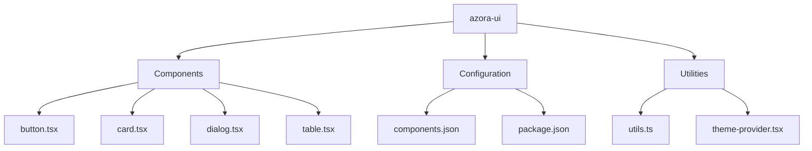
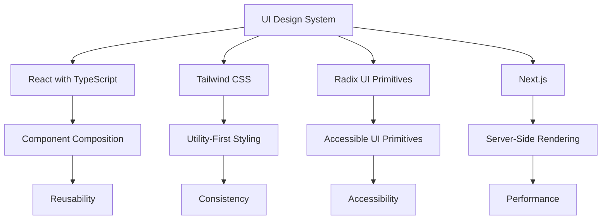
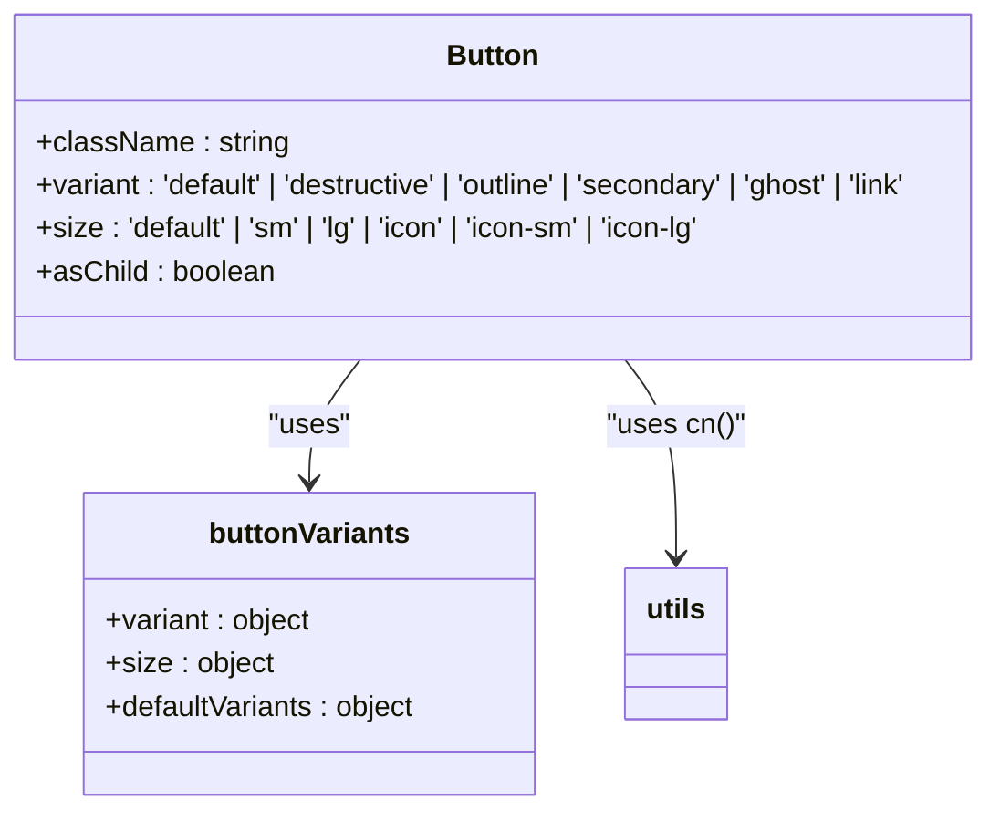
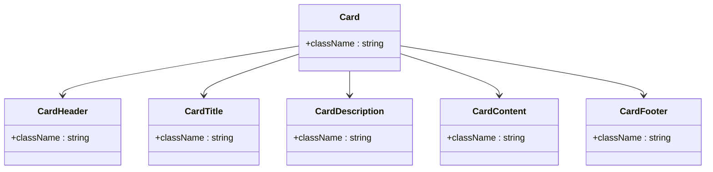
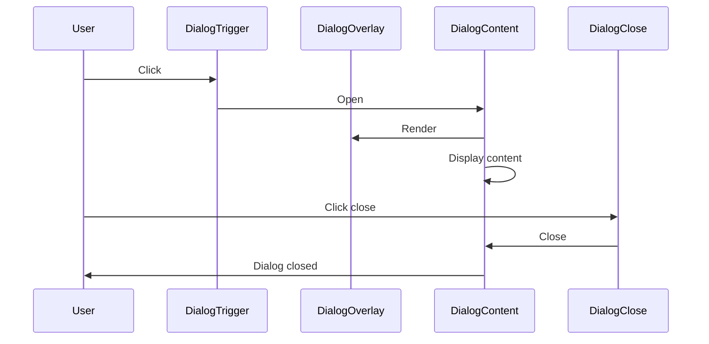
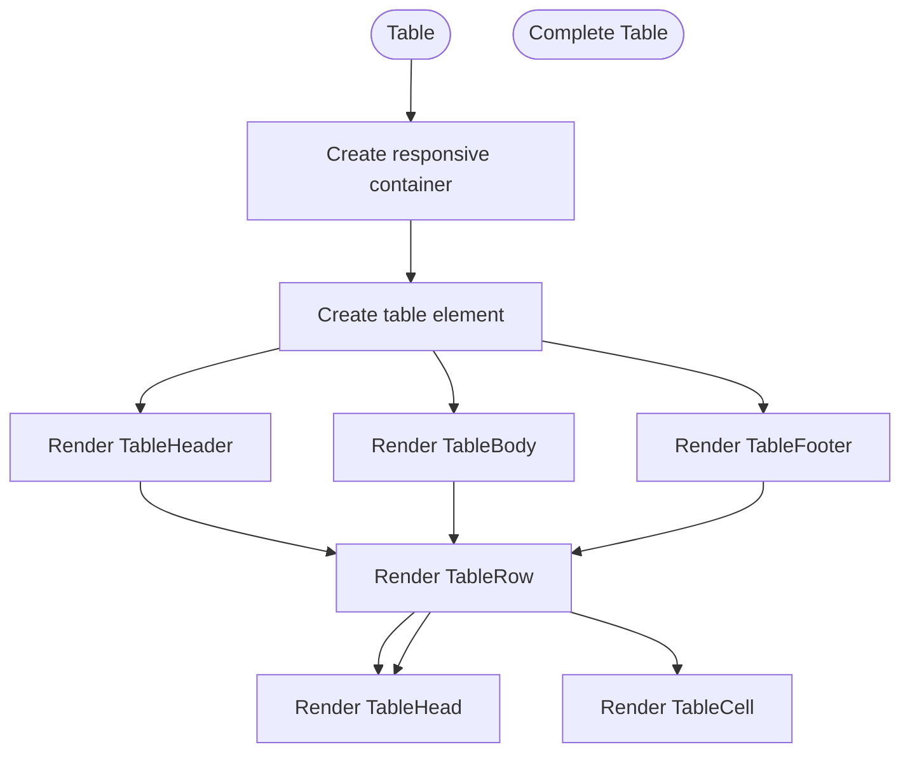

# UI Design System

<cite>
**Referenced Files in This Document**   
- [button.tsx](file://azora/azora-ui/button.tsx)
- [card.tsx](file://azora/azora-ui/card.tsx)
- [dialog.tsx](file://azora/azora-ui/dialog.tsx)
- [table.tsx](file://azora/azora-ui/table.tsx)
- [theme-provider.tsx](file://azora/azora-ui/theme-provider.tsx)
- [utils.ts](file://azora/azora-ui/utils.ts)
- [components.json](file://azora/azora-ui/components.json)
- [package.json](file://azora/azora-ui/package.json)
- [globals.css](file://ui/globals.css)
- [App.tsx](file://ui/App.tsx)
</cite>

## Table of Contents
1. [Introduction](#introduction)
2. [Project Structure](#project-structure)
3. [Core Components](#core-components)
4. [Architecture Overview](#architecture-overview)
5. [Detailed Component Analysis](#detailed-component-analysis)
6. [Dependency Analysis](#dependency-analysis)
7. [Performance Considerations](#performance-considerations)
8. [Troubleshooting Guide](#troubleshooting-guide)
9. [Conclusion](#conclusion)

## Introduction
The Azora OS UI Design System is a comprehensive React with TypeScript component library that ensures consistency, accessibility, and responsiveness across all frontend applications within the Azora ecosystem. Built on modern design principles and leveraging powerful UI primitives, the system provides a cohesive experience while enabling flexible customization through theming. This documentation details the implementation, design philosophy, and practical usage of key components that form the foundation of Azora's user interface.

## Project Structure
The UI Design System is organized in a modular structure within the `azora/azora-ui` directory, containing individual component files, configuration files, and styling assets. The system follows a component-driven architecture with clear separation of concerns, making it easy to maintain and extend. The structure promotes reusability and consistency across different applications within the Azora ecosystem.



**Diagram sources**
- [azora-ui](file://azora/azora-ui)

**Section sources**
- [azora-ui](file://azora/azora-ui)

## Core Components
The UI Design System provides a rich set of core components that serve as the building blocks for Azora's applications. These components are designed with accessibility, responsiveness, and theming capabilities in mind, ensuring a consistent user experience across different devices and contexts. The system leverages React with TypeScript to provide type safety and better developer experience.

**Section sources**
- [button.tsx](file://azora/azora-ui/button.tsx)
- [card.tsx](file://azora/azora-ui/card.tsx)
- [dialog.tsx](file://azora/azora-ui/dialog.tsx)
- [table.tsx](file://azora/azora-ui/table.tsx)

## Architecture Overview
The UI Design System architecture is built on a foundation of modern web technologies and design principles. It leverages React with TypeScript for type safety and component composition, Tailwind CSS for utility-first styling, and Next.js for server-side rendering and routing. The system is designed to be modular, extensible, and maintainable, with a clear separation between presentation and logic.



**Diagram sources**
- [package.json](file://azora/azora-ui/package.json)
- [components.json](file://azora/azora-ui/components.json)

## Detailed Component Analysis

### Button Component Analysis
The Button component is a fundamental interactive element in the UI Design System, providing various visual styles and sizes to accommodate different use cases. It is implemented using the class-variance-authority (CVA) library for variant management, allowing for easy customization and consistency across the application.



**Diagram sources**
- [button.tsx](file://azora/azora-ui/button.tsx)
- [utils.ts](file://azora/azora-ui/utils.ts)

**Section sources**
- [button.tsx](file://azora/azora-ui/button.tsx)

### Card Component Analysis
The Card component serves as a container for related content, providing a consistent visual structure for information display. It is composed of several sub-components (CardHeader, CardTitle, CardDescription, CardContent, CardFooter) that work together to create a flexible and accessible layout.



**Diagram sources**
- [card.tsx](file://azora/azora-ui/card.tsx)

**Section sources**
- [card.tsx](file://azora/azora-ui/card.tsx)

### Dialog Component Analysis
The Dialog component provides a modal interface for displaying content that requires user attention. Built on Radix UI's Dialog primitive, it ensures accessibility and proper focus management. The component supports various sub-components for different parts of the dialog (header, footer, title, description) and includes built-in close functionality.



**Diagram sources**
- [dialog.tsx](file://azora/azora-ui/dialog.tsx)

**Section sources**
- [dialog.tsx](file://azora/azora-ui/dialog.tsx)

### Table Component Analysis
The Table component provides a structured way to display tabular data with built-in responsiveness and accessibility features. It is composed of several sub-components (TableHeader, TableBody, TableFooter, TableRow, TableHead, TableCell) that work together to create a flexible and accessible table layout.



**Diagram sources**
- [table.tsx](file://azora/azora-ui/table.tsx)

**Section sources**
- [table.tsx](file://azora/azora-ui/table.tsx)

## Dependency Analysis
The UI Design System relies on a carefully selected set of dependencies that provide essential functionality while maintaining a lean bundle size. The dependencies are organized into direct dependencies for runtime functionality and devDependencies for development tools and type definitions.

```mermaid
graph TD
A[UI Design System] --> B[@radix-ui/react-*]
A --> C[class-variance-authority]
A --> D[clsx]
A --> E[tailwind-merge]
A --> F[lucide-react]
A --> G[next-themes]
A --> H[sonner]
B --> I[Accessible UI Primitives]
C --> J[Variant Management]
D --> K[Conditional Classnames]
E --> L[Classname Merging]
F --> M[Icons]
G --> N[Theme Management]
H --> O[Toasts]
```

**Diagram sources**
- [package.json](file://azora/azora-ui/package.json)

**Section sources**
- [package.json](file://azora/azora-ui/package.json)

## Performance Considerations
The UI Design System is optimized for performance through various techniques such as code splitting, lazy loading, and efficient rendering patterns. Components are designed to minimize re-renders and optimize the critical rendering path, ensuring a smooth user experience even on lower-powered devices.

## Troubleshooting Guide
When implementing components from the UI Design System, ensure that all required dependencies are properly installed and configured. Check that the theme provider is correctly set up in your application and that the Tailwind CSS configuration is properly linked. For accessibility issues, verify that all interactive elements have proper keyboard navigation and screen reader support.

**Section sources**
- [theme-provider.tsx](file://azora/azora-ui/theme-provider.tsx)
- [utils.ts](file://azora/azora-ui/utils.ts)

## Conclusion
The Azora OS UI Design System provides a robust foundation for building consistent, accessible, and responsive user interfaces across the Azora ecosystem. By leveraging modern web technologies and design principles, the system enables developers to create high-quality applications efficiently while maintaining a cohesive user experience. The component library is designed to be extensible and customizable, allowing teams to adapt it to their specific needs while preserving design consistency.