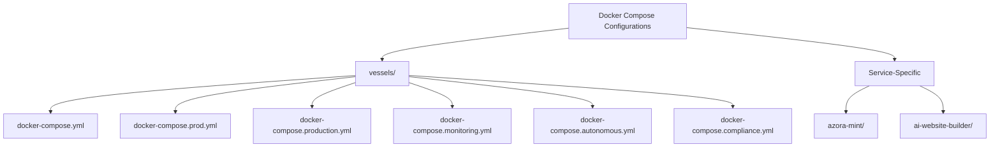
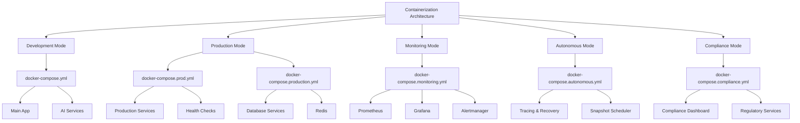
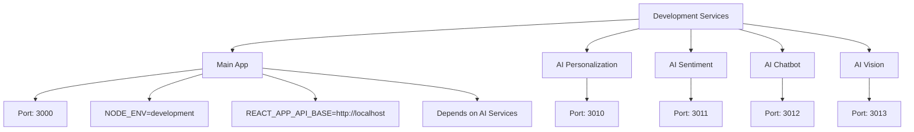
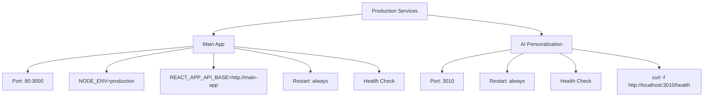
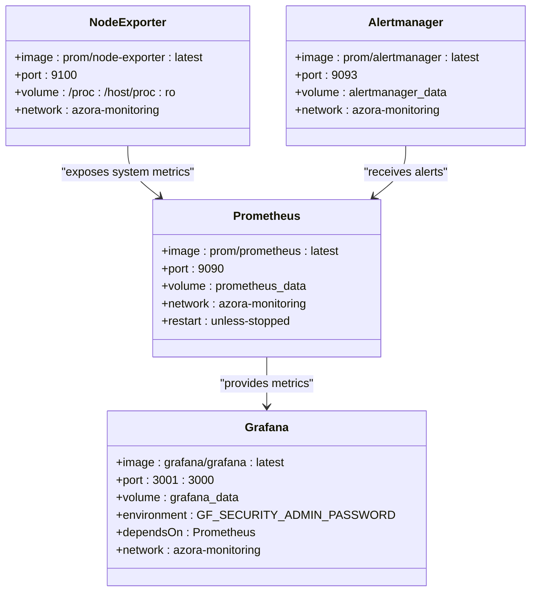
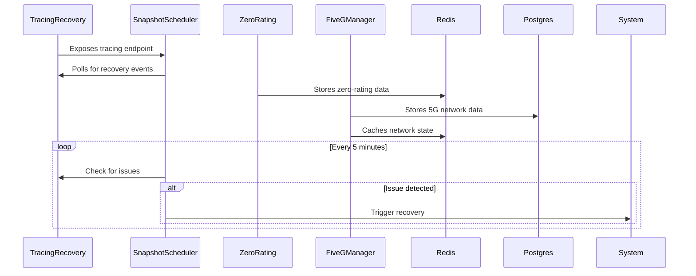
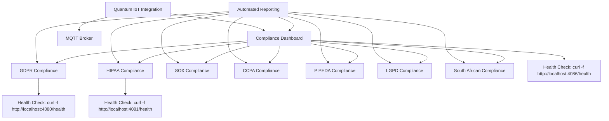
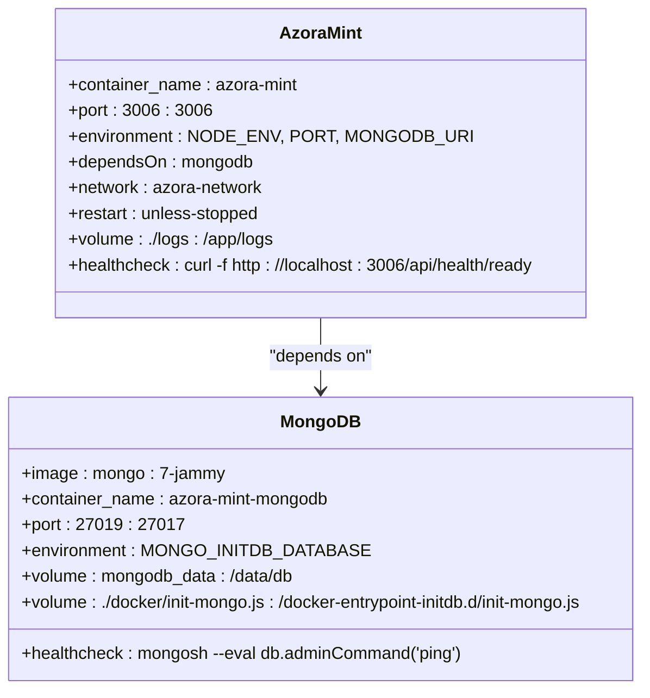
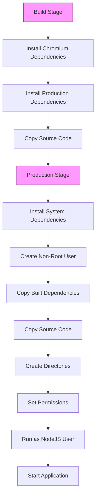
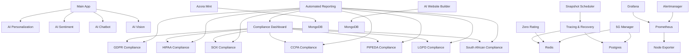

# Containerization Strategy

<cite>
**Referenced Files in This Document**   
- [docker-compose.yml](file://vessels/docker-compose.yml)
- [docker-compose.prod.yml](file://vessels/docker-compose.prod.yml)
- [docker-compose.production.yml](file://vessels/docker-compose.production.yml)
- [docker-compose.monitoring.yml](file://vessels/docker-compose.monitoring.yml)
- [docker-compose.autonomous.yml](file://vessels/docker-compose.autonomous.yml)
- [docker-compose.compliance.yml](file://vessels/docker-compose.compliance.yml)
- [prometheus.yml](file://infrastructure/monitoring/prometheus.yml)
- [alertmanager.yml](file://infrastructure/monitoring/alertmanager.yml)
- [azora-mint/docker-compose.yml](file://services/azora-mint/docker-compose.yml)
- [ai-website-builder/docker-compose.yml](file://organs/ai-website-builder/docker-compose.yml)
- [Dockerfile](file://organs/ai-website-builder/docker/Dockerfile)
- [Dockerfile](file://services/azora-mint/docker/Dockerfile)
</cite>

## Table of Contents
1. [Introduction](#introduction)
2. [Project Structure](#project-structure)
3. [Core Components](#core-components)
4. [Architecture Overview](#architecture-overview)
5. [Detailed Component Analysis](#detailed-component-analysis)
6. [Dependency Analysis](#dependency-analysis)
7. [Performance Considerations](#performance-considerations)
8. [Troubleshooting Guide](#troubleshooting-guide)
9. [Conclusion](#conclusion)

## Introduction
Azora OS implements a comprehensive Docker-based containerization strategy to manage its complex microservices architecture. The system utilizes multi-service docker-compose configurations to support different operational modes including development, production, monitoring, autonomous operations, and compliance. This documentation details the implementation of containerization across various environments, explaining service definitions, network configurations, volume mounts, and environment variables. It also covers practical management of containerized services and addresses common containerization challenges.

## Project Structure
The containerization strategy is organized through multiple docker-compose files located primarily in the `vessels/` directory, with additional service-specific configurations in individual service directories. The main configuration files include:
- `docker-compose.yml`: Development environment configuration
- `docker-compose.prod.yml`: Production-ready configuration with health checks
- `docker-compose.production.yml`: Full production deployment with database services
- `docker-compose.monitoring.yml`: Monitoring stack with Prometheus, Grafana, and Alertmanager
- `docker-compose.autonomous.yml`: Autonomous operations services
- `docker-compose.compliance.yml`: Compliance and regulatory services

Each service may also have its own docker-compose configuration for isolated development and testing.

**Diagram sources**
- [docker-compose.yml](file://vessels/docker-compose.yml)
- [docker-compose.prod.yml](file://vessels/docker-compose.prod.yml)
- [docker-compose.production.yml](file://vessels/docker-compose.production.yml)
- [docker-compose.monitoring.yml](file://vessels/docker-compose.monitoring.yml)
- [docker-compose.autonomous.yml](file://vessels/docker-compose.autonomous.yml)
- [docker-compose.compliance.yml](file://vessels/docker-compose.compliance.yml)
- [azora-mint/docker-compose.yml](file://services/azora-mint/docker-compose.yml)
- [ai-website-builder/docker-compose.yml](file://organs/ai-website-builder/docker-compose.yml)

**Section sources**
- [vessels/](file://vessels/)
- [services/](file://services/)
- [organs/](file://organs/)

## Core Components
The containerization strategy centers around several core components that enable Azora OS to operate efficiently across different environments. These include the main application container, AI services, database services, monitoring infrastructure, and compliance services. Each component is containerized with specific configurations for resource allocation, networking, and health monitoring. The system leverages Docker's multi-stage builds for image optimization and implements health checks for service reliability.

**Section sources**
- [docker-compose.yml](file://vessels/docker-compose.yml)
- [docker-compose.prod.yml](file://vessels/docker-compose.prod.yml)
- [docker-compose.production.yml](file://vessels/docker-compose.production.yml)

## Architecture Overview
Azora OS employs a multi-layered containerization architecture that supports different operational modes through specialized docker-compose configurations. The architecture separates concerns by environment, with distinct configurations for development, production, monitoring, autonomous operations, and compliance. Services are organized into logical groups that can be deployed independently based on operational requirements.

**Diagram sources**
- [docker-compose.yml](file://vessels/docker-compose.yml)
- [docker-compose.prod.yml](file://vessels/docker-compose.prod.yml)
- [docker-compose.production.yml](file://vessels/docker-compose.production.yml)
- [docker-compose.monitoring.yml](file://vessels/docker-compose.monitoring.yml)
- [docker-compose.autonomous.yml](file://vessels/docker-compose.autonomous.yml)
- [docker-compose.compliance.yml](file://vessels/docker-compose.compliance.yml)

## Detailed Component Analysis

### Development Environment Configuration
The development environment configuration in `docker-compose.yml` defines the basic service structure for local development. It includes the main application and various AI services with development-specific settings.

**Diagram sources**
- [docker-compose.yml](file://vessels/docker-compose.yml)

**Section sources**
- [docker-compose.yml](file://vessels/docker-compose.yml)

### Production Environment Configuration
The production environment configuration includes enhanced reliability features such as health checks and restart policies to ensure service availability.

**Diagram sources**
- [docker-compose.prod.yml](file://vessels/docker-compose.prod.yml)

**Section sources**
- [docker-compose.prod.yml](file://vessels/docker-compose.prod.yml)

### Monitoring Stack Configuration
The monitoring stack provides comprehensive observability for the containerized environment with Prometheus, Grafana, and supporting components.

**Diagram sources**
- [docker-compose.monitoring.yml](file://vessels/docker-compose.monitoring.yml)
- [prometheus.yml](file://infrastructure/monitoring/prometheus.yml)
- [alertmanager.yml](file://infrastructure/monitoring/alertmanager.yml)

**Section sources**
- [docker-compose.monitoring.yml](file://vessels/docker-compose.monitoring.yml)

### Autonomous Operations Configuration
The autonomous operations configuration supports self-healing and automated recovery capabilities.

**Diagram sources**
- [docker-compose.autonomous.yml](file://vessels/docker-compose.autonomous.yml)

**Section sources**
- [docker-compose.autonomous.yml](file://vessels/docker-compose.autonomous.yml)

### Compliance Configuration
The compliance configuration manages regulatory requirements across multiple jurisdictions.

**Diagram sources**
- [docker-compose.compliance.yml](file://vessels/docker-compose.compliance.yml)

**Section sources**
- [docker-compose.compliance.yml](file://vessels/docker-compose.compliance.yml)

### Service-Specific Configuration Example: Azora Mint
The azora-mint service demonstrates a complete service-specific containerization configuration with MongoDB dependency.

**Diagram sources**
- [azora-mint/docker-compose.yml](file://services/azora-mint/docker-compose.yml)

**Section sources**
- [azora-mint/docker-compose.yml](file://services/azora-mint/docker-compose.yml)

### Service-Specific Configuration Example: AI Website Builder
The AI website builder service includes specialized requirements for browser automation.

**Diagram sources**
- [ai-website-builder/docker-compose.yml](file://organs/ai-website-builder/docker-compose.yml)
- [Dockerfile](file://organs/ai-website-builder/docker/Dockerfile)

**Section sources**
- [ai-website-builder/docker-compose.yml](file://organs/ai-website-builder/docker-compose.yml)

## Dependency Analysis
The containerization strategy reveals a complex dependency graph where services depend on each other for functionality. The main application depends on various AI services, while specialized services like compliance and monitoring have their own dependency chains. Database services are shared across multiple applications, creating a centralized data layer. The system uses Docker networks to manage service communication and environment variables for configuration.

**Diagram sources**
- [docker-compose.yml](file://vessels/docker-compose.yml)
- [docker-compose.prod.yml](file://vessels/docker-compose.prod.yml)
- [docker-compose.production.yml](file://vessels/docker-compose.production.yml)
- [docker-compose.monitoring.yml](file://vessels/docker-compose.monitoring.yml)
- [docker-compose.autonomous.yml](file://vessels/docker-compose.autonomous.yml)
- [docker-compose.compliance.yml](file://vessels/docker-compose.compliance.yml)
- [azora-mint/docker-compose.yml](file://services/azora-mint/docker-compose.yml)
- [ai-website-builder/docker-compose.yml](file://organs/ai-website-builder/docker-compose.yml)

**Section sources**
- [vessels/](file://vessels/)
- [services/](file://services/)
- [organs/](file://organs/)

## Performance Considerations
The containerization strategy incorporates several performance optimizations. Multi-stage Docker builds reduce image sizes by separating build and production environments. Health checks ensure service reliability and enable automatic recovery. Resource limits in production configurations prevent any single service from consuming excessive resources. The monitoring stack provides visibility into service performance, allowing for data-driven optimization decisions. Service dependencies are carefully managed to minimize startup time and ensure proper initialization order.

**Section sources**
- [Dockerfile](file://organs/ai-website-builder/docker/Dockerfile)
- [Dockerfile](file://services/azora-mint/docker/Dockerfile)
- [docker-compose.production.yml](file://vessels/docker-compose.production.yml)

## Troubleshooting Guide
When troubleshooting containerization issues, consider the following common scenarios:

1. **Service fails to start**: Check container logs with `docker logs <container_name>` and verify environment variables and dependencies.

2. **Health checks failing**: Ensure the service is properly exposing the health endpoint and that dependencies are available.

3. **Database connection issues**: Verify database service is running and connection strings are correct.

4. **Port conflicts**: Check for port conflicts with other services or host applications.

5. **Volume mounting issues**: Ensure host paths exist and have proper permissions.

6. **Network connectivity problems**: Verify services are on the same network and can resolve each other's hostnames.

Use the monitoring stack (Prometheus, Grafana, Alertmanager) to identify performance bottlenecks and service degradation.

**Section sources**
- [docker-compose.monitoring.yml](file://vessels/docker-compose.monitoring.yml)
- [docker-compose.yml](file://vessels/docker-compose.yml)
- [docker-compose.prod.yml](file://vessels/docker-compose.prod.yml)

## Conclusion
Azora OS's containerization strategy provides a robust foundation for deploying and managing its complex microservices architecture. Through specialized docker-compose configurations for different operational modes, the system achieves flexibility, reliability, and scalability. The implementation demonstrates best practices in containerization, including multi-stage builds, health checks, proper networking, and comprehensive monitoring. This approach enables efficient development, reliable production deployments, and effective system observability.