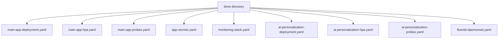
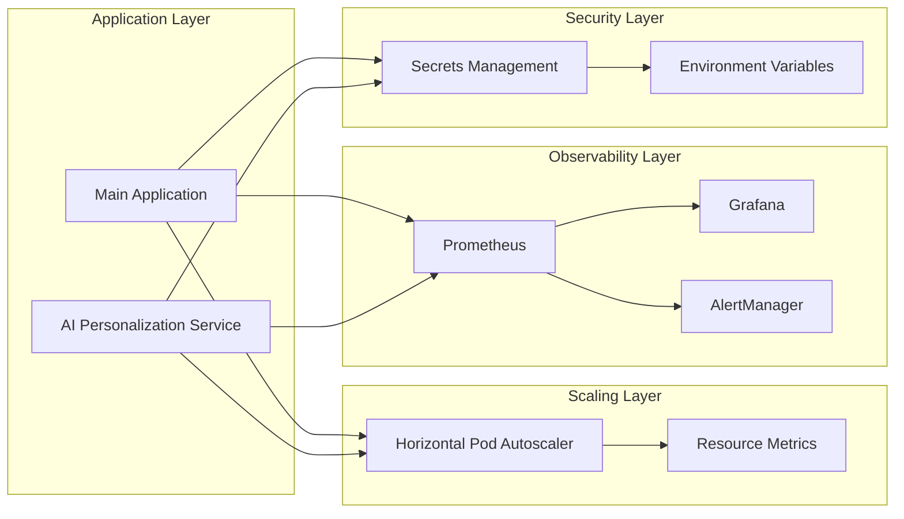
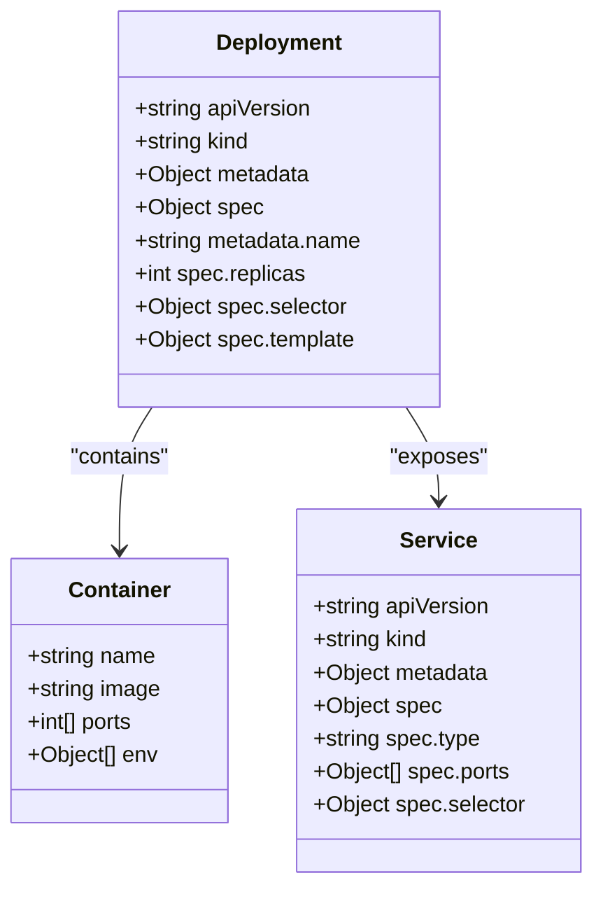
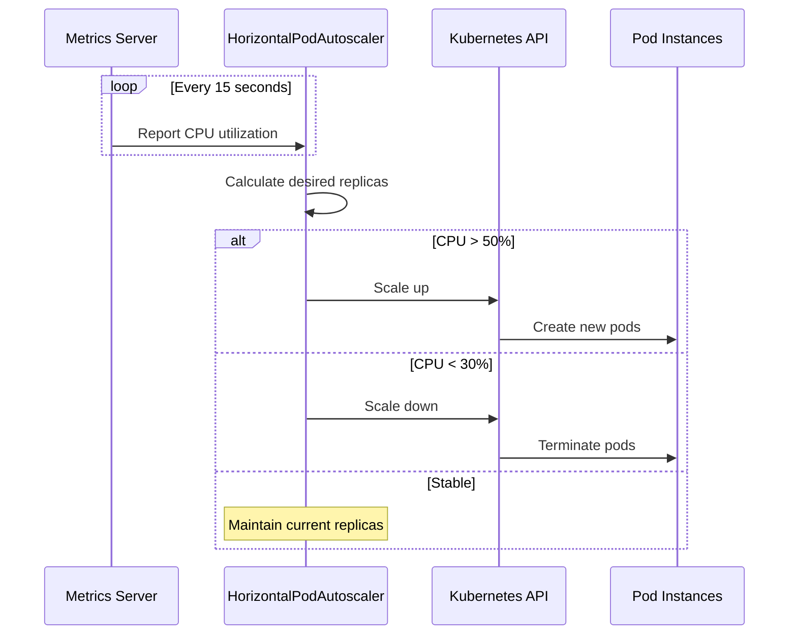
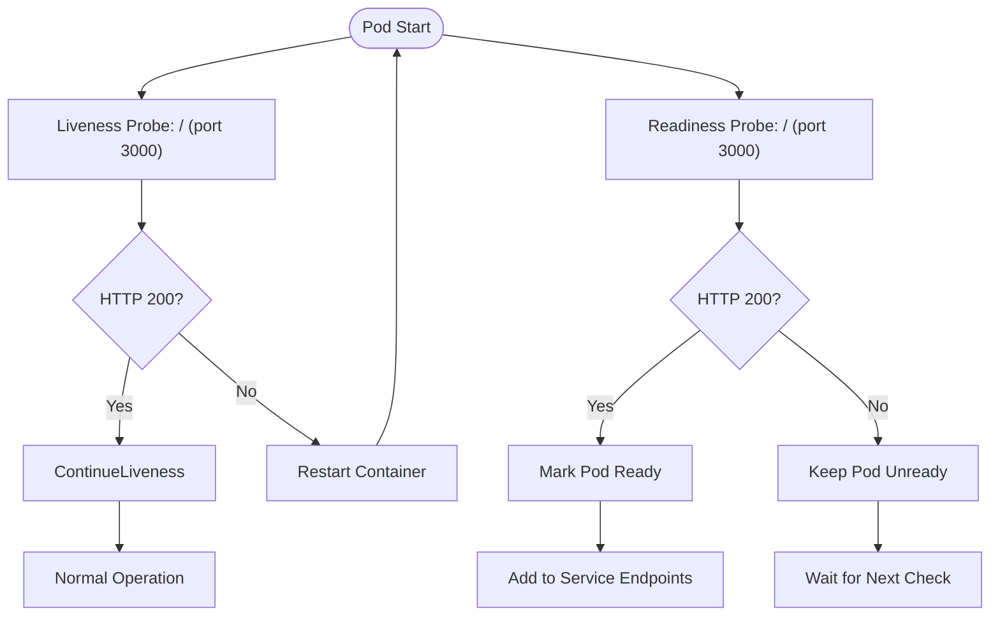
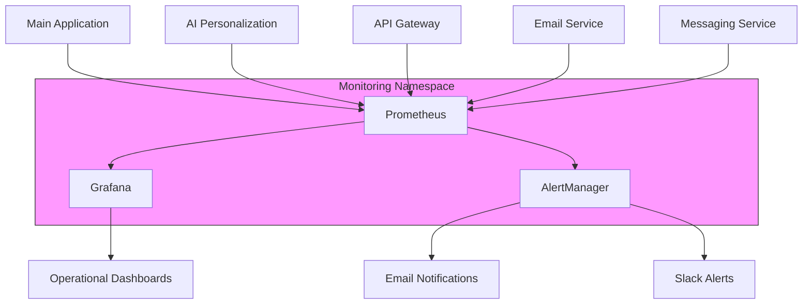
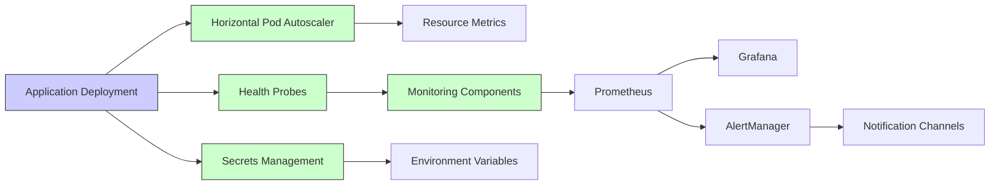

# Deployment Configurations

<cite>
**Referenced Files in This Document**   
- [main-app-deployment.yaml](file://biome/main-app-deployment.yaml)
- [main-app-hpa.yaml](file://biome/main-app-hpa.yaml)
- [main-app-probes.yaml](file://biome/main-app-probes.yaml)
- [app-secrets.yaml](file://biome/app-secrets.yaml)
- [monitoring-stack.yaml](file://biome/monitoring-stack.yaml)
- [ai-personalization-deployment.yaml](file://biome/ai-personalization-deployment.yaml)
- [ai-personalization-hpa.yaml](file://biome/ai-personalization-hpa.yaml)
- [ai-personalization-probes.yaml](file://biome/ai-personalization-probes.yaml)
- [prometheus.yml](file://infrastructure/monitoring/prometheus.yml)
- [alertmanager.yml](file://infrastructure/monitoring/alertmanager.yml)
- [MONITORING.md](file://codex/MONITORING.md)
</cite>

## Table of Contents
1. [Introduction](#introduction)
2. [Project Structure](#project-structure)
3. [Core Components](#core-components)
4. [Architecture Overview](#architecture-overview)
5. [Detailed Component Analysis](#detailed-component-analysis)
6. [Dependency Analysis](#dependency-analysis)
7. [Performance Considerations](#performance-considerations)
8. [Troubleshooting Guide](#troubleshooting-guide)
9. [Conclusion](#conclusion)

## Introduction
This document provides comprehensive guidance on deployment configurations in Azora OS, focusing on environment-specific settings managed through YAML files in the biome directory. It details the implementation of application deployments, horizontal pod autoscalers (HPA), and health probes, with practical examples for configuring application secrets, resource scaling policies, and monitoring stack components. The document also explains how these configurations contribute to system resilience and service availability.

## Project Structure

The biome directory contains all deployment configuration files for Azora OS, organized by service and configuration type. Each service has dedicated YAML files for deployment, horizontal pod autoscaling, and health probes, ensuring separation of concerns and easier management.



**Diagram sources**
- [main-app-deployment.yaml](file://biome/main-app-deployment.yaml)
- [ai-personalization-deployment.yaml](file://biome/ai-personalization-deployment.yaml)
- [monitoring-stack.yaml](file://biome/monitoring-stack.yaml)

**Section sources**
- [biome](file://biome)

## Core Components

The deployment configuration system in Azora OS consists of several core components that work together to ensure reliable and scalable application deployment. These include deployment manifests, horizontal pod autoscalers, health probes, secret management, and monitoring infrastructure.

**Section sources**
- [main-app-deployment.yaml](file://biome/main-app-deployment.yaml)
- [main-app-hpa.yaml](file://biome/main-app-hpa.yaml)
- [main-app-probes.yaml](file://biome/main-app-probes.yaml)
- [app-secrets.yaml](file://biome/app-secrets.yaml)
- [monitoring-stack.yaml](file://biome/monitoring-stack.yaml)

## Architecture Overview

The deployment architecture in Azora OS follows a microservices pattern with Kubernetes-native configuration management. Each service is independently deployable with its own scaling policies and health checks, while sharing common infrastructure components like monitoring and secret management.



**Diagram sources**
- [main-app-deployment.yaml](file://biome/main-app-deployment.yaml)
- [main-app-hpa.yaml](file://biome/main-app-hpa.yaml)
- [monitoring-stack.yaml](file://biome/monitoring-stack.yaml)
- [app-secrets.yaml](file://biome/app-secrets.yaml)

## Detailed Component Analysis

### Application Deployment Configuration

The application deployment configuration defines the desired state for application pods, including container specifications, replicas, and network settings. The main application deployment specifies two replicas with environment variables for production configuration.



**Diagram sources**
- [main-app-deployment.yaml](file://biome/main-app-deployment.yaml)
- [ai-personalization-deployment.yaml](file://biome/ai-personalization-deployment.yaml)

**Section sources**
- [main-app-deployment.yaml](file://biome/main-app-deployment.yaml#L1-L36)
- [ai-personalization-deployment.yaml](file://biome/ai-personalization-deployment.yaml#L1-L31)

### Horizontal Pod Autoscaler Implementation

The Horizontal Pod Autoscaler (HPA) automatically scales the number of pods based on observed CPU utilization. The main application HPA maintains between 2 and 10 replicas, scaling when CPU usage averages 50% across pods. The AI personalization service has a higher threshold of 60% CPU utilization due to its computational nature.



**Diagram sources**
- [main-app-hpa.yaml](file://biome/main-app-hpa.yaml)
- [ai-personalization-hpa.yaml](file://biome/ai-personalization-hpa.yaml)

**Section sources**
- [main-app-hpa.yaml](file://biome/main-app-hpa.yaml#L1-L18)
- [ai-personalization-hpa.yaml](file://biome/ai-personalization-hpa.yaml#L1-L18)

### Health Probes Configuration

Health probes ensure application reliability by monitoring liveness and readiness. The main application uses HTTP probes on port 3000 with a 30-second initial delay for liveness and 10-second delay for readiness. The AI personalization service uses a dedicated /health endpoint on port 3010.



**Diagram sources**
- [main-app-probes.yaml](file://biome/main-app-probes.yaml)
- [ai-personalization-probes.yaml](file://biome/ai-personalization-probes.yaml)

**Section sources**
- [main-app-probes.yaml](file://biome/main-app-probes.yaml#L1-L21)
- [ai-personalization-probes.yaml](file://biome/ai-personalization-probes.yaml#L1-L21)

### Secret Management

Application secrets are securely managed using Kubernetes Secrets. The app-secrets.yaml file contains base64-encoded values for sensitive information like JWT secrets and database URLs, preventing exposure in configuration files.

```mermaid
classDiagram
class Secret {
+string apiVersion
+string kind
+Object metadata
+string type
+Object data
}
class Application {
+string name
+string image
}
class Environment {
+string name
+string valueFrom
}
Application --> Environment : "uses"
Environment --> Secret : "references"
Secret --> data : "contains"
note right of Secret
Data stored in base64 encoding
JWT_SECRET : c3VwZXJzZWNyZXQ=
DATABASE_URL : cG9zdGdyZXM6Ly91c2VyOnBhc3NAaG9zdC9kYg==
end note
```

**Diagram sources**
- [app-secrets.yaml](file://biome/app-secrets.yaml)

**Section sources**
- [app-secrets.yaml](file://biome/app-secrets.yaml#L1-L8)

### Monitoring Stack Configuration

The monitoring stack provides comprehensive observability with Prometheus for metrics collection, Grafana for visualization, and AlertManager for notifications. All components are deployed in a dedicated monitoring namespace with appropriate services and endpoints.



**Diagram sources**
- [monitoring-stack.yaml](file://biome/monitoring-stack.yaml)
- [prometheus.yml](file://infrastructure/monitoring/prometheus.yml)
- [alertmanager.yml](file://infrastructure/monitoring/alertmanager.yml)

**Section sources**
- [monitoring-stack.yaml](file://biome/monitoring-stack.yaml#L1-L70)
- [prometheus.yml](file://infrastructure/monitoring/prometheus.yml#L1-L89)
- [alertmanager.yml](file://infrastructure/monitoring/alertmanager.yml#L1-L35)

## Dependency Analysis

The deployment configurations have several key dependencies that ensure proper functionality and integration across the system.



**Diagram sources**
- [main-app-deployment.yaml](file://biome/main-app-deployment.yaml)
- [main-app-hpa.yaml](file://biome/main-app-hpa.yaml)
- [main-app-probes.yaml](file://biome/main-app-probes.yaml)
- [app-secrets.yaml](file://biome/app-secrets.yaml)
- [monitoring-stack.yaml](file://biome/monitoring-stack.yaml)

**Section sources**
- [main-app-deployment.yaml](file://biome/main-app-deployment.yaml)
- [main-app-hpa.yaml](file://biome/main-app-hpa.yaml)
- [main-app-probes.yaml](file://biome/main-app-probes.yaml)
- [app-secrets.yaml](file://biome/app-secrets.yaml)
- [monitoring-stack.yaml](file://biome/monitoring-stack.yaml)

## Performance Considerations

The deployment configurations are designed with performance and scalability in mind. The HPA settings balance responsiveness with stability, avoiding rapid scaling fluctuations. The monitoring stack is configured with appropriate scrape intervals to minimize overhead while maintaining timely metrics collection.

**Section sources**
- [main-app-hpa.yaml](file://biome/main-app-hpa.yaml)
- [prometheus.yml](file://infrastructure/monitoring/prometheus.yml)

## Troubleshooting Guide

Common deployment issues and their solutions include:

- **Pods not starting**: Check secret decoding and environment variable configuration
- **HPA not scaling**: Verify metrics server availability and CPU usage thresholds
- **Health probes failing**: Validate application endpoints and probe timing settings
- **Monitoring gaps**: Confirm scrape configurations and service discovery settings

**Section sources**
- [main-app-probes.yaml](file://biome/main-app-probes.yaml)
- [monitoring-stack.yaml](file://biome/monitoring-stack.yaml)
- [prometheus.yml](file://infrastructure/monitoring/prometheus.yml)

## Conclusion

The deployment configurations in Azora OS provide a robust foundation for reliable and scalable application deployment. By leveraging Kubernetes-native features like deployments, horizontal pod autoscalers, and health probes, the system ensures high availability and automatic adaptation to changing load conditions. The integration with a comprehensive monitoring stack enables proactive issue detection and resolution, while secure secret management protects sensitive configuration data. These configurations can be adapted for different environments by modifying replica counts, resource limits, and scaling thresholds based on specific requirements and traffic patterns.