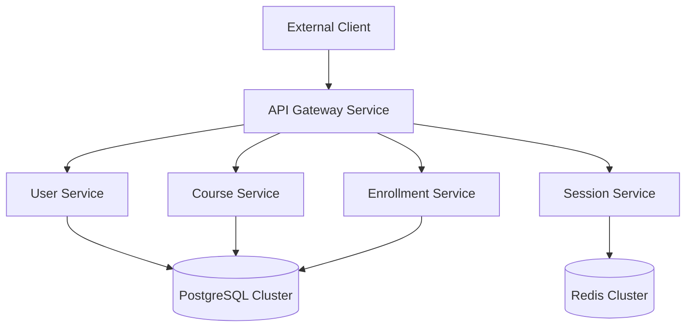
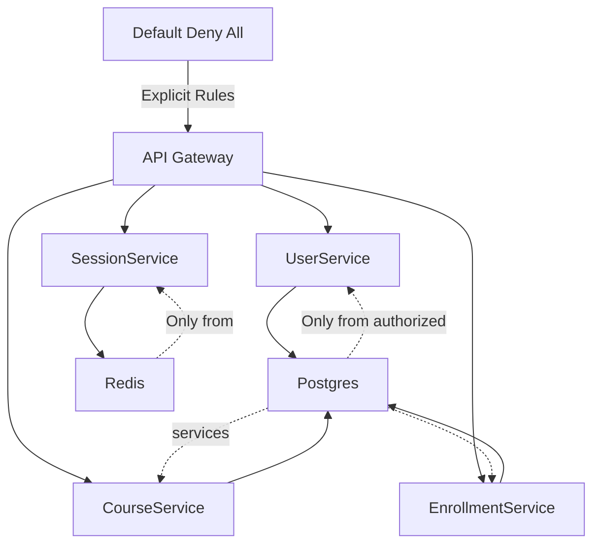

# Infrastructure and Deployment

<cite>
**Referenced Files in This Document**   
- [docker-compose.yml](file://vessels/docker-compose.yml)
- [Dockerfile](file://organs/accessibility/Dockerfile)
- [main-app-deployment.yaml](file://biome/main-app-deployment.yaml)
- [api-gateway.yaml](file://infrastructure/k8s/api-gateway.yaml)
- [user-service.yaml](file://infrastructure/k8s/user-service.yaml)
- [session-service.yaml](file://infrastructure/k8s/session-service.yaml)
- [course-service.yaml](file://infrastructure/k8s/course-service.yaml)
- [enrollment-service.yaml](file://infrastructure/k8s/enrollment-service.yaml)
- [postgres-cluster.yaml](file://infrastructure/k8s/postgres-cluster.yaml)
- [network-policies.yaml](file://infrastructure/k8s/network-policies.yaml)
- [ai-agent-service.yaml](file://infrastructure/k8s/ai-agent-service.yaml)
- [analytics-service.yaml](file://infrastructure/k8s/analytics-service.yaml)
- [llm-wrapper-service.yaml](file://infrastructure/k8s/llm-wrapper-service.yaml)
- [redis-cluster.yaml](file://infrastructure/k8s/redis-cluster.yaml)
</cite>

## Table of Contents
1. [Introduction](#introduction)
2. [Containerization Strategy](#containerization-strategy)
3. [Kubernetes Orchestration](#kubernetes-orchestration)
4. [Deployment Pipelines](#deployment-pipelines)
5. [Network Policies and Security](#network-policies-and-security)
6. [Service Configuration and Interactions](#service-configuration-and-interactions)
7. [Multi-Environment Deployment Examples](#multi-environment-deployment-examples)
8. [Scaling and Monitoring](#scaling-and-monitoring)
9. [Disaster Recovery and High Availability](#disaster-recovery-and-high-availability)
10. [Configuration Guidance for Deployment Scenarios](#configuration-guidance-for-deployment-scenarios)

## Introduction
Azora OS implements a modern cloud-native infrastructure strategy centered on containerization and orchestration. The system leverages Docker for consistent packaging and Kubernetes for robust orchestration across environments. This document details the implementation of deployment pipelines, network policies, service configurations, and operational practices that enable reliable, scalable, and secure deployments of the Azora ecosystem.

## Containerization Strategy
Azora OS employs Docker as the primary containerization technology to ensure consistency across development, testing, and production environments. Each microservice within the Azora ecosystem is packaged with its dependencies into a lightweight container image, enabling reproducible deployments.

The containerization approach follows best practices by using minimal base images such as `node:20-alpine` to reduce attack surface and improve startup times. The standard Dockerfile structure includes dependency installation, code copying, port exposure, and execution commands, ensuring uniform build processes across services.

Multiple Docker Compose configurations support different deployment scenarios, including autonomous operations, compliance enforcement, monitoring, and production workloads. These compose files define service relationships, network configurations, and environment-specific settings.

**Section sources**
- [docker-compose.yml](file://vessels/docker-compose.yml)
- [Dockerfile](file://organs/accessibility/Dockerfile)

## Kubernetes Orchestration
Azora OS utilizes Kubernetes for orchestrating containerized workloads at scale. The infrastructure includes declarative YAML manifests for Deployments, Services, and custom resources that define the desired state of the system.

Key components include:
- **API Gateway**: Deployed using Tyk Gateway with LoadBalancer service type for external access
- **Microservices**: User, Session, Course, and Enrollment services deployed with ClusterIP services
- **Data Stores**: PostgreSQL cluster managed via CloudNativePG operator with high availability
- **Caching**: Redis cluster for session storage and performance optimization

Each Deployment specifies replica counts, container images, environment variables, and health probes to ensure service reliability. The API Gateway serves as the entry point, routing requests to appropriate backend services.

**Diagram sources**
- [api-gateway.yaml](file://infrastructure/k8s/api-gateway.yaml)
- [user-service.yaml](file://infrastructure/k8s/user-service.yaml)
- [session-service.yaml](file://infrastructure/k8s/session-service.yaml)
- [course-service.yaml](file://infrastructure/k8s/course-service.yaml)
- [enrollment-service.yaml](file://infrastructure/k8s/enrollment-service.yaml)
- [postgres-cluster.yaml](file://infrastructure/k8s/postgres-cluster.yaml)
- [redis-cluster.yaml](file://infrastructure/k8s/redis-cluster.yaml)

## Deployment Pipelines
The deployment infrastructure supports multiple environments through specialized configuration files. The biome directory contains Kubernetes manifests for the main application, including deployment specifications, horizontal pod autoscalers, health probes, and monitoring stacks.

Deployment pipelines are designed to support continuous delivery with configuration separation between environments. The system uses ConfigMaps for non-sensitive configuration and Secrets for credentials and sensitive data. The Tyk API Gateway configuration is managed through a ConfigMap, while database credentials are stored in Kubernetes Secrets.

The deployment strategy includes health checks through liveness and readiness probes, ensuring only healthy instances receive traffic. Environment variables are used to configure service behavior across different deployment contexts.

**Section sources**
- [main-app-deployment.yaml](file://biome/main-app-deployment.yaml)
- [api-gateway.yaml](file://infrastructure/k8s/api-gateway.yaml)
- [postgres-cluster.yaml](file://infrastructure/k8s/postgres-cluster.yaml)

## Network Policies and Security
Azora OS implements a zero-trust network model using Kubernetes Network Policies to control pod-to-pod communication. The network-policies.yaml file defines a default deny-all policy, with explicit allow rules for required service interactions.

The security model enforces strict ingress and egress rules:
- API Gateway can access all backend services
- User, Course, and Enrollment services can access the PostgreSQL database
- Session service can access the Redis cache
- Database and cache services only accept connections from authorized clients

This micro-segmentation approach minimizes the attack surface and prevents unauthorized lateral movement within the cluster.

**Diagram sources**
- [network-policies.yaml](file://infrastructure/k8s/network-policies.yaml)

## Service Configuration and Interactions
The Azora OS microservices architecture consists of specialized components that interact through well-defined interfaces. Each service is configured with environment variables that specify database connections, cache endpoints, and other dependencies.

The API Gateway (Tyk) routes incoming requests to appropriate backend services based on configured endpoints. Backend services expose health check endpoints used by Kubernetes probes to monitor service health. The PostgreSQL cluster is configured with pgvector extension to support AI/ML workloads, and the Redis cluster provides low-latency data access for session management.

Service discovery is handled through Kubernetes DNS, with services referencing each other by name. The architecture supports independent scaling of each component based on workload requirements.

**Section sources**
- [api-gateway.yaml](file://infrastructure/k8s/api-gateway.yaml)
- [user-service.yaml](file://infrastructure/k8s/user-service.yaml)
- [session-service.yaml](file://infrastructure/k8s/session-service.yaml)
- [course-service.yaml](file://infrastructure/k8s/course-service.yaml)
- [enrollment-service.yaml](file://infrastructure/k8s/enrollment-service.yaml)

## Multi-Environment Deployment Examples
Azora OS supports multiple deployment environments through specialized configuration files:

1. **Development**: docker-compose.yml defines services with direct port mappings and development settings
2. **Production**: docker-compose.prod.yml and docker-compose.production.yml provide optimized configurations for production workloads
3. **Autonomous Operations**: docker-compose.autonomous.yml configures AI-driven operational services
4. **Compliance**: docker-compose.compliance.yml sets up compliance monitoring and reporting services
5. **Monitoring**: docker-compose.monitoring.yml deploys observability infrastructure

The Kubernetes manifests in the infrastructure/k8s directory represent the production deployment configuration, while the biome directory contains additional production-grade configurations including autoscaling and monitoring components.

**Section sources**
- [docker-compose.yml](file://vessels/docker-compose.yml)
- [main-app-deployment.yaml](file://biome/main-app-deployment.yaml)
- [api-gateway.yaml](file://infrastructure/k8s/api-gateway.yaml)

## Scaling and Monitoring
The infrastructure includes built-in support for horizontal scaling and comprehensive monitoring. The main-app-hpa.yaml and ai-personalization-hpa.yaml files define Horizontal Pod Autoscalers that automatically adjust replica counts based on CPU and memory utilization.

Monitoring is implemented through a comprehensive stack that includes:
- Kubernetes-native metrics via kube-state-metrics
- Application performance monitoring through the API Gateway
- Infrastructure monitoring via the monitoring-stack.yaml configuration
- Custom health probes for each service

The PostgreSQL cluster includes built-in monitoring with PodMonitor enabled for Prometheus integration. The system is designed to provide visibility into performance metrics, error rates, and resource utilization across all components.

**Section sources**
- [main-app-hpa.yaml](file://biome/main-app-hpa.yaml)
- [ai-personalization-hpa.yaml](file://biome/ai-personalization-hpa.yaml)
- [monitoring-stack.yaml](file://biome/monitoring-stack.yaml)
- [postgres-cluster.yaml](file://infrastructure/k8s/postgres-cluster.yaml)

## Disaster Recovery and High Availability
Azora OS implements high availability and disaster recovery through several mechanisms:

1. **Database High Availability**: The PostgreSQL cluster is configured with three instances for redundancy and automatic failover
2. **Multi-Replica Services**: All critical services deploy with at least two replicas to tolerate node failures
3. **Persistent Storage**: Data stores use persistent volumes with defined storage classes
4. **Backup Strategy**: Regular snapshots are managed through the snapshot-scheduler.js component
5. **Self-Healing**: Liveness and readiness probes enable automatic restart of unhealthy containers

The CloudNativePG operator manages the PostgreSQL cluster lifecycle, ensuring data consistency and availability during failures. The system design follows the principle of infrastructure as code, enabling rapid recovery through declarative configuration.

**Section sources**
- [postgres-cluster.yaml](file://infrastructure/k8s/postgres-cluster.yaml)
- [snapshot-scheduler.js](file://infrastructure/snapshot-scheduler.js)
- [user-service.yaml](file://infrastructure/k8s/user-service.yaml)

## Configuration Guidance for Deployment Scenarios
When deploying Azora OS, consider the following configuration guidance:

1. **Production Deployments**: Use the production Docker Compose files and Kubernetes manifests with appropriate resource limits and requests
2. **Security Hardening**: Replace default credentials in secrets, enable TLS, and restrict network access
3. **Scaling Strategy**: Configure Horizontal Pod Autoscalers based on observed workload patterns
4. **Monitoring Integration**: Connect the monitoring stack to existing observability platforms
5. **Disaster Recovery**: Implement regular backups and test recovery procedures
6. **Compliance Requirements**: Deploy compliance-specific services when operating in regulated environments

The modular design allows selective deployment of components based on organizational needs, while maintaining interoperability through standardized interfaces and protocols.

**Section sources**
- [docker-compose.prod.yml](file://vessels/docker-compose.prod.yml)
- [docker-compose.production.yml](file://vessels/docker-compose.production.yml)
- [main-app-deployment.yaml](file://biome/main-app-deployment.yaml)
- [network-policies.yaml](file://infrastructure/k8s/network-policies.yaml)