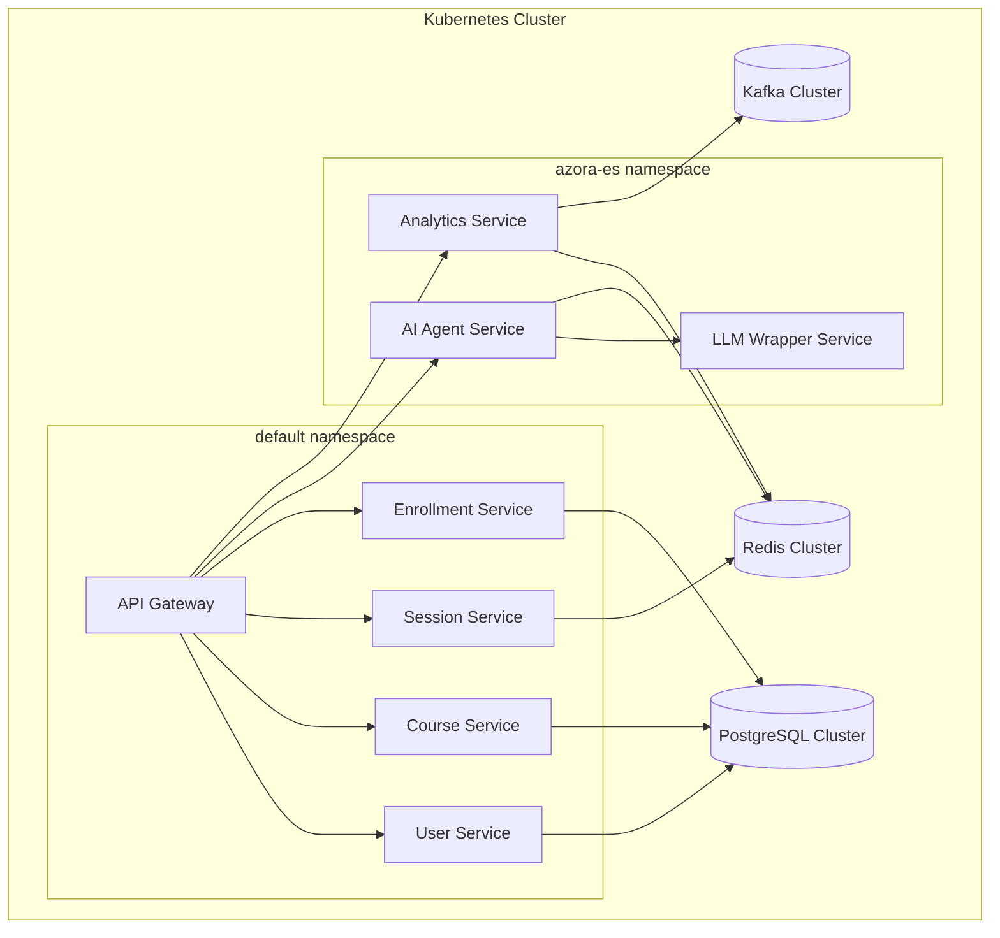
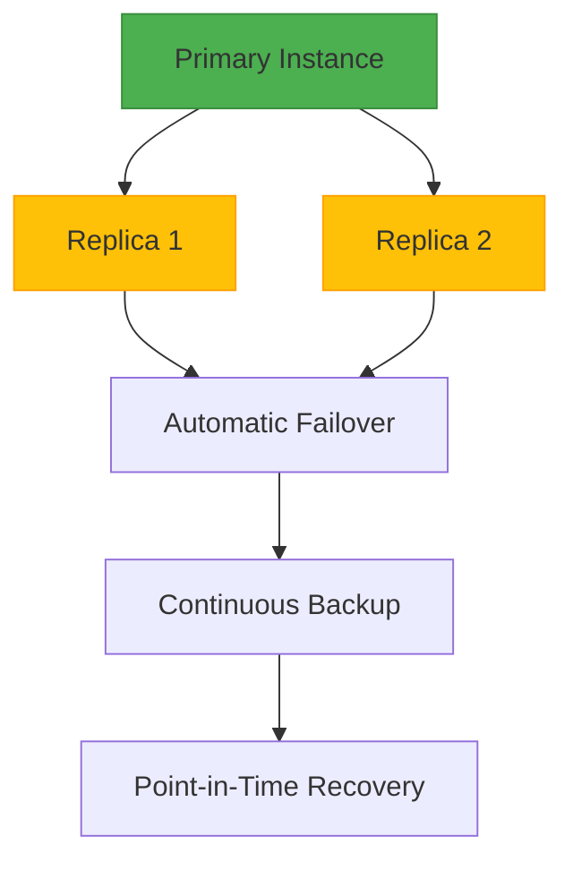
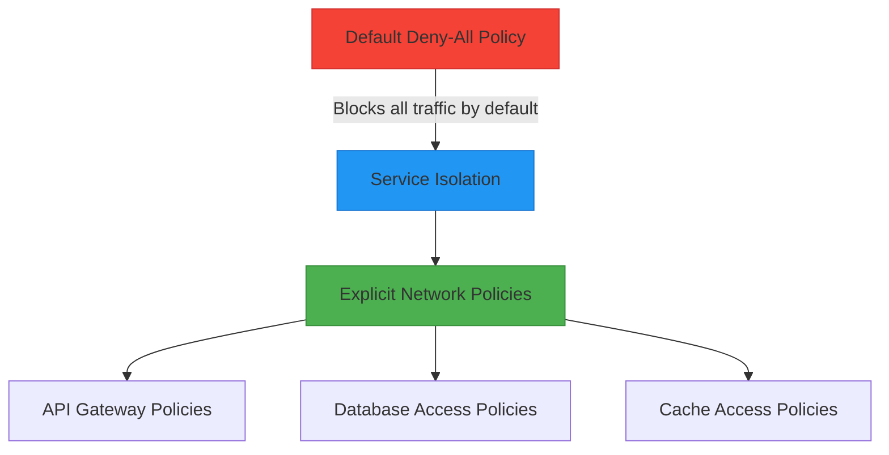
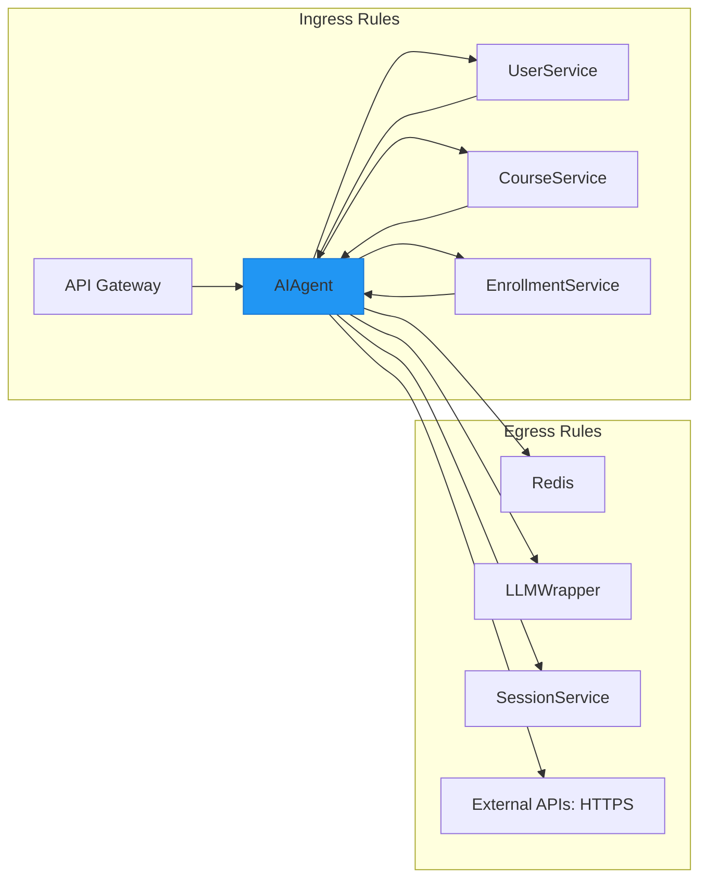
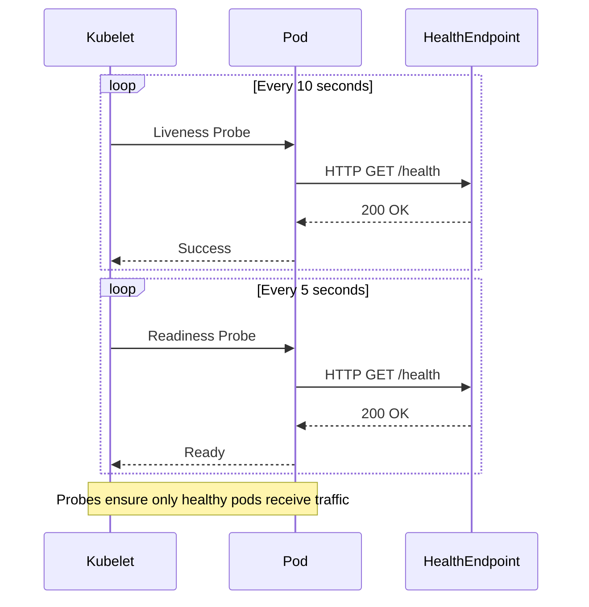
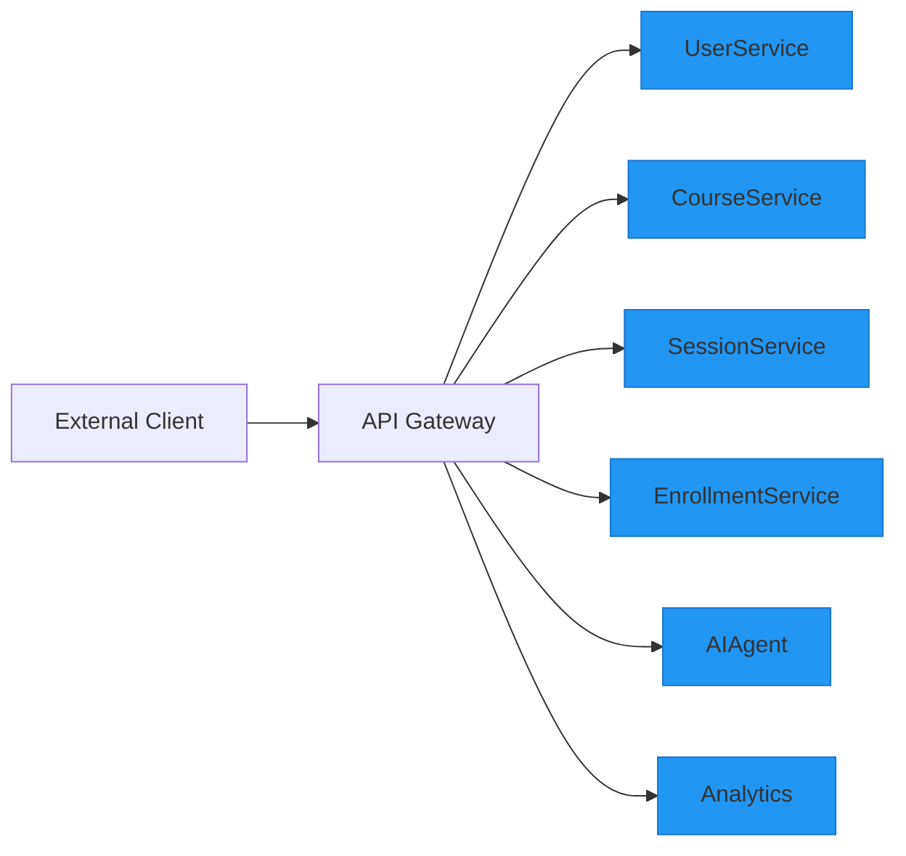

# Kubernetes Orchestration

<cite>
**Referenced Files in This Document**   
- [api-gateway.yaml](file://infrastructure/k8s/api-gateway.yaml)
- [postgres-cluster.yaml](file://infrastructure/k8s/postgres-cluster.yaml)
- [redis-cluster.yaml](file://infrastructure/k8s/redis-cluster.yaml)
- [analytics-service.yaml](file://infrastructure/k8s/analytics-service.yaml)
- [ai-agent-service.yaml](file://infrastructure/k8s/ai-agent-service.yaml)
- [llm-wrapper-service.yaml](file://infrastructure/k8s/llm-wrapper-service.yaml)
- [course-service.yaml](file://infrastructure/k8s/course-service.yaml)
- [session-service.yaml](file://infrastructure/k8s/session-service.yaml)
- [user-service.yaml](file://infrastructure/k8s/user-service.yaml)
- [network-policies.yaml](file://infrastructure/k8s/network-policies.yaml)
- [ai-agent-service-netpol.yaml](file://infrastructure/k8s/ai-agent-service-netpol.yaml)
- [analytics-service-netpol.yaml](file://infrastructure/k8s/analytics-service-netpol.yaml)
- [llm-wrapper-service-netpol.yaml](file://infrastructure/k8s/llm-wrapper-service-netpol.yaml)
</cite>

## Table of Contents
1. [Introduction](#introduction)
2. [Cluster Design and Namespace Strategy](#cluster-design-and-namespace-strategy)
3. [Core Service Deployments](#core-service-deployments)
4. [Database and Stateful Services](#database-and-stateful-services)
5. [Network Policies and Service Isolation](#network-policies-and-service-isolation)
6. [Health Probes and Resource Management](#health-probes-and-resource-management)
7. [Service Communication and Microservices Architecture](#service-communication-and-microservices-architecture)
8. [Deployment and Scaling Strategies](#deployment-and-scaling-strategies)
9. [Monitoring and Troubleshooting](#monitoring-and-troubleshooting)
10. [Conclusion](#conclusion)

## Introduction
This document provides comprehensive documentation for Kubernetes orchestration within Azora OS, detailing the cluster design, service deployment strategy, and operational practices. The system leverages Kubernetes to manage a microservices architecture that includes API gateways, analytics engines, AI agents, and database clusters. The orchestration strategy emphasizes service isolation, high availability, and secure inter-service communication through declarative YAML manifests. This documentation covers implementation details of Kubernetes resources, including deployments, services, network policies, and stateful components, with practical examples of core service configurations.

## Cluster Design and Namespace Strategy

The Kubernetes cluster for Azora OS is designed with a multi-namespace architecture to logically separate workloads and enforce security boundaries. The primary namespaces include `default` for core application services and `azora-es` for AI/ML and analytics workloads. This separation enables independent scaling, access control, and resource management for different service tiers.

**Diagram sources**
- [api-gateway.yaml](file://infrastructure/k8s/api-gateway.yaml)
- [user-service.yaml](file://infrastructure/k8s/user-service.yaml)
- [course-service.yaml](file://infrastructure/k8s/course-service.yaml)
- [session-service.yaml](file://infrastructure/k8s/session-service.yaml)
- [enrollment-service.yaml](file://infrastructure/k8s/enrollment-service.yaml)
- [analytics-service.yaml](file://infrastructure/k8s/analytics-service.yaml)
- [ai-agent-service.yaml](file://infrastructure/k8s/ai-agent-service.yaml)
- [llm-wrapper-service.yaml](file://infrastructure/k8s/llm-wrapper-service.yaml)
- [postgres-cluster.yaml](file://infrastructure/k8s/postgres-cluster.yaml)
- [redis-cluster.yaml](file://infrastructure/k8s/redis-cluster.yaml)

**Section sources**
- [api-gateway.yaml](file://infrastructure/k8s/api-gateway.yaml)
- [analytics-service.yaml](file://infrastructure/k8s/analytics-service.yaml)
- [ai-agent-service.yaml](file://infrastructure/k8s/ai-agent-service.yaml)
- [llm-wrapper-service.yaml](file://infrastructure/k8s/llm-wrapper-service.yaml)

## Core Service Deployments

### API Gateway Deployment
The API gateway is implemented using Tyk and serves as the entry point for all external requests. Deployed with 2 replicas for high availability, it routes traffic to appropriate microservices based on configured endpoints. The deployment uses a ConfigMap to inject configuration and connects to Redis for session management and analytics storage.

**Section sources**
- [api-gateway.yaml](file://infrastructure/k8s/api-gateway.yaml)

### AI Agent Service
The AI agent service in the `azora-es` namespace handles intelligent processing and decision-making. It runs with 2 replicas and is configured with resource requests and limits to ensure stable performance. The service communicates with the LLM wrapper service for natural language processing capabilities and uses Redis for state management.

**Section sources**
- [ai-agent-service.yaml](file://infrastructure/k8s/ai-agent-service.yaml)

### Analytics Service
The analytics service processes and aggregates data from various system components. Deployed with 2 replicas, it consumes data from Kafka and stores processed results in Redis. The service is designed to scale horizontally based on data processing demands.

**Section sources**
- [analytics-service.yaml](file://infrastructure/k8s/analytics-service.yaml)

### LLM Wrapper Service
The LLM wrapper service provides a secure interface to external language models. It abstracts the complexity of direct LLM API calls and manages authentication through Kubernetes secrets. The service runs in the `azora-es` namespace with 2 replicas for redundancy.

**Section sources**
- [llm-wrapper-service.yaml](file://infrastructure/k8s/llm-wrapper-service.yaml)

## Database and Stateful Services

### PostgreSQL Cluster
The PostgreSQL cluster is implemented using the CloudNativePG operator, providing a highly available database solution with 3 instances for redundancy. The cluster includes pgvector extension for AI/ML vector operations and is configured with 10Gi of storage. Database credentials are securely managed through Kubernetes secrets.

**Diagram sources**
- [postgres-cluster.yaml](file://infrastructure/k8s/postgres-cluster.yaml)

**Section sources**
- [postgres-cluster.yaml](file://infrastructure/k8s/postgres-cluster.yaml)
- [user-service.yaml](file://infrastructure/k8s/user-service.yaml)
- [course-service.yaml](file://infrastructure/k8s/course-service.yaml)

### Redis Cluster
The Redis cluster is deployed using the Redis Enterprise operator, providing a managed in-memory data store with 3 nodes for high availability. The cluster hosts multiple databases, including one dedicated to session management. Persistence is configured with RDB snapshots, and the search module enables advanced querying capabilities.

**Section sources**
- [redis-cluster.yaml](file://infrastructure/k8s/redis-cluster.yaml)

## Network Policies and Service Isolation

### Default Network Policy
A default deny-all policy is implemented to enforce a zero-trust security model. All pods are isolated by default, and explicit network policies must be defined to allow communication between services.

**Diagram sources**
- [network-policies.yaml](file://infrastructure/k8s/network-policies.yaml)

### Service-Specific Network Policies
Network policies are defined at both the cluster level and per-namespace to control traffic flow. The `default` namespace contains policies for core application services, while the `azora-es` namespace has policies for AI/ML services.

#### AI Agent Service Network Policy
The AI agent service can receive traffic from the API gateway and other core services, while its egress is restricted to Redis, the LLM wrapper service, and external HTTPS endpoints for API calls.

**Diagram sources**
- [ai-agent-service-netpol.yaml](file://infrastructure/k8s/ai-agent-service-netpol.yaml)

#### Analytics Service Network Policy
The analytics service accepts traffic from the API gateway and all core services, enabling comprehensive data collection. Its egress is limited to Redis for state storage, Kafka for data streaming, and external HTTPS endpoints.

**Section sources**
- [analytics-service-netpol.yaml](file://infrastructure/k8s/analytics-service-netpol.yaml)
- [llm-wrapper-service-netpol.yaml](file://infrastructure/k8s/llm-wrapper-service-netpol.yaml)
- [network-policies.yaml](file://infrastructure/k8s/network-policies.yaml)

## Health Probes and Resource Management

### Health Probes Implementation
All services implement both liveness and readiness probes to ensure reliable operation. Liveness probes use an initial delay of 30 seconds to allow for application startup, with checks performed every 10 seconds. Readiness probes have a shorter initial delay of 5 seconds and check every 5 seconds to quickly route traffic to healthy instances.

**Diagram sources**
- [analytics-service.yaml](file://infrastructure/k8s/analytics-service.yaml)
- [ai-agent-service.yaml](file://infrastructure/k8s/ai-agent-service.yaml)
- [llm-wrapper-service.yaml](file://infrastructure/k8s/llm-wrapper-service.yaml)
- [course-service.yaml](file://infrastructure/k8s/course-service.yaml)

### Resource Requests and Limits
Services in the `azora-es` namespace have defined resource requests and limits to ensure quality of service. The AI agent and analytics services request 250m CPU and 256-512Mi memory, with limits set at 500m CPU and 512Mi-1Gi memory. This prevents resource starvation and enables predictable scaling behavior.

**Section sources**
- [analytics-service.yaml](file://infrastructure/k8s/analytics-service.yaml)
- [ai-agent-service.yaml](file://infrastructure/k8s/ai-agent-service.yaml)
- [llm-wrapper-service.yaml](file://infrastructure/k8s/llm-wrapper-service.yaml)

## Service Communication and Microservices Architecture

### API Gateway Integration
The API gateway serves as the single entry point for external clients, routing requests to appropriate microservices based on path-based rules. It provides authentication, rate limiting, and request transformation capabilities.

**Diagram sources**
- [api-gateway.yaml](file://infrastructure/k8s/api-gateway.yaml)

### Inter-Service Dependencies
The microservices architecture follows a dependency hierarchy where core services (user, course, enrollment) provide foundational capabilities, while AI/ML services (AI agent, analytics) build upon this foundation to deliver enhanced functionality.

**Section sources**
- [api-gateway.yaml](file://infrastructure/k8s/api-gateway.yaml)
- [user-service.yaml](file://infrastructure/k8s/user-service.yaml)
- [course-service.yaml](file://infrastructure/k8s/course-service.yaml)
- [session-service.yaml](file://infrastructure/k8s/session-service.yaml)
- [enrollment-service.yaml](file://infrastructure/k8s/enrollment-service.yaml)
- [ai-agent-service.yaml](file://infrastructure/k8s/ai-agent-service.yaml)
- [analytics-service.yaml](file://infrastructure/k8s/analytics-service.yaml)

## Deployment and Scaling Strategies

### Rolling Updates
All deployments are configured for rolling updates, ensuring zero-downtime deployments. The default strategy gradually replaces pods, maintaining service availability during updates. This approach allows for safe deployment of new versions with automatic rollback on failure detection.

### Horizontal Pod Autoscaling
While not explicitly defined in the provided manifests, the resource requests and limits enable horizontal pod autoscaling based on CPU and memory utilization. The AI/ML services in the `azora-es` namespace are prime candidates for autoscaling based on processing load.

### High Availability
Critical services are deployed with multiple replicas (typically 2) across different nodes to ensure high availability. Stateful services like PostgreSQL and Redis use multi-instance configurations with automatic failover capabilities.

**Section sources**
- [api-gateway.yaml](file://infrastructure/k8s/api-gateway.yaml)
- [analytics-service.yaml](file://infrastructure/k8s/analytics-service.yaml)
- [ai-agent-service.yaml](file://infrastructure/k8s/ai-agent-service.yaml)
- [llm-wrapper-service.yaml](file://infrastructure/k8s/llm-wrapper-service.yaml)
- [postgres-cluster.yaml](file://infrastructure/k8s/postgres-cluster.yaml)
- [redis-cluster.yaml](file://infrastructure/k8s/redis-cluster.yaml)

## Monitoring and Troubleshooting

### Monitoring Stack
The cluster includes a monitoring stack with Prometheus and Grafana for metrics collection and visualization. The PostgreSQL cluster has PodMonitor enabled for comprehensive database monitoring. Redis Enterprise provides built-in monitoring for cache performance.

### Common Issues and Solutions
- **Pod CrashLoopBackOff**: Check container logs and health probe configuration; verify dependencies are available
- **Service Not Reachable**: Validate network policies and service selectors; check endpoint status
- **Database Connection Issues**: Verify database credentials in secrets; check network policies for database access
- **High Memory Usage**: Review resource limits; analyze application memory consumption patterns

**Section sources**
- [postgres-cluster.yaml](file://infrastructure/k8s/postgres-cluster.yaml)
- [network-policies.yaml](file://infrastructure/k8s/network-policies.yaml)

## Conclusion
The Kubernetes orchestration strategy for Azora OS implements a robust, secure, and scalable microservices architecture. By leveraging declarative YAML manifests, the system achieves consistent deployments across environments. The network policy implementation enforces strict service isolation, following zero-trust principles. Stateful services like PostgreSQL and Redis are configured for high availability with automated failover. The separation of concerns between core application services and AI/ML services enables independent scaling and maintenance. This orchestration approach provides a solid foundation for the continued evolution of Azora OS, supporting both current requirements and future expansion.