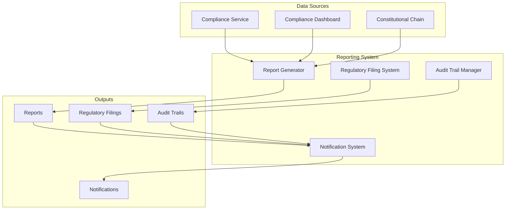
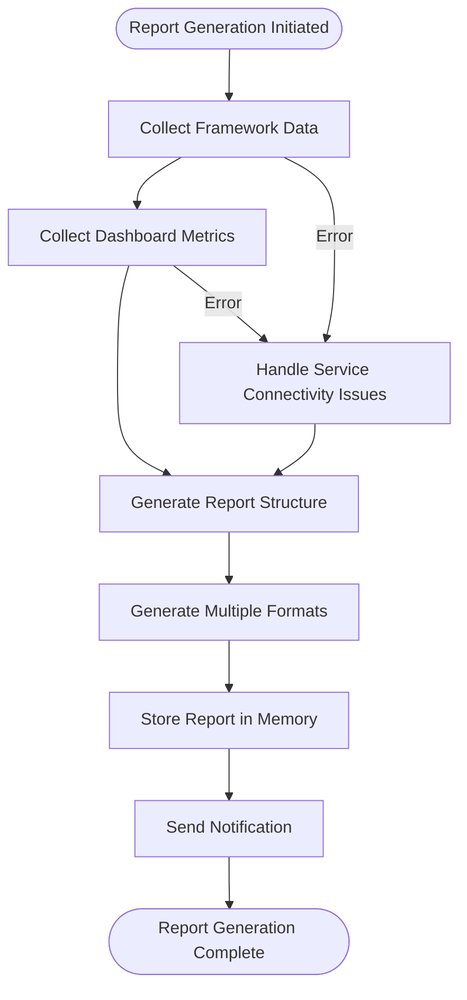
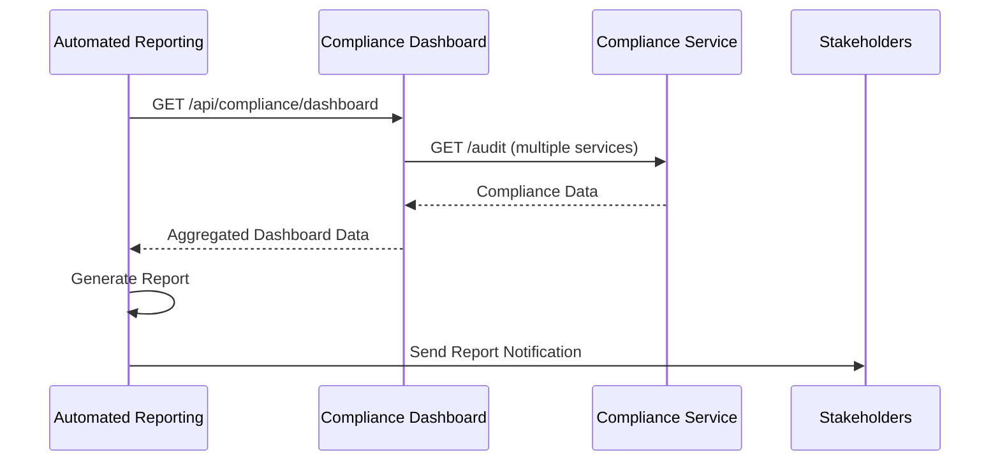
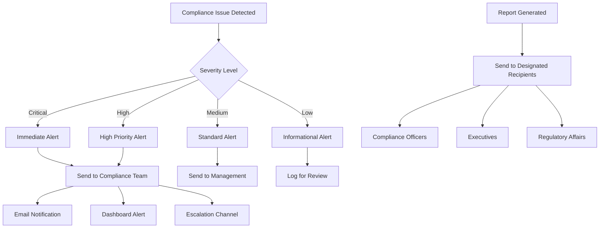
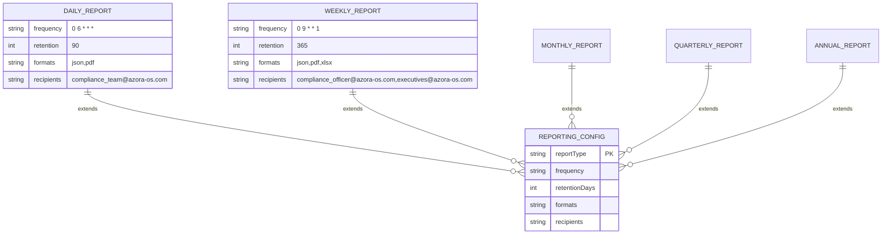
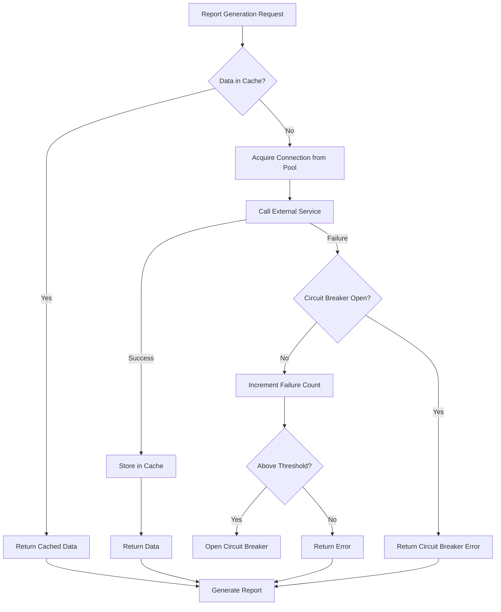
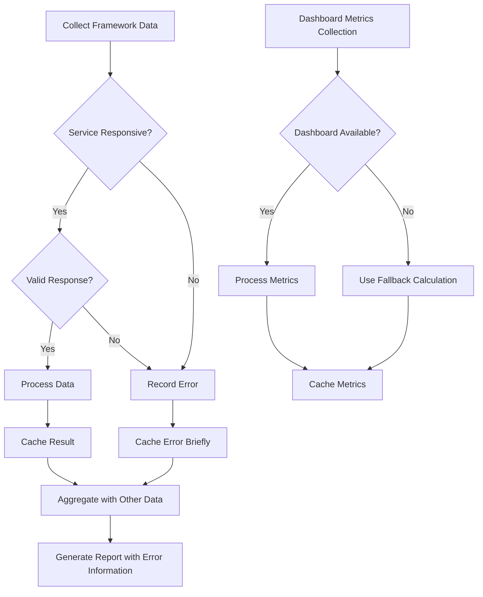
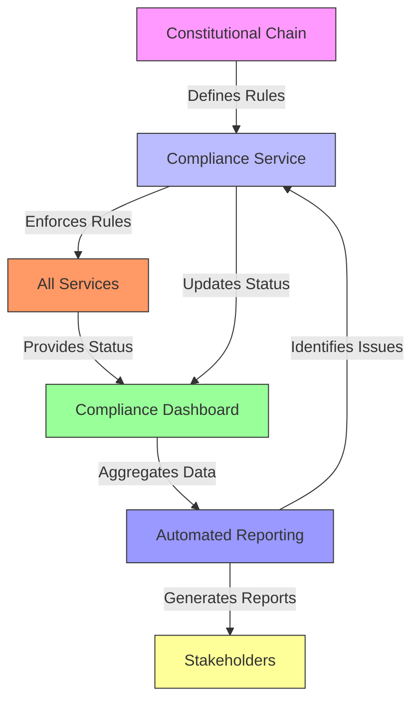
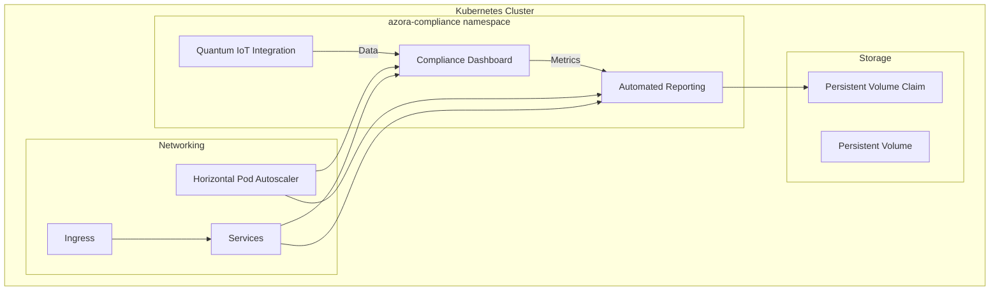

# Automated Compliance Reporting

<cite>
**Referenced Files in This Document**   
- [index.js](file://organs/automated-compliance-reporting/index.js)
- [README.md](file://organs/automated-compliance-reporting/README.md)
- [complianceService.ts](file://organs/compliance/src/complianceService.ts)
- [index.js](file://organs/compliance-service/index.js)
- [ReportsPanel.tsx](file://ui/compliance-ui/src/components/panels/ReportsPanel.tsx)
- [index.js](file://services/compliance-dashboard/index.js)
- [alertEngine.js](file://organs/vigil-service/src/alertEngine.js)
- [deployments.yaml](file://infrastructure/kubernetes/compliance/deployments.yaml)
</cite>

## Table of Contents
1. [Introduction](#introduction)
2. [Compliance Reporting System Architecture](#compliance-reporting-system-architecture)
3. [Report Generation Process](#report-generation-process)
4. [Compliance Dashboard Integration](#compliance-dashboard-integration)
5. [Alerting and Notification Mechanisms](#alerting-and-notification-mechanisms)
6. [Configuration Options](#configuration-options)
7. [Performance Considerations](#performance-considerations)
8. [Data Consistency and Error Handling](#data-consistency-and-error-handling)
9. [Relationship with Compliance Service and Constitutional Chain](#relationship-with-compliance-service-and-constitutional-chain)
10. [Deployment and Scaling](#deployment-and-scaling)

## Introduction

The Automated Compliance Reporting system provides comprehensive compliance monitoring and reporting capabilities across the Azora OS ecosystem. This system aggregates compliance status from various services, generates detailed reports, and implements alerting mechanisms to ensure regulatory adherence. The reporting system integrates with the compliance service, constitutional chain, and dashboard components to provide a unified compliance monitoring solution.

The system supports multiple regulatory frameworks including GDPR, HIPAA, SOX, CCPA, PIPEDA, and LGPD, providing automated reporting at various frequencies from daily snapshots to annual certifications. The implementation includes robust error handling, performance optimizations, and configurable distribution options to meet diverse organizational needs.

## Compliance Reporting System Architecture

The Automated Compliance Reporting system follows a modular architecture with distinct components for data collection, report generation, regulatory filing, audit trail management, and notification delivery. The system operates as a Node.js service with Express.js for API endpoints and leverages cron scheduling for automated report generation.

**Diagram sources**
- [index.js](file://organs/automated-compliance-reporting/index.js#L152-L192)
- [complianceService.ts](file://organs/compliance/src/complianceService.ts#L0-L61)

**Section sources**
- [index.js](file://organs/automated-compliance-reporting/index.js#L0-L1069)
- [README.md](file://organs/automated-compliance-reporting/README.md#L0-L217)

## Report Generation Process

The report generation process follows a systematic approach to collect compliance data from various services, aggregate metrics, and produce comprehensive reports in multiple formats. The ReportGenerator class orchestrates this process, collecting framework-specific data from individual compliance services and dashboard metrics from the central compliance dashboard.

The system implements performance optimizations including connection pooling, response caching, and circuit breakers to ensure reliable data collection even when individual services experience temporary issues. Data collection occurs through HTTP requests to service endpoints, with configurable timeouts and retry mechanisms.

**Diagram sources**
- [index.js](file://organs/automated-compliance-reporting/index.js#L363-L398)
- [complianceService.ts](file://organs/compliance/src/complianceService.ts#L0-L61)

**Section sources**
- [index.js](file://organs/automated-compliance-reporting/index.js#L363-L398)
- [complianceService.ts](file://organs/compliance/src/complianceService.ts#L0-L61)

## Compliance Dashboard Integration

The Automated Compliance Reporting system integrates closely with the Compliance Dashboard service to provide real-time compliance monitoring and reporting. The dashboard service exposes API endpoints that provide aggregated compliance metrics, active alerts, and framework-specific status information.

The reporting system collects data from the dashboard's `/api/compliance/dashboard` endpoint, which returns comprehensive compliance overview data including compliant frameworks, total frameworks, needs-attention frameworks, active alerts, and global metrics. This integration enables the reporting system to incorporate real-time compliance status into generated reports.

**Diagram sources**
- [index.js](file://organs/automated-compliance-reporting/index.js#L838-L881)
- [index.js](file://services/compliance-dashboard/index.js#L0-L267)

**Section sources**
- [index.js](file://organs/automated-compliance-reporting/index.js#L838-L881)
- [index.js](file://services/compliance-dashboard/index.js#L0-L267)

## Alerting and Notification Mechanisms

The reporting system implements a comprehensive alerting and notification system that integrates with the Vigil service's alert engine. When compliance issues are detected or reports are generated, the system triggers notifications to designated recipients through multiple channels.

The NotificationSystem class handles the delivery of report notifications and regulatory filing alerts to stakeholders. The system supports configurable recipient lists for different report types and automatically sends notifications when scheduled reports are generated or when critical compliance issues are identified.

**Diagram sources**
- [index.js](file://organs/automated-compliance-reporting/index.js#L995-L1026)
- [alertEngine.js](file://organs/vigil-service/src/alertEngine.js#L0-L424)

**Section sources**
- [index.js](file://organs/automated-compliance-reporting/index.js#L995-L1026)
- [alertEngine.js](file://organs/vigil-service/src/alertEngine.js#L0-L424)

## Configuration Options

The Automated Compliance Reporting system provides extensive configuration options for report frequency, format, retention, and distribution. These configurations are defined in the REPORTING_CONFIG object, which specifies settings for daily, weekly, monthly, quarterly, and annual reports.

Each report type has configurable frequency (using cron syntax), retention period, supported formats, and recipient lists. The system supports JSON, PDF, and XLSX formats for reports, allowing stakeholders to consume compliance information in their preferred format.

**Diagram sources**
- [index.js](file://organs/automated-compliance-reporting/index.js#L152-L192)
- [test.js](file://organs/automated-compliance-reporting/test.js#L343-L373)

**Section sources**
- [index.js](file://organs/automated-compliance-reporting/index.js#L152-L192)
- [test.js](file://organs/automated-compliance-reporting/test.js#L343-L373)

## Performance Considerations

The reporting system implements several performance optimizations to handle large-scale reporting efficiently. These include connection pooling for data collection, response caching with TTL, and circuit breakers for external service calls.

The DataCollectionPool class limits concurrent connections to prevent overwhelming downstream services, while the responseCache stores frequently accessed data to reduce redundant API calls. The ServiceCircuitBreaker class prevents cascading failures by temporarily halting requests to services that are experiencing issues.

**Diagram sources**
- [index.js](file://organs/automated-compliance-reporting/index.js#L0-L1069)
- [complianceService.ts](file://organs/compliance/src/complianceService.ts#L0-L61)

**Section sources**
- [index.js](file://organs/automated-compliance-reporting/index.js#L0-L1069)
- [complianceService.ts](file://organs/compliance/src/complianceService.ts#L0-L61)

## Data Consistency and Error Handling

The reporting system addresses data inconsistencies across services through robust error handling and fallback mechanisms. When a compliance service is unreachable or returns an error, the system captures this information in the report rather than failing the entire report generation process.

The ComplianceDataCollector class implements error handling for individual framework data collection, ensuring that issues with one service do not prevent the collection of data from other services. Error results are cached briefly to prevent repeated failed attempts while still allowing for recovery when services are restored.

**Diagram sources**
- [index.js](file://organs/automated-compliance-reporting/index.js#L0-L1069)
- [complianceService.ts](file://organs/compliance/src/complianceService.ts#L0-L61)

**Section sources**
- [index.js](file://organs/automated-compliance-reporting/index.js#L0-L1069)
- [complianceService.ts](file://organs/compliance/src/complianceService.ts#L0-L61)

## Relationship with Compliance Service and Constitutional Chain

The Automated Compliance Reporting system maintains a hierarchical relationship with the compliance service and constitutional chain, where the constitutional chain defines the foundational rules, the compliance service enforces these rules, and the reporting system monitors and reports on compliance status.

The compliance service acts as the authoritative source for compliance verification, implementing checks for constitutional rules such as maximum supply limits and founder email formats. The reporting system consumes this verification data to generate comprehensive compliance reports that reflect adherence to the constitutional framework.

**Diagram sources**
- [index.js](file://organs/compliance-service/index.js#L0-L109)
- [index.js](file://organs/automated-compliance-reporting/index.js#L0-L1069)

**Section sources**
- [index.js](file://organs/compliance-service/index.js#L0-L109)
- [index.js](file://organs/automated-compliance-reporting/index.js#L0-L1069)

## Deployment and Scaling

The Automated Compliance Reporting system is deployed as part of the Azora OS ecosystem using Kubernetes, with dedicated deployments for the reporting service, compliance dashboard, and related components. The infrastructure/kubernets/compliance directory contains the deployment configurations that define resource requirements, scaling parameters, and health checks.

The system is designed for high availability with multiple replicas and includes liveness and readiness probes to ensure service health. Persistent volumes are used for report storage, allowing reports to be retained according to regulatory requirements while maintaining service state across pod restarts.

**Diagram sources**
- [deployments.yaml](file://infrastructure/kubernetes/compliance/deployments.yaml#L0-L169)
- [index.js](file://organs/automated-compliance-reporting/index.js#L0-L1069)

**Section sources**
- [deployments.yaml](file://infrastructure/kubernetes/compliance/deployments.yaml#L0-L169)
- [index.js](file://organs/automated-compliance-reporting/index.js#L0-L1069)