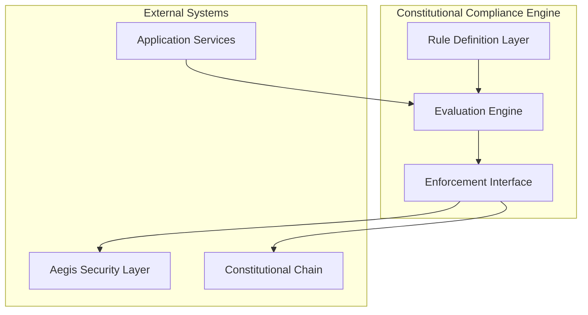
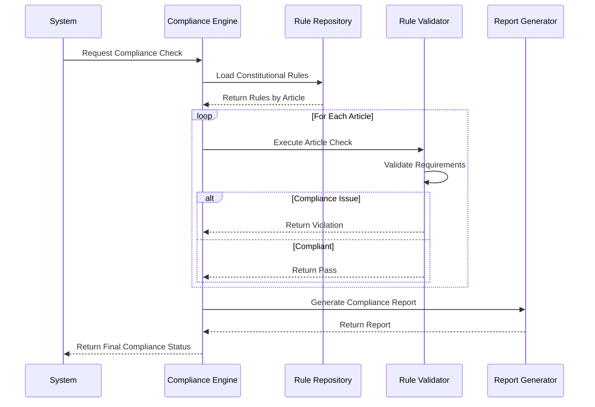
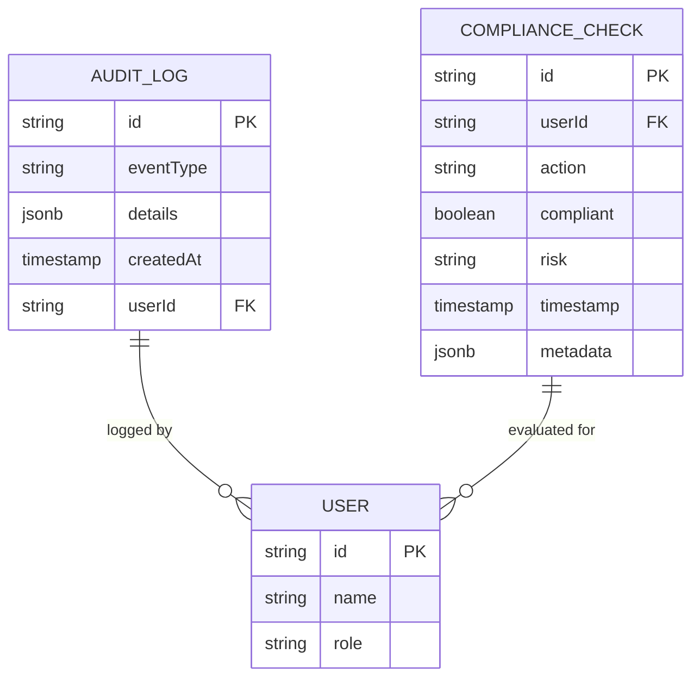
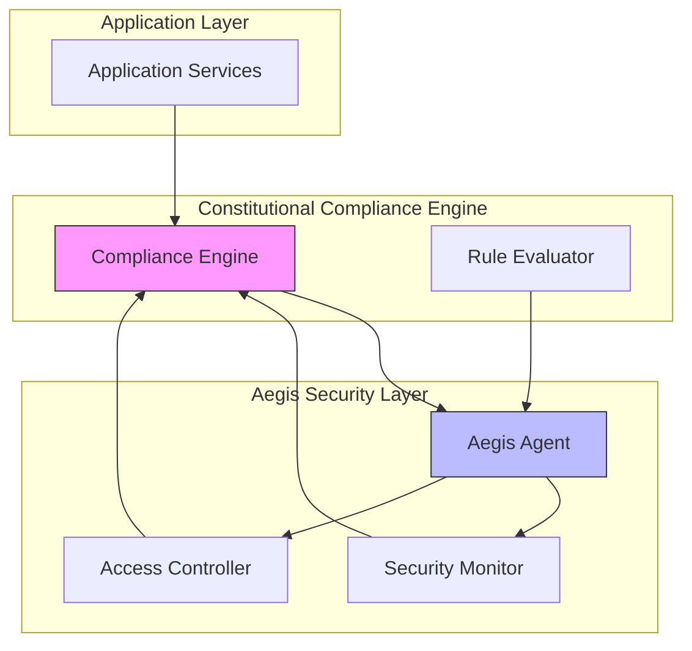
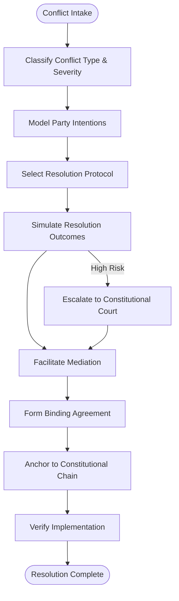

# Constitutional Compliance Engine

<cite>
**Referenced Files in This Document**   
- [constitutional-compliance-checker.js](file://infrastructure/constitutional-compliance-checker.js)
- [compliance.service.ts](file://organs/procurement-corridor/src/services/compliance.service.ts)
- [AegisAgent.ts](file://genome/ai-hierarchy/specialized-agents/aegis-agent.ts)
- [conflict.types.ts](file://organs/conflict-resolution/src/types/conflict.types.ts)
- [trade-dispute-resolver.ts](file://organs/conflict-resolution/src/services/trade-dispute-resolver.ts)
- [complianceService.ts](file://organs/compliance/src/complianceService.ts)
- [AuditLog.sql](file://organs/compliance/prisma/migrations/20251020075522_init/migration.sql)
- [types.ts](file://ui/enterprise-ui/src/types.ts)
</cite>

## Table of Contents
1. [Introduction](#introduction)
2. [Core Architecture](#core-architecture)
3. [Compliance Rule Evaluation](#compliance-rule-evaluation)
4. [Audit Logging and Reporting](#audit-logging-and-reporting)
5. [Integration with Aegis Security Layer](#integration-with-aegis-security-layer)
6. [Constitutional Chain Relationship](#constitutional-chain-relationship)
7. [Rule Conflict Resolution](#rule-conflict-resolution)
8. [Configuration and Custom Rule Sets](#configuration-and-custom-rule-sets)
9. [Performance Considerations](#performance-considerations)
10. [Conclusion](#conclusion)

## Introduction

The Constitutional Compliance Engine serves as the central enforcement mechanism for regulatory and constitutional rules within the Azora ecosystem. This engine ensures that all system components, services, and transactions adhere to the foundational principles outlined in the AZORA_CONSTITUTION.md and other governing documents. The engine operates as a proactive compliance gatekeeper, validating system states and transactions against constitutional requirements before production deployment or execution. It integrates with various system components including the Aegis security layer and the constitutional chain to provide a comprehensive compliance framework that spans technical, legal, and operational domains.

**Section sources**
- [constitutional-compliance-checker.js](file://infrastructure/constitutional-compliance-checker.js#L1-L50)

## Core Architecture

The Constitutional Compliance Engine is implemented as a multi-layered system with distinct components for rule management, evaluation, and enforcement. At its core, the engine follows a modular architecture that separates rule definition from execution logic, allowing for flexible configuration and extension. The engine operates on a constitution-as-code principle, where constitutional articles are translated into executable compliance checks that can be automatically validated.

The architecture consists of three primary layers: the rule definition layer, the evaluation engine, and the enforcement interface. The rule definition layer contains constitutional rules expressed as code, organized by article and section. The evaluation engine processes these rules against system state and transaction data, while the enforcement interface blocks non-compliant operations and generates audit trails. This separation of concerns enables the engine to scale across different domains and compliance requirements while maintaining a consistent enforcement mechanism.

**Diagram sources**
- [constitutional-compliance-checker.js](file://infrastructure/constitutional-compliance-checker.js#L1-L50)
- [compliance.service.ts](file://organs/procurement-corridor/src/services/compliance.service.ts#L1-L30)

**Section sources**
- [constitutional-compliance-checker.js](file://infrastructure/constitutional-compliance-checker.js#L1-L100)

## Compliance Rule Evaluation

The engine implements a systematic approach to compliance rule evaluation, processing constitutional articles through dedicated check methods. Each article from the AZORA_CONSTITUTION.md is mapped to a corresponding evaluation method that validates specific requirements. The evaluation process follows a sequential execution pattern, where Article I (Foundation & Purpose) is checked first, followed by subsequent articles in numerical order.

Rule evaluation employs multiple validation techniques including file existence checks, content analysis, and service availability verification. For example, Article III compliance verification examines the AzoraCoin.sol contract to ensure the maximum supply is exactly 1,000,000 AZR, while Article VI checks for the absence of prohibited external dependencies like AWS SDK or Stripe. The engine also validates economic allocations, ensuring student allocations are exactly 100,000 AZR (10%) and enterprise allocations are 600,000 AZR (60%) as specified in Article XI.

**Diagram sources**
- [constitutional-compliance-checker.js](file://infrastructure/constitutional-compliance-checker.js#L150-L400)
- [compliance.service.ts](file://organs/procurement-corridor/src/services/compliance.service.ts#L214-L261)

**Section sources**
- [constitutional-compliance-checker.js](file://infrastructure/constitutional-compliance-checker.js#L150-L483)

## Audit Logging and Reporting

The Constitutional Compliance Engine maintains comprehensive audit logs that record all compliance checks, violations, and enforcement actions. Each compliance evaluation generates a detailed report that includes passed checks, identified violations, and system warnings. The audit system captures critical metadata including timestamps, rule identifiers, violation severity levels, and contextual information about the evaluated system state.

Audit logs are stored in a dedicated database with a schema designed for compliance traceability. The AuditLog table captures event types, detailed JSON metadata, and associated user identifiers, while the ComplianceCheck table records the outcome of each compliance assessment. These logs serve multiple purposes including regulatory reporting, forensic analysis, and system improvement. The engine also generates periodic compliance reports that summarize system adherence to constitutional requirements over time.

**Diagram sources**
- [complianceService.ts](file://organs/compliance/src/complianceService.ts#L1-L20)
- [AuditLog.sql](file://organs/compliance/prisma/migrations/20251020075522_init/migration.sql#L15-L22)

**Section sources**
- [complianceService.ts](file://organs/compliance/src/complianceService.ts#L1-L30)

## Integration with Aegis Security Layer

The Constitutional Compliance Engine maintains a symbiotic relationship with the Aegis security layer, forming a comprehensive governance and security framework. Aegis agents serve as the enforcement arm of the compliance engine, implementing security monitoring, threat detection, and access control policies that align with constitutional requirements. The integration enables real-time compliance auditing, where Aegis agents continuously monitor system activities and trigger compliance checks for high-risk operations.

The engine leverages Aegis tools to execute compliance-related operations across distributed services. The AegisTools class provides methods for running compliance checks, retrieving security status, and reporting incidents, creating a bidirectional communication channel between compliance and security functions. This integration ensures that security policies are not implemented in isolation but are instead evaluated against constitutional principles, preventing security measures that might violate user rights or system ethics.

**Diagram sources**
- [AegisAgent.ts](file://genome/ai-hierarchy/specialized-agents/aegis-agent.ts#L1-L40)
- [compliance.service.ts](file://organs/procurement-corridor/src/services/compliance.service.ts#L1-L30)

**Section sources**
- [AegisAgent.ts](file://genome/ai-hierarchy/specialized-agents/aegis-agent.ts#L1-L50)
- [services.ts](file://genome/agent-tools/services.ts#L147-L190)

## Constitutional Chain Relationship

The Constitutional Compliance Engine is intrinsically linked to the constitutional chain, which serves as the immutable source of truth for system governance. The engine derives its authority from the constitutional chain, which contains the canonical version of the AZORA_CONSTITUTION.md and other foundational documents. During compliance checks, the engine validates that local rule sets are synchronized with the constitutional chain, preventing governance drift or unauthorized modifications.

The relationship operates on a verification and anchoring principle: the engine verifies system compliance against constitutional requirements, and successful compliance states are periodically anchored to the constitutional chain. This creates a verifiable audit trail that demonstrates adherence to constitutional principles over time. The engine also monitors the constitutional chain for amendments, automatically updating its rule evaluation logic when constitutional changes are ratified through the formal amendment process.

**Section sources**
- [constitutional-compliance-checker.js](file://infrastructure/constitutional-compliance-checker.js#L1-L50)
- [compliance.service.ts](file://organs/procurement-corridor/src/services/compliance.service.ts#L1-L30)

## Rule Conflict Resolution

When rule conflicts arise, the Constitutional Compliance Engine employs the constitutional court pattern to resolve disputes through a structured adjudication process. Conflicts are classified by type (trade, border, regulatory, humanitarian, cyber, climate, diplomatic, economic, security, or social) and severity (low, medium, high, critical, or existential), with each classification triggering an appropriate resolution protocol.

The conflict resolution process follows a multi-stage workflow: intake, taxonomy classification, intent modeling, protocol selection, simulation, mediation, agreement formation, and blockchain anchoring. During intent modeling, NLP and symbolic logic extract underlying interests from stated positions, identifying common ground and compromise opportunities. The system then simulates various resolution paths, evaluating outcomes based on economic, humanitarian, political, and environmental stakes before recommending an optimal resolution strategy.

**Diagram sources**
- [conflict.types.ts](file://organs/conflict-resolution/src/types/conflict.types.ts#L1-L40)
- [trade-dispute-resolver.ts](file://organs/conflict-resolution/src/services/trade-dispute-resolver.ts#L253-L286)

**Section sources**
- [conflict.types.ts](file://organs/conflict-resolution/src/types/conflict.types.ts#L1-L125)
- [trade-dispute-resolver.ts](file://organs/conflict-resolution/src/services/trade-dispute-resolver.ts#L489-L506)

## Configuration and Custom Rule Sets

The Constitutional Compliance Engine supports configurable rule sets that can be customized for different organizational units, regulatory jurisdictions, or operational domains. Custom rules are implemented as pluggable modules that extend the base ConstitutionRule interface, allowing organizations to define domain-specific compliance requirements while maintaining alignment with constitutional principles.

Rule configuration occurs through a hierarchical system where global constitutional rules form the foundation, and custom rule sets are layered on top for specific contexts. For example, the procurement corridor service loads UNGC principles and South African legal rules in addition to constitutional rules, creating a comprehensive compliance framework for tender evaluations. Configuration options include rule severity levels, evaluation frequency, and enforcement actions, enabling organizations to tailor compliance policies to their specific risk profiles and operational requirements.

**Section sources**
- [compliance.service.ts](file://organs/procurement-corridor/src/services/compliance.service.ts#L214-L261)
- [compliance.service.ts](file://organs/procurement-corridor/src/services/compliance.service.ts#L305-L372)

## Performance Considerations

The Constitutional Compliance Engine is designed for real-time compliance validation at scale, with performance optimizations that enable high-throughput evaluation of complex rule sets. The engine employs caching mechanisms to store frequently accessed constitutional documents and rule definitions, reducing disk I/O during compliance checks. Rule evaluation is implemented as asynchronous operations that can be parallelized across multiple CPU cores, minimizing latency for time-sensitive transactions.

For large-scale deployments, the engine supports distributed processing through a microservices architecture, where compliance checks are delegated to specialized service instances based on rule category or domain. The system also implements rate limiting and queuing mechanisms to prevent resource exhaustion during peak loads. Performance monitoring tools track key metrics including check latency, throughput, and failure rates, enabling proactive optimization of the compliance infrastructure.

**Section sources**
- [constitutional-compliance-checker.js](file://infrastructure/constitutional-compliance-checker.js#L1-L50)
- [compliance.service.ts](file://organs/procurement-corridor/src/services/compliance.service.ts#L214-L261)

## Conclusion

The Constitutional Compliance Engine represents a comprehensive framework for enforcing regulatory and constitutional rules across the Azora ecosystem. By implementing constitution-as-code principles, the engine transforms abstract governance concepts into executable compliance checks that can be automatically validated. Its integration with the Aegis security layer and constitutional chain creates a robust governance infrastructure that ensures system operations remain aligned with foundational principles.

The engine's modular architecture supports flexible configuration and extension, enabling organizations to implement custom rule sets while maintaining constitutional compliance. Through comprehensive audit logging and real-time monitoring, the engine provides transparency and accountability for all compliance decisions. The constitutional court pattern offers a sophisticated mechanism for resolving rule conflicts, ensuring that the system can adapt to complex governance challenges while preserving its core principles.