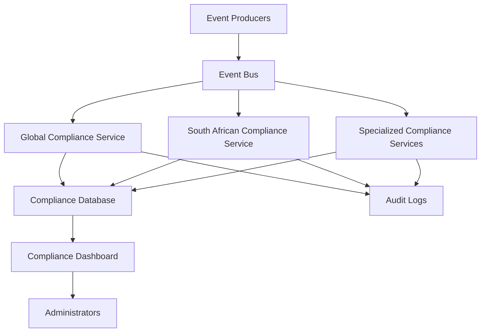
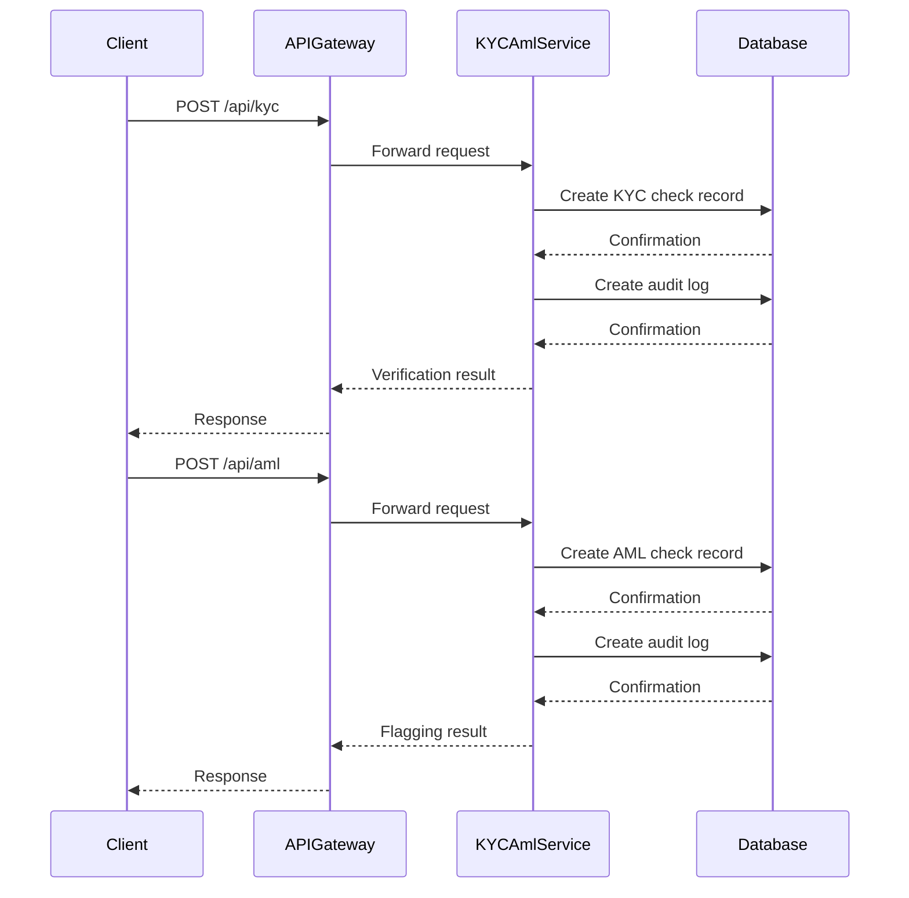
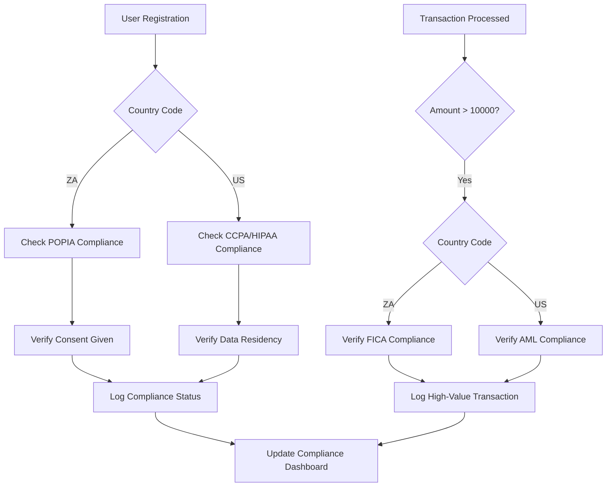
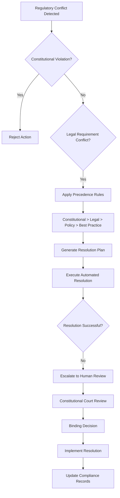

# Constitutional Compliance System

<cite>
**Referenced Files in This Document**   
- [AZORA_CONSTITUTION.md](file://codex/constitution/AZORA_CONSTITUTION.md)
- [compliance-service/index.js](file://organs/compliance-service/index.js)
- [global-compliance/index.js](file://organs/global-compliance/index.js)
- [south-african-compliance/index.js](file://organs/south-african-compliance/index.js)
- [azora-aegis/src/kycAmlService.ts](file://services/azora-aegis/src/kycAmlService.ts)
- [procurement-corridor/src/services/compliance.service.ts](file://organs/procurement-corridor/src/services/compliance.service.ts)
</cite>

## Table of Contents
1. [Introduction](#introduction)
2. [Compliance Engine Architecture](#compliance-engine-architecture)
3. [KYC/AML Verification System](#kycaml-verification-system)
4. [Automated Reporting Mechanisms](#automated-reporting-mechanisms)
5. [Regional Compliance Implementation](#regional-compliance-implementation)
6. [Constitutional Chain Integration](#constitutional-chain-integration)
7. [Conflict Resolution and Constitutional Court](#conflict-resolution-and-constitutional-court)
8. [Configuration Options](#configuration-options)
9. [Performance Considerations](#performance-considerations)
10. [Troubleshooting Guide](#troubleshooting-guide)

## Introduction

The Constitutional Compliance System is a comprehensive framework designed to enforce regulatory requirements across multiple jurisdictions within the Azora OS ecosystem. This system implements Constitution-as-Code principles, encoding legal and ethical requirements directly into software components that govern operations, transactions, and data handling. The architecture integrates multiple compliance layers including global standards, regional regulations, and constitutional mandates to ensure adherence to both local laws and organizational principles.

The system operates through a multi-tiered approach with specialized services for different compliance domains. At its core, the Constitutional Compliance System ensures that all operations within Azora OS align with the AZORA_CONSTITUTION.md, which establishes foundational principles including African ownership, student empowerment, and complete infrastructure independence. The system is designed to handle complex regulatory landscapes, particularly focusing on South African legislation such as POPIA, FICA, and BBBEE, while also supporting international standards like GDPR, CCPA, and HIPAA.

**Section sources**
- [AZORA_CONSTITUTION.md](file://codex/constitution/AZORA_CONSTITUTION.md#L1-L100)

## Compliance Engine Architecture

The Compliance Engine Architecture consists of multiple interconnected services that work together to enforce regulatory requirements across the Azora OS ecosystem. The core component is the compliance-service, which operates on port 4081 and provides endpoints for verifying compliance across various domains. This service implements a rule-based system that evaluates compliance requirements for different types of operations, including maximum supply limits and email format validation.

The architecture follows a microservices pattern with specialized compliance services for different regulatory domains. The global-compliance service manages international standards across 193 UN member states, while the south-african-compliance service focuses specifically on South African legislation including POPIA, ECT, CPA, NCA, FICA, LRA, and BCEA. These services communicate through event-driven architecture, subscribing to the azora:events channel to process compliance checks in real-time as system events occur.

The engine uses a hierarchical approach to compliance evaluation, with constitutional rules taking precedence over legal and policy requirements. Each compliance check generates audit logs that are stored in the database and can be retrieved through API endpoints. The system also maintains real-time compliance status for each regulatory domain, allowing for immediate detection of violations and automated response mechanisms.

**Diagram sources**
- [compliance-service/index.js](file://organs/compliance-service/index.js#L1-L50)
- [global-compliance/index.js](file://organs/global-compliance/index.js#L1-L50)
- [south-african-compliance/index.js](file://organs/south-african-compliance/index.js#L1-L50)

**Section sources**
- [compliance-service/index.js](file://organs/compliance-service/index.js#L1-L110)
- [global-compliance/index.js](file://organs/global-compliance/index.js#L1-L287)
- [south-african-compliance/index.js](file://organs/south-african-compliance/index.js#L1-L212)

## KYC/AML Verification System

The KYC/AML Verification System is implemented through the azora-aegis service, which provides comprehensive identity verification and transaction monitoring capabilities. This system operates on port 4000 and exposes RESTful endpoints for checking user identity and transaction compliance. The verification process follows a two-tiered approach, with separate checks for user identity (KYC) and transaction patterns (AML).

The KYC verification process validates user identity information, requiring both name and identification number for approval. The system creates audit records for each check, storing the results in the kycCheck table with associated risk assessment and approval status. For AML monitoring, the system flags transactions exceeding 10,000 AZR as potentially suspicious, creating corresponding amlCheck records and audit logs.

The verification system integrates with the Prisma ORM to persist compliance data and maintain an immutable audit trail. Each verification request triggers the creation of audit logs that capture the event type, details, and associated user ID. The system follows a stateless design pattern, with all verification data stored in the database rather than in memory, ensuring consistency and reliability across service instances.

**Diagram sources**
- [azora-aegis/src/kycAmlService.ts](file://services/azora-aegis/src/kycAmlService.ts#L23-L62)
- [azora-aegis/src/kycAmlApi.ts](file://services/azora-aegis/src/kycAmlApi.ts#L1-L35)

**Section sources**
- [azora-aegis/src/kycAmlService.ts](file://services/azora-aegis/src/kycAmlService.ts#L1-L62)
- [azora-aegis/src/kycAmlApi.ts](file://services/azora-aegis/src/kycAmlApi.ts#L1-L35)

## Automated Reporting Mechanisms

The Automated Reporting Mechanisms within the Constitutional Compliance System provide comprehensive monitoring and reporting capabilities across multiple compliance domains. The system generates real-time compliance reports that aggregate data from various sources, including user registrations, transactions, and system events. These reports are accessible through dedicated API endpoints and can be retrieved in JSON format for integration with external monitoring tools.

The reporting system maintains detailed logs of all compliance checks, violations, and audit events. The south-african-compliance service, for example, provides endpoints to retrieve compliance status for specific legislation (POPIA, FICA, etc.), a comprehensive violation history, and periodic compliance reports. The global-compliance service offers similar functionality at the international level, with reports covering regulatory frameworks across all UN member states.

All reporting data is stored in a structured database schema with appropriate indexing for efficient querying. The system implements rate limiting and pagination for large datasets, ensuring performance stability even under heavy load. Reports include metadata such as timestamps, severity levels, and contextual information to support compliance audits and regulatory reviews. The architecture supports both real-time reporting for operational monitoring and historical analysis for trend identification and compliance pattern recognition.

**Section sources**
- [south-african-compliance/index.js](file://organs/south-african-compliance/index.js#L150-L212)
- [global-compliance/index.js](file://organs/global-compliance/index.js#L200-L287)

## Regional Compliance Implementation

The Regional Compliance Implementation demonstrates how the Constitutional Compliance System enforces regulatory requirements for different jurisdictions, with specific examples for the United States (US) and South Africa (ZA). The global-compliance service manages international standards through a comprehensive database of regulatory frameworks mapped to country codes. For US regulations, the system enforces requirements such as HIPAA for healthcare data, CCPA for California consumer privacy, and FATCA for financial transparency.

For South Africa, the system implements a dedicated compliance service that monitors adherence to local legislation including POPIA (data protection), FICA (financial intelligence), and BBBEE (broad-based black economic empowerment). The implementation uses event-driven architecture to trigger compliance checks when specific system events occur. For example, when a user registers, the system automatically checks POPIA compliance by verifying explicit consent, and when a high-value transaction is processed, it validates FICA requirements for user verification.

The configuration system supports regional variations through environment variables and country-specific rule sets. The global-compliance service determines data residency requirements based on country codes, with strict requirements for countries like Russia, China, and South Africa. The system also accounts for regional differences in minimum age requirements, currency codes, and official languages, ensuring compliance with local consumer protection laws.

**Diagram sources**
- [global-compliance/index.js](file://organs/global-compliance/index.js#L1-L287)
- [south-african-compliance/index.js](file://organs/south-african-compliance/index.js#L1-L212)

**Section sources**
- [global-compliance/index.js](file://organs/global-compliance/index.js#L1-L287)
- [south-african-compliance/index.js](file://organs/south-african-compliance/index.js#L1-L212)

## Constitutional Chain Integration

The Constitutional Chain Integration connects the compliance system with the Aegis security layer and the constitutional governance framework to create a unified enforcement mechanism. The integration follows the Constitution-as-Code principle, where constitutional requirements are directly encoded in software components that automatically enforce compliance. This creates a self-governing system where violations are detected and addressed without requiring manual intervention.

The integration architecture consists of multiple layers, with the constitutional chain serving as the foundation that defines the highest-level rules. These constitutional principles are implemented in the compliance-service, which acts as the enforcement engine. The Aegis security layer provides identity verification and access control, ensuring that only compliant entities can interact with the system. When a compliance check is performed, the results are recorded on the constitutional chain, creating an immutable audit trail that can be verified by any stakeholder.

The system implements a hierarchical decision-making process where constitutional rules take precedence over legal and policy requirements. This ensures that the organization's core principles are never compromised, even when there are conflicts between different regulatory frameworks. The integration also supports real-time monitoring of constitutional adherence, with automated alerts triggered when potential violations are detected.

**Section sources**
- [AZORA_CONSTITUTION.md](file://codex/constitution/AZORA_CONSTITUTION.md#L1-L100)
- [compliance-service/index.js](file://organs/compliance-service/index.js#L1-L110)
- [azora-aegis/src/kycAmlService.ts](file://services/azora-aegis/src/kycAmlService.ts#L1-L62)

## Conflict Resolution and Constitutional Court

The Conflict Resolution and Constitutional Court pattern addresses situations where regulatory requirements from different jurisdictions conflict with each other or with constitutional principles. The system implements a hierarchical resolution framework where constitutional rules take precedence over all other requirements. When conflicts arise, the system follows a defined escalation path that begins with automated resolution attempts and progresses to human oversight when necessary.

The Constitutional Court pattern is implemented through the procurement-corridor service, which contains a comprehensive set of constitution-as-code rules for evaluating compliance with South African procurement legislation. This service includes specific rules for constitutional principles such as fair, equitable, and transparent procurement (Section 217), non-discrimination (Section 9), and preferential procurement under the PPPFA. When evaluating tenders and bids, the system checks for compliance with these constitutional requirements before considering other legal and policy factors.

For automated conflict resolution, the system uses a rule-based approach with defined priorities. Constitutional rules are assigned the highest severity level (critical), followed by legal requirements (high), policy requirements (medium), and best practices (low). When a conflict is detected, the system prioritizes compliance with higher-severity rules and generates recommendations for resolving lower-severity violations. The system also maintains a complete audit trail of all conflict resolution decisions, ensuring transparency and accountability.

**Diagram sources**
- [procurement-corridor/src/services/compliance.service.ts](file://organs/procurement-corridor/src/services/compliance.service.ts#L22-L370)

**Section sources**
- [procurement-corridor/src/services/compliance.service.ts](file://organs/procurement-corridor/src/services/compliance.service.ts#L22-L370)

## Configuration Options

The Constitutional Compliance System provides extensive configuration options for regional compliance rules, allowing organizations to adapt to specific regulatory environments. The system uses environment variables and configuration files to define country-specific parameters such as data residency requirements, minimum age thresholds, currency codes, and official languages. These configuration options are loaded at startup and can be updated without requiring service restarts.

For South African compliance, the system supports configuration of specific legislation requirements including POPIA, FICA, and BBBEE. The configuration includes parameters for transaction thresholds, consent requirements, and documentation standards. For international compliance, the system supports configuration of regional variations for GDPR, CCPA, HIPAA, and other regulatory frameworks. The configuration system also allows for the definition of custom compliance rules that can be applied to specific business units or operational domains.

The configuration architecture follows a hierarchical approach, with global defaults that can be overridden by regional and local settings. This allows for consistent baseline compliance while accommodating regional variations. The system validates all configuration changes against a schema to prevent invalid settings, and maintains a version history of configuration changes for audit purposes.

**Section sources**
- [global-compliance/index.js](file://organs/global-compliance/index.js#L1-L287)
- [south-african-compliance/index.js](file://organs/south-african-compliance/index.js#L1-L212)

## Performance Considerations

The Constitutional Compliance System is designed with performance considerations for real-time compliance validation, ensuring minimal impact on system responsiveness while maintaining rigorous regulatory adherence. The architecture employs several optimization strategies, including event-driven processing, database indexing, and asynchronous operations. Compliance checks are processed asynchronously to prevent blocking of critical business operations, with results available through callback mechanisms or polling endpoints.

The system implements caching for frequently accessed compliance rules and country-specific regulations, reducing database load and improving response times. For high-volume operations, the system uses batch processing to aggregate multiple compliance checks into single database transactions, minimizing I/O overhead. The database schema is optimized with appropriate indexes on frequently queried fields such as user ID, timestamp, and compliance status.

To handle peak loads, the system supports horizontal scaling through container orchestration. Each compliance service can be deployed as multiple instances behind a load balancer, with shared database connections managed through connection pooling. The system also implements rate limiting and circuit breaker patterns to prevent cascading failures during periods of high demand. Monitoring tools track key performance metrics including response times, error rates, and system resource utilization, enabling proactive capacity planning and performance optimization.

**Section sources**
- [global-compliance/index.js](file://organs/global-compliance/index.js#L1-L287)
- [south-african-compliance/index.js](file://organs/south-african-compliance/index.js#L1-L212)
- [compliance-service/index.js](file://organs/compliance-service/index.js#L1-L110)

## Troubleshooting Guide

The Troubleshooting Guide provides solutions for common issues encountered when implementing and operating the Constitutional Compliance System. One frequent issue is configuration errors in regional compliance rules, which can lead to false positives or missed violations. To resolve this, administrators should verify that country codes and regulatory frameworks are correctly mapped in the configuration files and that environment variables are properly set.

Another common issue is performance degradation during peak usage periods. This can be addressed by optimizing database queries, increasing connection pool sizes, and adding caching layers for frequently accessed compliance rules. Monitoring tools should be used to identify bottlenecks and adjust system resources accordingly. For intermittent failures in compliance checks, administrators should verify the connectivity between services and ensure that the event bus is functioning correctly.

When dealing with conflicting regulatory requirements, administrators should consult the constitutional precedence rules and ensure that higher-severity rules are properly prioritized. The system's audit logs can be used to trace the decision-making process and identify where conflicts were resolved. For persistent issues, the Constitutional Court escalation path should be followed, involving human review and binding decisions on complex compliance matters.

**Section sources**
- [compliance-service/index.js](file://organs/compliance-service/index.js#L1-L110)
- [global-compliance/index.js](file://organs/global-compliance/index.js#L1-L287)
- [south-african-compliance/index.js](file://organs/south-african-compliance/index.js#L1-L212)