# Regional Compliance Frameworks

<cite>
**Referenced Files in This Document**   
- [index.js](file://organs/south-african-compliance/index.js)
- [sa-legal-frameworks.js](file://organs/south-african-compliance/sa-legal-frameworks.js)
- [database.js](file://organs/south-african-compliance/database.js)
- [ZA.json](file://organs/global-compliance/country-configs/ZA.json)
- [global-compliance.js](file://organs/compliance-service/global-compliance.js)
- [index.js](file://organs/compliance-service/index.js)
</cite>

## Table of Contents
1. [Introduction](#introduction)
2. [Project Structure](#project-structure)
3. [Core Components](#core-components)
4. [Architecture Overview](#architecture-overview)
5. [Detailed Component Analysis](#detailed-component-analysis)
6. [Dependency Analysis](#dependency-analysis)
7. [Performance Considerations](#performance-considerations)
8. [Troubleshooting Guide](#troubleshooting-guide)
9. [Conclusion](#conclusion)

## Introduction
This document provides a comprehensive overview of the Regional Compliance Frameworks within the Azora OS ecosystem, with a specific focus on South African regulations such as POPIA, CCMA (implied through labor laws), and the Companies Act. It details how jurisdiction-specific compliance rules are implemented, enforced, and integrated into user transactions. The system architecture connects regional compliance modules with a global compliance service and a constitutional governance chain to ensure regulatory adherence across multiple jurisdictions.

## Project Structure
The compliance framework is organized into dedicated service modules, with country-specific implementations residing in isolated directories. The global compliance engine serves as the central orchestrator, while regional services like the South African Compliance Service handle local regulatory enforcement.

**Diagram sources**
- [organs/south-african-compliance/index.js](file://organs/south-african-compliance/index.js)
- [organs/compliance-service/global-compliance.js](file://organs/compliance-service/global-compliance.js)

**Section sources**
- [organs/south-african-compliance/index.js](file://organs/south-african-compliance/index.js)
- [organs/compliance-service/global-compliance.js](file://organs/compliance-service/global-compliance.js)

## Core Components
The core components include the Global Compliance Engine, which manages cross-jurisdictional rules, and regional services like the South African Compliance Service that enforce local regulations. These components work in concert to validate user transactions against applicable laws, log compliance events, and trigger corrective actions when violations occur.

**Section sources**
- [organs/compliance-service/global-compliance.js](file://organs/compliance-service/global-compliance.js)
- [organs/south-african-compliance/index.js](file://organs/south-african-compliance/index.js)

## Architecture Overview
The compliance architecture follows a hierarchical model where regional modules implement country-specific rules that are registered with the global compliance engine. This engine evaluates transactions against all applicable frameworks and ensures alignment with constitutional principles.

**Diagram sources**
- [organs/compliance-service/global-compliance.js](file://organs/compliance-service/global-compliance.js)
- [organs/south-african-compliance/index.js](file://organs/south-african-compliance/index.js)

## Detailed Component Analysis

### South African Compliance Analysis
The South African Compliance Service enforces key regulations including POPIA, FICA, CPA, and NCA through event-driven checks. It listens to system events and applies compliance rules based on transaction context.

#### For Object-Oriented Components:

**Diagram sources**
- [organs/south-african-compliance/index.js](file://organs/south-african-compliance/index.js)
- [organs/compliance-service/global-compliance.js](file://organs/compliance-service/global-compliance.js)

#### For API/Service Components:

**Diagram sources**
- [organs/south-african-compliance/index.js](file://organs/south-african-compliance/index.js)
- [organs/compliance-service/global-compliance.js](file://organs/compliance-service/global-compliance.js)

#### For Complex Logic Components:

```mermaid
flowchart TD
Start([Transaction Initiated]) --> CountryCheck{"Country Code = ZA?"}
CountryCheck --> |Yes| LoadZARules["Load ZA.json Configuration"]
LoadZARules --> CheckFICA["Verify FICA: KYC & High-Value Transactions"]
CheckFICA --> FICAPass{"Amount ≤ 10,000 AZR?"}
FICAPass --> |Yes| FICASuccess["FICA Compliant"]
FICAPass --> |No| FICAVerify["Require User Verification"]
FICAVerify --> FICAVerified{"User Verified?"}
FICAVerified --> |Yes| FICASuccess
FICAVerified --> |No| FICAViolation["Log FICA Violation"]
FICASuccess --> CheckPOPIA["Verify POPIA: Consent Given"]
CheckPOPIA --> POPIACompliant{"Consent Given?"}
POPIACompliant --> |Yes| FinalApprove["Transaction Approved"]
POPIACompliant --> |No| POPIAViolation["Log POPIA Violation"]
FinalApprove --> End([Transaction Complete])
```

**Diagram sources**
- [organs/south-african-compliance/index.js](file://organs/south-african-compliance/index.js)
- [organs/global-compliance/country-configs/ZA.json](file://organs/global-compliance/country-configs/ZA.json)

**Section sources**
- [organs/south-african-compliance/index.js](file://organs/south-african-compliance/index.js)
- [organs/south-african-compliance/sa-legal-frameworks.js](file://organs/south-african-compliance/sa-legal-frameworks.js)
- [organs/global-compliance/country-configs/ZA.json](file://organs/global-compliance/country-configs/ZA.json)

## Dependency Analysis
The compliance system relies on a network of interdependent services and data sources. Regional modules depend on the global compliance engine for orchestration, while both depend on shared infrastructure like Redis for event streaming and PostgreSQL for persistent storage.

**Diagram sources**
- [organs/south-african-compliance/index.js](file://organs/south-african-compliance/index.js)
- [organs/compliance-service/global-compliance.js](file://organs/compliance-service/global-compliance.js)
- [organs/south-african-compliance/database.js](file://organs/south-african-compliance/database.js)

**Section sources**
- [organs/south-african-compliance/index.js](file://organs/south-african-compliance/index.js)
- [organs/compliance-service/global-compliance.js](file://organs/compliance-service/global-compliance.js)
- [organs/south-african-compliance/database.js](file://organs/south-african-compliance/database.js)

## Performance Considerations
The compliance system is designed for high-throughput transaction processing with asynchronous event handling. Critical performance considerations include:
- Event processing latency in Redis message queues
- Database query optimization for compliance logging
- Caching of frequently accessed country configurations
- Parallel execution of independent compliance checks
- Rate limiting for high-frequency transaction monitoring

The architecture supports horizontal scaling of regional compliance services to handle jurisdiction-specific load patterns.

## Troubleshooting Guide
Common issues in the compliance system include:
- Missing Redis connection causing event processing failures
- Database schema mismatches preventing violation logging
- Incorrect country code mapping leading to wrong regulation application
- Timezone discrepancies in audit timestamps
- Memory leaks in long-running compliance monitoring processes

Monitoring should focus on event queue depth, database connection pool usage, and compliance violation rates by jurisdiction.

**Section sources**
- [organs/south-african-compliance/index.js](file://organs/south-african-compliance/index.js)
- [organs/compliance-service/global-compliance.js](file://organs/compliance-service/global-compliance.js)

## Conclusion
The Regional Compliance Frameworks in Azora OS provide a robust, extensible system for enforcing jurisdiction-specific regulations. By combining centralized governance with decentralized implementation, the architecture effectively manages complex compliance requirements across multiple legal jurisdictions. The South African implementation demonstrates how key frameworks like POPIA, FICA, and CPA can be integrated into transaction workflows with real-time monitoring and violation reporting.