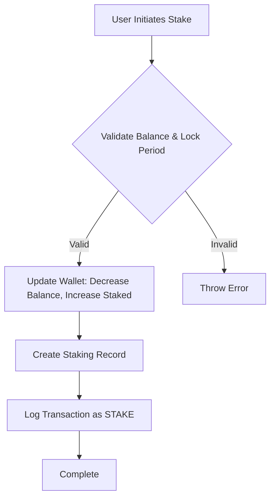
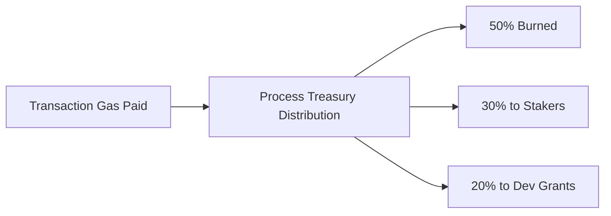
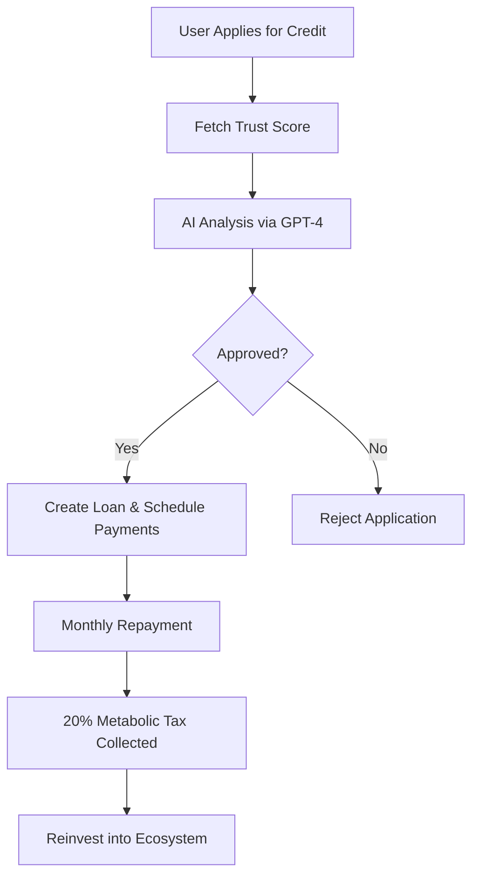
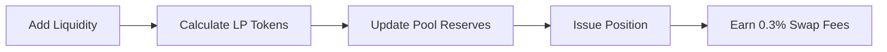
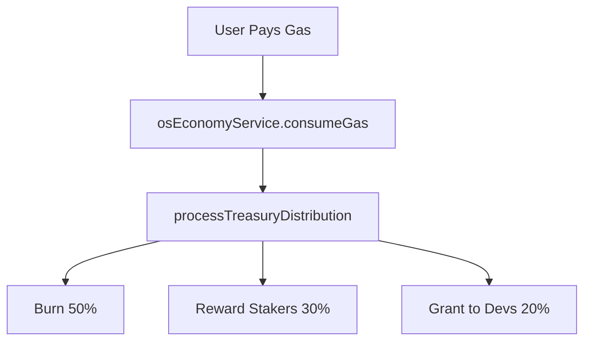

# Economic Engine

<cite>
**Referenced Files in This Document**   
- [CreditService.ts](file://ui/CreditService.ts)
- [LiquidityService.ts](file://ui/LiquidityService.ts)
- [stakingService.ts](file://ui/stakingService.ts)
- [osEconomyService.ts](file://ui/osEconomyService.ts)
- [corporate-metabolism.ts](file://genome/agent-tools/corporate-metabolism.ts)
</cite>

## Table of Contents
1. [Introduction](#introduction)
2. [Two-Token System: AZR and a-Tokens](#two-token-system-azr-and-a-tokens)
3. [Staking Mechanisms](#staking-mechanisms)
4. [Metabolic Reinvestment Model](#metabolic-reinvestment-model)
5. [Credit Calculation and Trust Scoring](#credit-calculation-and-trust-scoring)
6. [Liquidity Management](#liquidity-management)
7. [Revenue Distribution and Transaction Flows](#revenue-distribution-and-transaction-flows)
8. [Service Integration: Minting, Staking, and Liquidity](#service-integration-minting-staking-and-liquidity)
9. [Token Valuation and Stabilization](#token-valuation-and-stabilization)
10. [Configuration Options and Economic Parameters](#configuration-options-and-economic-parameters)
11. [Performance Considerations](#performance-considerations)
12. [Conclusion](#conclusion)

## Introduction
The Azora Economic Engine is a self-sustaining, AI-integrated financial ecosystem designed to promote equitable growth, autonomous governance, and metabolic reinvestment. It operates on a dual-token model (AZR and a-Tokens), integrates staking and liquidity mechanisms, and employs a unique metabolic tax system to fund ecosystem development. This document details the implementation and interplay of these systems, focusing on credit evaluation, liquidity provisioning, staking rewards, and revenue distribution through autonomous services.

## Two-Token System: AZR and a-Tokens
The Azora economy is built on two primary token types:
- **AZR**: The native utility and governance token used for transactions, staking, gas fees, and system rewards.
- **a-Tokens**: Synthetic or application-specific tokens representing value within sub-systems (e.g., credit instruments, liquidity pool shares, or staking derivatives).

AZR serves as the base denomination across all economic activities, including microtransactions, service payments, and treasury distributions. a-Tokens are used to abstract complex financial instruments such as liquidity positions and credit derivatives, enabling modular financial engineering within the ecosystem.

**Section sources**
- [CreditService.ts](file://ui/CreditService.ts#L1-L390)
- [LiquidityService.ts](file://ui/LiquidityService.ts#L1-L332)

## Staking Mechanisms
The staking system allows users to lock AZR tokens for a fixed period in exchange for yield, contributing to network security and stability. The implementation supports variable lock periods with tiered APY:
- 5% APY for lock periods ≤ 180 days
- 10% APY for lock periods > 180 days

Staking records are tracked in a database with wallet integration, ensuring atomic updates to balances and transaction logs. Rewards are distributed from a dedicated staking pool wallet, with periodic redistribution events that zero out the pool balance and credit individual stakers proportionally based on their stake size.

**Diagram sources**
- [stakingService.ts](file://ui/stakingService.ts#L1-L96)

**Section sources**
- [stakingService.ts](file://ui/stakingService.ts#L1-L96)

## Metabolic Reinvestment Model
The metabolic reinvestment model is a core innovation that automatically redirects transaction value into ecosystem growth. Every transaction involving system gas or service usage triggers a distribution mechanism:
- **50% Burn**: Permanently removes AZR from circulation, creating deflationary pressure.
- **30% Reward**: Distributed to stakers as yield, incentivizing long-term participation.
- **20% Grant**: Allocated to a developer grant pool to fund innovation and protocol improvements.

This model ensures that economic activity directly fuels system sustainability, reducing reliance on external funding and aligning user behavior with ecosystem health.

**Diagram sources**
- [osEconomyService.ts](file://ui/osEconomyService.ts#L1-L98)

**Section sources**
- [osEconomyService.ts](file://ui/osEconomyService.ts#L1-L98)

## Credit Calculation and Trust Scoring
Credit issuance is governed by an AI-augmented trust scoring system that evaluates users based on five key factors:
- Transaction History
- Social Connections
- Reputation
- Financial Stability
- Community Engagement

Each factor contributes to an overall trust score (0–100), which determines credit eligibility and terms. The system uses OpenAI's GPT-4 to analyze applications contextually, applying constitutional rules to approve or reject requests. Approved loans generate amortized repayment schedules with monthly payments and metabolic tax collection.

The metabolic tax (20% of each repayment) is automatically collected through a daily cron job that scans for overdue payments and enforces deductions, ensuring continuous reinvestment.

**Diagram sources**
- [CreditService.ts](file://ui/CreditService.ts#L1-L390)

**Section sources**
- [CreditService.ts](file://ui/CreditService.ts#L1-L390)

## Liquidity Management
The liquidity system implements an automated market maker (AMM) model with constant product formula (x * y = k). Users can provide liquidity to pools (e.g., AZR/ETH, AZR/USDC) and earn trading fees (0.3% per swap). The service supports:
- Pool creation and initialization
- Liquidity addition and removal
- Token swaps with price impact calculation
- Fee distribution to liquidity providers

Liquidity positions are represented as NFT-like tokens, allowing users to track their share of pool reserves. Value calculations are based on proportional ownership, with simplified price assumptions for cross-token valuation.

**Diagram sources**
- [LiquidityService.ts](file://ui/LiquidityService.ts#L1-L332)

**Section sources**
- [LiquidityService.ts](file://ui/LiquidityService.ts#L1-L332)

## Revenue Distribution and Transaction Flows
Revenue flows are structured to ensure transparency and systemic growth. Key transaction types include:
- **Gas Consumption**: Triggers burn, staking rewards, and dev grants.
- **SaaS Payments**: Direct transfers between users and service providers.
- **Swap Fees**: Distributed to liquidity providers.
- **Loan Repayments**: Include metabolic tax for autonomous collection.

All transactions are logged with metadata, including microservice context, enabling auditability and real-time economic monitoring.

**Section sources**
- [osEconomyService.ts](file://ui/osEconomyService.ts#L1-L98)

## Service Integration: Minting, Staking, and Liquidity
While direct minting logic is not present in the analyzed files, the economic engine integrates tightly with staking and liquidity services:
- **Staking Service**: Manages AZR locking, yield distribution, and wallet state.
- **Liquidity Service**: Facilitates decentralized exchange and fee generation.
- **Credit Service**: Issues synthetic credit instruments backed by trust scores.

These services interact through shared wallet and transaction models, ensuring consistency across economic activities. The absence of explicit minting suggests a fixed or externally governed supply mechanism, with value accrual driven by deflationary burns and utility demand.

**Section sources**
- [stakingService.ts](file://ui/stakingService.ts#L1-L96)
- [LiquidityService.ts](file://ui/LiquidityService.ts#L1-L332)
- [CreditService.ts](file://ui/CreditService.ts#L1-L390)

## Token Valuation and Stabilization
Token valuation is stabilized through a combination of mechanisms:
- **Deflationary Burns**: 50% of all transaction gas is burned, reducing supply.
- **Yield Incentives**: Staking rewards encourage holding behavior.
- **Liquidity Incentives**: Swap fees reward providers, enhancing market depth.
- **AI-Governed Credit**: Prevents over-leveraging through dynamic trust scoring.

These mechanisms work in concert to balance inflationary pressures from rewards with deflationary sinks, promoting long-term price stability.

**Section sources**
- [osEconomyService.ts](file://ui/osEconomyService.ts#L1-L98)
- [CreditService.ts](file://ui/CreditService.ts#L1-L390)

## Configuration Options and Economic Parameters
Key economic parameters are configurable via environment variables and service logic:
- `STAKING_POOL_WALLET_ID`: Destination for staking rewards.
- `DEV_GRANT_POOL_WALLET_ID`: Recipient of development grants.
- `OPENAI_API_KEY`: Enables AI-driven credit analysis.
- Pool fees (default 0.3%) and metabolic tax rate (20%) are hardcoded but can be extended for configurability.

Future enhancements could externalize these parameters into a governance-controlled registry for dynamic adjustment.

**Section sources**
- [stakingService.ts](file://ui/stakingService.ts#L1-L96)
- [CreditService.ts](file://ui/CreditService.ts#L1-L390)
- [osEconomyService.ts](file://ui/osEconomyService.ts#L1-L98)

## Performance Considerations
The economic engine is designed for high-volume transaction processing with the following optimizations:
- **Atomic Transactions**: Prisma transactions ensure ACID compliance for balance updates.
- **Cron-Based Automation**: Daily autonomous collection runs batch processing for efficiency.
- **Indexing**: MongoDB and Prisma models use indexed fields (e.g., `userId`, `status`) for fast queries.
- **Caching**: Trust scores are cached for 24 hours to avoid recomputation.

For scalability, the system could integrate with blockchain or event-sourcing architectures to handle higher throughput and ensure decentralization.

**Section sources**
- [stakingService.ts](file://ui/stakingService.ts#L1-L96)
- [CreditService.ts](file://ui/CreditService.ts#L1-L390)
- [osEconomyService.ts](file://ui/osEconomyService.ts#L1-L98)

## Conclusion
The Azora Economic Engine represents a sophisticated, self-reinforcing financial system that combines tokenomics, AI governance, and metabolic reinvestment. By integrating staking, liquidity, credit, and automated revenue distribution, it creates a resilient ecosystem where user activity directly contributes to long-term sustainability. The transparent, code-enforced economic rules ensure fairness and predictability, laying the foundation for a decentralized autonomous economy.