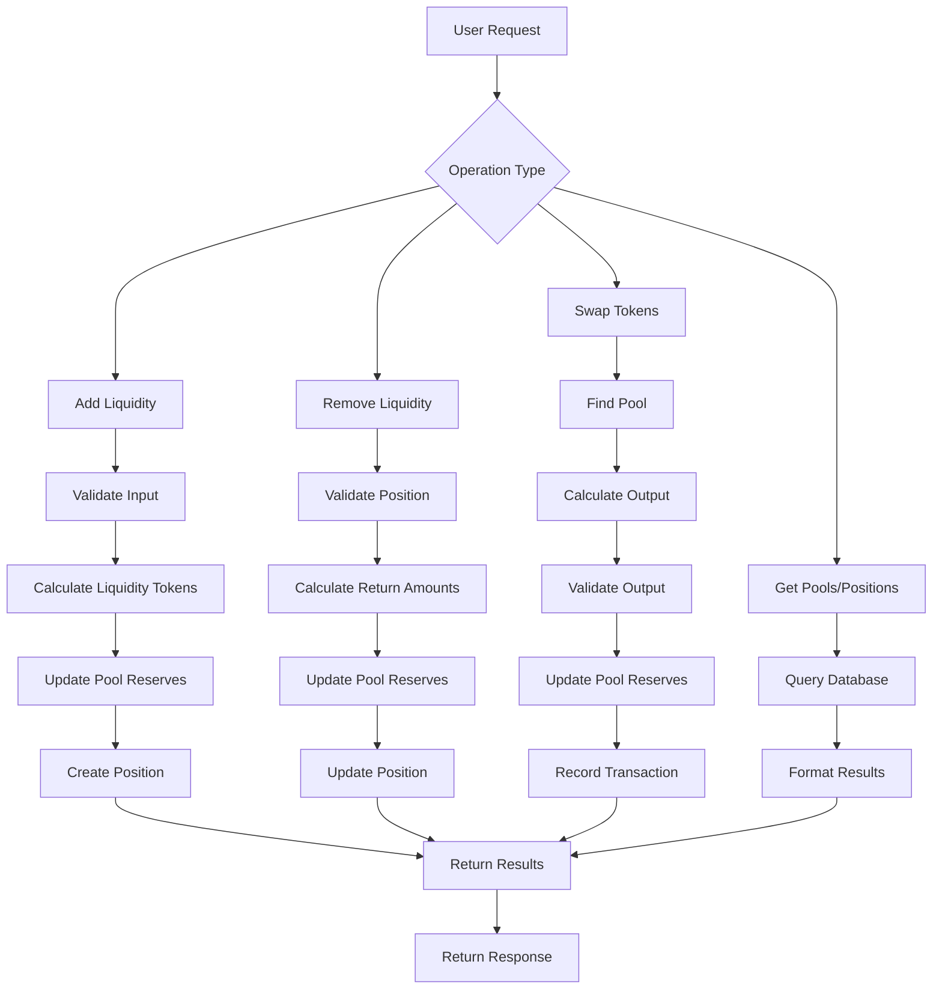

# Liquidity Management

<cite>
**Referenced Files in This Document**   
- [LiquidityService.ts](file://ui\LiquidityService.ts)
- [monitor_treasury.py](file://infrastructure\liquidity\monitor_treasury.py)
</cite>

## Table of Contents
1. [Introduction](#introduction)
2. [Treasury Monitoring System](#treasury-monitoring-system)
3. [Liquidity Pool Management](#liquidity-pool-management)
4. [Market-Making Strategies](#market-making-strategies)
5. [LiquidityService Implementation](#liquiditieservice-implementation)
6. [Relationship to AZR Token Stability](#relationship-to-azr-token-stability)
7. [Common Issues and Mitigation](#common-issues-and-mitigation)
8. [Configuration and Performance](#configuration-and-performance)

## Introduction
Liquidity management is a critical component of the Azora ecosystem, ensuring the stability and functionality of the AZR token economy. This document details the treasury monitoring systems, liquidity pool management, and market-making strategies implemented within the Azora OS. The system is designed to maintain optimal liquidity levels across exchanges, support price stability, and enable founder withdrawals based on constitutional compliance. The core components include the LiquidityService for managing liquidity pools and the monitor_treasury.py script for real-time treasury monitoring.

## Treasury Monitoring System
The treasury monitoring system is responsible for tracking the financial health of the Azora ecosystem and ensuring that liquidity conditions are met for founder withdrawals. The monitor_treasury.py script runs as a continuous monitoring process that checks key metrics at regular intervals.

The system evaluates treasury balance, new user acquisition, and B2B revenue against predefined thresholds. When metrics fall below these thresholds, alerts are generated to notify stakeholders. The monitoring process saves status reports to a designated directory, with the latest report always available as latest.json for dashboard consumption.

Treasury status is loaded from a JSON file that contains balance information, last withdrawal details, and the AZR peg value. Growth metrics are simulated in the demo environment but would connect to actual APIs in production. The system determines if founder liquidity is enabled based on whether new users or B2B revenue meet their respective thresholds.

**Section sources**
- [monitor_treasury.py](file://infrastructure\liquidity\monitor_treasury.py#L1-L153)

## Liquidity Pool Management
Liquidity pool management is handled by the LiquidityService class, which provides a comprehensive interface for interacting with liquidity pools. The service initializes default pools for key token pairs including AZR/ETH, AZR/USDC, and ETH/USDC with predefined reserve amounts.

The service supports adding and removing liquidity from pools, with appropriate validation to ensure positive amounts and correct token pairs. When adding liquidity, the service calculates liquidity tokens to mint using a formula that differs for initial and subsequent provisions. For the first provision, liquidity tokens are calculated as the square root of the product of the deposited amounts. For subsequent provisions, the service calculates the minimum of the proportional liquidity shares based on each token's reserve ratio.

When removing liquidity, the service calculates the corresponding token amounts to return based on the share of the pool represented by the liquidity tokens being removed. The pool reserves and total liquidity are updated accordingly, and the user's position is adjusted or closed.

**Section sources**
- [LiquidityService.ts](file://ui\LiquidityService.ts#L51-L331)

## Market-Making Strategies
The market-making strategy implemented in the LiquidityService follows an Automated Market Maker (AMM) model with a constant product formula. The swapTokens method enables token exchanges through liquidity pools by calculating output amounts using the AMM formula with fee adjustment.

The service applies a 0.3% fee to swaps, which is deducted from the input amount before applying the AMM formula. This fee structure incentivizes liquidity provision and contributes to pool growth over time. Price impact is calculated for each swap to inform users of potential slippage, with the difference between expected and actual output expressed as a percentage.

The system maintains multiple liquidity pools for different token pairs, allowing for efficient price discovery and arbitrage opportunities that help maintain price stability across exchanges. The default pools are initialized with balanced reserves to provide adequate initial liquidity for trading.

**Section sources**
- [LiquidityService.ts](file://ui\LiquidityService.ts#L255-L331)

## LiquidityService Implementation
The LiquidityService implementation provides a complete set of methods for liquidity management operations. The service uses MongoDB schemas to define liquidity pools, positions, and swap transactions, with appropriate fields for tracking reserves, fees, and timestamps.

The addLiquidity method validates input parameters and pool state before updating reserves and creating a new liquidity position. It handles both initial and subsequent liquidity provisions with different calculation methods. The removeLiquidity method ensures users cannot remove more liquidity than they own and updates both pool and position state accordingly.

The getUserLiquidityPositions method retrieves a user's active positions and calculates their current value based on their share of pool reserves. The calculatePositionValue method uses a simplified valuation model that assumes a fixed exchange rate between ETH and AZR for demonstration purposes.

Swap operations are fully integrated with pool management, with reserves updated immediately after successful swaps and transaction records created for audit purposes. The priceImpact calculation provides transparency into market conditions and potential slippage for users.

**Diagram sources**
- [LiquidityService.ts](file://ui\LiquidityService.ts#L51-L331)

**Section sources**
- [LiquidityService.ts](file://ui\LiquidityService.ts#L51-L331)

## Relationship to AZR Token Stability
Liquidity management is directly tied to AZR token stability through multiple mechanisms. The constitution specifies that AZR should be backed by transparent reserves, with the reserve ratio and asset list published and audited monthly. The treasury monitoring system ensures that sufficient reserves are maintained to support the token's peg.

Liquidity pools provide market depth that reduces volatility by absorbing large buy and sell orders. The AMM model ensures continuous liquidity availability, while the fee structure incentivizes liquidity provision. Price impact calculations help maintain transparency about market conditions.

The system enables collateralized fiat liquidity access, allowing users to leverage their AZR holdings while maintaining ecosystem stability. Founder withdrawals are conditional on meeting growth metrics, ensuring that liquidity is only enabled when the ecosystem demonstrates sufficient traction and revenue generation.

## Common Issues and Mitigation
Common liquidity issues include liquidity crunches and flash crashes, which are addressed through multiple mitigation strategies. The treasury monitoring system provides early warning of potential liquidity issues by tracking key metrics and generating alerts when thresholds are breached.

Liquidity crunches are prevented through proactive pool management and the maintenance of a reserve allocation specifically for market making and liquidity provision. The system's design ensures that founder withdrawals are disabled when growth metrics fall below thresholds, preventing excessive token outflow during periods of low activity.

Flash crashes are mitigated through the AMM model's inherent price discovery mechanism, which requires increasingly larger trades to move the price significantly. The price impact calculation provides transparency about potential slippage, discouraging large, destabilizing trades.

The system also includes a ceremonial burn mechanism that reduces circulating supply over time, counteracting inflationary pressures and supporting long-term price stability.

## Configuration and Performance
The monitor_treasury.py script includes configurable parameters for treasury thresholds, growth metrics, check intervals, and alert recipients. These values can be adjusted based on the ecosystem's stage and requirements without code changes.

The LiquidityService is designed for real-time performance with efficient database queries and minimal computational overhead. Pool operations are optimized to complete quickly, with appropriate indexing on MongoDB collections to support high-volume trading.

For production deployment, the monitoring interval can be adjusted based on system load and monitoring requirements. The alert system can be integrated with actual email services or monitoring platforms to ensure timely notification of critical issues.

The system architecture supports horizontal scaling, with the LiquidityService potentially deployed across multiple instances behind a load balancer to handle increased traffic during periods of high market activity.