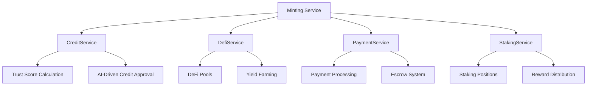
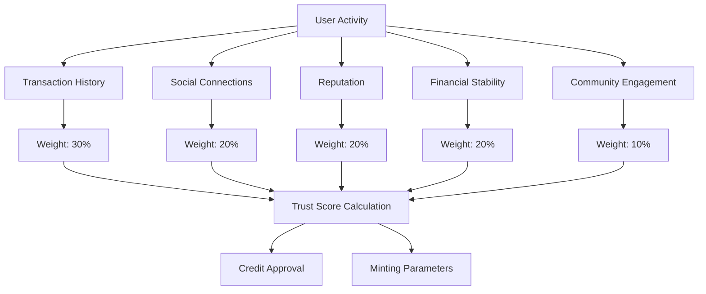
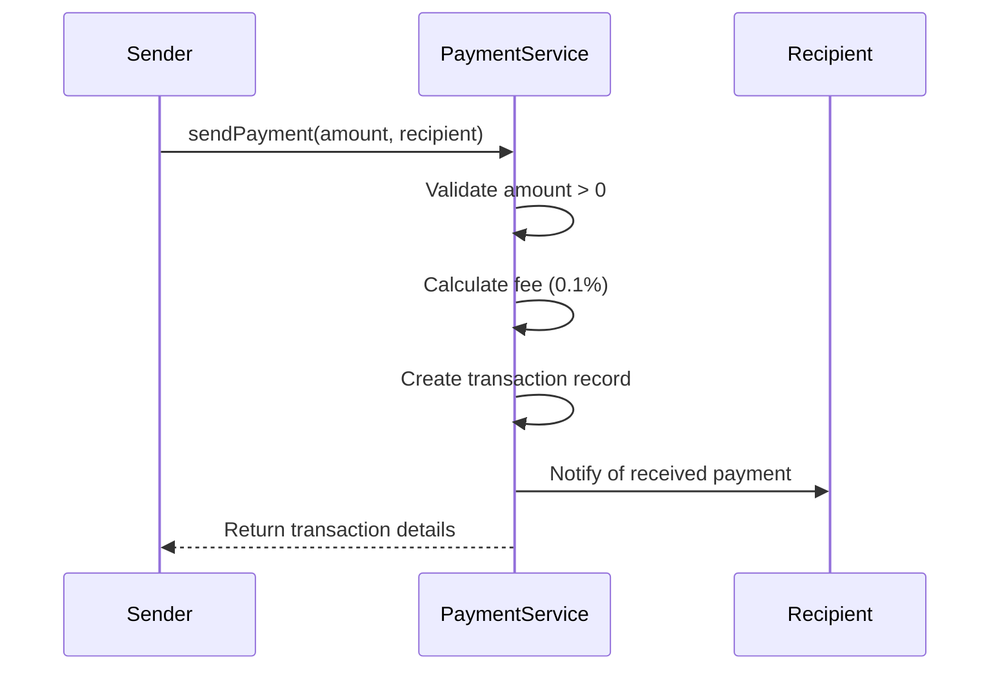
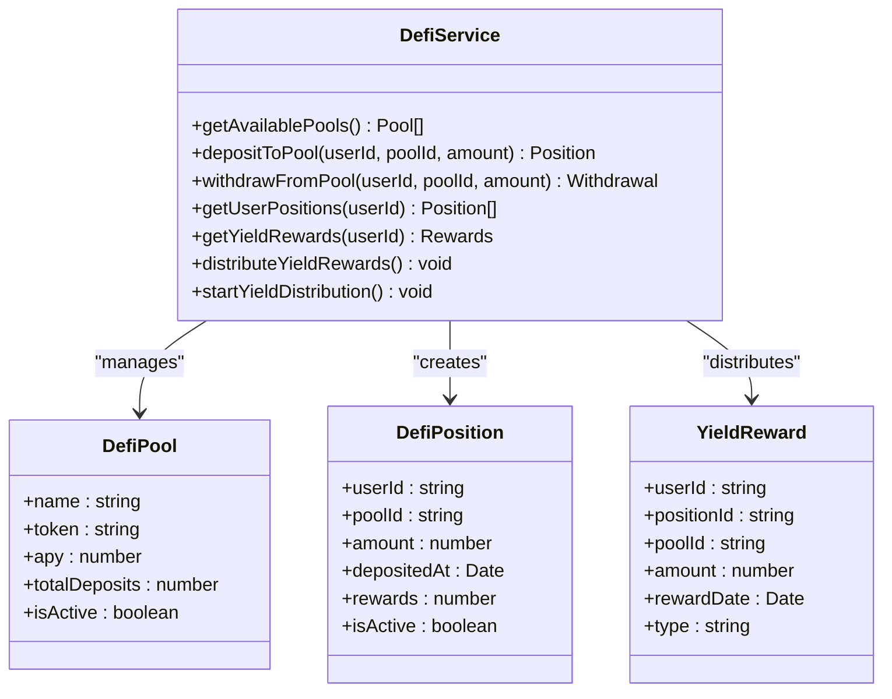
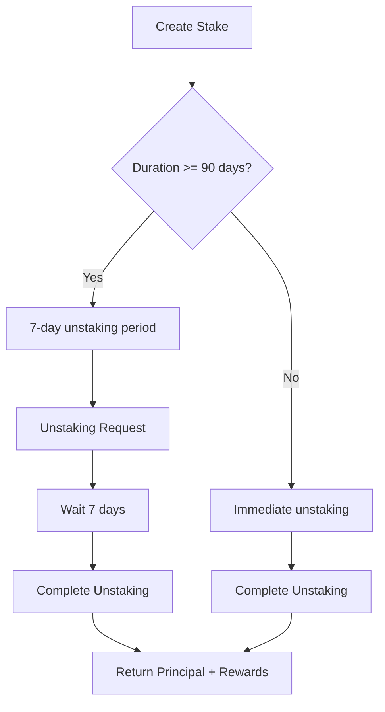
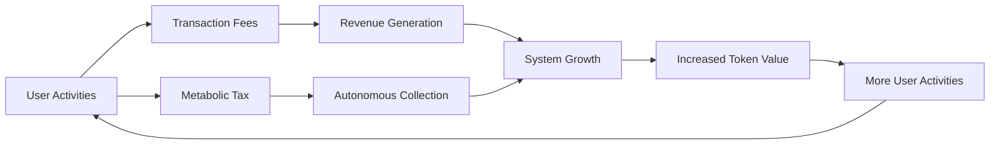
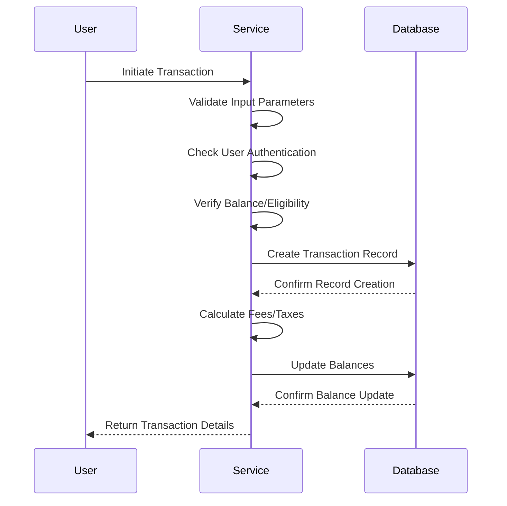
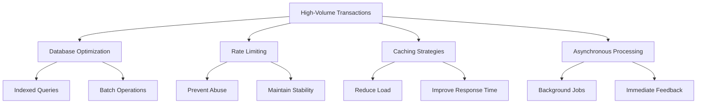

# Minting Service

<cite>
**Referenced Files in This Document**   
- [CreditService.ts](file://services/azora-mint/src/services/CreditService.ts)
- [DefiService.ts](file://services/azora-mint/src/services/DefiService.ts)
- [PaymentService.ts](file://services/azora-mint/src/services/PaymentService.ts)
- [StakingService.ts](file://services/azora-mint/src/services/StakingService.ts)
- [credit.ts](file://services/azora-mint/src/routes/credit.ts)
- [defi.ts](file://services/azora-mint/src/routes/defi.ts)
- [ECONOMIC_MODEL.md](file://codex/economics/ECONOMIC_MODEL.md)
</cite>

## Table of Contents
1. [Introduction](#introduction)
2. [Core Services Overview](#core-services-overview)
3. [Credit Calculation Algorithms](#credit-calculation-algorithms)
4. [Payment Processing Workflows](#payment-processing-workflows)
5. [DeFi Integration Patterns](#defi-integration-patterns)
6. [Staking Service Implementation](#staking-service-implementation)
7. [Metabolic Reinvestment Model](#metabolic-reinvestment-model)
8. [Transaction Validation and Security](#transaction-validation-and-security)
9. [Configuration Options](#configuration-options)
10. [Performance Considerations](#performance-considerations)

## Introduction

The Minting Service in Azora OS is a comprehensive financial engine that manages the creation, distribution, and circulation of AZR tokens through various economic activities. This service integrates credit systems, payment processing, DeFi protocols, and staking mechanisms to create a self-sustaining economic ecosystem. The minting process is closely tied to user activities and contributions, ensuring that token distribution aligns with value creation within the platform.

The service operates on a metabolic reinvestment model where a portion of transaction value is autonomously collected and reinvested into the system's growth. This creates a positive feedback loop that drives network effects and increases the overall value of the AZR token. The minting service is designed to handle high-volume microtransactions while maintaining security, preventing double-spending, and ensuring fair distribution.

**Section sources**
- [ECONOMIC_MODEL.md](file://codex/economics/ECONOMIC_MODEL.md#L1-L357)

## Core Services Overview

The Minting Service comprises four primary components: CreditService, DefiService, PaymentService, and StakingService. These services work in concert to facilitate financial activities and token minting within the Azora ecosystem.

**Diagram sources**
- [CreditService.ts](file://services/azora-mint/src/services/CreditService.ts#L99-L389)
- [DefiService.ts](file://services/azora-mint/src/services/DefiService.ts#L49-L277)
- [PaymentService.ts](file://services/azora-mint/src/services/PaymentService.ts#L44-L316)
- [StakingService.ts](file://services/azora-mint/src/services/StakingService.ts#L46-L271)

**Section sources**
- [CreditService.ts](file://services/azora-mint/src/services/CreditService.ts#L1-L389)
- [DefiService.ts](file://services/azora-mint/src/services/DefiService.ts#L1-L277)
- [PaymentService.ts](file://services/azora-mint/src/services/PaymentService.ts#L1-L316)
- [StakingService.ts](file://services/azora-mint/src/services/StakingService.ts#L1-L271)

## Credit Calculation Algorithms

The CreditService implements a sophisticated credit calculation system that combines traditional financial metrics with AI-driven analysis to determine creditworthiness and minting eligibility. The core of this system is the Trust Score, which evaluates users across five dimensions: transaction history, social connections, reputation, financial stability, and community engagement.

The Trust Score is calculated using a weighted formula where transaction history carries the highest weight (30%), followed by social connections, reputation, and financial stability (20% each), with community engagement at 10%. This score directly influences credit approval decisions and minting parameters. Users with higher trust scores receive more favorable terms and higher minting limits.

The AI-driven credit analysis uses OpenAI's GPT-4 model to evaluate credit applications. The system prompts the AI with the user's trust score, requested amount, and purpose, asking it to provide an approval decision, suggested amount, interest rate, term, and reasoning. This AI analysis is combined with the trust score to make final approval decisions, creating a hybrid system that leverages both algorithmic and artificial intelligence approaches.

**Section sources**
- [CreditService.ts](file://services/azora-mint/src/services/CreditService.ts#L99-L389)

## Payment Processing Workflows

The PaymentService handles all transaction processing within the Azora ecosystem, including direct payments, payment requests, and escrow transactions. The service is designed to support high-volume microtransactions with minimal fees (0.1%) while ensuring transaction integrity and preventing double-spending.

When a user initiates a payment, the system creates a transaction record with a unique hash and processes the transfer. The workflow includes validation of the sender's balance (in a real implementation), fee calculation, and updating of transaction records. Payment requests allow users to request funds from others, creating a flexible payment ecosystem that supports both push and pull transaction models.

For marketplace transactions, the PaymentService implements an escrow system where funds are held until the item or service is delivered. This ensures trust in peer-to-peer transactions and prevents fraud. The escrow workflow involves creating a pending transaction, confirming delivery, and releasing funds to the seller. Only the buyer or seller can release the escrow, providing security for both parties.

**Section sources**
- [PaymentService.ts](file://services/azora-mint/src/services/PaymentService.ts#L44-L316)
- [credit.ts](file://services/azora-mint/src/routes/credit.ts#L1-L224)

## DeFi Integration Patterns

The DefiService integrates decentralized finance protocols into the Azora ecosystem, creating multiple avenues for AZR token minting and distribution. The service manages various DeFi pools including staking pools, liquidity mining, and yield farming, each with different APY (Annual Percentage Yield) rates to incentivize different types of participation.

The integration follows a pattern of deposit-withdraw-reward distribution. Users deposit tokens into a pool, earn rewards based on the pool's APY and their deposit amount, and can withdraw their principal plus rewards. The system automatically distributes yield rewards on an hourly basis, ensuring that users receive their earnings in a timely manner.

The service initializes default DeFi pools with varying risk-return profiles, from the standard AZR Staking Pool (8% APY) to the High Yield Pool (20% APY). This tiered approach allows users to choose their preferred risk level and encourages broader participation in the ecosystem. The hourly reward distribution cron job ensures that yield farming remains attractive and competitive with other DeFi platforms.

**Diagram sources**
- [DefiService.ts](file://services/azora-mint/src/services/DefiService.ts#L49-L277)

**Section sources**
- [DefiService.ts](file://services/azora-mint/src/services/DefiService.ts#L49-L277)
- [defi.ts](file://services/azora-mint/src/routes/defi.ts#L1-L207)

## Staking Service Implementation

The StakingService provides a comprehensive staking mechanism that incentivizes long-term holding of AZR tokens while contributing to network security and stability. The service implements a duration-based APY model where longer staking periods receive higher returns, encouraging users to commit their tokens for extended periods.

The staking process begins with the creation of a staking position, which requires a minimum of 1 AZR and a duration between 30 and 365 days. The APY is calculated based on the duration: 2% for less than 30 days, 4% for 30 days, 6% for 90 days, 8% for 180 days, and 12% for 365 days. This graduated scale rewards longer commitments and helps stabilize the token supply.

For stakes of 90 days or longer, the service implements a 7-day unstaking period to prevent rapid withdrawal and maintain liquidity stability. During this period, the stake status changes to "unstaking" and becomes available for withdrawal after one week. This mechanism balances user flexibility with network stability requirements.

The daily reward distribution system runs at midnight, calculating and distributing rewards to all active staking positions. The rewards are calculated based on the daily rate (APY/365) multiplied by the staked amount. This ensures that users receive their earnings consistently and can track their returns over time.

**Section sources**
- [StakingService.ts](file://services/azora-mint/src/services/StakingService.ts#L46-L271)

## Metabolic Reinvestment Model

The metabolic reinvestment model is a core component of the Azora economic engine, where a portion of transaction value is autonomously collected and reinvested into the system's growth. This model creates a self-sustaining economic cycle that drives network effects and increases the overall value of the AZR token.

In the credit system, a 20% metabolic tax is applied to loan repayments. When a user makes a repayment, 20% of the payment amount is collected as a metabolic tax and directed to autonomous collection. This tax funds system operations and growth initiatives, creating a revenue stream that is directly tied to economic activity within the platform.

The autonomous collection runs as a daily cron job that processes overdue loans and collects the metabolic tax. For severely overdue loans (over 90 days), the system marks them as defaulted, which may trigger additional collection mechanisms. This automated process ensures consistent revenue collection without requiring manual intervention.

The reinvestment model is designed to allocate 105% of revenue back into the system, with 70% going to infrastructure and development, 20% to student incentives, 10% to the founding team, and 5% to an emergency reserve. This aggressive reinvestment strategy accelerates growth and creates a compounding effect on the platform's value.

**Section sources**
- [CreditService.ts](file://services/azora-mint/src/services/CreditService.ts#L345-L389)
- [ECONOMIC_MODEL.md](file://codex/economics/ECONOMIC_MODEL.md#L1-L357)

## Transaction Validation and Security

The Minting Service implements multiple layers of transaction validation and security measures to prevent double-spending, fraud, and unauthorized access. Each service includes comprehensive input validation, error handling, and access control mechanisms to ensure the integrity of financial operations.

The PaymentService validates all payment amounts to ensure they are positive numbers and checks user authentication before processing transactions. The system generates unique transaction hashes for each payment, creating an immutable record that can be verified on the blockchain. For escrow transactions, the service implements strict access controls, allowing only the buyer or seller to release funds.

The CreditService includes AI-driven fraud detection through its OpenAI integration, which analyzes credit applications for potential risks and inconsistencies. The system also implements rate limiting and monitoring to detect suspicious patterns of activity. All sensitive operations are logged for audit purposes, and the system includes fallback mechanisms in case of AI service failures.

For staking operations, the service validates staking amounts and durations, ensuring they meet minimum requirements and fall within acceptable ranges. The 7-day unstaking period for longer stakes acts as a security measure against rapid withdrawal attacks. All staking positions are recorded with timestamps and status indicators, providing a clear audit trail of user activities.

**Section sources**
- [PaymentService.ts](file://services/azora-mint/src/services/PaymentService.ts#L44-L316)
- [CreditService.ts](file://services/azora-mint/src/services/CreditService.ts#L99-L389)
- [StakingService.ts](file://services/azora-mint/src/services/StakingService.ts#L46-L271)

## Configuration Options

The Minting Service provides several configuration options that can be adjusted to optimize performance, security, and user experience. These options are primarily controlled through environment variables and system parameters that can be modified without requiring code changes.

Key configuration parameters include:
- **OPENAI_API_KEY**: API key for AI-driven credit analysis
- **STAKING_POOL_WALLET_ID**: Wallet ID for the staking reward pool
- **Metabolic Tax Rate**: Currently set at 20% for loan repayments
- **Minimum Staking Amount**: Set at 1 AZR
- **Staking Duration Limits**: Minimum 30 days, maximum 365 days
- **Transaction Fee**: Set at 0.1% of transaction amount

The cron job schedules are also configurable, allowing administrators to adjust the frequency of automated processes:
- Autonomous collection: Runs daily at midnight (0 0 * * *)
- Yield distribution: Runs hourly (0 * * * *)
- Reward distribution: Runs daily at midnight (0 0 * * *)

These configuration options provide flexibility in managing the minting service and allow for optimization based on network conditions, user demand, and business requirements. The system is designed to be easily configurable without requiring code modifications, enabling rapid response to changing market conditions.

**Section sources**
- [CreditService.ts](file://services/azora-mint/src/services/CreditService.ts#L99-L389)
- [DefiService.ts](file://services/azora-mint/src/services/DefiService.ts#L49-L277)
- [StakingService.ts](file://services/azora-mint/src/services/StakingService.ts#L46-L271)

## Performance Considerations

The Minting Service is designed to handle high-volume microtransactions efficiently while maintaining system stability and responsiveness. Several performance optimization strategies have been implemented to ensure scalability and reliability under heavy load.

For database operations, the service uses MongoDB with appropriate indexing on frequently queried fields such as userId, status, and timestamps. This ensures fast retrieval of user-specific data and transaction histories. The system also implements batch operations where possible, reducing the number of database round-trips for related operations.

The service leverages asynchronous processing for non-critical operations, allowing immediate user feedback while completing background tasks. For example, when a user applies for credit, the system returns a response immediately while the AI analysis and database operations complete in the background. This improves user experience by reducing perceived latency.

Rate limiting is implemented to prevent abuse and ensure fair usage of system resources. The cron jobs for autonomous collection, yield distribution, and reward distribution are scheduled during off-peak hours to minimize impact on user-facing operations. The system also includes comprehensive logging and monitoring to identify performance bottlenecks and optimize resource allocation.

For high-frequency operations like payment processing, the service is designed to handle thousands of transactions per second through efficient code paths and connection pooling. The use of lightweight transaction records and minimal processing overhead ensures that microtransactions can be processed quickly and cost-effectively.

**Section sources**
- [PaymentService.ts](file://services/azora-mint/src/services/PaymentService.ts#L44-L316)
- [CreditService.ts](file://services/azora-mint/src/services/CreditService.ts#L99-L389)
- [DefiService.ts](file://services/azora-mint/src/services/DefiService.ts#L49-L277)