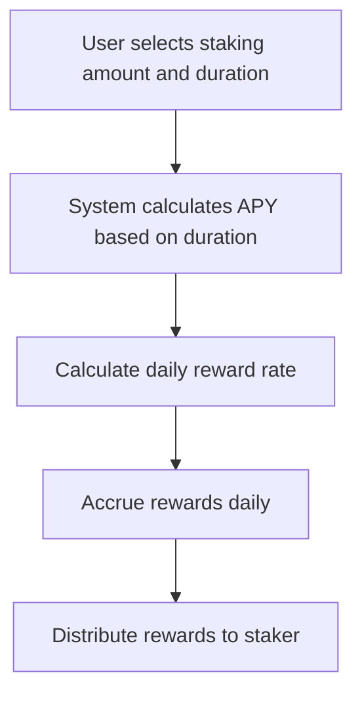
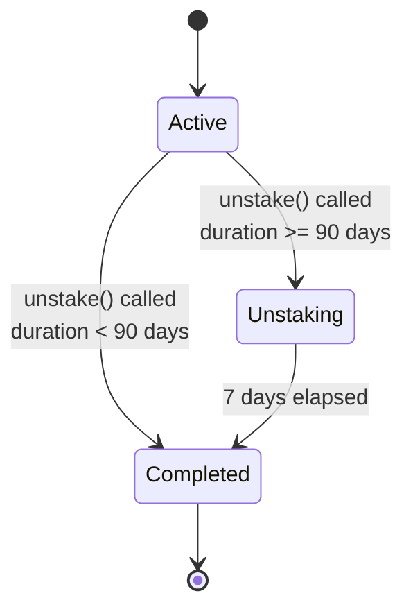
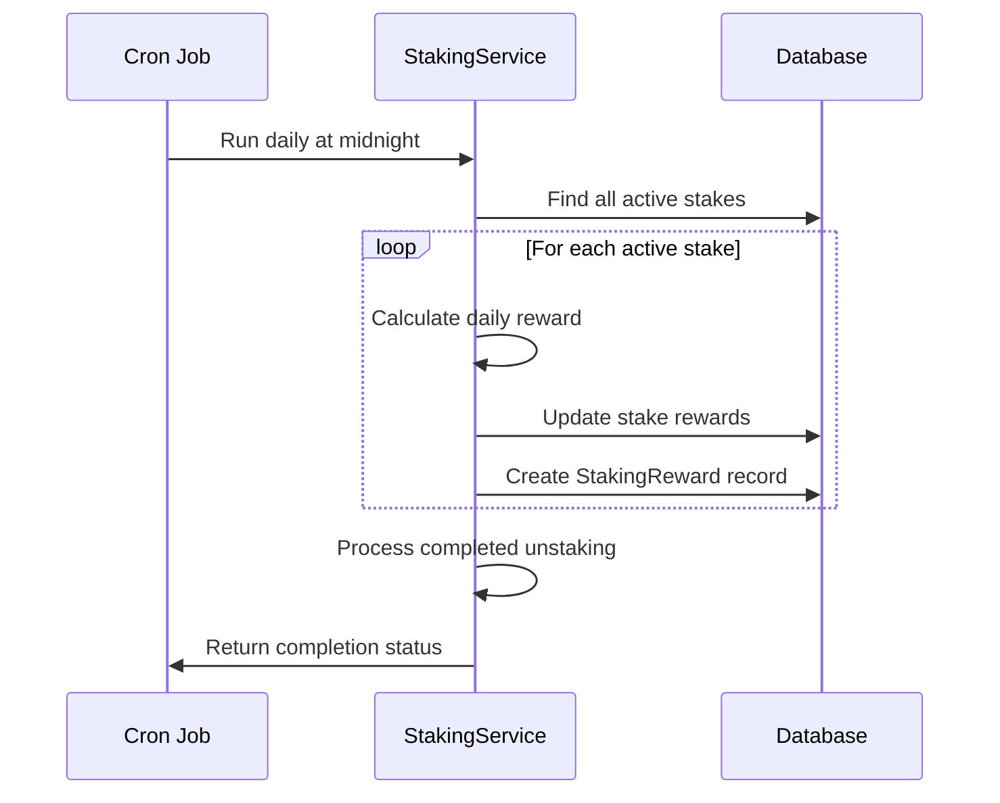
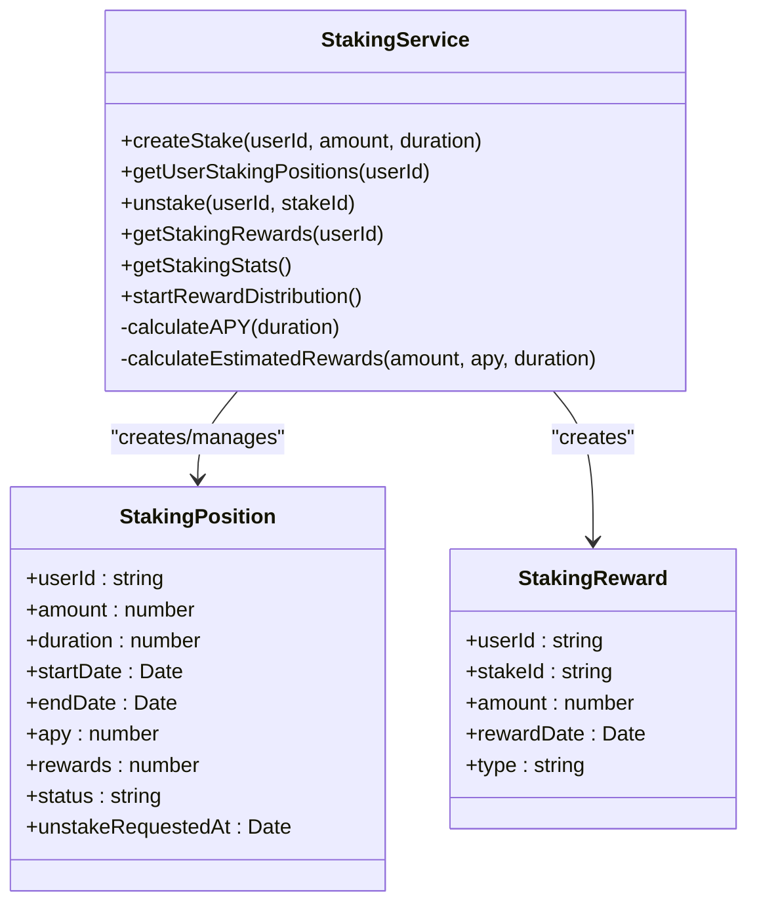
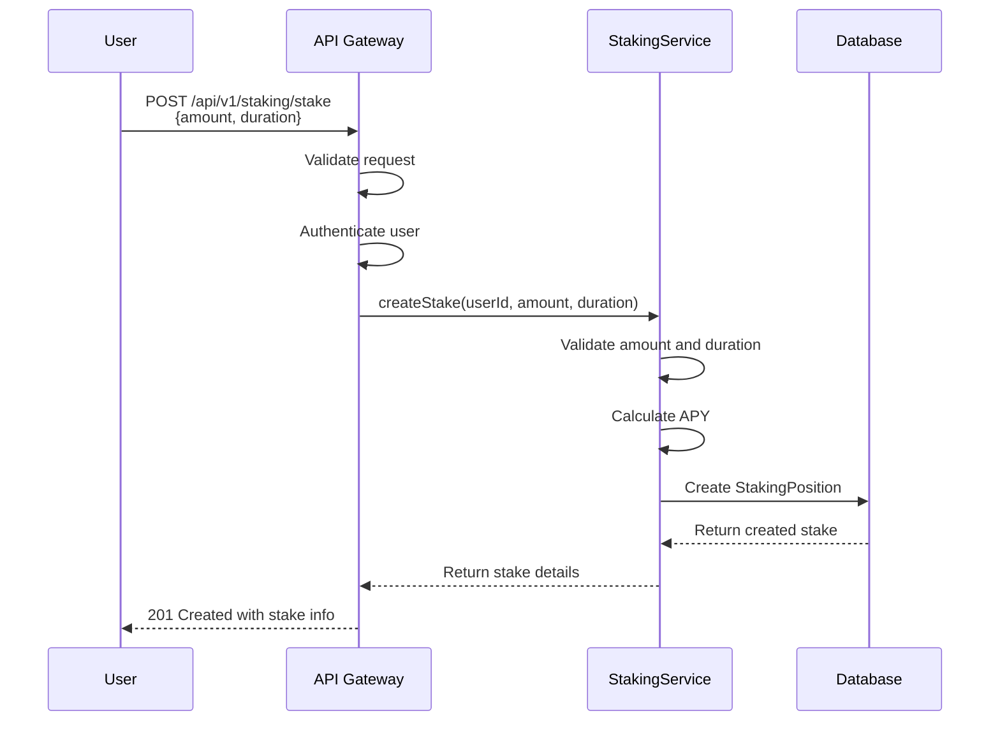

# Staking Mechanisms

<cite>
**Referenced Files in This Document**   
- [StakingService.ts](file://services/azora-mint/src/services/StakingService.ts)
- [staking.ts](file://services/azora-mint/src/routes/staking.ts)
- [ECONOMIC_MODEL.md](file://codex/economics/ECONOMIC_MODEL.md)
- [enhanced-mint-core.ts](file://services/azora-mint/enhanced-mint-core.ts)
</cite>

## Table of Contents
1. [Introduction](#introduction)
2. [Staking Reward Calculation Algorithms](#staking-reward-calculation-algorithms)
3. [Lock-up Periods and Unstaking Mechanics](#lock-up-periods-and-unstaking-mechanics)
4. [Yield Distribution Models](#yield-distribution-models)
5. [StakingService Class Implementation](#stakingservice-class-implementation)
6. [Staking Transaction Flows](#staking-transaction-flows)
7. [Relationship to AZR Token Economic Stability](#relationship-to-azr-token-economic-stability)
8. [Early Withdrawal Penalties and Reward Compounding](#early-withdrawal-penalties-and-reward-compounding)
9. [Configuration Options for Staking Parameters](#configuration-options-for-staking-parameters)
10. [Performance Considerations](#performance-considerations)
11. [Conclusion](#conclusion)

## Introduction
The staking mechanism in the Azora ecosystem is a core component of the tokenomics and economic model, designed to incentivize long-term holding, ensure network security, and distribute rewards fairly among participants. This document provides a comprehensive analysis of the staking system, focusing on the implementation details, reward algorithms, and integration with the broader economic framework of the AZR token. The system is implemented primarily through the `StakingService` class and exposed via API endpoints in the `staking.ts` route file.

**Section sources**
- [StakingService.ts](file://services/azora-mint/src/services/StakingService.ts)
- [staking.ts](file://services/azora-mint/src/routes/staking.ts)

## Staking Reward Calculation Algorithms
The staking reward calculation is based on an Annual Percentage Yield (APY) model that varies according to the staking duration. The algorithm implements a tiered APY structure where longer staking periods receive higher returns, incentivizing long-term commitment to the ecosystem.

The `calculateAPY` method in the `StakingService` class determines the yield based on duration:
- 12% APY for 365 days (1 year)
- 8% APY for 180-364 days (6 months)
- 6% APY for 90-179 days (3 months)
- 4% APY for 30-89 days (1 month)
- 2% APY for periods shorter than 30 days

Rewards are calculated daily using the formula: `dailyReward = (stakeAmount × APY / 100) / 365`. The estimated total rewards for a staking period are computed by multiplying the daily reward by the number of days in the staking duration.

**Diagram sources**
- [StakingService.ts](file://services/azora-mint/src/services/StakingService.ts#L46-L58)

**Section sources**
- [StakingService.ts](file://services/azora-mint/src/services/StakingService.ts#L46-L68)

## Lock-up Periods and Unstaking Mechanics
The staking system implements flexible lock-up periods ranging from 30 to 365 days, with different unstaking procedures based on the duration of the stake. The system enforces minimum and maximum duration constraints to maintain economic stability.

For stakes with durations of 90 days or longer, a 7-day unstaking period is required. When a user initiates unstaking, the position status changes from "active" to "unstaking," and the user must wait 7 days before the principal and accrued rewards can be withdrawn. This mechanism prevents rapid capital flight and provides stability to the staking pool.

Shorter stakes (less than 90 days) allow for immediate unstaking, providing liquidity options for users who prefer shorter commitments. The system validates that the lock period has expired before processing any unstaking request, preventing early withdrawals except through the designated unstaking period.

**Diagram sources**
- [StakingService.ts](file://services/azora-mint/src/services/StakingService.ts#L146-L184)

**Section sources**
- [StakingService.ts](file://services/azora-mint/src/services/StakingService.ts#L146-L184)

## Yield Distribution Models
The Azora staking system employs a daily yield distribution model, where rewards are calculated and credited to stakers on a daily basis. The `distributeDailyRewards` method runs as a cron job at midnight every day, processing all active staking positions and distributing appropriate rewards.

Each day, the system:
1. Retrieves all active staking positions
2. Calculates the daily reward for each position based on the staked amount and APY
3. Updates the stake's accumulated rewards
4. Creates a `StakingReward` record to document the distribution
5. Persists the updated stake information

This daily distribution model ensures that users can see their rewards accumulating in real-time, enhancing user engagement and transparency. The system also processes any completed unstaking requests as part of the same cron job, maintaining consistency in the staking lifecycle management.

**Diagram sources**
- [StakingService.ts](file://services/azora-mint/src/services/StakingService.ts#L215-L245)

**Section sources**
- [StakingService.ts](file://services/azora-mint/src/services/StakingService.ts#L215-L245)

## StakingService Class Implementation
The `StakingService` class serves as the core implementation of the staking mechanism, encapsulating all business logic related to staking operations. The class provides methods for creating stakes, retrieving staking positions, unstaking, and managing reward distribution.

Key methods include:
- `createStake`: Creates a new staking position with validation for minimum amount (1 AZR) and duration constraints (30-365 days)
- `getUserStakingPositions`: Retrieves all staking positions for a specific user
- `unstake`: Initiates the unstaking process with appropriate validation and timing rules
- `getStakingRewards`: Returns a user's reward history and total earned rewards
- `getStakingStats`: Provides global staking metrics for monitoring and analytics
- `startRewardDistribution`: Initializes the daily cron job for reward distribution

The service uses MongoDB models for persistence, with `StakingPosition` and `StakingReward` schemas defining the data structure for staking records and reward transactions respectively.

**Diagram sources**
- [StakingService.ts](file://services/azora-mint/src/services/StakingService.ts#L46-L271)

**Section sources**
- [StakingService.ts](file://services/azora-mint/src/services/StakingService.ts#L46-L271)

## Staking Transaction Flows
The staking transaction flow begins with a user request through the API endpoint and proceeds through validation, processing, and persistence stages. The primary entry point is the `/api/v1/staking/stake` POST endpoint, which accepts the staking amount and duration.

The flow proceeds as follows:
1. API request validation using express-validator middleware
2. Authentication verification to ensure the user is logged in
3. Service layer processing to create the staking position
4. Database persistence of the new stake
5. Return of confirmation with estimated rewards and maturity date

For unstaking, the flow follows a similar pattern but includes additional logic to handle the 7-day waiting period for longer stakes. The system updates the stake status accordingly and returns information about when the unstaking will be completed.

**Diagram sources**
- [staking.ts](file://services/azora-mint/src/routes/staking.ts#L25-L75)
- [StakingService.ts](file://services/azora-mint/src/services/StakingService.ts#L70-L100)

**Section sources**
- [staking.ts](file://services/azora-mint/src/routes/staking.ts#L25-L75)
- [StakingService.ts](file://services/azora-mint/src/services/StakingService.ts#L70-L100)

## Relationship to AZR Token Economic Stability
The staking mechanism plays a crucial role in the economic stability of the AZR token by reducing circulating supply, creating demand through yield incentives, and aligning long-term holder interests with the platform's success. According to the economic model outlined in the ECONOMIC_MODEL.md document, staking contributes to value creation through multiple channels.

By locking up tokens for periods ranging from 30 to 365 days, staking reduces the available supply in the market, which can help stabilize or increase the token price as demand grows. The tiered APY structure incentivizes longer lock-up periods, further enhancing supply stability. Additionally, the daily distribution of rewards creates consistent demand for the token, as new rewards are added to the economy and can be reinvested or spent within the ecosystem.

The staking pool also serves as a mechanism for distributing newly minted tokens or protocol fees, providing a transparent and predictable inflation schedule that participants can anticipate and plan for.

**Section sources**
- [ECONOMIC_MODEL.md](file://codex/economics/ECONOMIC_MODEL.md#L1-L357)

## Early Withdrawal Penalties and Reward Compounding
The current implementation handles early withdrawal through a time-based restriction rather than a direct penalty. For stakes with durations of 90 days or longer, users cannot immediately withdraw their funds; instead, they must wait 7 days after initiating the unstaking process. This effectively serves as a cooling-off period that discourages short-term speculation while not imposing a financial penalty.

The system does not currently implement reward compounding, where earned rewards are automatically reinvested to generate additional returns. Instead, rewards are accumulated in the stake record and distributed to the user's wallet upon completion of the staking period or during the unstaking process. However, users can manually compound their rewards by creating new stakes with their earned rewards.

Future enhancements could include an option for automatic compounding, where users can elect to have their daily rewards automatically staked, potentially at an enhanced APY to incentivize this behavior and increase capital efficiency within the system.

**Section sources**
- [StakingService.ts](file://services/azora-mint/src/services/StakingService.ts#L146-L184)
- [enhanced-mint-core.ts](file://services/azora-mint/enhanced-mint-core.ts#L724-L889)

## Configuration Options for Staking Parameters
The staking system includes several configurable parameters that can be adjusted to respond to market conditions and economic goals. These parameters are defined in the enhanced mint core configuration and can be modified without requiring code changes.

Key configurable parameters include:
- Minimum staking amount (currently 1 AZR)
- Valid duration range (30-365 days)
- APY rates for different duration tiers
- Unstaking waiting period (7 days for long-term stakes)
- Reward distribution frequency (daily)

The enhanced mint core configuration also defines lock periods and associated bonuses, such as a 10% APR bonus for 90-day stakes, 15% for 180-day stakes, and 25% for 365-day stakes. These parameters can be adjusted to influence user behavior and optimize the staking pool composition based on the platform's economic objectives.

**Section sources**
- [enhanced-mint-core.ts](file://services/azora-mint/enhanced-mint-core.ts#L724-L889)
- [StakingService.ts](file://services/azora-mint/src/services/StakingService.ts#L46-L58)

## Performance Considerations
The staking system is designed with performance considerations for handling concurrent operations, particularly for the daily reward distribution which must process potentially thousands of staking positions. The `distributeDailyRewards` method runs as a scheduled cron job and processes each active stake sequentially, which could become a bottleneck as the user base grows.

To mitigate performance issues, the system could be enhanced with:
- Batch processing of rewards to reduce database transaction overhead
- Pagination or chunking of active stakes to prevent memory issues
- Caching of frequently accessed data like global staking statistics
- Database indexing on key fields like userId, status, and dates
- Horizontal scaling of the service to distribute load

The use of MongoDB's aggregation framework for calculating global statistics is efficient, but these operations should be monitored as data volume increases. The system currently lacks explicit rate limiting on API endpoints, which could be added to prevent abuse and ensure fair access to staking services.

**Section sources**
- [StakingService.ts](file://services/azora-mint/src/services/StakingService.ts#L215-L245)

## Conclusion
The Azora staking mechanism represents a sophisticated implementation of token staking that balances user incentives, economic stability, and technical robustness. By offering tiered APY rates based on duration, implementing thoughtful unstaking mechanics, and distributing rewards daily, the system creates a compelling value proposition for token holders. The integration with the broader economic model ensures that staking contributes directly to the platform's growth objectives and token value appreciation. Future enhancements could include reward compounding options and improved performance optimizations for large-scale operations.