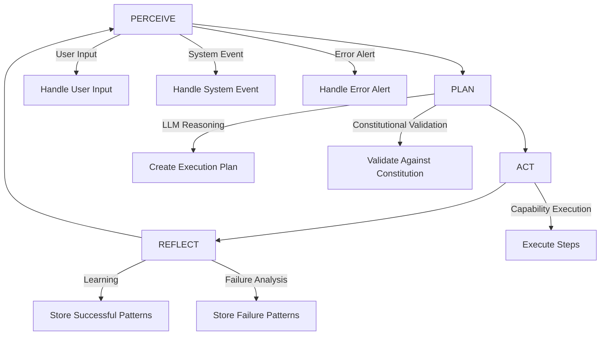
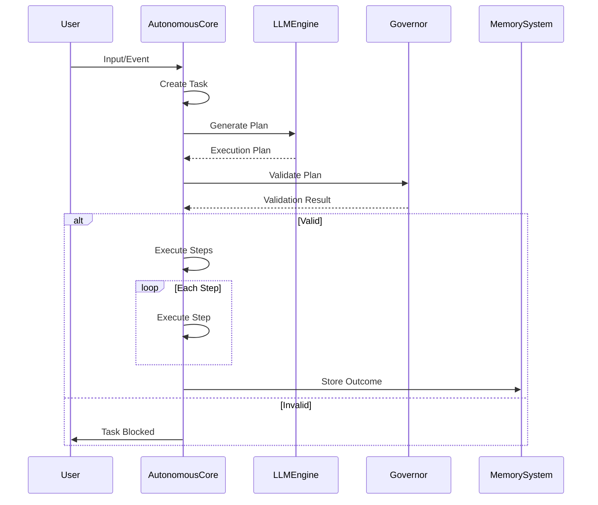
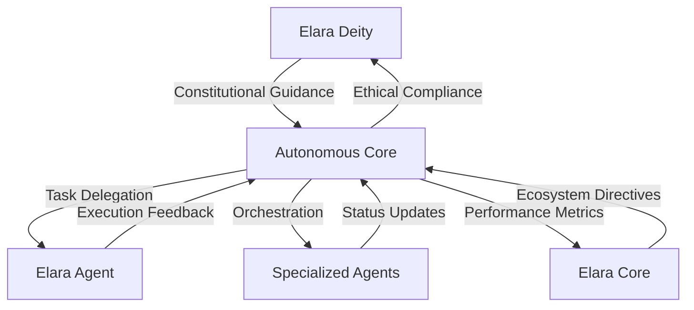

# Autonomous Core

<cite>
**Referenced Files in This Document**   
- [autonomous-core.ts](file://genome/agent-tools/autonomous-core.ts)
- [elara-deity.ts](file://genome/agent-tools/elara-deity.ts)
- [elara-core.ts](file://genome/agent-tools/elara-core.ts)
- [elara-agent.ts](file://genome/agent-tools/elara-agent.ts)
</cite>

## Table of Contents
1. [Introduction](#introduction)
2. [Core Autonomy Algorithms](#core-autonomy-algorithms)
3. [Decision-Making Framework](#decision-making-framework)
4. [Self-Evolution Capabilities](#self-evolution-capabilities)
5. [Multi-Level Orchestration](#multi-level-orchestration)
6. [Constitutional Oversight and Autonomy Balance](#constitutional-oversight-and-autonomy-balance)
7. [Autonomy Conflicts and Resolution](#autonomy-conflicts-and-resolution)
8. [Configuration Options](#configuration-options)
9. [Performance Considerations](#performance-considerations)
10. [Troubleshooting Guide](#troubleshooting-guide)

## Introduction

The Autonomous Core is the central intelligence engine of Azora OS, responsible for enabling self-governance and autonomous decision-making across the ecosystem. It operates as a sophisticated AI agent that perceives, plans, acts, and reflects on its environment to achieve optimal outcomes while maintaining alignment with constitutional principles. The core integrates multiple advanced capabilities including LLM reasoning, constitutional governance, memory systems, and user state tracking to deliver intelligent, context-aware operations.

The Autonomous Core functions as the primary orchestrator between higher-level entities like Elara Deity and Elara Core, and lower-level agents such as Elara Agent. This hierarchical structure enables multi-level coordination where strategic decisions from higher entities are translated into actionable tasks by the Autonomous Core, which then delegates execution to specialized agents while maintaining oversight and learning from outcomes.

**Section sources**
- [autonomous-core.ts](file://genome/agent-tools/autonomous-core.ts#L1-L50)

## Core Autonomy Algorithms

The Autonomous Core implements a four-phase autonomous loop that forms the foundation of its decision-making process: PERCEIVE, PLAN, ACT, and REFLECT. This cyclical approach ensures continuous adaptation and learning from environmental interactions.

During the PERCEIVE phase, the core gathers information from multiple sources including user inputs, system events, error alerts, and scheduled tasks. These perceptions are processed and stored in short-term memory, with different perception types triggering specific handling mechanisms. User inputs are analyzed using the LISTEN capability to understand intent, while system events are converted into actionable perceptions based on their severity.

The PLAN phase involves creating detailed execution plans for identified tasks. The core leverages its LLMReasoningEngine to generate step-by-step plans, which are then validated against constitutional principles through the ConstitutionalGovernor. This validation ensures that all planned actions comply with ethical and operational guidelines before execution.

In the ACT phase, the core executes the planned steps sequentially, using either core capabilities or direct tool calls. Each step is monitored for success, and execution halts if any step fails, preventing cascading errors. The core supports various tool operations including file, network, and analysis operations, routing them through appropriate capability handlers.

The final REFLECT phase enables learning from task execution. Successful patterns are stored in long-term memory as learning opportunities, while failures are analyzed to identify root causes and prevent recurrence. This reflection process updates user state tracking and contributes to the core's continuous evolution.

**Diagram sources**
- [autonomous-core.ts](file://genome/agent-tools/autonomous-core.ts#L100-L300)

**Section sources**
- [autonomous-core.ts](file://genome/agent-tools/autonomous-core.ts#L100-L830)

## Decision-Making Framework

The Autonomous Core employs a sophisticated decision-making framework that combines LLM-powered reasoning with constitutional governance to ensure both intelligence and ethical alignment. The framework operates through a structured process that begins with perception processing and ends with task completion or failure.

When a perception is received, the core first determines its type and priority, then creates a corresponding task with appropriate parameters. For user inputs, the core uses its LISTEN capability to analyze intent and extract entities, creating a task that captures the user's request with necessary context. System events trigger maintenance tasks, while error alerts activate healing protocols through the HEAL capability.

Task planning leverages the LLMReasoningEngine to generate detailed execution plans. The core creates a prompt containing the task description, parameters, and context, which the LLM processes to produce a step-by-step plan. This plan is then parsed into structured steps with specific tools and operations. The parsing logic identifies keywords in step descriptions to determine appropriate operations such as 'help', 'heal', 'discover', or 'develop'.

Before execution, all plans undergo constitutional validation through the ConstitutionalGovernor. This critical step ensures that proposed actions align with ethical principles and operational constraints. If validation fails, the task is marked as failed with appropriate reasoning, preventing potentially harmful or non-compliant actions. Successful validation allows the plan to proceed to the execution phase.

Task execution follows a sequential model where each step is processed in order. The core supports two execution pathways: capability-based operations routed through CoreCapabilities, and direct tool operations for file, network, and analysis functions. Each step's success or failure is tracked, with failures halting further execution and triggering appropriate error handling.

**Diagram sources**
- [autonomous-core.ts](file://genome/agent-tools/autonomous-core.ts#L300-L600)

**Section sources**
- [autonomous-core.ts](file://genome/agent-tools/autonomous-core.ts#L300-L830)

## Self-Evolution Capabilities

The Autonomous Core possesses advanced self-evolution capabilities that enable continuous improvement through learning from experience and systematic reflection. These capabilities are implemented through memory systems, performance tracking, and adaptive learning mechanisms that allow the core to optimize its operations over time.

The core's learning system operates on two primary tracks: successful pattern recognition and failure analysis. When tasks are completed successfully, the core stores information about the task type, description, number of steps, and execution time in its memory system under the 'successful_patterns' category. This creates a repository of proven approaches that can be referenced for similar future tasks. Conversely, when tasks fail, the core analyzes the failure by storing the task type, description, and specific error that caused the failure in the 'failure_patterns' category.

Memory systems play a crucial role in the core's evolution, with both short-term and long-term storage mechanisms. Short-term memory, implemented as a Map, temporarily holds recent perceptions and working context during task processing. Long-term memory, managed by the MemorySystem component, persists completed tasks, successful patterns, and failure analyses, creating a comprehensive knowledge base that informs future decisions.

Performance metrics are continuously tracked to measure the core's effectiveness. Key metrics include tasks completed, tasks failed, average response time, and last activity timestamp. These metrics provide quantitative feedback on the core's operational efficiency and help identify areas for improvement. The metrics are updated after each task completion or failure, creating a real-time performance dashboard.

The reflection phase is particularly important for self-evolution, as it enables the core to analyze task execution outcomes and extract learning patterns. By examining both successes and failures, the core can refine its planning algorithms, improve its capability execution, and enhance its overall decision-making quality. This continuous feedback loop ensures that the core becomes increasingly effective over time.

**Section sources**
- [autonomous-core.ts](file://genome/agent-tools/autonomous-core.ts#L600-L830)

## Multi-Level Orchestration

The Autonomous Core serves as a critical orchestration layer between different levels of the Azora OS hierarchy, enabling seamless coordination between Elara Deity, Elara Core, and Elara Agent. This multi-level orchestration architecture allows strategic decisions from higher entities to be translated into actionable tasks executed by lower-level agents.

When interacting with Elara Deity, the Autonomous Core acts as an implementation layer for supreme constitutional decisions. While Elara Deity operates at a transcendent level of multi-dimensional thinking and omniscient knowledge, the Autonomous Core translates these high-level insights into concrete actions that can be executed within the system. The core receives constitutional guidance and ethical evaluations from Elara Deity, ensuring that all autonomous operations remain aligned with the highest principles of the Azora Constitution.

With Elara Core, the Autonomous Core functions as a specialized executor within the broader ecosystem orchestration framework. Elara Core manages strategic planning and predictive analytics across the entire Azora ecosystem, while the Autonomous Core focuses on tactical execution of specific tasks. The core receives high-level directives from Elara Core, such as ecosystem optimization opportunities identified through fractal depth analysis, and converts them into detailed execution plans.

The relationship with Elara Agent is more direct, with the Autonomous Core often delegating specific operations to specialized agents. When a task requires capabilities beyond the core's immediate scope, it can create and delegate sub-tasks to Elara Agent instances. This delegation pattern allows for parallel processing of complex workflows, with the Autonomous Core maintaining oversight and coordinating the overall process.

This hierarchical orchestration enables a division of labor where each entity operates at its optimal level of abstraction: Elara Deity at the strategic/constitutional level, Elara Core at the ecosystem/orchestration level, Autonomous Core at the operational/execution level, and Elara Agent at the tactical/implementation level. This structure maximizes efficiency while maintaining clear lines of responsibility and accountability.

**Diagram sources**
- [autonomous-core.ts](file://genome/agent-tools/autonomous-core.ts#L1-L830)
- [elara-deity.ts](file://genome/agent-tools/elara-deity.ts#L1-L900)
- [elara-core.ts](file://genome/agent-tools/elara-core.ts#L1-L450)
- [elara-agent.ts](file://genome/agent-tools/elara-agent.ts#L1-L660)

**Section sources**
- [autonomous-core.ts](file://genome/agent-tools/autonomous-core.ts#L1-L830)
- [elara-deity.ts](file://genome/agent-tools/elara-deity.ts#L1-L900)
- [elara-core.ts](file://genome/agent-tools/elara-core.ts#L1-L450)
- [elara-agent.ts](file://genome/agent-tools/elara-agent.ts#L1-L660)

## Constitutional Oversight and Autonomy Balance

The Autonomous Core maintains a careful balance between autonomous operations and constitutional oversight through its integration with the ConstitutionalGovernor component. This balance ensures that the core can operate efficiently while remaining compliant with ethical principles and operational constraints defined in the Azora Constitution.

The ConstitutionalGovernor acts as a gatekeeper for all planned actions, validating each execution plan before it can proceed to the act phase. This validation process examines the proposed actions against constitutional principles, ethical guidelines, and operational constraints. If the governor determines that an action violates any of these criteria, it blocks the task and provides reasoning for the veto, preventing potentially harmful or non-compliant operations.

This oversight mechanism creates a system of checks and balances where autonomy is granted within clearly defined boundaries. The core can autonomously handle routine tasks and implement approved strategies, but any action that touches on ethical, legal, or security concerns requires constitutional validation. This approach enables efficient operation for standard workflows while ensuring rigorous scrutiny for sensitive operations.

The balance is further refined through configurable decision thresholds that determine the level of autonomy granted to the core. These thresholds can be adjusted based on the organization's risk tolerance, regulatory environment, and operational requirements. For example, in highly regulated domains, the thresholds can be set to require human intervention for lower-confidence decisions, while in less sensitive areas, the core can operate with greater autonomy.

The core also implements transparency mechanisms that log all constitutional validations and veto decisions, creating an audit trail of its decision-making process. This logging includes both successful validations and blocked actions, providing complete visibility into how constitutional oversight is applied. The logs are stored in the memory system and can be reviewed by human operators or compliance systems.

This balanced approach ensures that the Autonomous Core can deliver the benefits of automation and intelligent decision-making while maintaining accountability and ethical alignment. By embedding constitutional oversight directly into the decision-making workflow, the core exemplifies how advanced AI systems can operate autonomously without compromising on governance and compliance.

**Section sources**
- [autonomous-core.ts](file://genome/agent-tools/autonomous-core.ts#L400-L500)

## Autonomy Conflicts and Resolution

Autonomy conflicts in the Autonomous Core are resolved through a hierarchical orchestration system that prioritizes constitutional compliance and ethical alignment. When conflicts arise between autonomous operations and constitutional principles, the system employs a multi-layered resolution approach that balances efficiency with governance.

The primary mechanism for conflict resolution is the ConstitutionalGovernor, which validates all execution plans before they proceed to the act phase. When a planned action conflicts with constitutional principles, the governor blocks the task and provides detailed reasoning for the veto. This prevents the core from executing actions that would violate ethical guidelines or operational constraints, ensuring that autonomy never overrides constitutional oversight.

In cases where multiple autonomous agents or processes generate conflicting requests, the core uses a priority-based task queue to resolve the conflict. Tasks are sorted by priority (critical, high, medium, low), ensuring that the most important operations are processed first. This queuing system prevents resource contention and ensures that critical system functions receive precedence over less urgent tasks.

For conflicts between different constitutional principles, the core employs a weighted decision framework that evaluates the relative importance of competing principles. The ConstitutionalGovernor assesses each principle's weight and relevance to the specific context, calculating a net ethical score that determines whether the action should proceed. This approach allows for nuanced decision-making in complex situations where multiple valid principles may appear to conflict.

The supreme orchestration hierarchy provides additional conflict resolution capabilities through escalation mechanisms. When the Autonomous Core encounters a conflict it cannot resolve, it can escalate the decision to Elara Core or Elara Deity for higher-level guidance. This hierarchical escalation ensures that complex or high-stakes conflicts receive appropriate scrutiny from entities with broader context and deeper reasoning capabilities.

The core also implements a reflection-based learning system that analyzes past conflicts to improve future conflict resolution. By storing information about resolved conflicts in its memory system, the core can recognize similar patterns in future situations and apply proven resolution strategies. This continuous learning process enhances the core's ability to handle conflicts efficiently over time.

**Section sources**
- [autonomous-core.ts](file://genome/agent-tools/autonomous-core.ts#L400-L500)

## Configuration Options

The Autonomous Core provides several configuration options that allow administrators to customize its behavior and autonomy levels according to organizational requirements. These configuration options enable fine-tuning of the core's operations to balance efficiency, safety, and compliance.

The core's task queue implements a configurable priority system that determines the order in which tasks are processed. Administrators can adjust the priority weights for different task types (critical, high, medium, low) to ensure that the most important operations receive precedence. This configuration allows organizations to align the core's behavior with their specific operational priorities and service level agreements.

Autonomy levels can be configured through the ConstitutionalGovernor's decision thresholds. These thresholds determine the confidence level required for autonomous execution versus human intervention. By adjusting these thresholds, organizations can control how much autonomy the core has in different domains. For example, in highly regulated areas, the intervention threshold can be set lower to require human review of more decisions, while in less sensitive areas, higher thresholds allow for greater autonomy.

The perception system can be configured to adjust how different event types are handled. Administrators can modify the mapping between event severity and perception priority, customize the handling of specific perception types, and configure which system events trigger automatic task creation. This flexibility allows the core to be tuned to specific operational environments and monitoring requirements.

Performance monitoring configurations enable administrators to define what metrics are tracked and how they are reported. The core's metrics system can be configured to focus on specific performance indicators such as response time, task success rate, or resource utilization. These configurations help organizations monitor the core's effectiveness and identify areas for optimization.

Additionally, the core's learning system provides configuration options for memory management, including how long completed tasks are retained, how aggressively failure patterns are applied to future planning, and how frequently successful patterns are reviewed for optimization. These settings allow organizations to balance the benefits of learning against storage requirements and processing overhead.

**Section sources**
- [autonomous-core.ts](file://genome/agent-tools/autonomous-core.ts#L600-L830)

## Performance Considerations

Maintaining system stability during autonomous operations requires careful attention to performance considerations in the Autonomous Core. The core implements several mechanisms to ensure efficient operation while preventing resource exhaustion and system instability.

The autonomous loop includes built-in throttling mechanisms that prevent overwhelming the system with rapid-fire operations. After each complete cycle of perceive, plan, act, and reflect, the core pauses for 100 milliseconds before beginning the next cycle. This brief pause allows other system processes to execute and prevents the core from monopolizing computational resources.

Error handling includes exponential backoff mechanisms that increase pause times when errors occur. When an error is encountered in the autonomous loop, the core pauses for 5 seconds before retrying, preventing rapid error loops that could destabilize the system. This approach allows time for transient issues to resolve while maintaining overall system responsiveness.

Task execution is designed to be resource-efficient by processing steps sequentially rather than in parallel. While this approach may take longer for complex tasks, it prevents resource contention and ensures predictable resource usage. The core also implements proper error handling within the act phase, where a failure in one step halts further execution of that task, preventing cascading failures.

Memory management is optimized to balance learning with resource constraints. The core uses a Map for short-term memory operations, which provides efficient key-value storage with O(1) lookup times. Long-term memory operations are handled by the MemorySystem component, which likely implements persistence mechanisms that prevent memory leaks and ensure data durability.

The core's event-driven architecture minimizes unnecessary processing by only activating when new perceptions are added to the queue. This approach conserves resources during idle periods while ensuring rapid response when new inputs arrive. The setupEventListeners method establishes efficient event handling that responds to system events without continuous polling.

Performance monitoring is built into the core through its metrics tracking system, which records key performance indicators such as tasks completed, tasks failed, and average response time. These metrics provide valuable insights into the core's operational efficiency and can be used to identify performance bottlenecks or resource constraints.

**Section sources**
- [autonomous-core.ts](file://genome/agent-tools/autonomous-core.ts#L250-L300)

## Troubleshooting Guide

Common issues with the Autonomous Core typically relate to task execution failures, constitutional validation blocks, or performance degradation. This troubleshooting guide provides solutions for the most frequently encountered problems.

When tasks are failing during execution, the first step is to examine the step-level error messages stored in the task's steps array. Each failed step includes an error property that describes the specific issue. Common causes include capability execution failures, tool operation errors, or network connectivity issues. The solution often involves checking the specific capability or tool implementation and ensuring all dependencies are properly configured.

If tasks are being blocked by the ConstitutionalGovernor, the issue is typically related to constitutional compliance. The governor's validation includes a reasoning property that explains why the action was blocked. Review this reasoning to understand which constitutional principle was violated, then modify the task parameters or execution plan to align with the principle. In some cases, constitutional exceptions may need to be approved through proper governance channels.

Performance issues such as high CPU usage or slow response times are often caused by rapid-fire perceptions overwhelming the autonomous loop. Check the perception queue length and identify the source of excessive perceptions. Implement rate limiting on high-frequency perception sources or adjust the core's processing cycle to include longer pauses between iterations.

Memory leaks can occur if completed tasks are not properly cleaned up. Verify that the reflect phase is correctly removing completed tasks from the current task reference after storing them in long-term memory. Monitor memory usage over time and ensure the MemorySystem is properly persisting and managing stored data.

For issues with capability execution, verify that all required capabilities are properly registered with the CoreCapabilities component. Check that the capability operation names match between the plan generation and execution phases, as mismatches can cause silent failures. The executeCapabilityOperation method should include comprehensive logging to trace capability execution.

When the core fails to start, check the initialization sequence in the initializeComponents method. Ensure all dependent components (userTracker, observationLoop) are available and properly configured. Review the component startup order and verify that all required services are running before attempting to start the Autonomous Core.

**Section sources**
- [autonomous-core.ts](file://genome/agent-tools/autonomous-core.ts#L1-L830)