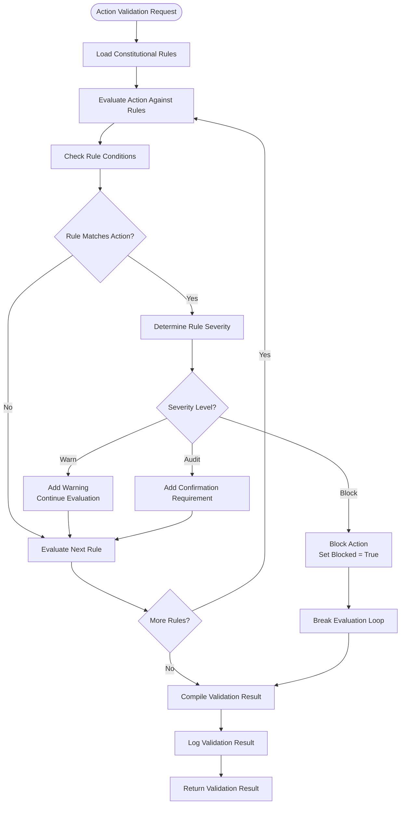
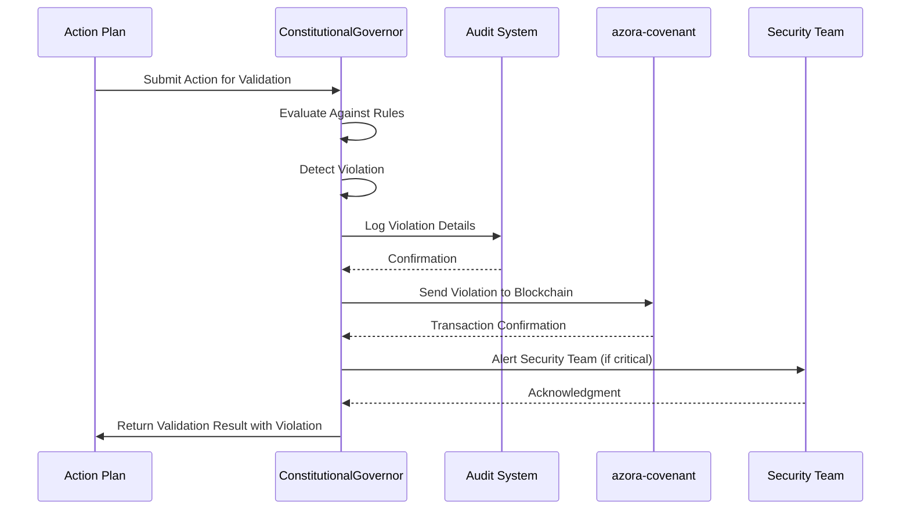
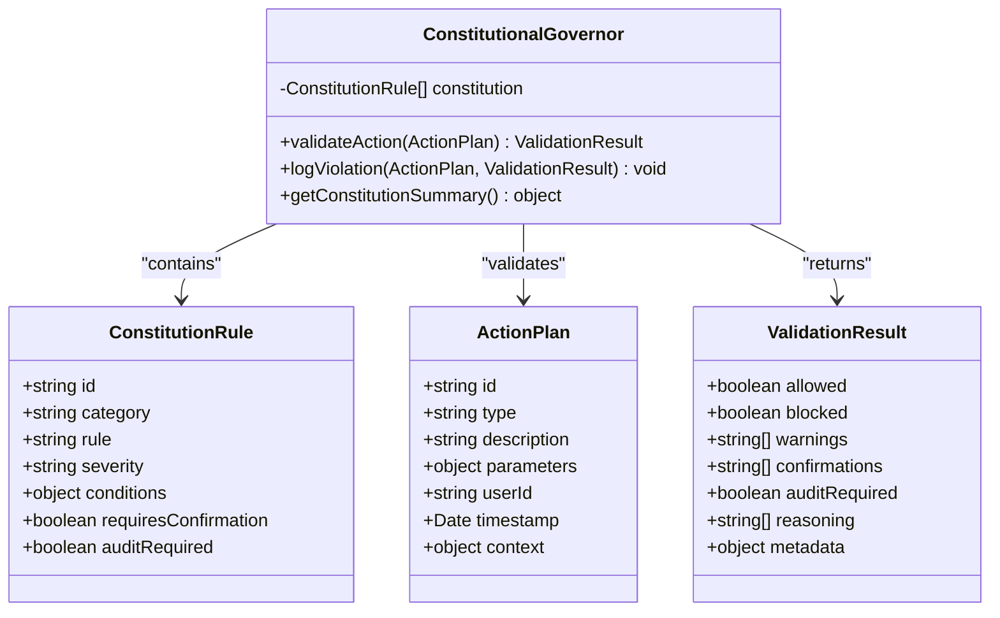

# Constitutional Governor

<cite>
**Referenced Files in This Document**   
- [constitutional-governor.ts](file://genome/agent-tools/constitutional-governor.ts)
- [AZORA_CONSTITUTION.md](file://codex/constitution/AZORA_CONSTITUTION.md)
- [ui\components\constitutional-governor.tsx](file://ui/components/constitutional-governor.tsx)
</cite>

## Table of Contents
1. [Introduction](#introduction)
2. [Rule Evaluation Engine](#rule-evaluation-engine)
3. [Violation Logging and Blockchain Integration](#violation-logging-and-blockchain-integration)
4. [Security, Privacy, Ethics, Compliance, and Governance Rules](#security-privacy-ethics-compliance-and-governance-rules)
5. [Interaction with Elara AI Agents](#interaction-with-elara-ai-agents)
6. [Rule Conflict Resolution and Audit System](#rule-conflict-resolution-and-audit-system)
7. [Configuration Options and Custom Rule Sets](#configuration-options-and-custom-rule-sets)
8. [Performance Considerations](#performance-considerations)
9. [Conclusion](#conclusion)

## Introduction
The Constitutional Governor is a core component of the Azora OS ecosystem, responsible for enforcing constitutional rules across all system operations. It acts as a governance and compliance engine that validates actions against a predefined set of constitutional principles derived from the AZORA_CONSTITUTION.md. The component ensures that all activities within the system adhere to security, privacy, ethics, compliance, and governance standards. It integrates with Elara AI agents to validate actions before execution and maintains an immutable audit trail through blockchain integration. The Constitutional Governor plays a critical role in maintaining the integrity and sovereignty of the Azora OS, ensuring that no action violates the constitutional framework.

**Section sources**
- [constitutional-governor.ts](file://genome/agent-tools/constitutional-governor.ts#L53-L337)
- [AZORA_CONSTITUTION.md](file://codex/constitution/AZORA_CONSTITUTION.md#L1-L981)

## Rule Evaluation Engine
The Constitutional Governor's rule evaluation engine is implemented as a class that loads and evaluates constitutional rules against proposed actions. The engine uses a structured approach to validate actions based on predefined conditions and severity levels. Rules are categorized into security, privacy, ethics, compliance, and governance, each with specific conditions that trigger validation outcomes.

The evaluation process begins when an action plan is submitted for validation. The engine iterates through all loaded constitutional rules, checking if the action matches the conditions specified in each rule. For each rule, the engine evaluates action types, resources, data types, and amount thresholds. The severity of the rule determines the response: 'block' prevents the action, 'warn' issues a warning, and 'audit' requires confirmation and logging.

The validation process is optimized to stop at the first blocking rule, ensuring efficient evaluation. The engine returns a comprehensive validation result that includes whether the action is allowed, any warnings or confirmations required, and reasoning for the decision. This approach allows for real-time validation of actions while maintaining strict adherence to constitutional principles.

**Diagram sources**
- [constitutional-governor.ts](file://genome/agent-tools/constitutional-governor.ts#L154-L246)

**Section sources**
- [constitutional-governor.ts](file://genome/agent-tools/constitutional-governor.ts#L154-L246)

## Violation Logging and Blockchain Integration
When a constitutional violation is detected, the Constitutional Governor initiates a comprehensive logging and alerting process. The violation logging mechanism captures detailed information about the offending action, including the action ID, type, user ID, reasoning for the violation, rule ID, severity level, and timestamp. This information is logged to the system's audit system for immediate visibility and analysis.

The integration with blockchain technology ensures that all violations are recorded in an immutable audit trail. The Constitutional Governor sends violation data to the azora-covenant service, which records the transaction on the blockchain. This creates a tamper-proof record of all constitutional violations, providing transparency and accountability across the ecosystem. The blockchain integration uses a placeholder implementation that would be replaced with actual API calls in production.

For critical violations, the system triggers additional security measures. The Constitutional Governor can alert the security team through multiple channels, including email notifications, SMS alerts, and integration with communication platforms like Slack or Discord. This multi-channel alerting ensures that critical violations receive immediate attention from the appropriate personnel.

**Diagram sources**
- [constitutional-governor.ts](file://genome/agent-tools/constitutional-governor.ts#L248-L290)

**Section sources**
- [constitutional-governor.ts](file://genome/agent-tools/constitutional-governor.ts#L248-L290)

## Security, Privacy, Ethics, Compliance, and Governance Rules
The Constitutional Governor enforces a comprehensive set of rules across five key categories: security, privacy, ethics, compliance, and governance. These rules are defined in the ConstitutionalGovernor class and loaded during initialization. Each rule has a unique ID, category, description, severity level, conditions, and requirements for confirmation and auditing.

Security rules prevent actions that could compromise system integrity, such as deleting system components, modifying security settings, or accessing restricted data. High-value financial transactions also require confirmation to prevent unauthorized transfers. Privacy rules ensure that personal data is protected and can only be accessed with explicit user consent. These rules cover financial data, health information, and other sensitive personal information.

Ethics rules mandate that all agent actions prioritize user benefit and system stability. Compliance rules ensure that financial operations are auditable and transparent, with specific requirements for token transfers, minting, and burning. Governance rules require approval for system changes, including code modifications, deployments, and service restarts. These rules collectively ensure that the Azora OS operates within ethical and legal boundaries while maintaining system integrity and user trust.

**Diagram sources**
- [constitutional-governor.ts](file://genome/agent-tools/constitutional-governor.ts#L0-L52)

**Section sources**
- [constitutional-governor.ts](file://genome/agent-tools/constitutional-governor.ts#L53-L152)

## Interaction with Elara AI Agents
The Constitutional Governor plays a critical role in validating actions proposed by Elara AI agents before execution. When an Elara agent generates an action plan, it must be validated by the Constitutional Governor to ensure compliance with constitutional principles. This interaction creates a governance layer that prevents AI agents from taking actions that could violate security, privacy, or ethical guidelines.

The validation process occurs through the validateAction method, which receives an ActionPlan object from the Elara agent. The Constitutional Governor evaluates the action against all constitutional rules and returns a ValidationResult that indicates whether the action is allowed, blocked, or requires confirmation. If the action is blocked, the Elara agent must generate an alternative plan that complies with constitutional requirements.

This interaction ensures that AI agents operate within defined boundaries while still maintaining their autonomy for non-critical decisions. The Constitutional Governor acts as a safety mechanism that prevents harmful or non-compliant actions while allowing beneficial actions to proceed. This balance between autonomy and governance enables the Azora OS to leverage the power of AI while maintaining strict adherence to constitutional principles.

**Section sources**
- [constitutional-governor.ts](file://genome/agent-tools/constitutional-governor.ts#L154-L246)
- [elara-agent.ts](file://genome/agent-tools/elara-agent.ts#L1-L662)

## Rule Conflict Resolution and Audit System
The Constitutional Governor includes mechanisms for resolving rule conflicts and maintaining a comprehensive audit system. When multiple rules apply to the same action, the system prioritizes blocking rules over warning or audit rules. The evaluation process stops at the first blocking rule, preventing conflicting outcomes and ensuring consistent enforcement of constitutional principles.

The audit system captures detailed information about all validation results, including allowed actions, warnings, confirmations, and violations. This information is logged to the system's audit system and, for violations, recorded on the blockchain through integration with azora-covenant. The audit trail provides transparency and accountability, allowing administrators to review historical decisions and identify patterns of non-compliance.

For rule conflicts that cannot be resolved through the priority system, the Constitutional Governor relies on the broader governance framework described in the AZORA_CONSTITUTION.md. This includes mechanisms for constitutional review, board arbitration, and community voting on major disputes. The system also supports temporary "mutations" to non-critical rules through governance sandboxing, allowing for safe experimentation and evolution of the constitutional framework.

**Section sources**
- [constitutional-governor.ts](file://genome/agent-tools/constitutional-governor.ts#L248-L337)
- [AZORA_CONSTITUTION.md](file://codex/constitution/AZORA_CONSTITUTION.md#L1-L981)

## Configuration Options and Custom Rule Sets
The Constitutional Governor supports configuration options for custom rule sets, allowing organizations to adapt the governance framework to their specific needs. While the current implementation loads a predefined set of rules, the design allows for loading rules from external configuration files or databases. This flexibility enables organizations to define their own security, privacy, ethics, compliance, and governance policies while maintaining the core validation engine.

Custom rule sets can be organized by category and severity, with conditions that match specific action types, resources, data types, and amount thresholds. Organizations can define their own confirmation requirements and audit needs based on their risk tolerance and regulatory environment. The system supports dynamic rule loading, allowing for updates to the constitutional framework without requiring system restarts.

The configuration system also supports rule inheritance and composition, enabling organizations to build upon the base Azora constitution while adding organization-specific rules. This approach ensures consistency with the core principles of the Azora OS while accommodating the unique requirements of different organizations and use cases.

**Section sources**
- [constitutional-governor.ts](file://genome/agent-tools/constitutional-governor.ts#L70-L152)

## Performance Considerations
The Constitutional Governor is designed with performance considerations for real-time rule evaluation at scale. The validation engine uses an optimized approach that stops evaluation at the first blocking rule, reducing processing time for actions that violate critical policies. This early termination strategy ensures that the system can handle high volumes of action validation requests without introducing significant latency.

The rule evaluation process is implemented synchronously to provide immediate feedback to AI agents and other system components. However, the design allows for asynchronous processing of non-critical validations, enabling the system to maintain responsiveness during peak loads. The use of simple condition checks and direct property access minimizes computational overhead, making the validation process efficient even with large rule sets.

For large-scale deployments, the Constitutional Governor can be enhanced with caching mechanisms that store frequently used validation results. This reduces redundant evaluations for common action patterns and improves overall system performance. The modular design also supports horizontal scaling, allowing multiple instances of the Constitutional Governor to handle validation requests in parallel across distributed systems.

**Section sources**
- [constitutional-governor.ts](file://genome/agent-tools/constitutional-governor.ts#L154-L246)

## Conclusion
The Constitutional Governor is a critical component of the Azora OS ecosystem, providing a robust governance and compliance framework that ensures all system operations adhere to constitutional principles. By enforcing rules across security, privacy, ethics, compliance, and governance domains, the Constitutional Governor maintains the integrity and sovereignty of the system. Its integration with Elara AI agents creates a balanced approach to AI governance, allowing for autonomous operation within defined boundaries. The violation logging and blockchain integration provide an immutable audit trail that enhances transparency and accountability. With support for custom rule sets and optimized performance, the Constitutional Governor is well-suited for real-time rule evaluation at scale, making it a foundational element of the Azora OS architecture.