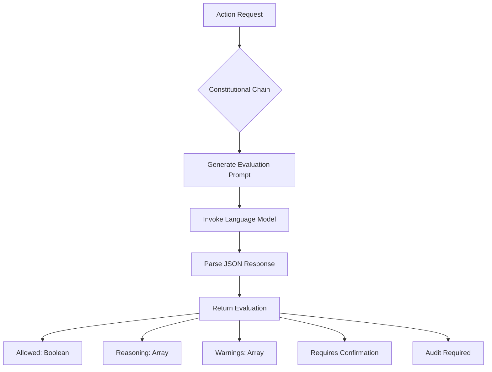
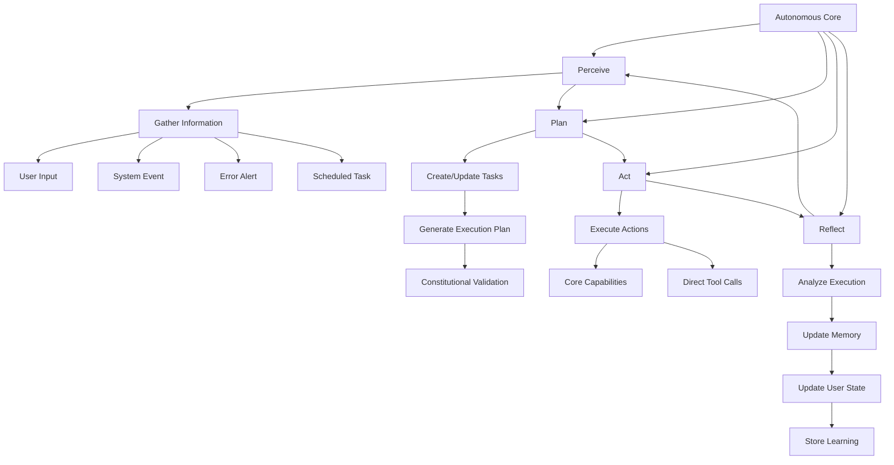
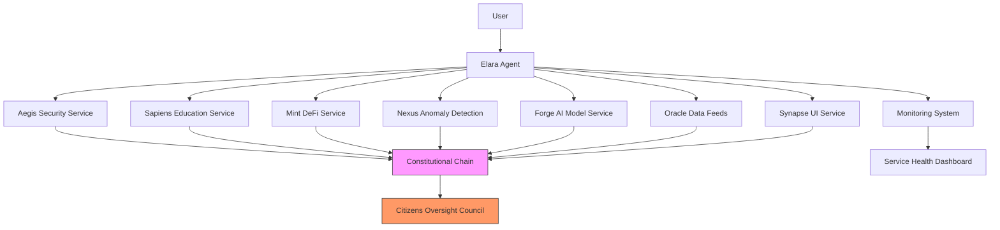
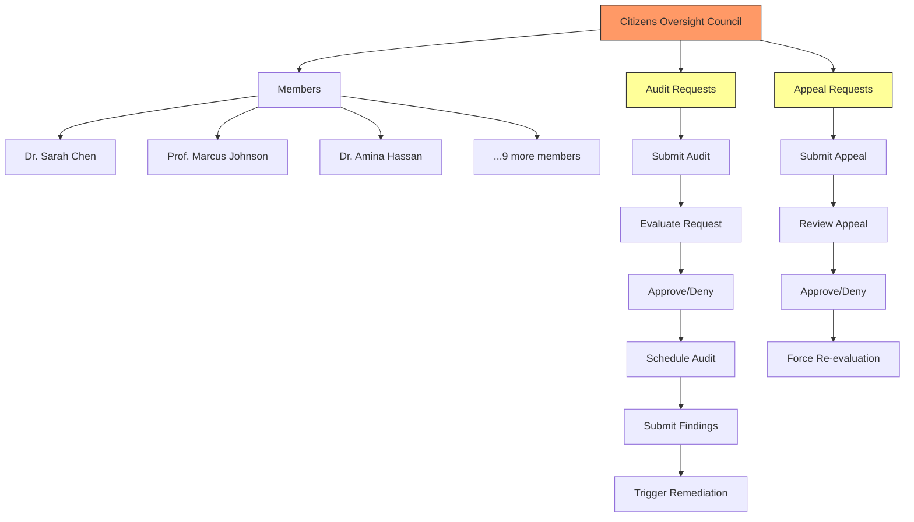

# Elara AI Governance

<cite>
**Referenced Files in This Document**   
- [constitutional-chain.ts](file://genome/agent-tools/constitutional-chain.ts)
- [ethics-engine.ts](file://genome/agent-tools/ethics-engine.ts)
- [autonomous-core.ts](file://genome/agent-tools/autonomous-core.ts)
- [elara-agent.ts](file://genome/agent-tools/elara-agent.ts)
- [citizens-oversight-council.ts](file://genome/agent-tools/citizens-oversight-council.ts)
- [AZORA_CONSTITUTION.md](file://codex/constitution/AZORA_CONSTITUTION.md)
</cite>

## Table of Contents
1. [Introduction](#introduction)
2. [Constitutional Chain Implementation](#constitutional-chain-implementation)
3. [Ethics Engine Architecture](#ethics-engine-architecture)
4. [Autonomous Core Components](#autonomous-core-components)
5. [Elara Agents and Service Relationships](#elara-agents-and-service-relationships)
6. [Citizens Oversight Council](#citizens-oversight-council)
7. [AI Decision Conflict Resolution](#ai-decision-conflict-resolution)
8. [Governance Configuration Options](#governance-configuration-options)
9. [Performance Considerations](#performance-considerations)
10. [Conclusion](#conclusion)

## Introduction
The Elara AI governance system serves as the constitutional and ethical oversight framework for the Azora OS ecosystem. This document details the implementation of three core components: the Constitutional Chain, Ethics Engine, and Autonomous Core, which work together to ensure all AI decisions align with the principles outlined in the AZORA Constitution. The governance system provides a robust framework for ethical decision-making, constitutional compliance, and autonomous operation while maintaining human oversight through the Citizens Oversight Council. This documentation explains how transactions are validated against constitutional principles, the relationship between Elara agents and service components, and mechanisms for resolving AI decision conflicts.

## Constitutional Chain Implementation

The Constitutional Chain is the primary mechanism for ensuring all AI actions align with Azora's Ubuntu-aligned constitutional principles. Implemented in `constitutional-chain.ts`, this component evaluates actions against ten core principles that promote human dignity, truth-seeking, abundance creation, human agency preservation, transparency, educational liberation, contextual justice, collective good innovation, absolute privacy, and distributed power.

The Constitutional Chain operates by invoking a language model to evaluate proposed actions against these principles. When an action is submitted for evaluation, the system generates a comprehensive prompt that includes all constitutional principles and requests a JSON response with approval status, reasoning, warnings, confirmation requirements, and audit needs. The evaluation process is designed to be strict but fair, allowing beneficial actions while blocking harmful ones.

For educational content specifically, the Constitutional Chain performs enhanced evaluation that always requires an audit. This ensures that all educational materials promote truth-seeking and critical thinking while avoiding indoctrination. The system can also retrieve the complete list of constitutional principles for reference or display purposes.



**Diagram sources**
- [constitutional-chain.ts](file://genome/agent-tools/constitutional-chain.ts#L25-L156)

**Section sources**
- [constitutional-chain.ts](file://genome/agent-tools/constitutional-chain.ts#L25-L156)
- [AZORA_CONSTITUTION.md](file://codex/constitution/AZORA_CONSTITUTION.md#L1-L100)

## Ethics Engine Architecture

The Ethics Engine provides comprehensive ethical governance with cultural alignment capabilities. Implemented in `ethics-engine.ts`, this system evaluates decisions against a framework of ethical principles, each with defined weights, constraints, and priority levels. The engine supports multiple cultural contexts and ensures decisions align with both universal ethical standards and specific cultural values.

The Ethics Engine operates through a multi-step evaluation process:
1. It checks decisions against each ethical principle, identifying potential violations
2. It assesses cultural alignment based on primary and supported cultures
3. It calculates an overall ethical approval score combining principle compliance and cultural alignment
4. It identifies ethical concerns and generates mitigation recommendations

The system maintains a violation history and compliance metrics, automatically triggering remediation protocols for critical violations. It also provides a compliance status report that includes overall compliance scores, principle-specific compliance levels, unresolved violations, and recommendations for improvement.

```mermaid
classDiagram
class EthicsEngine {
+evaluateDecisions(simulations) EthicalEvaluation[]
+evaluateDecision(decision) EthicalEvaluation
+evaluateQuery(query, context) EthicalCheck
+evaluateEvolution(plan) boolean
+getComplianceStatus() EthicalCompliance
-checkPrinciples(decision) Map~string, PrincipleCheck~
-assessCulturalAlignment(decision) CulturalAlignmentResult
-calculateEthicalApproval(principleChecks, culturalAlignment) {approved, confidence, reasoning}
-identifyEthicalConcerns(principleChecks) EthicalConcern[]
-generateEthicalRecommendations(concerns, decision) string[]
}
class EthicalEvaluation {
+decisionId : string
+approved : boolean
+confidence : number
+reasoning : string
+concerns : EthicalConcern[]
+recommendations : string[]
+culturalAlignment : CulturalAlignmentResult
+timestamp : Date
}
class EthicalConcern {
+principle : string
+severity : 'critical' | 'high' | 'medium' | 'low'
+description : string
+mitigation : string[]
+impact : number
}
class CulturalAlignmentResult {
+aligned : boolean
+culture : string
+score : number
+concerns : string[]
+adaptations : string[]
}
class EthicalCompliance {
+overallCompliance : number
+principleCompliance : Map~string, number~
+violations : EthicalViolation[]
+lastAudit : Date
+recommendations : string[]
}
EthicsEngine --> EthicalEvaluation : "produces"
EthicsEngine --> EthicalConcern : "identifies"
EthicsEngine --> CulturalAlignmentResult : "assesses"
EthicsEngine --> EthicalCompliance : "reports"
```

**Diagram sources**
- [ethics-engine.ts](file://genome/agent-tools/ethics-engine.ts#L102-L610)

**Section sources**
- [ethics-engine.ts](file://genome/agent-tools/ethics-engine.ts#L102-L610)
- [AZORA_CONSTITUTION.md](file://codex/constitution/AZORA_CONSTITUTION.md#L1-L100)

## Autonomous Core Components

The Autonomous Core represents the central intelligence of the Elara system, implementing a complete autonomous loop with perception, planning, action, and reflection phases. Implemented in `autonomous-core.ts`, this component integrates multiple subsystems including the LLM reasoning engine, constitutional governor, memory system, user state tracker, data access controls, and observation loop.

The core operates through a continuous autonomous loop that:
1. **Perceives**: Gathers information from user inputs, system events, error alerts, and scheduled tasks
2. **Plans**: Analyzes perceptions, creates tasks, and develops execution plans validated against constitutional principles
3. **Acts**: Executes planned actions through core capabilities or direct tool calls
4. **Reflects**: Analyzes task execution for learning and updates state accordingly

The system maintains comprehensive state tracking, including agent status, current tasks, memory systems, and performance metrics. It implements a task queue with priority-based sorting and supports proactive opportunity identification through its discovery capability. The core also includes robust error handling and recovery mechanisms to ensure system stability.



**Diagram sources**
- [autonomous-core.ts](file://genome/agent-tools/autonomous-core.ts#L68-L309)

**Section sources**
- [autonomous-core.ts](file://genome/agent-tools/autonomous-core.ts#L68-L309)
- [elara-agent.ts](file://genome/agent-tools/elara-agent.ts#L0-L100)

## Elara Agents and Service Relationships

Elara agents serve as the operational interface between users and the autonomous system, coordinating interactions with various service components. The agent architecture follows a hierarchical structure with specialized agents handling different domains such as security (Aegis), education (Sapiens), and DeFi (Mint). These agents communicate through a standardized protocol that ensures consistency and interoperability across the ecosystem.

The relationship between Elara agents and service components is governed by a microservices architecture where each agent interacts with specific service endpoints through well-defined APIs. The agents act as intelligent orchestrators, routing requests to appropriate services, aggregating responses, and applying constitutional and ethical checks before returning results to users. This architecture enables modular development and deployment while maintaining centralized governance.

Agents also integrate with monitoring systems to track service health and performance, automatically rerouting requests if services become degraded or unavailable. They maintain contextual awareness across interactions, preserving user state and preferences throughout sessions. The system supports both synchronous and asynchronous communication patterns, allowing agents to handle long-running operations and provide status updates.



**Diagram sources**
- [elara-agent.ts](file://genome/agent-tools/elara-agent.ts#L0-L100)
- [autonomous-core.ts](file://genome/agent-tools/autonomous-core.ts#L68-L309)

**Section sources**
- [elara-agent.ts](file://genome/agent-tools/elara-agent.ts#L0-L100)
- [autonomous-core.ts](file://genome/agent-tools/autonomous-core.ts#L68-L309)

## Citizens Oversight Council

The Citizens Oversight Council provides human constitutional oversight of the AI governance system, serving as a check on the Guardian Oracles and ensuring democratic accountability. Implemented in `citizens-oversight-council.ts`, this elected body of human experts has the authority to audit training data, initiate appeals of Oracle rulings, review constitutional amendments, and monitor system integrity and bias.

The council consists of 12 members serving one-year terms, with requirements for geographic, gender, expertise, and cultural diversity. Members are elected through a transparent process that prioritizes underrepresented groups and ensures pan-African representation. The council operates with a 2/3 majority quorum requirement for decision-making, balancing efficiency with broad consensus.

Key functions of the council include:
- **Audit Requests**: Members can request audits of Guardian Oracle systems for training data, decision logic, bias analysis, or system integrity
- **Appeal Process**: The council can review and approve appeals of Oracle rulings, forcing re-evaluation with new evidence
- **Compliance Monitoring**: Continuous oversight of system operations and ethical compliance
- **Emergency Protocols**: Activation of remediation procedures for critical findings

The council maintains detailed records of audit requests, appeal submissions, and findings, with all decisions publicly documented. This creates a transparent governance layer that complements the automated constitutional and ethical checks.



**Diagram sources**
- [citizens-oversight-council.ts](file://genome/agent-tools/citizens-oversight-council.ts#L67-L414)

**Section sources**
- [citizens-oversight-council.ts](file://genome/agent-tools/citizens-oversight-council.ts#L67-L414)
- [AZORA_CONSTITUTION.md](file://codex/constitution/AZORA_CONSTITUTION.md#L1-L100)

## AI Decision Conflict Resolution

AI decision conflicts are resolved through a multi-layered governance framework that combines automated checks with human oversight. When conflicts arise between AI agents or when ethical concerns are identified, the system follows a structured resolution process that escalates through constitutional, ethical, and human review layers.

The primary conflict resolution mechanism is the Constitutional Chain, which evaluates all actions against the ten core principles. If an action violates any principle, it is blocked or requires confirmation. The Ethics Engine provides a secondary layer of evaluation, assessing decisions against a broader framework of ethical principles and cultural alignment requirements. For decisions with low confidence scores or identified ethical concerns, the system requires human review or approval.

When conflicts cannot be resolved automatically, they are escalated to the Citizens Oversight Council. The council can initiate formal audits of AI systems, review appeal requests, and make binding decisions on contested issues. This human oversight ensures that complex ethical dilemmas receive appropriate consideration and that the system remains aligned with human values.

The system also implements a "governor veto" mechanism that allows immediate blocking of actions that clearly violate constitutional principles, such as those involving harm to humans or ecosystems. This provides a rapid response capability for critical issues while longer-term resolution processes are initiated.

**Section sources**
- [constitutional-chain.ts](file://genome/agent-tools/constitutional-chain.ts#L25-L156)
- [ethics-engine.ts](file://genome/agent-tools/ethics-engine.ts#L102-L610)
- [citizens-oversight-council.ts](file://genome/agent-tools/citizens-oversight-council.ts#L67-L414)

## Governance Configuration Options

The Elara governance system provides several configuration options that allow administrators to adjust parameters based on operational requirements and risk tolerance. These options are designed to balance autonomy with oversight, enabling the system to adapt to different contexts while maintaining constitutional compliance.

Key configuration parameters include:
- **Constitutional Thresholds**: Settings that determine how strictly actions are evaluated against constitutional principles
- **Ethical Weights**: Adjustable weights for different ethical principles based on organizational priorities
- **Cultural Sensitivity**: Thresholds for cultural alignment requirements in different regions
- **Autonomy Levels**: Controls that determine the degree of autonomous decision-making allowed
- **Audit Requirements**: Configuration of when automatic audits are triggered
- **Escalation Protocols**: Rules for when decisions require human review or approval

These parameters are typically set during system initialization and can be updated through a formal governance process that requires appropriate approvals. The system maintains an audit trail of all configuration changes to ensure transparency and accountability.

**Section sources**
- [ethics-engine.ts](file://genome/agent-tools/ethics-engine.ts#L102-L610)
- [constitutional-chain.ts](file://genome/agent-tools/constitutional-chain.ts#L25-L156)

## Performance Considerations

The Elara governance system is designed for real-time decision processing with performance optimizations at multiple levels. The architecture balances thorough constitutional and ethical checks with the need for responsive operation, implementing several strategies to maintain performance under load.

Key performance considerations include:
- **Caching**: Frequently accessed constitutional principles and ethical frameworks are cached to reduce lookup times
- **Parallel Processing**: Independent evaluation tasks are processed in parallel to maximize throughput
- **Asynchronous Operations**: Non-critical checks and logging operations are performed asynchronously to avoid blocking
- **Batch Processing**: Multiple similar evaluations are batched when possible to reduce overhead
- **Optimized Data Structures**: Efficient data structures are used for storing and retrieving compliance metrics

The system also implements rate limiting and load shedding mechanisms to maintain stability during peak loads. Monitoring tools track response times, error rates, and resource utilization, providing early warning of performance issues. The autonomous core includes built-in performance optimization capabilities that can dynamically adjust processing strategies based on current system conditions.

**Section sources**
- [autonomous-core.ts](file://genome/agent-tools/autonomous-core.ts#L68-L309)
- [ethics-engine.ts](file://genome/agent-tools/ethics-engine.ts#L102-L610)

## Conclusion
The Elara AI governance system provides a comprehensive framework for constitutional oversight and ethical decision-making in the Azora OS ecosystem. By implementing the Constitutional Chain, Ethics Engine, and Autonomous Core components, the system ensures that all AI actions align with the principles outlined in the AZORA Constitution while maintaining human oversight through the Citizens Oversight Council. The architecture enables real-time validation of transactions against constitutional principles, resolves AI decision conflicts through a multi-layered governance framework, and provides configurable parameters for adapting to different operational contexts. This robust governance model supports the development of autonomous AI systems that are both powerful and ethically aligned, setting a new standard for responsible AI development.