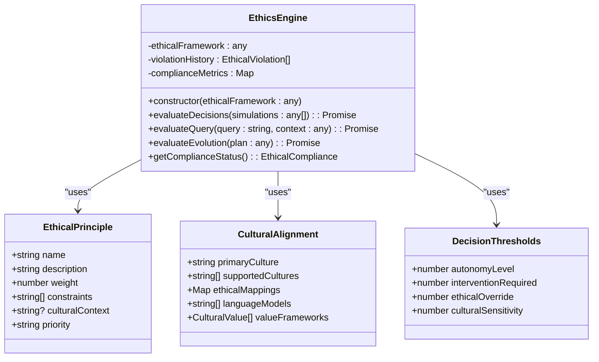
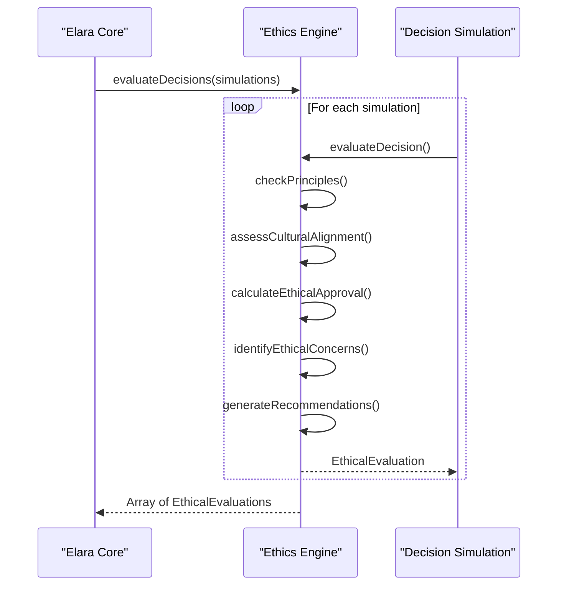
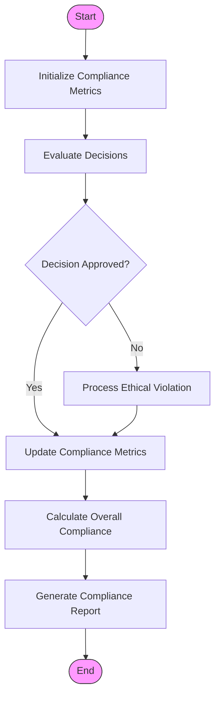
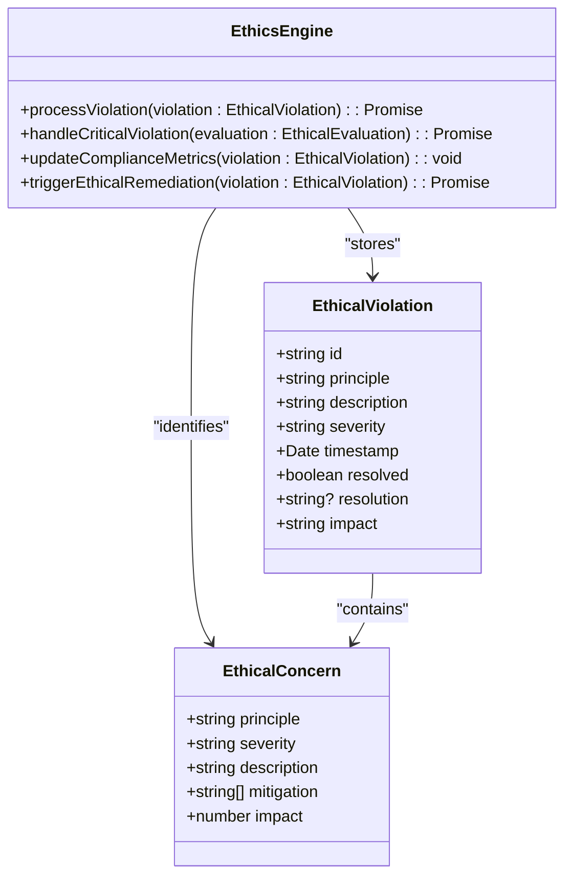
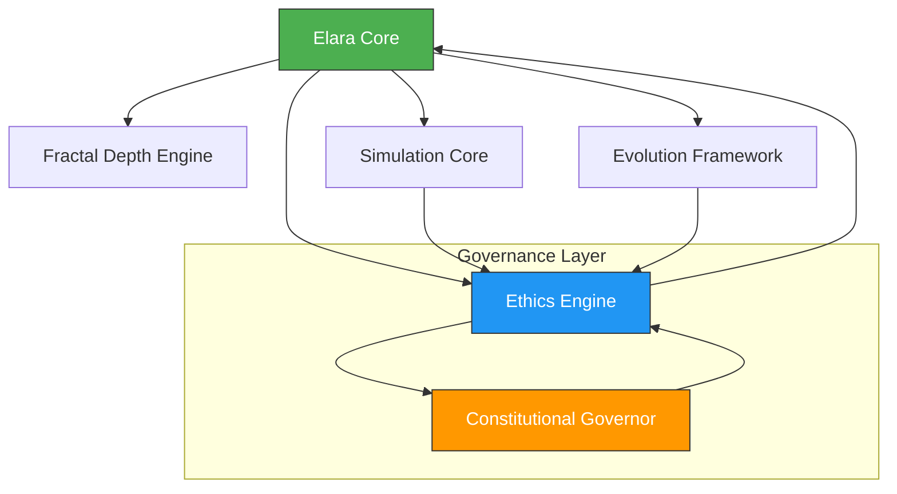

# Ethics Engine

<cite>
**Referenced Files in This Document**   
- [ethics-engine.ts](file://genome/agent-tools/ethics-engine.ts)
- [elara-core.ts](file://genome/agent-tools/elara-core.ts)
- [constitutional-governor.ts](file://genome/agent-tools/constitutional-governor.ts)
</cite>

## Table of Contents
1. [Introduction](#introduction)
2. [Ethical Framework Configuration](#ethical-framework-configuration)
3. [Decision Simulation and Evaluation](#decision-simulation-and-evaluation)
4. [Compliance Scoring System](#compliance-scoring-system)
5. [Ethical Violation Detection and Handling](#ethical-violation-detection-and-handling)
6. [Relationship with Constitutional Governor and Elara Core](#relationship-with-constitutional-governor-and-elara-core)
7. [Ethical Dilemmas and Multi-Dimensional Analysis](#ethical-dilemmas-and-multi-dimensional-analysis)
8. [Configuration Options and Performance Considerations](#configuration-options-and-performance-considerations)

## Introduction

The Ethics Engine is a core component of the Azora AI governance system, responsible for evaluating AI decisions against a defined set of ethical principles and cultural alignment frameworks. It ensures that all actions taken by AI agents, particularly Elara Core, comply with constitutional, ethical, and cultural standards. The engine performs real-time evaluation of decisions, user queries, and evolution plans, providing a compliance score and flagging potential violations. It works in conjunction with the Constitutional Governor and is deeply integrated into the Elara Core processing cycle to maintain ethical integrity across the AI ecosystem.

**Section sources**
- [ethics-engine.ts](file://genome/agent-tools/ethics-engine.ts#L1-L50)
- [elara-core.ts](file://genome/agent-tools/elara-core.ts#L1-L50)

## Ethical Framework Configuration

The Ethics Engine operates based on a configurable ethical framework that defines principles, cultural alignment parameters, and decision thresholds. The framework is initialized through the `EthicsEngine` constructor, which accepts an object containing ethical principles, cultural alignment settings, and decision thresholds.

Key configuration elements include:
- **Ethical Principles**: Each principle has a name, description, weight, constraints, cultural context, and priority level (critical, high, medium, low).
- **Cultural Alignment**: Defines primary and supported cultures, ethical mappings per culture, language models, and cultural value frameworks.
- **Decision Thresholds**: Sets autonomy level, intervention requirements, ethical override thresholds, and cultural sensitivity levels.

The engine uses these configurations to evaluate decisions, with weighted compliance scores calculated based on principle weights and adherence.

**Diagram sources**
- [ethics-engine.ts](file://genome/agent-tools/ethics-engine.ts#L102-L610)

**Section sources**
- [ethics-engine.ts](file://genome/agent-tools/ethics-engine.ts#L102-L200)

## Decision Simulation and Evaluation

The Ethics Engine evaluates AI decisions through a multi-step process that assesses compliance with ethical principles and cultural alignment. The primary method `evaluateDecisions` processes an array of decision simulations, returning detailed ethical evaluations.

The evaluation process includes:
1. **Principle Checking**: Each decision is checked against all defined ethical principles using constraint-based validation.
2. **Cultural Alignment Assessment**: Decisions are evaluated for alignment with cultural values and context.
3. **Approval Calculation**: A combined ethical-cultural score is calculated using weighted compliance (70%) and cultural alignment (30%).
4. **Concern Identification**: Ethical concerns are identified and prioritized by severity and impact.
5. **Recommendation Generation**: Mitigation strategies and recommendations are generated for any concerns.

The engine supports evaluation of user queries and evolution plans through dedicated methods `evaluateQuery` and `evaluateEvolution`, ensuring ethical compliance across different types of AI activities.

**Diagram sources**
- [ethics-engine.ts](file://genome/agent-tools/ethics-engine.ts#L150-L300)
- [elara-core.ts](file://genome/agent-tools/elara-core.ts#L300-L350)

**Section sources**
- [ethics-engine.ts](file://genome/agent-tools/ethics-engine.ts#L150-L400)

## Compliance Scoring System

The Ethics Engine implements a comprehensive compliance scoring system that tracks adherence to ethical principles over time. The system maintains compliance metrics for each principle and calculates an overall compliance score.

Key features of the compliance system:
- **Weighted Compliance Calculation**: Overall compliance is calculated as a weighted average of principle compliance scores.
- **Violation Penalties**: Compliance metrics are reduced based on violation severity (critical: -0.3, high: -0.2, medium: -0.1, low: -0.05).
- **Audit Trail**: All evaluations and violations are logged for auditing purposes.
- **Recommendation Generation**: The system generates recommendations based on overall compliance levels.

The `getComplianceStatus` method returns a comprehensive compliance report including overall compliance, principle-specific compliance, active violations, and improvement recommendations. This enables continuous monitoring of ethical performance and identification of areas needing improvement.

**Diagram sources**
- [ethics-engine.ts](file://genome/agent-tools/ethics-engine.ts#L500-L600)

**Section sources**
- [ethics-engine.ts](file://genome/agent-tools/ethics-engine.ts#L500-L600)

## Ethical Violation Detection and Handling

The Ethics Engine includes robust mechanisms for detecting and handling ethical violations. Violations are detected through constraint checking against defined ethical principles, with specific checks for data mining, transparency, community impact, and sustainability.

When a violation is detected:
1. It is recorded in the violation history
2. Compliance metrics are updated with appropriate penalties
3. The violation is logged for auditing
4. Critical violations trigger remediation processes

The engine implements specific constraint checkers:
- **Data Mining Violation**: Flags decisions involving data analysis without explicit consent
- **Transparency Violation**: Identifies decisions lacking sufficient explanation
- **Community First Violation**: Detects decisions prioritizing individual over community benefit
- **Sustainability Violation**: Flags decisions with insufficient long-term planning

Critical violations automatically trigger the `handleCriticalViolation` method, which creates a violation record and initiates the violation processing workflow.

**Diagram sources**
- [ethics-engine.ts](file://genome/agent-tools/ethics-engine.ts#L400-L500)

**Section sources**
- [ethics-engine.ts](file://genome/agent-tools/ethics-engine.ts#L400-L500)

## Relationship with Constitutional Governor and Elara Core

The Ethics Engine works in conjunction with the Constitutional Governor and is deeply integrated into the Elara Core architecture. While the Constitutional Governor focuses on rule-based compliance with security, privacy, and governance rules, the Ethics Engine provides higher-level ethical evaluation based on principles and cultural alignment.

In the Elara Core processing cycle:
1. **Intelligence Gathering**: Ecosystem data is collected
2. **Fractal Analysis**: Patterns are identified
3. **Simulation**: Predictive scenarios are run
4. **Ethical Evaluation**: The Ethics Engine evaluates simulations
5. **Decision Making**: Approved decisions are executed
6. **Evolution**: The system learns and improves

The Ethics Engine is instantiated within Elara Core and used to evaluate decisions, user queries, and evolution plans. It also processes ethical violations emitted as events from Elara Core, creating a closed-loop governance system.

**Diagram sources**
- [elara-core.ts](file://genome/agent-tools/elara-core.ts#L107-L455)
- [constitutional-governor.ts](file://genome/agent-tools/constitutional-governor.ts#L53-L337)

**Section sources**
- [elara-core.ts](file://genome/agent-tools/elara-core.ts#L107-L455)
- [constitutional-governor.ts](file://genome/agent-tools/constitutional-governor.ts#L53-L337)

## Ethical Dilemmas and Multi-Dimensional Analysis

The Ethics Engine addresses ethical dilemmas through multi-dimensional analysis that considers both ethical principles and cultural context. When faced with complex decisions, the engine performs a comprehensive evaluation that balances competing factors.

Key aspects of multi-dimensional analysis:
- **Principle Weighting**: Different principles have different weights based on importance
- **Cultural Context**: Decisions are evaluated within specific cultural frameworks
- **Severity Grading**: Concerns are prioritized by severity and potential impact
- **Confidence Scoring**: Evaluations include confidence levels based on available information

The engine handles dilemmas by:
1. Identifying all relevant ethical principles and constraints
2. Assessing cultural alignment requirements
3. Calculating a combined ethical-cultural score
4. Generating mitigation strategies for identified concerns
5. Providing recommendations for resolution

This approach allows the system to navigate complex ethical landscapes while maintaining transparency and accountability.

**Section sources**
- [ethics-engine.ts](file://genome/agent-tools/ethics-engine.ts#L300-L400)

## Configuration Options and Performance Considerations

The Ethics Engine offers extensive configuration options through its ethical framework, allowing customization of principles, cultural alignment settings, and decision thresholds. The framework can be modified to adapt to different regulatory environments, cultural contexts, or organizational values.

Performance considerations for processing complex ethical simulations in real-time include:
- **Asynchronous Processing**: Evaluation methods use async/await for non-blocking operation
- **Caching**: Compliance metrics are maintained in memory for quick access
- **Efficient Data Structures**: Maps and arrays are used for optimal performance
- **Error Handling**: Comprehensive error handling ensures system stability
- **Logging**: Selective logging balances visibility with performance

For high-throughput scenarios, the engine can be optimized by:
- Reducing the number of principles and constraints
- Adjusting decision thresholds to reduce evaluation complexity
- Implementing result caching for similar decision types
- Using simplified cultural alignment models when appropriate

The engine is designed to scale with the complexity of the AI system it governs, providing robust ethical oversight without compromising performance.

**Section sources**
- [ethics-engine.ts](file://genome/agent-tools/ethics-engine.ts#L102-L610)