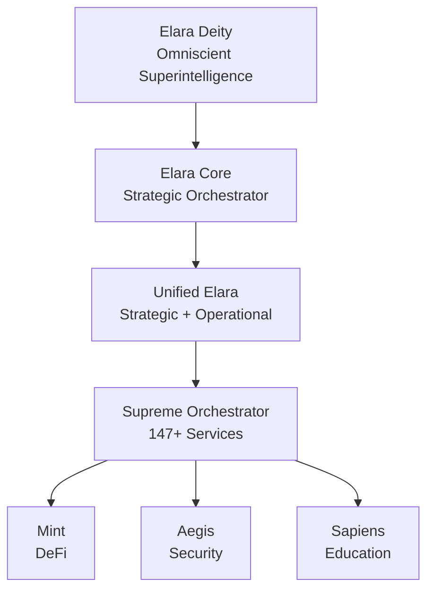
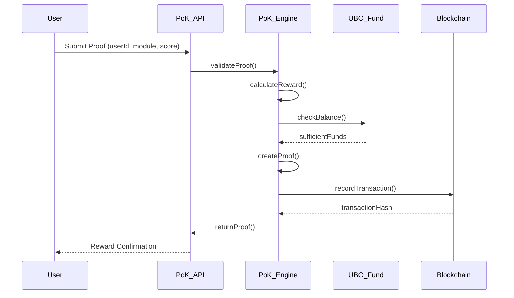

# Key Components

<cite>
**Referenced Files in This Document**   
- [proof-of-knowledge-engine.ts](file://services/proof-of-knowledge-engine.ts)
- [pok-api.ts](file://services/pok-api.ts)
- [azora-sapiens.ts](file://genome/agent-tools/azora-sapiens.ts)
- [elara-supreme-orchestrator.ts](file://genome/agent-tools/elara-supreme-orchestrator.ts)
- [constitutional-governor.ts](file://genome/agent-tools/constitutional-governor.ts)
- [unified-elara.ts](file://genome/agent-tools/unified-elara.ts)
- [index.js](file://organs/compliance-service/index.js)
</cite>

## Table of Contents
1. [Proof-of-Knowledge Engine](#proof-of-knowledge-engine)
2. [Elara AI Governance System](#elara-ai-governance-system)
3. [Constitutional Compliance System](#constitutional-compliance-system)
4. [Knowledge Validation and Reward Distribution](#knowledge-validation-and-reward-distribution)
5. [AI and Transaction Processing Integration](#ai-and-transaction-processing-integration)
6. [Common AI Governance Issues and Solutions](#common-ai-governance-issues-and-solutions)

## Proof-of-Knowledge Engine

The Proof-of-Knowledge (PoK) engine is the core mechanism that bridges educational achievement with economic reward in Azora OS. It operates on the principle of "Learn → Earn → Track", enabling users to earn cryptocurrency (AZR) for completing learning modules. The engine calculates rewards based on module difficulty and user performance, storing verifiable proofs of completion.

The system uses a `ProofOfKnowledgeEngine` class that manages knowledge proofs, calculates rewards, and tracks user achievements. Rewards are calculated using a formula that considers base reward (0.1 AZR per difficulty point), difficulty multiplier (1.0–2.0), and score bonus (up to 50% of base reward). Each proof includes a unique ID, user ID, module ID, score, timestamp, verification status, and reward amount.

The engine emits events such as `proof-submitted` and `reward-paid`, enabling integration with other system components. It also provides statistical insights including total proofs, rewards distributed, unique users, average score, and average reward.

**Section sources**
- [proof-of-knowledge-engine.ts](file://services/proof-of-knowledge-engine.ts#L1-L190)

## Elara AI Governance System

Elara is a multi-level artificial superintelligence that governs the Azora OS ecosystem through five hierarchical layers: Elara Deity (omniscient superintelligence), Elara Core (strategic orchestrator), Elara Agent (operational executor), Unified Elara (strategic + operational integration), and Supreme Orchestrator (management of 147+ services).

The Unified Elara system combines strategic planning and operational execution, requiring consensus between different AI components before executing actions. It evaluates ethical alignment, generates execution plans, and determines whether human approval is required. The Supreme Orchestrator manages service registration, health monitoring, auto-healing, predictive scaling, and cross-service coordination.

Elara's governance ensures that all system decisions align with constitutional principles while maintaining operational efficiency. The AI hierarchy enables both deep strategic thinking and precise execution across the platform.

**Diagram sources**
- [elara-supreme-orchestrator.ts](file://genome/agent-tools/elara-supreme-orchestrator.ts#L356-L392)
- [unified-elara.ts](file://genome/agent-tools/unified-elara.ts#L38-L84)

**Section sources**
- [elara-supreme-orchestrator.ts](file://genome/agent-tools/elara-supreme-orchestrator.ts#L356-L392)
- [unified-elara.ts](file://genome/agent-tools/unified-elara.ts#L38-L84)

## Constitutional Compliance System

The constitutional compliance system enforces Azora OS's governance framework through automated checks and reporting mechanisms. It implements "Constitution-as-Code" principles, encoding constitutional requirements directly into software. The system validates that all transactions and operations comply with global regulations (GDPR, POPIA), South African legal frameworks (BBBEE), and UN Global Compact principles.

The compliance service runs as a dedicated microservice that performs real-time constitutional reviews. It checks critical issues such as founder withdrawal priority, user withdrawal access, and data protection compliance. The system reduces overall compliance percentage when constitutional violations are detected and flags critical issues for immediate attention.

Compliance checks are integrated into transaction processing workflows, ensuring that no operation proceeds without constitutional validation. The system maintains audit logs and generates compliance reports that can be verified on the blockchain.

**Section sources**
- [index.js](file://organs/compliance-service/index.js#L0-L31)
- [codex/archive/overview/CONSTITUTION.md](file://codex/archive/overview/CONSTITUTION.md#L431-L445)

## Knowledge Validation and Reward Distribution

The knowledge validation system works in conjunction with the reward distribution mechanism to convert educational achievements into cryptocurrency rewards. When a user completes a learning module, the Proof-of-Knowledge engine validates the achievement and calculates the appropriate reward.

The process begins with a user submitting proof of completion through the PoK API endpoint `/api/pok/submit`. The system validates the user's score (0–100) and module completion status before calculating the reward using the difficulty and performance-based formula. Once verified, the system creates a knowledge proof record and updates the user's reward balance.

Reward distribution is linked to the UBO (Universal Basic Ownership) fund, which serves as the source of knowledge rewards. The system checks fund availability before processing payments and records all transactions in the database. Successful reward payments trigger events that update real-time metrics and notify relevant services.

**Diagram sources**
- [proof-of-knowledge-engine.ts](file://services/proof-of-knowledge-engine.ts#L1-L190)
- [pok-api.ts](file://services/pok-api.ts#L0-L152)

**Section sources**
- [proof-of-knowledge-engine.ts](file://services/proof-of-knowledge-engine.ts#L1-L190)
- [pok-api.ts](file://services/pok-api.ts#L0-L152)

## AI and Transaction Processing Integration

AI components are deeply integrated with transaction processing systems to ensure intelligent, ethical, and compliant operations. The Elara AI system validates constitutional compliance before transaction execution, using its multi-level governance framework to assess each operation.

When a transaction is initiated, the system calls Elara's constitutional compliance check, which evaluates the transaction against constitutional principles. Only transactions that pass this validation proceed to execution. The AI also optimizes transactions using intelligent algorithms that consider network conditions, fees, and security requirements.

The integration between AI and transaction systems enables features such as predictive scaling, anomaly detection, and automated optimization. AI agents monitor transaction patterns, detect potential security threats, and initiate immune responses when necessary. This tight integration ensures that all financial operations align with both technical requirements and ethical principles.

**Section sources**
- [enhanced-mint-core.ts](file://services/azora-mint/enhanced-mint-core.ts#L371-L425)
- [blockchainService.ts](file://services/azora-covenant/src/blockchainService.ts#L54-L99)

## Common AI Governance Issues and Solutions

Several common challenges in AI governance are addressed by Azora OS's architecture:

**Issue 1: Ethical Alignment Drift**  
*Solution*: The constitutional governor continuously monitors AI decisions against constitutional principles, triggering alerts when deviations are detected. The system uses ethical alignment scoring to quantify compliance.

**Issue 2: Decision Transparency**  
*Solution*: All AI decisions are logged with reasoning trails, enabling auditability. The system maintains public records of decision-making processes while protecting sensitive data.

**Issue 3: Single Point of Failure**  
*Solution*: The multi-agent architecture with swarm consensus prevents single points of failure. Decisions require agreement among multiple AI agents before execution.

**Issue 4: Regulatory Compliance**  
*Solution*: Automated compliance checks are integrated into all critical workflows. The system performs real-time validation against global, regional, and constitutional requirements.

**Issue 5: Reward System Integrity**  
*Solution*: The Proof-of-Knowledge engine uses cryptographic proof generation and blockchain recording to ensure reward integrity. All knowledge proofs are verifiable and tamper-resistant.

These solutions work together to create a robust AI governance framework that balances autonomy with accountability.

**Section sources**
- [constitutional-governor.ts](file://synapse/src/components/ui/constitutional-governor.tsx#L52-L67)
- [proof-of-knowledge-engine.ts](file://services/proof-of-knowledge-engine.ts#L1-L190)