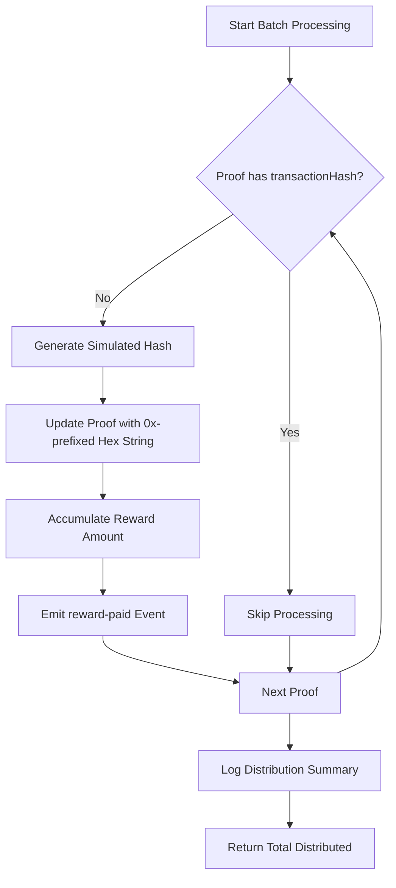
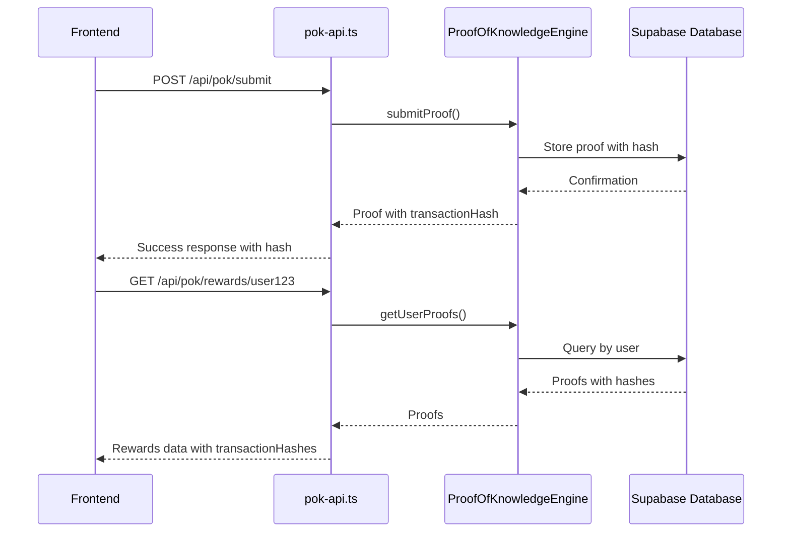
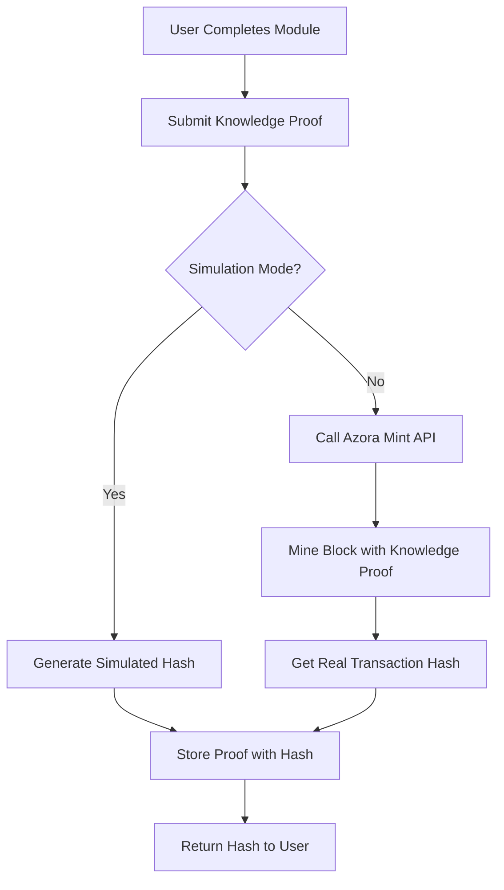

# Blockchain Integration

<cite>
**Referenced Files in This Document**   
- [proof-of-knowledge-engine.ts](file://services/proof-of-knowledge-engine.ts)
- [pok-api.ts](file://services/pok-api.ts)
- [blockchain-ledger.ts](file://services/azora-mint/blockchain-ledger.ts)
</cite>

## Table of Contents
1. [Introduction](#introduction)
2. [Knowledge Proofs and Blockchain Ledger Integration](#knowledge-proofs-and-blockchain-ledger-integration)
3. [transactionHash Implementation in KnowledgeProof Interface](#transactionhash-implementation-in-knowledgeproof-interface)
4. [processBatchRewards: Simulating Blockchain Transactions](#processbatchrewards-simulating-blockchain-transactions)
5. [REST API and Blockchain Event Emission](#rest-api-and-blockchain-event-emission)
6. [Common Issues and Simulation Approach](#common-issues-and-simulation-approach)
7. [Future Integration with Azora Mint](#future-integration-with-azora-mint)
8. [Configuration Options for Transaction Settings](#configuration-options-for-transaction-settings)
9. [Performance Considerations](#performance-considerations)

## Introduction
This document details the integration between the Proof-of-Knowledge (PoK) system and the blockchain ledger within the Azora ecosystem. It explains how educational achievements are transformed into verifiable, reward-bearing knowledge proofs, how these are linked to blockchain transactions via cryptographic hashes, and how the system simulates real blockchain behavior during early-stage development. The integration spans multiple services including the PoK engine, REST API, and blockchain ledger components.

## Knowledge Proofs and Blockchain Ledger Integration
The Proof-of-Knowledge system is tightly integrated with the blockchain ledger to ensure that educational achievements result in economic rewards recorded on-chain. When a user completes a learning module, a `KnowledgeProof` is generated and stored. This proof contains metadata about the achievement and is linked to a simulated or real blockchain transaction through the `transactionHash` field.

The integration follows a three-step process:
1. **Proof Submission**: Users submit completed modules to the PoK engine.
2. **Reward Calculation**: The system calculates AZR rewards based on difficulty and performance.
3. **Blockchain Linking**: A transaction hash is generated and associated with the proof, creating an immutable record.

This integration enables verifiable, tamper-proof records of educational accomplishments that are economically incentivized through the Azora blockchain.

**Section sources**
- [proof-of-knowledge-engine.ts](file://services/proof-of-knowledge-engine.ts#L30-L40)
- [blockchain-ledger.ts](file://services/azora-mint/blockchain-ledger.ts#L65-L71)

## transactionHash Implementation in KnowledgeProof Interface
The `KnowledgeProof` interface includes an optional `transactionHash` property that serves as the cryptographic link between educational achievements and blockchain transactions.

```typescript
export interface KnowledgeProof {
  id: string
  userId: string
  moduleId: string
  score: number
  timestamp: Date
  verified: boolean
  rewardAmount: number
  rewardCurrency: 'AZR'
  transactionHash?: string
}
```

The `transactionHash` field is initially undefined when a proof is created. It is populated during the reward processing phase, either through simulation or actual blockchain interaction. When retrieving proofs from the database, the `proof_hash` field from the database record is mapped to this `transactionHash` property, establishing continuity between the application layer and data storage.

This implementation allows for flexible transaction handling—proofs can exist before their corresponding blockchain transactions are confirmed, supporting asynchronous processing and retry mechanisms.

**Section sources**
- [proof-of-knowledge-engine.ts](file://services/proof-of-knowledge-engine.ts#L30-L40)

## processBatchRewards: Simulating Blockchain Transactions
The `processBatchRewards` method in the `ProofOfKnowledgeEngine` class simulates blockchain transactions for batch reward distribution, particularly for UBO (Universal Basic Ownership) distributions.



**Diagram sources**
- [proof-of-knowledge-engine.ts](file://services/proof-of-knowledge-engine.ts#L212-L228)

The simulation uses Node.js `crypto.randomBytes(32)` to generate a 64-character hexadecimal string prefixed with "0x", mimicking Ethereum-style transaction hashes. This approach provides realistic transaction identifiers during development and testing phases before connecting to the actual Azora Mint blockchain.

The method processes each proof in sequence, only generating hashes for proofs that don't already have them, and emits a `reward-paid` event after each successful processing. This design supports idempotent operations and prevents duplicate reward distribution.

**Section sources**
- [proof-of-knowledge-engine.ts](file://services/proof-of-knowledge-engine.ts#L212-L228)

## REST API and Blockchain Event Emission
The REST API defined in `pok-api.ts` serves as the interface between frontend applications and the blockchain-backed Proof-of-Knowledge system. It exposes endpoints that trigger blockchain-related operations and emit events that can be captured by monitoring systems.

Key API endpoints include:
- `POST /api/pok/submit`: Submits a knowledge proof and triggers reward calculation
- `GET /api/pok/rewards/:userId`: Retrieves user rewards and associated transaction hashes
- `POST /api/pok/batch`: Processes batch rewards with simulated transaction hashes
- `GET /api/pok/verify/:proofId`: Verifies proof authenticity

When a proof is submitted, the API calls the `submitProof` method which emits a `proof-submitted` event. Similarly, batch processing emits `reward-paid` events. These events can be listened to by external services for analytics, notifications, or synchronization with the actual blockchain.

The API also integrates with Supabase for persistent storage, where the `proof_hash` is stored alongside proof data, creating a durable record that survives application restarts.



**Diagram sources**
- [pok-api.ts](file://services/pok-api.ts#L50-L112)
- [proof-of-knowledge-engine.ts](file://services/proof-of-knowledge-engine.ts#L140-L189)

**Section sources**
- [pok-api.ts](file://services/pok-api.ts#L50-L112)

## Common Issues and Simulation Approach
Two common issues in blockchain integration are addressed through the current simulation approach:

### Transaction Confirmation Delays
During development, waiting for actual blockchain confirmations would severely impact user experience. The simulation approach eliminates this delay by immediately providing transaction hashes, allowing the frontend to show "transaction pending" states without waiting for network consensus.

### Hash Collisions
While theoretically possible, the 256-bit entropy from `crypto.randomBytes(32)` makes collisions astronomically improbable. The simulation uses cryptographically secure random generation rather than simple UUIDs or timestamps, maintaining security properties similar to real blockchain systems.

The current approach balances realism with development agility by:
- Generating Ethereum-style 0x-prefixed hex strings
- Using cryptographically secure random number generation
- Maintaining consistent data structures that will work with real blockchain data
- Supporting event emission for monitoring and analytics

This ensures a smooth transition from simulation to production when integrated with Azora Mint.

**Section sources**
- [proof-of-knowledge-engine.ts](file://services/proof-of-knowledge-engine.ts#L212-L228)

## Future Integration with Azora Mint
The current simulation will be replaced with actual blockchain integration through Azora Mint, which provides the production blockchain infrastructure.

The transition will involve:
1. **Replacing simulated hashes** with actual transaction IDs from the Azora blockchain
2. **Integrating with the mining engine** to record educational achievements as Proof-of-Knowledge mining
3. **Connecting to real wallet addresses** for actual AZR token transfers
4. **Implementing blockchain confirmation monitoring** to update proof statuses

The `blockchain-ledger.ts` service already contains the foundation for this integration, including support for educational transactions and knowledge-based mining. When fully integrated, completing educational modules will literally mine new AZR coins through Proof-of-Knowledge, aligning learning with value creation.



**Diagram sources**
- [blockchain-ledger.ts](file://services/azora-mint/blockchain-ledger.ts#L280-L342)

**Section sources**
- [blockchain-ledger.ts](file://services/azora-mint/blockchain-ledger.ts#L280-L342)

## Configuration Options for Transaction Settings
While the current implementation uses hardcoded simulation parameters, the architecture supports configuration through environment variables and service parameters:

- **Database usage**: Controlled by the `useDatabase` flag in `ProofOfKnowledgeEngine`
- **Reward calculations**: Base rewards and multipliers can be configured based on module difficulty and score
- **Transaction simulation**: The hashing mechanism can be replaced with different algorithms or external services
- **Event emission**: The event system allows for pluggable listeners for analytics, logging, or blockchain synchronization

Future enhancements will include:
- Configurable hash generation strategies
- Adjustable simulation delay to mimic real blockchain confirmation times
- Multiple blockchain network support (testnet, mainnet, sidechains)
- Gas price and transaction priority settings

These configuration options will allow operators to fine-tune the blockchain integration behavior based on deployment environment and performance requirements.

## Performance Considerations
Handling high-frequency blockchain interactions requires careful performance optimization:

### Batch Processing Efficiency
The `processBatchRewards` method processes proofs sequentially rather than in parallel to prevent race conditions and ensure consistent state. For high-volume scenarios, this could be enhanced with:
- Parallel processing with proper locking
- Database transaction batching
- Rate limiting to prevent system overload

### Memory Management
The engine maintains in-memory caches of proofs and user rewards, which could grow large in production. The system already includes a fallback mechanism using Supabase, but additional optimizations could include:
- LRU caching with size limits
- Automatic cleanup of old proofs
- Streaming large result sets

### Scalability
The current REST API can become a bottleneck under heavy load. Recommended improvements include:
- Adding Redis caching for frequent queries
- Implementing pagination for large proof sets
- Using WebSockets for real-time updates instead of polling
- Deploying multiple API instances behind a load balancer

The event-driven architecture using `EventEmitter` provides a solid foundation for scaling, as events can be forwarded to message queues or pub/sub systems in distributed deployments.

**Section sources**
- [proof-of-knowledge-engine.ts](file://services/proof-of-knowledge-engine.ts#L212-L228)
- [pok-api.ts](file://services/pok-api.ts#L50-L112)