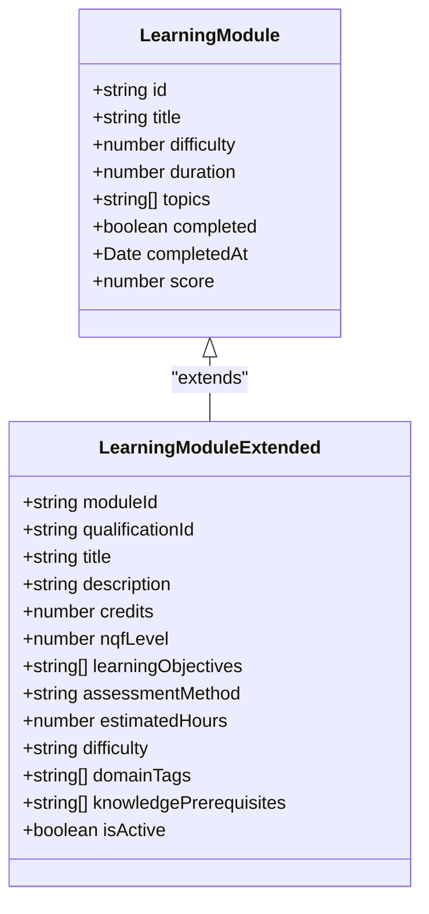
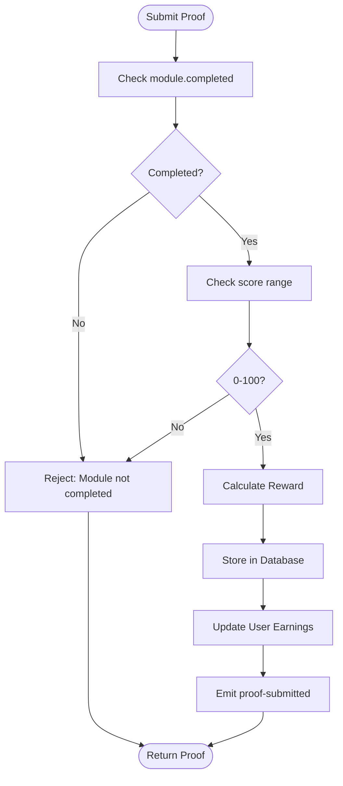
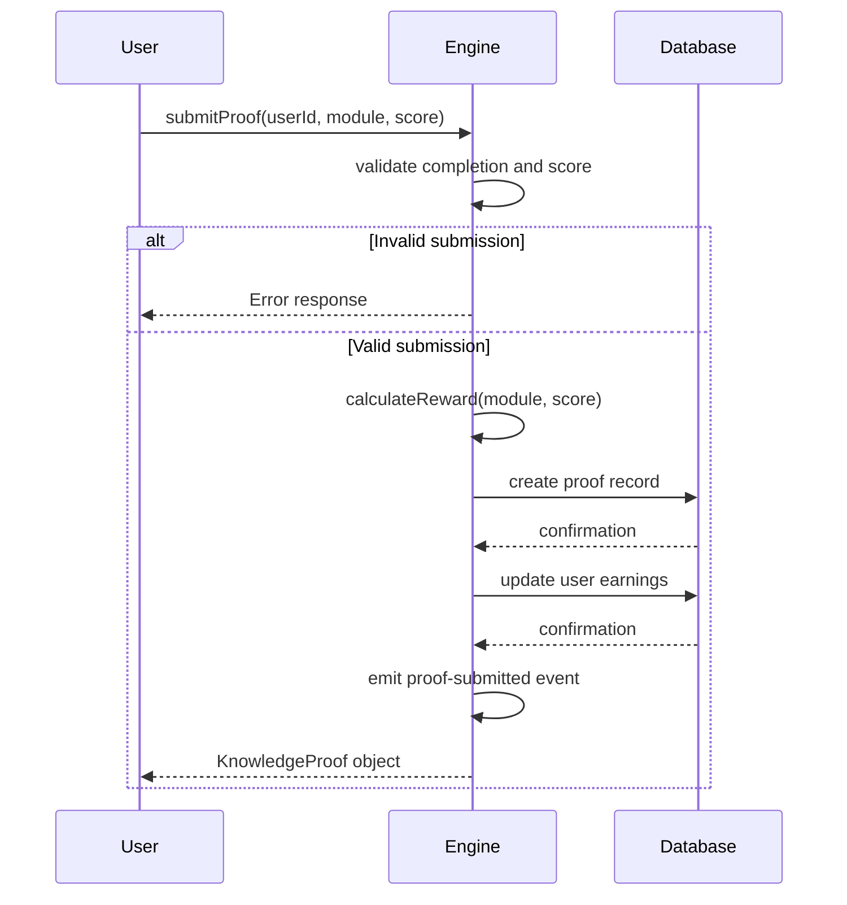
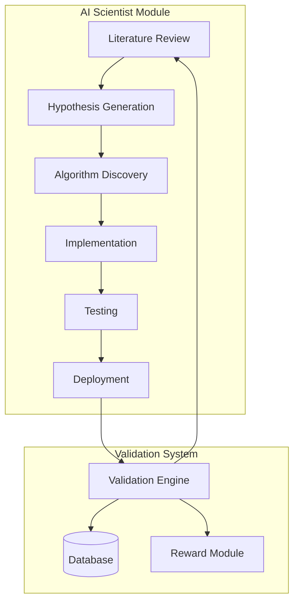

# Knowledge Validation System

<cite>
**Referenced Files in This Document**   
- [ai-scientist-module.ts](file://genome/agent-tools/ai-scientist-module.ts)
- [proof-of-knowledge-engine.ts](file://services/proof-of-knowledge-engine.ts)
- [azora-sapiens.ts](file://genome/agent-tools/azora-sapiens.ts)
</cite>

## Table of Contents
1. [Introduction](#introduction)
2. [Learning Module Interface Structure](#learning-module-interface-structure)
3. [Validation Process and Completion Criteria](#validation-process-and-completion-criteria)
4. [Score Validation and Reward Calculation](#score-validation-and-reward-calculation)
5. [AI Scientist Module Integration](#ai-scientist-module-integration)
6. [Error Handling and Common Issues](#error-handling-and-common-issues)
7. [Configuration and Performance Considerations](#configuration-and-performance-considerations)

## Introduction
The Knowledge Validation System is a core component of the Azora ecosystem, responsible for verifying learning outcomes and enabling economic rewards through the Proof-of-Knowledge framework. This system ensures that educational achievements are authentic, properly assessed, and fairly rewarded. It integrates with the AI Scientist Module to continuously improve validation methodologies and maintain academic integrity across decentralized learning pathways.

**Section sources**
- [proof-of-knowledge-engine.ts](file://services/proof-of-knowledge-engine.ts#L1-L50)
- [azora-sapiens.ts](file://genome/agent-tools/azora-sapiens.ts#L1-L100)

## Learning Module Interface Structure
The LearningModule interface defines the structure for educational content within the system. Two distinct implementations exist across the codebase, reflecting different aspects of the learning ecosystem.

The Proof-of-Knowledge Engine defines a LearningModule with numeric difficulty (1-10), completion status, and score tracking. This version focuses on quantifiable metrics for reward calculation.

The Azora Sapiens implementation provides a more comprehensive structure with NQF levels, credit values, learning objectives, and assessment methods. It includes difficulty as an enumerated type (beginner, intermediate, advanced, expert) and supports complex learning cycles with prepare, engage, apply, and demonstrate phases.

Both interfaces share core attributes like module identification, title, and completion tracking, but serve different purposes within the validation pipeline. The system reconciles these representations during the validation process.

**Diagram sources**
- [proof-of-knowledge-engine.ts](file://services/proof-of-knowledge-engine.ts#L19-L28)
- [azora-sapiens.ts](file://genome/agent-tools/azora-sapiens.ts#L68-L102)

**Section sources**
- [proof-of-knowledge-engine.ts](file://services/proof-of-knowledge-engine.ts#L19-L28)
- [azora-sapiens.ts](file://genome/agent-tools/azora-sapiens.ts#L68-L102)

## Validation Process and Completion Criteria
The validation process enforces strict completion criteria before allowing reward calculation. The Proof-of-Knowledge Engine requires modules to be explicitly marked as completed and validates that scores fall within the acceptable range of 0-100.

Completion status is verified through the module's completed property, which must be true before submission. The system also checks for proper module completion through integration with the Azora Sapiens platform, where completion is determined by successful assessment outcomes and phase progression in the learning cycle.

The validation process includes multiple checkpoints:
1. Module completion status verification
2. Score range validation (0-100)
3. User authentication and authorization
4. Duplicate submission prevention
5. Database integrity checks

These criteria ensure that only legitimate learning achievements are rewarded, maintaining the integrity of the knowledge economy.

**Diagram sources**
- [proof-of-knowledge-engine.ts](file://services/proof-of-knowledge-engine.ts#L50-L100)

**Section sources**
- [proof-of-knowledge-engine.ts](file://services/proof-of-knowledge-engine.ts#L50-L100)

## Score Validation and Reward Calculation
The reward calculation system uses a multi-factor formula that considers module difficulty and performance score. The base reward is determined by the module's difficulty level (0.1 AZR per difficulty point), which is then amplified by a difficulty multiplier (1.0-2.0) based on the difficulty level.

Performance is factored in through a score bonus, calculated as a percentage of the base reward. The score bonus ranges from 0% (for a score of 0) to 50% (for a score of 100), providing additional incentives for high achievement.

The total reward is computed as: (baseReward × difficultyMultiplier) + scoreBonus. This ensures that both challenging modules and high performance are appropriately rewarded. The system rounds the final reward to two decimal places for consistency.

For example, completing a difficulty 8 module with a score of 85 yields:
- Base reward: 0.8 AZR
- Difficulty multiplier: 1.8
- Score bonus: 0.425 AZR
- Total reward: 1.86 AZR

This transparent calculation ensures fairness and predictability in the reward system.

**Diagram sources**
- [proof-of-knowledge-engine.ts](file://services/proof-of-knowledge-engine.ts#L100-L200)

**Section sources**
- [proof-of-knowledge-engine.ts](file://services/proof-of-knowledge-engine.ts#L100-L200)

## AI Scientist Module Integration
The AI Scientist Module enhances the validation system through autonomous research and continuous improvement. It analyzes performance metrics, identifies improvement opportunities, and proposes algorithmic enhancements to the validation process.

The module operates through a structured research cycle that includes literature review, hypothesis generation, algorithm discovery, implementation, testing, and deployment. It monitors key performance indicators such as validation accuracy, processing efficiency, and fraud detection rates.

When the AI Scientist identifies potential improvements, it generates algorithm candidates with expected performance gains. These candidates undergo rigorous testing before deployment. Low-risk improvements are automatically deployed, while high-risk changes require human review.

The integration creates a feedback loop where validation outcomes inform research priorities, and research findings enhance validation accuracy. This self-improving system ensures that the knowledge validation process evolves with emerging educational technologies and assessment methodologies.

**Diagram sources**
- [ai-scientist-module.ts](file://genome/agent-tools/ai-scientist-module.ts#L1-L100)
- [proof-of-knowledge-engine.ts](file://services/proof-of-knowledge-engine.ts#L1-L50)

**Section sources**
- [ai-scientist-module.ts](file://genome/agent-tools/ai-scientist-module.ts#L1-L100)

## Error Handling and Common Issues
The system implements comprehensive error handling for common validation issues. Invalid score submissions (outside 0-100 range) are rejected with specific error messages. Incomplete modules are blocked from reward calculation, requiring proper completion status.

Database connectivity issues trigger automatic fallback to in-memory storage, ensuring service continuity during infrastructure problems. The system logs warnings when switching to fallback mode and attempts to restore database connectivity.

Duplicate proof submissions are prevented through unique identifier generation and database constraints. The system also validates user authentication and authorization before processing submissions.

For high-severity issues, the system emits error events that can trigger monitoring alerts and automated recovery procedures. Warning messages are logged for non-critical issues, allowing for post-hoc analysis and system improvement.

The error handling strategy prioritizes data integrity and user experience, providing clear feedback while maintaining system reliability under various failure conditions.

**Section sources**
- [proof-of-knowledge-engine.ts](file://services/proof-of-knowledge-engine.ts#L80-L120)

## Configuration and Performance Considerations
The validation system is designed for high-volume processing with configurable parameters. The useDatabase flag allows switching between persistent storage and in-memory operation based on infrastructure availability.

For high-volume validation requests, the system employs caching through in-memory storage of user rewards and recent proofs. This reduces database load and improves response times for frequently accessed data.

The batch reward processing function enables efficient distribution of multiple rewards, minimizing blockchain transaction overhead. This is particularly important for UBO (Universal Basic Offer) distributions.

Configuration options include:
- Database connection settings
- Reward calculation parameters
- Validation strictness levels
- Logging verbosity
- Caching behavior

Performance monitoring is integrated through system statistics that track total proofs, distributed rewards, unique users, and average scores. These metrics inform capacity planning and system optimization efforts.

The system scales horizontally through microservice architecture, with the Proof-of-Knowledge Engine running as a dedicated service that can be independently scaled based on demand.

**Section sources**
- [proof-of-knowledge-engine.ts](file://services/proof-of-knowledge-engine.ts#L200-L236)