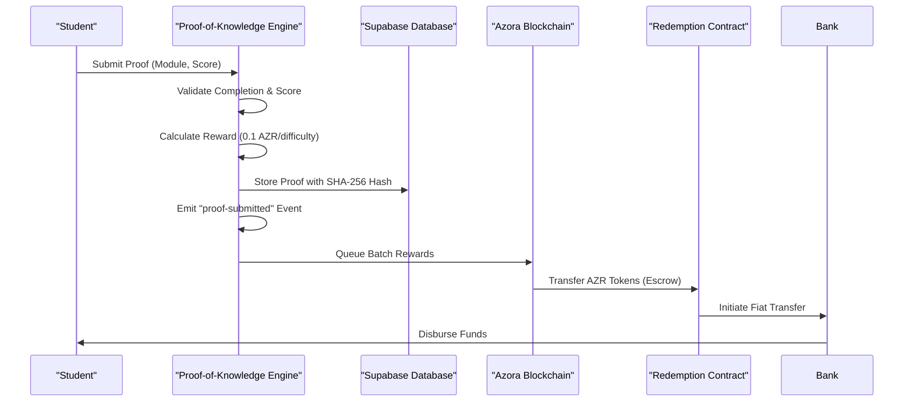
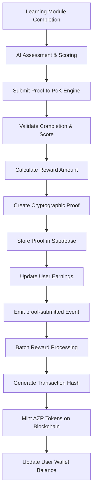

# Proof-of-Knowledge Engine

<cite>
**Referenced Files in This Document**   
- [proof-of-knowledge-engine.ts](file://services/proof-of-knowledge-engine.ts)
- [ECONOMIC_MODEL.md](file://codex/economics/ECONOMIC_MODEL.md)
- [AZORA_CONSTITUTION.md](file://codex/constitution/AZORA_CONSTITUTION.md)
- [Redemption.sol](file://contracts/Redemption.sol)
</cite>

## Table of Contents
1. [Introduction](#introduction)
2. [Knowledge Validation Algorithm](#knowledge-validation-algorithm)
3. [Reward Distribution Logic](#reward-distribution-logic)
4. [Blockchain Integration](#blockchain-integration)
5. [AI Assessment System Integration](#ai-assessment-system-integration)
6. [Knowledge Validation Disputes and Resolution](#knowledge-validation-disputes-and-resolution)
7. [Configuration Options for Educational Institutions](#configuration-options-for-educational-institutions)
8. [Performance Considerations](#performance-considerations)
9. [Implementation Flow Example](#implementation-flow-example)

## Introduction
The Proof-of-Knowledge Engine is a core component of the Azora ecosystem that bridges educational achievement with cryptocurrency rewards. This system implements a "Learn → Earn → Track" model where students validate their knowledge through assessments and receive AZR tokens as rewards. The engine integrates with Supabase for data persistence, connects to the blockchain ledger for token minting, and works in conjunction with AI assessment systems to validate learning outcomes. This documentation details the implementation of the knowledge validation algorithm, reward distribution logic, and integration points with the broader Azora infrastructure.

## Knowledge Validation Algorithm
The Proof-of-Knowledge Engine validates educational achievements through a structured process that verifies module completion and performance metrics. The validation process begins when a user submits proof of completing a learning module, which must include a completion status and assessment score between 0-100. The engine first verifies that the module has been marked as completed and that the score falls within the valid range. Upon validation, the system creates a cryptographic proof that includes a unique identifier, user information, module details, score, timestamp, and verification status. This proof is stored in the database with a SHA-256 hash for integrity verification. The validation process is designed to prevent fraudulent submissions while ensuring legitimate educational achievements are properly recognized.

**Section sources**
- [proof-of-knowledge-engine.ts](file://services/proof-of-knowledge-engine.ts#L85-L147)

## Reward Distribution Logic
The reward calculation system uses a multi-factor formula that considers module difficulty, performance score, and base reward parameters. The algorithm calculates rewards using three components: a base reward of 0.1 AZR per difficulty point (on a 1-10 scale), a difficulty multiplier that ranges from 1.0 to 2.0 based on module complexity, and a score bonus that provides additional rewards for high performance. The total reward is computed by multiplying the base reward by the difficulty multiplier and adding the score bonus, with results rounded to two decimal places. For example, a user completing a difficulty 5 module with an 85% score would receive a calculated reward based on these factors. The system ensures all rewards are denominated in AZR tokens and tracks cumulative earnings for each user.

**Section sources**
- [proof-of-knowledge-engine.ts](file://services/proof-of-knowledge-engine.ts#L62-L80)
- [ECONOMIC_MODEL.md](file://codex/economics/ECONOMIC_MODEL.md#L1-L357)

## Blockchain Integration
The Proof-of-Knowledge Engine integrates with the blockchain ledger through a multi-step process that ensures secure and verifiable token distribution. When a knowledge proof is validated, the system generates a cryptographic hash of the proof data and stores it in the Supabase database as an immutable record. For batch reward processing, the engine simulates blockchain transactions by generating Ethereum-style transaction hashes for each reward, which are then stored with the proof records. The Redemption.sol smart contract serves as the bridge between the PoK system and fiat currency redemption, allowing users to escrow their AZR tokens for bank transfers. This contract maintains a mapping of redemption requests, tracks their status, and requires administrative approval for completion, ensuring secure and auditable token transfers to the treasury address.

**Diagram sources**
- [proof-of-knowledge-engine.ts](file://services/proof-of-knowledge-engine.ts#L149-L234)
- [Redemption.sol](file://contracts/Redemption.sol#L1-L152)

## AI Assessment System Integration
The Proof-of-Knowledge Engine works in conjunction with AI assessment systems to validate learning outcomes and trigger reward distribution. The AI system evaluates student performance through automated assessments, exams, and project evaluations, generating scores that are fed into the PoK engine for reward calculation. When the AI system confirms a student's mastery of a subject, it calls the `triggerKnowledgeReward` method in the PoK system, passing user identification, reward type, achievement details, and the calculated score. This integration creates a seamless flow from learning assessment to economic reward, with the AI system serving as the validation authority and the PoK engine handling the economic mechanics. The constitution mandates that all AI assessments must be transparent and auditable, with assessment criteria and scoring algorithms publicly available.

**Section sources**
- [proof-of-knowledge-engine.ts](file://services/proof-of-knowledge-engine.ts#L85-L147)
- [AZORA_CONSTITUTION.md](file://codex/constitution/AZORA_CONSTITUTION.md#L1-L981)

## Knowledge Validation Disputes and Resolution
The system includes mechanisms for resolving disputes related to knowledge validation and reward distribution. When a user challenges a validation outcome, the dispute resolution process begins with direct mediation between the user and the assessment authority. If unresolved, the case escalates to a board member for arbitration, with final appeals possible through constitutional review. The system maintains comprehensive audit trails of all validation decisions, including assessment criteria, scoring rubrics, and submission timestamps, to support dispute resolution. For technical disputes regarding proof authenticity, the engine provides a `verifyProof` method that checks the cryptographic integrity of proof records against their stored hashes. The constitution establishes a 5-member board with authority to resolve disputes, requiring simple majority (3/5) for operational decisions and supermajority (4/5) for constitutional matters.

**Section sources**
- [proof-of-knowledge-engine.ts](file://services/proof-of-knowledge-engine.ts#L215-L229)
- [AZORA_CONSTITUTION.md](file://codex/constitution/AZORA_CONSTITUTION.md#L700-L750)

## Configuration Options for Educational Institutions
Educational institutions can configure the Proof-of-Knowledge Engine through parameters that define module difficulty, assessment criteria, and reward structures. Institutions assign difficulty ratings (1-10) to learning modules, which directly impact the base reward calculation. They can also define assessment rubrics and passing thresholds that determine score calculations. The system supports institutional branding and customization through API endpoints that allow integration with existing learning management systems. Institutions have access to analytics dashboards that show student performance metrics, reward distribution statistics, and engagement data. The constitution grants institutions autonomy in designing curricula while ensuring all implementations adhere to the core economic principles of the Azora ecosystem, including the fixed supply of 1,000,000 AZR tokens and the 40% allocation to student incentives.

**Section sources**
- [ECONOMIC_MODEL.md](file://codex/economics/ECONOMIC_MODEL.md#L1-L357)
- [AZORA_CONSTITUTION.md](file://codex/constitution/AZORA_CONSTITUTION.md#L400-L450)

## Performance Considerations
The Proof-of-Knowledge Engine is designed with scalability in mind to support large user bases across the African continent and beyond. The system employs a dual-storage strategy, using Supabase as the primary database with in-memory caching as a fallback during connectivity issues. This architecture ensures continuous operation even in regions with unreliable internet connectivity. The engine uses event-driven architecture with EventEmitter to decouple components and improve responsiveness. For high-volume scenarios, the batch reward processing system can handle multiple proofs simultaneously, reducing blockchain transaction overhead. The system's statistics methods are optimized to aggregate data efficiently, providing real-time insights into platform usage without impacting performance. As the user base grows, the system can be scaled horizontally by deploying additional instances behind a load balancer, with Redis for distributed caching and state management.

**Section sources**
- [proof-of-knowledge-engine.ts](file://services/proof-of-knowledge-engine.ts#L183-L200)

## Implementation Flow Example
The flow from learning completion to AZR token minting follows a structured sequence of events. When a student completes a learning module in the Azora Sapiens platform, the AI assessment system evaluates their performance and generates a score. This score is passed to the Proof-of-Knowledge Engine via the `submitProof` method, which validates the completion status and score range. The engine then calculates the reward using the difficulty-based formula and creates a knowledge proof with a unique identifier and cryptographic hash. This proof is stored in Supabase with the user's earnings updated atomically. Periodically, the system processes batch rewards by calling `processBatchRewards`, which generates transaction hashes and emits reward events. These events trigger the Azora Mint system to mint the corresponding AZR tokens on the blockchain ledger, completing the economic loop from education to cryptocurrency reward.

**Diagram sources**
- [proof-of-knowledge-engine.ts](file://services/proof-of-knowledge-engine.ts#L85-L147)
- [Redemption.sol](file://contracts/Redemption.sol#L1-L152)