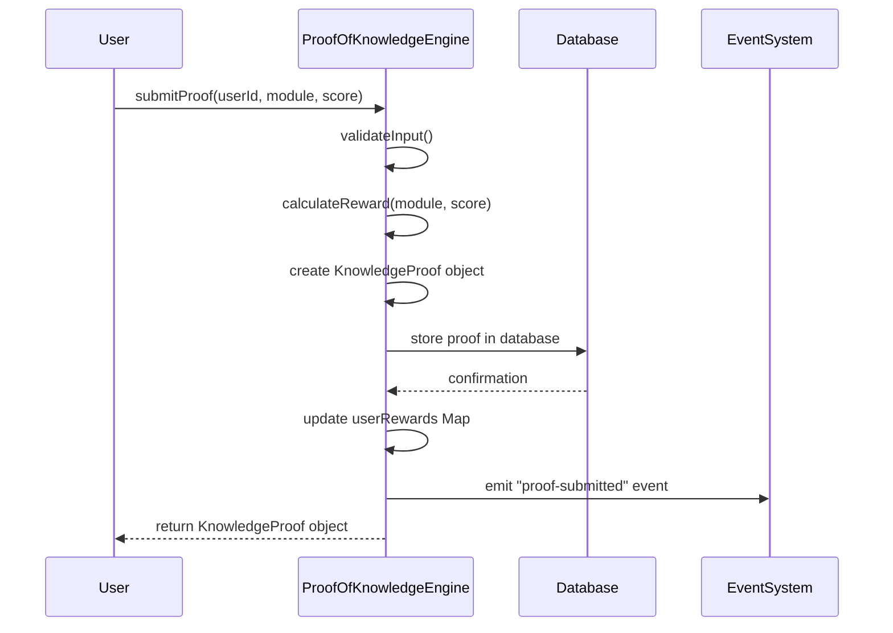

# Reward Distribution Logic

<cite>
**Referenced Files in This Document**   
- [proof-of-knowledge-engine.ts](file://services/proof-of-knowledge-engine.ts)
- [pok-api.ts](file://services/pok-api.ts)
- [azora-mint/index.js](file://services/azora-mint/index.js)
- [azora-mint/mining-service.js](file://services/azora-mint/mining-service.js)
</cite>

## Table of Contents
1. [Introduction](#introduction)
2. [Reward Calculation Algorithm](#reward-calculation-algorithm)
3. [KnowledgeProof Object Creation](#knowledgeproof-object-creation)
4. [Currency Handling and Reward Aggregation](#currency-handling-and-reward-aggregation)
5. [Configuration Options](#configuration-options)
6. [Performance Considerations](#performance-considerations)
7. [Troubleshooting Guide](#troubleshooting-guide)

## Introduction
The Reward Distribution Logic in the Azora ecosystem implements a Proof-of-Knowledge (PoK) framework that rewards users for completing educational modules. This system connects learning outcomes with economic incentives by calculating rewards based on module difficulty and user performance. The implementation centers around the `ProofOfKnowledgeEngine` class, which handles reward calculation, proof generation, and distribution mechanics. The system ensures that users are fairly compensated for their knowledge acquisition while maintaining economic sustainability through the Universal Basic Opportunity (UBO) Fund.

**Section sources**
- [proof-of-knowledge-engine.ts](file://services/proof-of-knowledge-engine.ts#L1-L50)

## Reward Calculation Algorithm
The reward calculation algorithm in the Proof-of-Knowledge Engine determines the amount of AZR tokens earned by users based on three key factors: base reward, difficulty multiplier, and score bonus. The `calculateReward` method implements this algorithm by first establishing a base reward of 0.1 AZR per difficulty point, where difficulty ranges from 1 to 10. For a module with difficulty 5, the base reward would be 0.5 AZR (5 × 0.1).

The algorithm then applies a difficulty multiplier calculated as 1 + (difficulty / 10), which ranges from 1.0 for difficulty 1 to 2.0 for difficulty 10. For a difficulty 5 module, this results in a multiplier of 1.5. Finally, a score bonus is calculated as the base reward multiplied by (score / 200), providing a bonus that ranges from 0% to 50% of the base reward for scores between 0 and 100.

For a module with difficulty 5 and score 85, the calculation proceeds as follows:
- Base reward: 5 × 0.1 = 0.5 AZR
- Difficulty multiplier: 1 + (5 / 10) = 1.5
- Score bonus: 0.5 × (85 / 200) = 0.2125 AZR
- Total reward: (0.5 × 1.5) + 0.2125 = 0.9625 AZR, rounded to 0.96 AZR

The method returns a structured `RewardCalculation` object containing all components of the calculation, with the total reward rounded to two decimal places to address floating-point precision concerns.

```mermaid
flowchart TD
A[Start Reward Calculation] --> B[Input: Module Difficulty, Score]
B --> C[Calculate Base Reward: difficulty × 0.1]
C --> D[Calculate Difficulty Multiplier: 1 + (difficulty / 10)]
D --> E[Calculate Score Bonus: baseReward × (score / 200)]
E --> F[Calculate Total Reward: (baseReward × multiplier) + scoreBonus]
F --> G[Round to 2 Decimal Places]
G --> H[Return Reward Calculation Object]
```

**Diagram sources**
- [proof-of-knowledge-engine.ts](file://services/proof-of-knowledge-engine.ts#L53-L80)

**Section sources**
- [proof-of-knowledge-engine.ts](file://services/proof-of-knowledge-engine.ts#L53-L80)

## KnowledgeProof Object Creation
The relationship between reward calculation and KnowledgeProof object creation is established in the `submitProof` method of the ProofOfKnowledgeEngine class. After validating that the module is completed and the score is within the valid range (0-100), the method calls `calculateReward` to determine the appropriate reward amount. The resulting reward calculation is then used to create a KnowledgeProof object that serves as a verifiable record of the user's achievement.

The KnowledgeProof object contains essential information including the user ID, module ID, score, timestamp, verification status, reward amount, currency (AZR), and an optional transaction hash. This object is stored in both persistent storage (Supabase database) and in-memory cache for performance. When stored in the database, a SHA-256 hash of key fields is generated to ensure proof authenticity and prevent tampering.

The creation of the KnowledgeProof object triggers several downstream processes: the user's reward balance is updated in the `userRewards` Map, an event is emitted to notify other system components, and the proof is made available for retrieval through various API endpoints. This integration ensures that reward distribution is transparent, verifiable, and properly recorded across the system.



**Diagram sources**
- [proof-of-knowledge-engine.ts](file://services/proof-of-knowledge-engine.ts#L80-L140)

**Section sources**
- [proof-of-knowledge-engine.ts](file://services/proof-of-knowledge-engine.ts#L80-L140)

## Currency Handling and Reward Aggregation
Rewards are denominated in AZR, the native currency of the Azora ecosystem, and are stored and aggregated in the `userRewards` Map within the ProofOfKnowledgeEngine class. This Map maintains a running total of rewards earned by each user, with user IDs as keys and accumulated reward amounts as values. When a new proof is submitted, the system retrieves the user's current reward balance, adds the new reward amount, and updates the Map accordingly.

To address floating-point precision issues, all reward calculations are rounded to two decimal places using JavaScript's `toFixed(2)` method followed by `Number()` conversion. This ensures consistent representation of currency amounts and prevents accumulation of rounding errors over multiple transactions. The system also maintains rewards in the database with appropriate numeric types to preserve precision.

The UBO Fund, which finances knowledge rewards, has a starting balance of 10,000,000 AZR (1% of total supply). Before distributing any reward, the system checks that sufficient funds are available in this pool. When rewards are paid, the UBO Fund balance is decremented by the reward amount, and the total knowledge rewards paid metric is incremented. This dual-tracking mechanism ensures fiscal responsibility and provides transparency into fund utilization.

**Section sources**
- [proof-of-knowledge-engine.ts](file://services/proof-of-knowledge-engine.ts#L140-L189)
- [azora-mint/index.js](file://services/azora-mint/index.js#L233-L272)

## Configuration Options
The reward formula parameters can be adjusted through configuration in the Proof-of-Knowledge system. While the core calculation algorithm is implemented in the ProofOfKnowledgeEngine class, specific reward amounts for different achievement types are configured in the Azora Mint service. The `PROOF_OF_KNOWLEDGE_REWARDS` object defines reward amounts for various categories including module completion, assessment passes, certificate achievements, and milestone bonuses.

For example, basic module completion awards 100 AZR, intermediate modules award 150 AZR, and advanced modules award 200 AZR. Assessment passes offer higher rewards, with practical exams awarding 300 AZR, code audits 400 AZR, and capstone projects 500 AZR. Certificate achievements provide substantial rewards, with CKQ-Basic certification awarding 1,000 AZR and CKQ-Advanced certification awarding 2,000 AZR.

These configuration values can be modified to adjust the economic incentives within the system. The UBO Fund balance and reward distribution rates can also be configured, allowing the system to adapt to changing economic conditions or strategic priorities. Configuration changes are typically implemented through environment variables or database settings, enabling adjustments without requiring code modifications.

**Section sources**
- [azora-mint/index.js](file://services/azora-mint/index.js#L157-L197)
- [azora-mint/mining-service.js](file://services/azora-mint/mining-service.js#L444-L483)

## Performance Considerations
The system includes several performance optimizations for batch reward processing, particularly important when handling large volumes of proofs. The `processBatchRewards` method in the ProofOfKnowledgeEngine class processes multiple KnowledgeProof objects in sequence, simulating blockchain transactions by assigning transaction hashes and emitting reward-paid events. This method returns the total amount of AZR distributed, providing a summary of the batch operation.

For high-throughput scenarios, the system leverages database transactions to ensure data consistency when recording multiple rewards. The API endpoints are designed to handle concurrent requests efficiently, with proper error handling and rate limiting to prevent abuse. The in-memory cache of proofs and user rewards provides fast access to frequently requested data, reducing database load.

The system also implements event-driven architecture through the EventEmitter interface, allowing other components to react to proof submission events without blocking the main processing flow. This decoupling improves overall system responsiveness and enables asynchronous processing of secondary operations like notifications and analytics updates.

```mermaid
flowchart TD
A[Batch Rewards Processing] --> B[Input: Array of KnowledgeProof objects]
B --> C[Initialize totalProcessed = 0]
C --> D{For each proof in array}
D --> E[Check if proof has transactionHash]
E --> |No| F[Generate transactionHash]
F --> G[Add proof.rewardAmount to totalProcessed]
G --> H[Emit "reward-paid" event]
H --> I[Next proof]
I --> D
D --> |All processed| J[Log batch summary]
J --> K[Return totalProcessed amount]
```

**Diagram sources**
- [proof-of-knowledge-engine.ts](file://services/proof-of-knowledge-engine.ts#L183-L234)

**Section sources**
- [proof-of-knowledge-engine.ts](file://services/proof-of-knowledge-engine.ts#L183-L234)

## Troubleshooting Guide
Common issues in the reward distribution system typically involve validation failures, insufficient funds, or data consistency problems. When a reward cannot be processed, the system returns appropriate HTTP status codes and error messages to aid troubleshooting.

Validation errors (HTTP 400) occur when required fields are missing or values are invalid. These include missing userId, rewardType, or rewardCategory parameters, as well as scores outside the valid range of 0-100. Invalid reward types or categories trigger validation checks against the configured reward structure.

Insufficient funds errors (HTTP 402) occur when the UBO Fund balance is inadequate to cover a requested reward. This safeguard prevents the system from over-allocating rewards and maintains economic stability. Monitoring the UBO Fund balance and planning for replenishment when utilization exceeds thresholds can prevent this issue.

Database connectivity problems may cause the system to fall back to in-memory storage, as indicated by warning messages. While this ensures continued operation, it may affect data persistence and consistency. Ensuring reliable database connectivity and implementing proper retry mechanisms can mitigate this issue.

Floating-point precision concerns are addressed through explicit rounding to two decimal places, but developers should be aware of JavaScript's inherent floating-point arithmetic limitations when performing additional calculations with reward amounts.

**Section sources**
- [proof-of-knowledge-engine.ts](file://services/proof-of-knowledge-engine.ts#L100-L140)
- [azora-mint/index.js](file://services/azora-mint/index.js#L233-L272)
- [pok-api.ts](file://services/pok-api.ts#L0-L67)