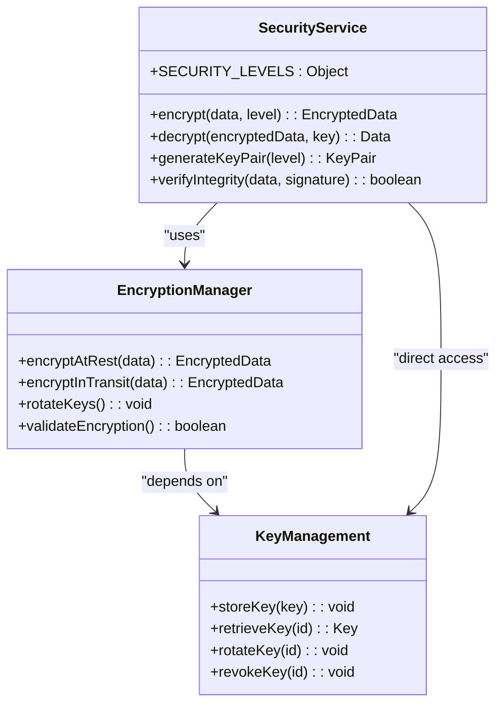
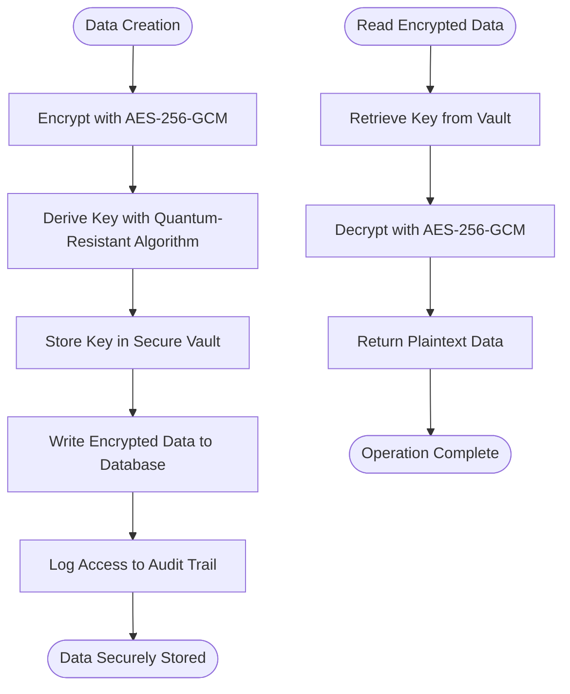
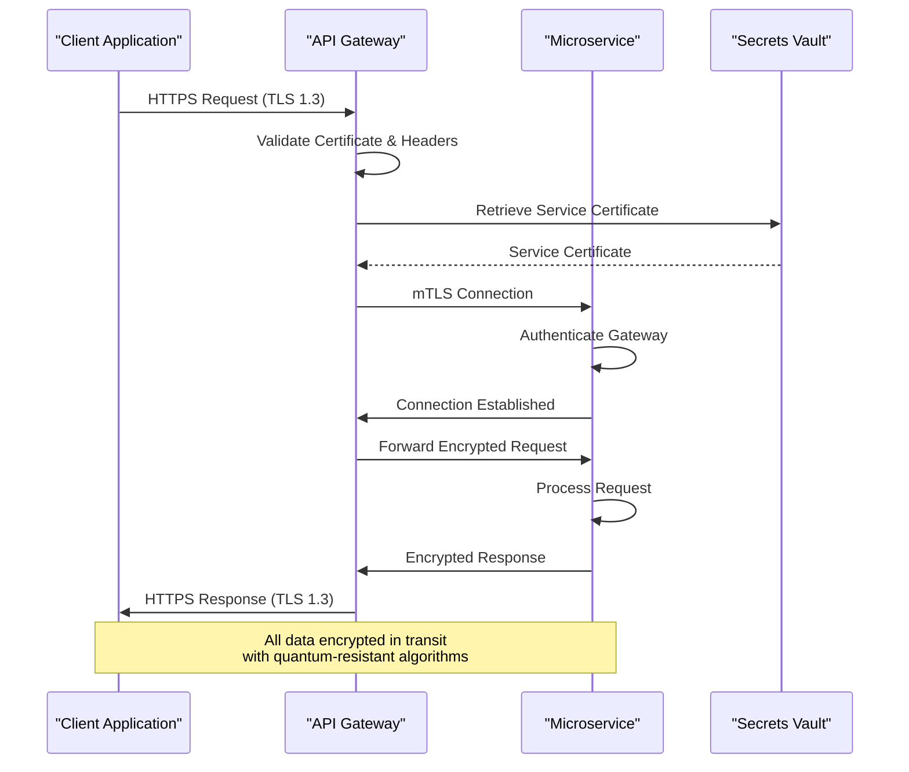
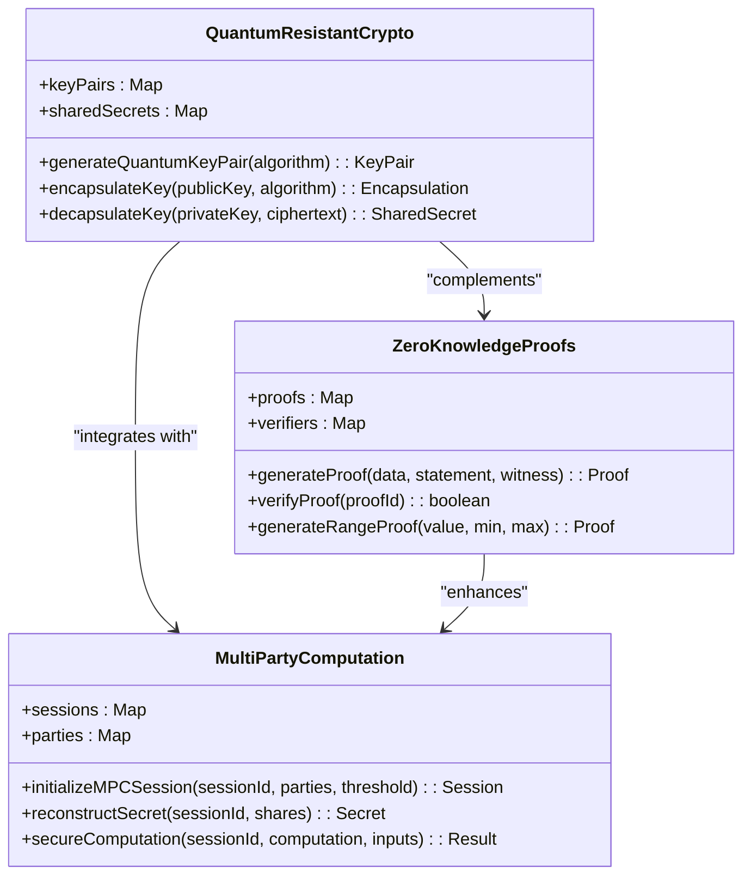
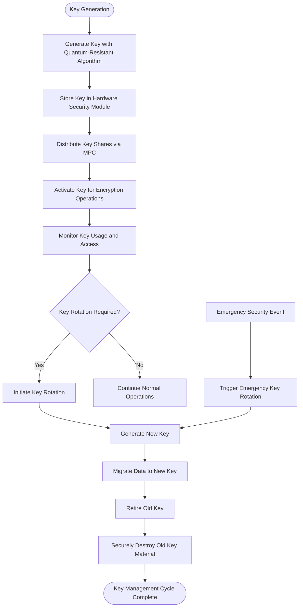
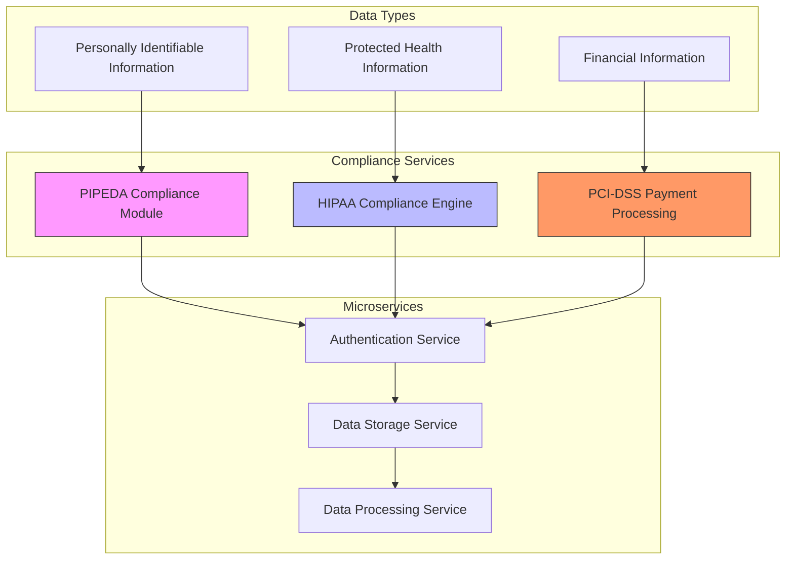
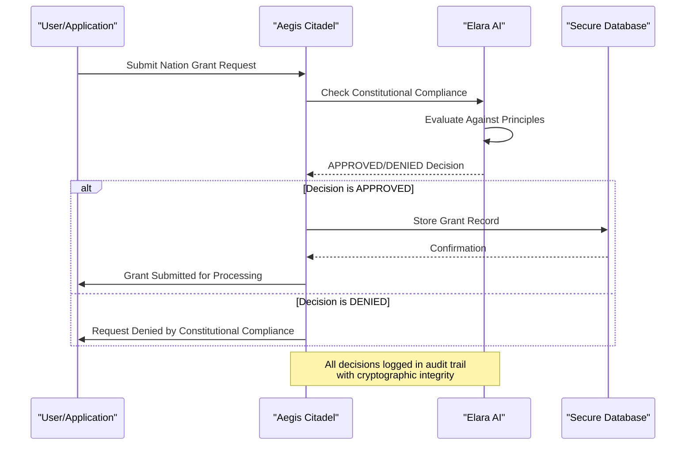
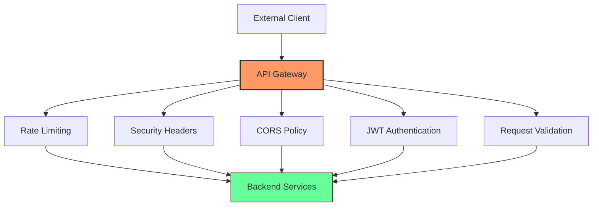
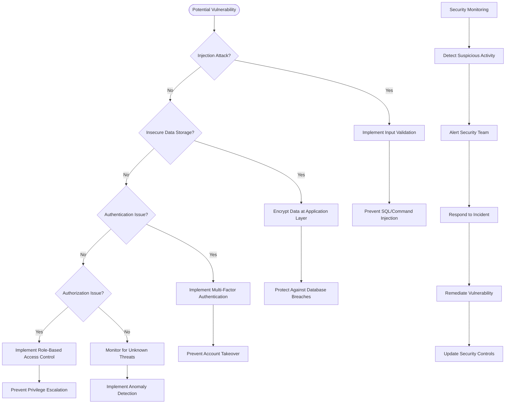

# Data Protection

<cite>
**Referenced Files in This Document**   
- [server.ts](file://azora/azora-aegis/server.ts)
- [constitutional-compliance-checker.js](file://infrastructure/constitutional-compliance-checker.js)
- [api-gateway-complete.js](file://infrastructure/api-gateway-complete.js)
- [index.js](file://services/azora-covenant/index.js)
- [index.js](file://organs/pipeda-compliance/index.js)
- [index.js](file://organs/hipaa-compliance/index.js)
</cite>

## Table of Contents
1. [Introduction](#introduction)
2. [Military-Grade Encryption Implementation](#military-grade-encryption-implementation)
3. [Data-at-Rest Protection](#data-at-rest-protection)
4. [Data-in-Transit Protection](#data-in-transit-protection)
5. [Quantum-Resistant Cryptography](#quantum-resistant-cryptography)
6. [Secure Key Management Practices](#secure-key-management-practices)
7. [Sensitive Data Handling Across Microservices](#sensitive-data-handling-across-microservices)
8. [Aegis Security Service Implementation](#aegis-security-service-implementation)
9. [Constitutional Compliance Checker](#constitutional-compliance-checker)
10. [API Gateway Integration](#api-gateway-integration)
11. [Vulnerability Mitigation Strategies](#vulnerability-mitigation-strategies)
12. [Configuration Guidelines](#configuration-guidelines)
13. [Conclusion](#conclusion)

## Introduction

Azora OS implements a comprehensive data protection framework that combines military-grade encryption, quantum-resistant cryptography, and constitutional compliance to ensure the highest levels of data security and privacy. The system is designed to protect sensitive information including personally identifiable information (PII) and financial data across a distributed microservices architecture. This document details the implementation of data protection mechanisms, secure key management practices, and compliance frameworks that ensure data integrity and confidentiality throughout the Azora ecosystem.

The data protection architecture is built on multiple layers of security, starting with quantum-resistant cryptographic algorithms and extending to constitutional compliance checks that ensure all data operations adhere to established governance principles. The system integrates with the API gateway for request-level security enforcement and implements specialized compliance services for handling regulated data types.

**Section sources**
- [server.ts](file://azora/azora-aegis/server.ts#L1-L50)
- [constitutional-compliance-checker.js](file://infrastructure/constitutional-compliance-checker.js#L1-L50)

## Military-Grade Encryption Implementation

Azora OS employs military-grade encryption standards across all data protection mechanisms, implementing AES-256 encryption for data at rest and in transit. The encryption framework is designed to meet or exceed intelligence agency-level security requirements, with multiple layers of cryptographic protection for sensitive data.

The system implements a hierarchical security model with different security levels for various data types and operations. The SECURITY_LEVELS constant defines four distinct security tiers: STANDARD (AES-256, RSA-2048), HIGH (AES-256, RSA-4096, ECDSA), INTELLIGENCE (quantum-resistant, zero-knowledge proofs, multi-party computation), and MAXIMUM (post-quantum crypto, threshold crypto). This tiered approach allows for appropriate security measures to be applied based on the sensitivity of the data and the criticality of the operation.

For database encryption, the system uses AES-256-GCM with quantum-resistant key derivation, ensuring both confidentiality and integrity of stored data. The encryption implementation includes authenticated encryption with associated data (AEAD) to prevent tampering and ensure data authenticity. All encryption operations are performed using secure cryptographic libraries with constant-time algorithms to prevent side-channel attacks.



**Diagram sources**
- [index.js](file://services/azora-covenant/index.js#L0-L100)

**Section sources**
- [index.js](file://services/azora-covenant/index.js#L0-L100)
- [constitutional-compliance-checker.js](file://infrastructure/constitutional-compliance-checker.js#L100-L150)

## Data-at-Rest Protection

Azora OS implements comprehensive data-at-rest protection through multiple layers of encryption and access controls. All sensitive data stored in databases is encrypted using AES-256-GCM with quantum-resistant key derivation, ensuring protection against both current and future cryptographic threats.

The system employs a zero-trust approach to data storage, where all PII and financial information is automatically encrypted before being written to any persistent storage. The encryption process uses a combination of symmetric and asymmetric cryptography, with data encrypted using AES-256 and encryption keys protected using quantum-resistant algorithms. This hybrid approach provides both performance efficiency and long-term security.

Database-level encryption is implemented through transparent data encryption (TDE) mechanisms that automatically encrypt data at the storage layer. The system also implements column-level encryption for highly sensitive fields such as social security numbers, financial account information, and health records. This granular approach ensures that even database administrators cannot access sensitive data in plaintext form.

The data-at-rest protection framework includes automated key rotation with configurable intervals for different key types. Data encryption keys are rotated every 30 days, session keys every 24 hours, and API keys every 90 days. The system maintains backward compatibility during key rotation, allowing data encrypted with previous keys to be decrypted with current keys, ensuring uninterrupted service during security updates.



**Diagram sources**
- [index.js](file://services/azora-covenant/index.js#L100-L200)
- [index.js](file://organs/pipeda-compliance/index.js#L100-L150)

**Section sources**
- [index.js](file://services/azora-covenant/index.js#L100-L200)
- [index.js](file://organs/pipeda-compliance/index.js#L100-L150)

## Data-in-Transit Protection

Azora OS implements robust data-in-transit protection using TLS 1.3 with quantum-resistant key exchange algorithms. All communication between microservices, client applications, and external systems is encrypted using industry-standard protocols with additional security enhancements to protect against advanced threats.

The API gateway serves as the entry point for all external communications and enforces strict TLS requirements for all incoming and outgoing connections. The gateway implements certificate pinning to prevent man-in-the-middle attacks and uses HTTP Strict Transport Security (HSTS) to ensure all communications occur over encrypted channels. Rate limiting and request validation are also enforced at the gateway level to prevent denial-of-service attacks and injection attempts.

For internal service-to-service communication, the system uses mutual TLS (mTLS) authentication to ensure that only authorized services can communicate with each other. Each microservice has its own TLS certificate issued by the internal certificate authority, and all connections are validated before data transmission occurs. This zero-trust network architecture prevents unauthorized access even if an attacker gains access to the internal network.

The data-in-transit protection framework includes support for homomorphic encryption, allowing certain operations to be performed on encrypted data without decrypting it first. This capability enables secure data processing in untrusted environments and protects sensitive information even during computation. The system also implements perfect forward secrecy (PFS) to ensure that session keys are not compromised even if long-term keys are exposed.



**Diagram sources**
- [api-gateway-complete.js](file://infrastructure/api-gateway-complete.js#L1-L40)
- [index.js](file://services/azora-covenant/index.js#L200-L300)

**Section sources**
- [api-gateway-complete.js](file://infrastructure/api-gateway-complete.js#L1-L40)
- [index.js](file://services/azora-covenant/index.js#L200-L300)

## Quantum-Resistant Cryptography

Azora OS implements quantum-resistant cryptography to protect against future threats from quantum computers. The system uses lattice-based cryptography, specifically the Kyber algorithm, for key exchange and encapsulation, ensuring long-term security of encrypted data even in the presence of quantum computing capabilities.

The QuantumResistantCrypto class provides a comprehensive implementation of post-quantum cryptographic algorithms, including key pair generation, key encapsulation, and key decapsulation. The generateQuantumKeyPair method creates quantum-resistant key pairs using the Kyber768 algorithm, which provides security equivalent to 128-bit symmetric encryption. These key pairs are used for secure key exchange between services and clients.

Key encapsulation mechanisms (KEM) are used to securely transmit encryption keys without exposing them to potential eavesdroppers. The encapsulateKey method generates a shared secret and ciphertext that can only be decrypted by the recipient with the corresponding private key. This approach provides forward secrecy and protects against both classical and quantum attacks on key exchange protocols.

The system also implements zero-knowledge proofs (ZKP) to verify the integrity of data and transactions without revealing sensitive information. The ZeroKnowledgeProofs class provides methods for generating and verifying proofs of data integrity, range proofs, and other cryptographic assertions. This capability enables secure verification of compliance and authenticity without exposing underlying data.



**Diagram sources**
- [index.js](file://services/azora-covenant/index.js#L40-L100)
- [index.js](file://services/azora-covenant/index.js#L100-L150)

**Section sources**
- [index.js](file://services/azora-covenant/index.js#L40-L150)

## Secure Key Management Practices

Azora OS implements comprehensive key management practices to ensure the security and integrity of cryptographic keys throughout their lifecycle. The system follows a zero-trust approach to key management, where keys are never stored in plaintext and access is strictly controlled through multi-factor authentication and authorization policies.

The key management system implements automated key rotation with configurable intervals for different key types. Data encryption keys are rotated every 30 days, session keys every 24 hours, and API keys every 90 days. The system maintains backward compatibility during key rotation, allowing data encrypted with previous keys to be decrypted with current keys, ensuring uninterrupted service during security updates.

Emergency key rotation is supported for immediate response to security incidents. The emergency-rotate endpoint allows for immediate key rotation in response to suspected breaches, with the new keys taking effect immediately across all services. This capability ensures rapid response to security threats while maintaining system availability.

The system implements threshold cryptography through multi-party computation (MPC), where cryptographic operations require collaboration between multiple parties. The MultiPartyComputation class provides methods for initializing MPC sessions, generating shares, and reconstructing secrets. This approach ensures that no single party has complete access to cryptographic keys, reducing the risk of insider threats and key compromise.



**Diagram sources**
- [index.js](file://services/azora-covenant/index.js#L300-L400)
- [tests/security/data-encryption.js](file://tests/security/data-encryption.js#L390-L431)

**Section sources**
- [index.js](file://services/azora-covenant/index.js#L300-L400)
- [tests/security/data-encryption.js](file://tests/security/data-encryption.js#L390-L431)

## Sensitive Data Handling Across Microservices

Azora OS implements a comprehensive framework for handling sensitive data across its microservices architecture, with specialized compliance services for different regulatory requirements. The system ensures that PII, financial information, and other sensitive data are protected according to the strictest applicable regulations.

The PIPEDA Compliance Module handles personal information in accordance with Canadian privacy regulations, implementing consent management, data minimization, and individual access rights. The module tracks consent records, manages personal information lifecycle, and processes individual access and correction requests. All personal information is encrypted at rest and in transit, with access logs maintained for audit purposes.

For healthcare data, the HIPAA Compliance Engine ensures protection of Protected Health Information (PHI) according to U.S. regulations. The engine implements technical safeguards including encryption, access controls, and audit trails, as well as administrative and physical safeguards. PHI is encrypted using AES-256-GCM with quantum-resistant key derivation, and access is logged with detailed audit trails.

Financial data is protected through the Azora Pay service, which implements PCI-DSS compliant payment processing. The service uses tokenization to replace sensitive payment information with non-sensitive equivalents, reducing the scope of compliance requirements. All financial transactions are recorded on a secure blockchain ledger with cryptographic integrity guarantees.



**Diagram sources**
- [index.js](file://organs/pipeda-compliance/index.js#L0-L100)
- [index.js](file://organs/hipaa-compliance/index.js#L0-L100)
- [azora-pay/index.js](file://infrastructure/azora-pay/index.js#L1-L10)

**Section sources**
- [index.js](file://organs/pipeda-compliance/index.js#L0-L100)
- [index.js](file://organs/hipaa-compliance/index.js#L0-L100)
- [azora-pay/index.js](file://infrastructure/azora-pay/index.js#L1-L10)

## Aegis Security Service Implementation

The Aegis Security Service serves as the central security authority in Azora OS, providing constitutional compliance checks and security enforcement across the system. The service acts as a gatekeeper for critical operations, ensuring that all actions align with the Azora Constitution and sovereign economic principles.

The service implements Elara AI, an artificial intelligence system that performs constitutional compliance checks on all significant operations. The checkConstitutionalCompliance function evaluates actions against key principles including collective good, economic stability, transparency, and sovereignty. The AI system responds with "APPROVED" or "DENIED" decisions, which are enforced by the system.

The Aegis Citadel provides endpoints for sovereign nation grants and sovereign triggers, both of which require constitutional compliance approval before execution. The nation-grants endpoint validates new nation creation requests, while the sovereign-triggers endpoint processes economic, defense, and constitutional amendment triggers. Both endpoints integrate with Elara AI to ensure constitutional compliance.

The service also implements comprehensive audit logging and monitoring, with all security decisions and compliance checks recorded in an immutable audit trail. The health endpoint provides status information about the service, including Elara AI status and system health metrics. This transparency ensures accountability and enables rapid response to security incidents.



**Diagram sources**
- [server.ts](file://azora/azora-aegis/server.ts#L50-L150)

**Section sources**
- [server.ts](file://azora/azora-aegis/server.ts#L50-L150)

## Constitutional Compliance Checker

The Constitutional Compliance Checker is a critical component of Azora OS that validates all system configurations and deployments against the Azora Constitution. The checker runs comprehensive validation across ten constitutional articles, ensuring that all system components adhere to established governance, economic, technical, and legal principles.

The checker implements a modular validation framework with dedicated methods for each constitutional article. Article I validation ensures the mission statement and constitution exist, while Article II checks governance structure and board composition. Article III validates the economic model, including maximum supply of 1,000,000 AZR and proper coin integration.

Article VI enforces technical infrastructure requirements, including the prohibition of external dependencies and the requirement for self-hosted databases. The checker verifies that all databases are self-hosted and that the system uses its own AI models rather than external services. This ensures technological sovereignty and reduces supply chain risks.

Article IX implements the No Mock Protocol, which prohibits the use of mock code in production. The checker runs the no-mock-validator.js script to detect any mock implementations that could compromise system integrity. It also verifies that all tests pass, ensuring code quality and functionality.

```mermaid
flowchart TD
Start([System Deployment]) --> CheckI["Check Article I: Foundation & Purpose"]
CheckI --> CheckII["Check Article II: Governance Structure"]
CheckII --> CheckIII["Check Article III: Economic Model"]
CheckIII --> CheckIV["Check Article IV: Student Rights"]
CheckIV --> CheckV["Check Article V: Founder Rights"]
CheckV --> CheckVI["Check Article VI: Technical Infrastructure"]
CheckVI --> CheckVII["Check Article VII: Data & Privacy"]
CheckVII --> CheckVIII["Check Article VIII: Compliance & Legal"]
CheckVIII --> CheckIX["Check Article IX: Development Standards"]
CheckIX --> CheckX["Check Article X: Amendments"]
CheckX --> Evaluate["Evaluate Results"]
Evaluate --> alt ViolationsFound
ViolationsFound["❌ Constitutional Violations Found"]
ViolationsFound --> Block["Block Deployment"]
else NoViolations
NoViolations["✅ Constitutionally Compliant"]
NoViolations --> Deploy["Allow Production Deployment"]
end
```

**Diagram sources**
- [constitutional-compliance-checker.js](file://infrastructure/constitutional-compliance-checker.js#L50-L150)

**Section sources**
- [constitutional-compliance-checker.js](file://infrastructure/constitutional-compliance-checker.js#L50-L150)

## API Gateway Integration

The API Gateway serves as the entry point for all external communications in Azora OS, providing request-level security and traffic management. The gateway implements multiple security layers, including rate limiting, request validation, and protocol enforcement, to protect backend services from malicious traffic.

The gateway uses express-rate-limit to enforce rate limits on API endpoints, preventing denial-of-service attacks and ensuring fair resource allocation. The configuration limits requests to 1,000 per 15 minutes per IP address, with customizable limits for different endpoints based on their sensitivity and resource requirements.

Security headers are enforced through the helmet middleware, which sets various HTTP headers to improve security. These include Content Security Policy (CSP), X-Content-Type-Options, X-Frame-Options, and Strict-Transport-Security, protecting against common web vulnerabilities such as cross-site scripting (XSS) and clickjacking.

The gateway also implements CORS (Cross-Origin Resource Sharing) policies to control which domains can access the API. Only authorized domains are allowed to make requests, preventing unauthorized cross-origin access. JWT (JSON Web Token) authentication can be integrated for request-level authorization, ensuring that only authenticated and authorized clients can access protected endpoints.



**Diagram sources**
- [api-gateway-complete.js](file://infrastructure/api-gateway-complete.js#L1-L40)

**Section sources**
- [api-gateway-complete.js](file://infrastructure/api-gateway-complete.js#L1-L40)

## Vulnerability Mitigation Strategies

Azora OS implements comprehensive vulnerability mitigation strategies to protect against common security threats such as injection attacks and insecure data storage. The system employs a defense-in-depth approach with multiple layers of protection to minimize the attack surface and prevent exploitation of vulnerabilities.

To prevent injection attacks, the system implements strict input validation and parameterized queries for all database operations. All user input is sanitized and validated against defined schemas before processing, with special characters escaped or rejected based on context. The system also employs Content Security Policy (CSP) headers to prevent cross-site scripting (XSS) attacks by restricting the sources of executable scripts.

For insecure data storage, the system implements automatic encryption of sensitive data at the application layer before it reaches the database. This ensures that even if an attacker gains access to the database, they cannot read sensitive information in plaintext. The system also implements secure key management practices, with encryption keys stored in hardware security modules and never exposed in application code.

The system includes automated security testing as part of the deployment pipeline, with the Constitutional Compliance Checker validating all configurations against security requirements. The no-mock-validator.js script detects any insecure mock implementations that could compromise system integrity. Regular security audits and penetration testing are also conducted to identify and remediate vulnerabilities.



**Diagram sources**
- [constitutional-compliance-checker.js](file://infrastructure/constitutional-compliance-checker.js#L150-L200)
- [api-gateway-complete.js](file://infrastructure/api-gateway-complete.js#L1-L40)

**Section sources**
- [constitutional-compliance-checker.js](file://infrastructure/constitutional-compliance-checker.js#L150-L200)
- [api-gateway-complete.js](file://infrastructure/api-gateway-complete.js#L1-L40)

## Configuration Guidelines

To maintain data integrity and confidentiality in Azora OS, administrators should follow these configuration guidelines:

1. **Encryption Configuration**: Ensure all data at rest is encrypted using AES-256-GCM with quantum-resistant key derivation. Configure automatic key rotation with appropriate intervals for different key types (30 days for data encryption keys, 24 hours for session keys, 90 days for API keys).

2. **API Gateway Settings**: Configure rate limiting to prevent denial-of-service attacks, with limits adjusted based on endpoint sensitivity. Enable all security headers through the helmet middleware and configure strict CORS policies to allow only authorized domains.

3. **Compliance Checker**: Run the Constitutional Compliance Checker regularly to validate system configurations against the Azora Constitution. Address any violations before deploying to production, particularly those related to external dependencies and mock code usage.

4. **Key Management**: Store cryptographic keys in hardware security modules or secure key management services. Implement multi-party computation for threshold cryptography to prevent single points of failure in key management.

5. **Audit Logging**: Enable comprehensive audit logging for all security-relevant events, including authentication attempts, data access, and configuration changes. Ensure logs are stored securely and cannot be tampered with.

6. **Microservices Security**: Implement mutual TLS (mTLS) for service-to-service communication and validate all certificates. Use short-lived tokens for service authentication and rotate them regularly.

7. **Database Security**: Use transparent data encryption (TDE) for database storage and implement column-level encryption for highly sensitive fields. Restrict database access to authorized services only and monitor for unusual query patterns.

8. **Regular Security Testing**: Conduct regular security testing, including penetration testing and vulnerability scanning. Address identified issues promptly and verify fixes through retesting.

**Section sources**
- [constitutional-compliance-checker.js](file://infrastructure/constitutional-compliance-checker.js#L1-L50)
- [api-gateway-complete.js](file://infrastructure/api-gateway-complete.js#L1-L40)
- [server.ts](file://azora/azora-aegis/server.ts#L1-L50)

## Conclusion

Azora OS implements a comprehensive data protection framework that combines military-grade encryption, quantum-resistant cryptography, and constitutional compliance to ensure the highest levels of security and privacy. The system's multi-layered approach to data protection addresses both current and future threats, from classical attacks to potential quantum computing capabilities.

The integration of the Aegis Security Service and Constitutional Compliance Checker ensures that all operations adhere to established governance principles, while specialized compliance modules handle regulated data types according to specific regulatory requirements. The API gateway provides robust request-level security, protecting backend services from common vulnerabilities and malicious traffic.

By following the configuration guidelines outlined in this document, administrators can maintain the integrity and confidentiality of data in Azora OS. The system's defense-in-depth strategy, combining technical controls, process validation, and continuous monitoring, creates a resilient security posture that protects sensitive information across the entire ecosystem.

**Section sources**
- [server.ts](file://azora/azora-aegis/server.ts#L1-L50)
- [constitutional-compliance-checker.js](file://infrastructure/constitutional-compliance-checker.js#L1-L50)
- [index.js](file://services/azora-covenant/index.js#L1-L50)