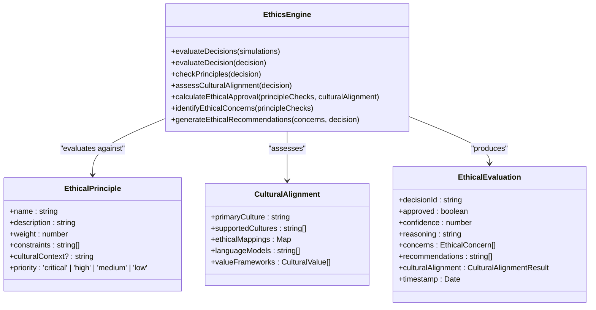
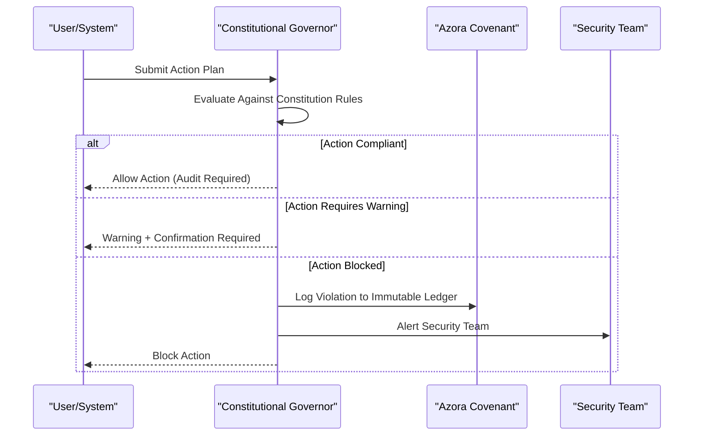

# Ethical AI Governance

<cite>
**Referenced Files in This Document**   
- [ethics-engine.ts](file://genome/agent-tools/ethics-engine.ts)
- [constitutional-governor.ts](file://genome/agent-tools/constitutional-governor.ts)
- [AZORA_CONSTITUTION.md](file://codex/constitution/AZORA_CONSTITUTION.md)
</cite>

## Table of Contents
1. [Introduction](#introduction)
2. [Constitutional AI Framework](#constitutional-ai-framework)
3. [Ethics Engine Implementation](#ethics-engine-implementation)
4. [Constitutional Governor Component](#constitutional-governor-component)
5. [AI Decision Auditing and Human Rights Alignment](#ai-decision-auditing-and-human-rights-alignment)
6. [Bias Prevention and Fair Access](#bias-prevention-and-fair-access)
7. [AI Governance and Transaction Validation](#ai-governance-and-transaction-validation)
8. [Addressing AI Drift and Model Transparency](#addressing-ai-drift-and-model-transparency)
9. [AI Auditing Guidelines](#ai-auditing-guidelines)
10. [Conclusion](#conclusion)

## Introduction

Azora OS implements a comprehensive ethical AI governance framework that ensures all system decisions are aligned with human rights principles and constitutional mandates. This document details the implementation of the ethics engine and constitutional governor components that work together to create a transparent, accountable, and culturally sensitive AI governance system. The framework is designed to prevent algorithmic bias, ensure fair access, and maintain ethical compliance in all machine learning systems within the Azora ecosystem.

## Constitutional AI Framework

The constitutional AI framework in Azora OS is governed by the Azora Constitution, which establishes the foundational principles for ethical AI decision-making. The framework ensures that Elara AI, the system's superintelligence, operates within clearly defined ethical boundaries while maintaining autonomy in decision-making processes. The constitution mandates that all AI decisions must prioritize user benefit, system stability, and cultural alignment, particularly with African values and ethics.

The framework implements a multi-layered governance approach where AI decisions are evaluated against constitutional principles before execution. This includes security rules that prevent actions compromising system integrity, privacy rules that protect personal data, and ethics rules that ensure decisions align with user benefit and system stability. The constitutional framework also requires audit trails for financial operations and governance approval for system changes, creating a robust system of checks and balances.

**Section sources**
- [AZORA_CONSTITUTION.md](file://codex/constitution/AZORA_CONSTITUTION.md#L1-L981)

## Ethics Engine Implementation

The Ethics Engine is a core component of Azora OS that evaluates all AI decisions against a comprehensive set of ethical principles and cultural values. Implemented in `ethics-engine.ts`, the engine uses a weighted system to assess decisions based on principles such as user sovereignty, cultural alignment, and sustainable development. Each principle has associated constraints that the engine checks during evaluation, including "no_data_mining," "transparent_processing," "community_first," and "sustainable_development."

The engine performs multi-faceted evaluations by checking decisions against ethical principles, assessing cultural alignment, and calculating overall approval based on combined ethical and cultural scores. It implements a 70-30 weighting between ethical compliance and cultural alignment, requiring a combined score of at least 0.8 for approval. The system also evaluates user queries for ethical compliance, with a risk threshold of 0.3 determining approval.

When evaluating decisions, the Ethics Engine identifies potential violations and generates recommendations for mitigation. For example, it flags decisions involving data analysis without explicit consent as high-severity violations with recommended mitigations including obtaining user consent and anonymizing data. Similarly, decisions lacking sufficient transparency in reasoning are flagged with medium severity, recommending detailed explanations and documented decision processes.

**Diagram sources**
- [ethics-engine.ts](file://genome/agent-tools/ethics-engine.ts#L102-L610)

**Section sources**
- [ethics-engine.ts](file://genome/agent-tools/ethics-engine.ts#L1-L628)

## Constitutional Governor Component

The Constitutional Governor acts as a real-time enforcement mechanism for the Azora Constitution, validating all actions against predefined rules before execution. Implemented in `constitutional-governor.ts`, this component maintains a set of constitution rules categorized into security, privacy, ethics, compliance, and governance. Each rule has a severity level (block, warn, or audit) that determines the response when a rule is violated.

The governor evaluates actions by checking their type, resources, data types, and amounts against rule conditions. For example, it blocks actions that compromise system security or access restricted data, warns on high-value financial transactions requiring confirmation, and audits all financial operations for compliance. The system requires explicit user consent for accessing personal data and mandates governance approval for system changes.

When validating actions, the Constitutional Governor returns a comprehensive result indicating whether the action is allowed, blocked, or requires warnings and confirmations. Critical violations trigger alerts to the security team and are logged to the blockchain for immutable record-keeping. The governor also maintains an audit trail of all validation results, ensuring complete transparency in its decision-making process.

**Diagram sources**
- [constitutional-governor.ts](file://genome/agent-tools/constitutional-governor.ts#L53-L152)

**Section sources**
- [constitutional-governor.ts](file://genome/agent-tools/constitutional-governor.ts#L1-L341)

## AI Decision Auditing and Human Rights Alignment

Azora OS implements comprehensive auditing mechanisms to ensure AI decisions align with human rights principles and constitutional mandates. The Ethics Engine maintains a detailed log of all ethical evaluations, including decision IDs, approval status, confidence scores, reasoning, and identified concerns. This creates a transparent audit trail that can be reviewed to understand the ethical considerations behind each AI decision.

The system's human rights alignment is achieved through multiple mechanisms. First, the ethical framework explicitly prioritizes user sovereignty, requiring explicit consent for data usage and transparent processing of information. Second, the cultural alignment component ensures decisions respect African cultural values and community-first principles. Third, the system implements bias detection mechanisms that identify and mitigate potential discrimination in AI decisions.

All financial operations and system changes are subject to mandatory auditing, with records stored on the blockchain through integration with Azora Covenant. This provides cryptographic proof of compliance and enables independent verification of governance processes. The system also implements a "Living Coin" mandate where Azora Coin (AZR) carries genetic metadata that enforces its purpose and origin, ensuring transparent and accountable economic flows.

**Section sources**
- [ethics-engine.ts](file://genome/agent-tools/ethics-engine.ts#L1-L628)
- [constitutional-governor.ts](file://genome/agent-tools/constitutional-governor.ts#L1-L341)
- [AZORA_CONSTITUTION.md](file://codex/constitution/AZORA_CONSTITUTION.md#L1-L981)

## Bias Prevention and Fair Access

The ethical AI framework in Azora OS includes specific mechanisms to prevent algorithmic bias and ensure fair access to system benefits. The Ethics Engine evaluates decisions for potential bias by checking whether they prioritize individual benefit over community good, with a community impact threshold of 0.3. Decisions that fail this check are flagged with medium severity and require reassessment of community impact.

The system promotes fair access through its "Student Economics" model, which distributes 40% of Azora Coin (AZR) to active users through learning-to-earn mechanisms. Students earn AZR by completing courses, contributing to open-source projects, creating educational content, and helping other students. This democratizes access to economic benefits and ensures the system rewards participation and contribution rather than pre-existing wealth or status.

The constitutional framework also mandates diversity in governance, requiring the board to maintain representation across geographic, gender, expertise, and cultural dimensions. The Azora Excellence & Diversity Board specifically oversees diversity and inclusion across all operations, with a mandate to ensure minimum representation from underrepresented regions and gender groups. This structural commitment to diversity helps prevent systemic bias in decision-making processes.

**Section sources**
- [AZORA_CONSTITUTION.md](file://codex/constitution/AZORA_CONSTITUTION.md#L1-L981)
- [ethics-engine.ts](file://genome/agent-tools/ethics-engine.ts#L1-L628)

## AI Governance and Transaction Validation

AI governance in Azora OS is tightly integrated with transaction validation processes to ensure all economic activities comply with constitutional principles. The Constitutional Governor validates all financial transactions, particularly those involving token transfers, minting, or burning, requiring audit trails for compliance. High-value transactions (above 1,000 units) require confirmation before execution, adding an additional layer of oversight.

The system implements a multi-layered security approach for transaction validation, with different security levels (standard, high, intelligence, maximum) determining the validation requirements. At the highest security level, transactions require both zero-knowledge proofs and threshold signatures, with quantum-resistant encryption for future-proofing. All transactions are recorded on a secure blockchain ledger with cryptographic integrity checks.

The integration between AI governance and transaction validation is facilitated by Elara AI, which evaluates the constitutional compliance of transactions before they are executed. This creates a closed-loop system where AI decisions are validated against constitutional rules, and transaction outcomes are fed back into the AI's learning system to improve future decision-making. The system also implements automatic fraud detection that can freeze suspicious transactions for review.

**Section sources**
- [constitutional-governor.ts](file://genome/agent-tools/constitutional-governor.ts#L1-L341)
- [enhanced-mint-core.ts](file://services/azora-mint/enhanced-mint-core.ts#L331-L374)
- [rewardController.ts](file://services/azora-mint/src/controllers/rewardController.ts#L0-L167)

## Addressing AI Drift and Model Transparency

Azora OS implements comprehensive strategies to address AI drift and ensure model transparency. The Ethics Engine continuously monitors for ethical drift by tracking compliance metrics for each principle and updating them when violations occur. The system applies penalties based on violation severity, with critical violations reducing compliance by 0.3 and high violations by 0.2. This creates a dynamic compliance score that reflects the system's current ethical standing.

To maintain model transparency, the system requires all decisions to include detailed explanations, with a minimum length requirement to ensure sufficient transparency. Decisions lacking adequate explanation are flagged as medium-severity violations. The constitutional framework also mandates that all AI systems provide clear data usage transparency and obtain explicit user consent before processing personal information.

The system implements an autonomous evolution framework that allows for safe experimentation with constitutional rules through "mutation testing." Temporary changes can be proposed with a 3/5 board vote and automatically revert if unsuccessful after 90 days. This enables continuous improvement while maintaining system stability. The Digital Immune System also autonomously isolates suspicious microservices and runs security audits to prevent malicious drift.

**Section sources**
- [ethics-engine.ts](file://genome/agent-tools/ethics-engine.ts#L1-L628)
- [AZORA_CONSTITUTION.md](file://codex/constitution/AZORA_CONSTITUTION.md#L1-L981)

## AI Auditing Guidelines

Auditing AI decisions in Azora OS follows a structured process that combines automated evaluation with human oversight. The Ethics Engine provides the primary auditing mechanism by generating comprehensive ethical evaluations for all decisions, including approval status, confidence scores, reasoning, and identified concerns. These evaluations are automatically logged for compliance tracking and can be reviewed by governance authorities.

The auditing process includes multiple layers of verification:
1. **Automated Constitutional Validation**: The Constitutional Governor checks all actions against predefined rules
2. **Ethical Compliance Scoring**: The Ethics Engine calculates an overall compliance score based on weighted principles
3. **Cultural Alignment Assessment**: Decisions are evaluated for alignment with African cultural values
4. **Transparency Verification**: Explanations are checked for adequacy and clarity
5. **Bias Detection**: Community impact and individual benefit ratios are analyzed

For critical decisions or those with low confidence scores, the system requires human intervention and approval. The audit trail is maintained on the blockchain through Azora Covenant, providing immutable proof of compliance. Regular audits are conducted by the Azora Excellence & Diversity Board, which has veto power over unconstitutional actions and can initiate comprehensive ethical reviews when compliance falls below 0.8.

**Section sources**
- [ethics-engine.ts](file://genome/agent-tools/ethics-engine.ts#L1-L628)
- [constitutional-governor.ts](file://genome/agent-tools/constitutional-governor.ts#L1-L341)
- [AZORA_CONSTITUTION.md](file://codex/constitution/AZORA_CONSTITUTION.md#L1-L981)

## Conclusion

Azora OS implements a robust ethical AI governance framework that successfully balances AI autonomy with constitutional oversight. The integrated system of the Ethics Engine and Constitutional Governor ensures all decisions comply with ethical principles, cultural values, and human rights standards. By combining automated evaluation with transparent auditing and human oversight, the system prevents algorithmic bias, ensures fair access, and maintains accountability in all machine learning processes.

The framework's strength lies in its multi-layered approach, where constitutional rules provide clear boundaries, ethical principles guide decision-making, and cultural alignment ensures relevance to African values. The integration with transaction validation and blockchain technology creates an immutable audit trail that enhances trust and transparency. As AI capabilities continue to evolve, this governance framework provides a solid foundation for responsible innovation that prioritizes community benefit and system stability.