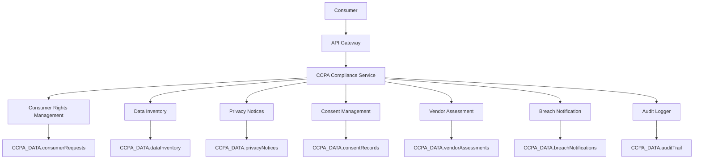
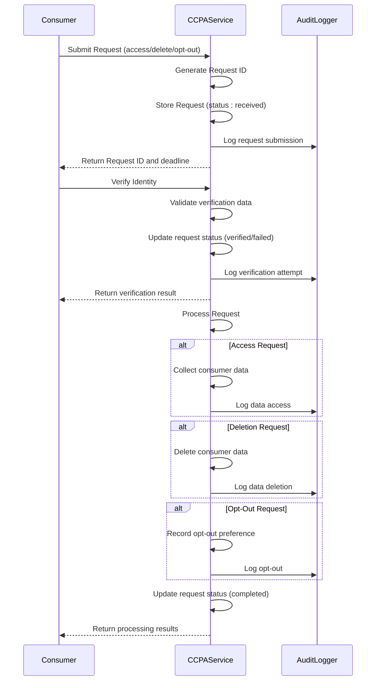
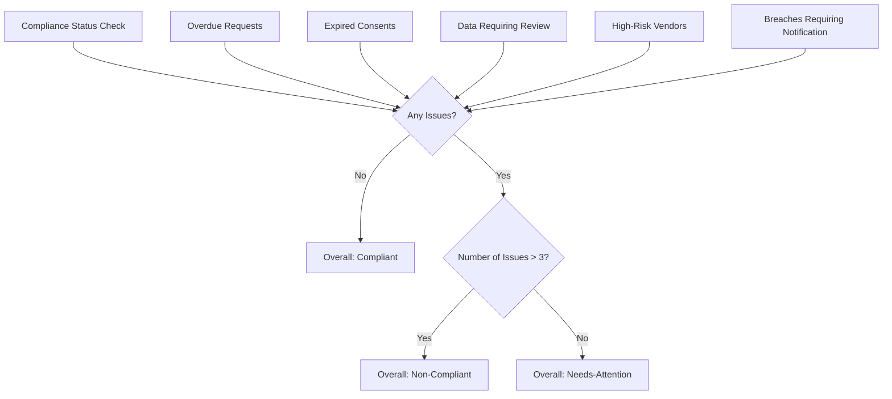

# CCPA Compliance

<cite>
**Referenced Files in This Document**   
- [index.js](file://organs/ccpa-compliance/index.js)
- [ccpa-compliance-test.js](file://tests/integration/ccpa-compliance-test.js)
- [docker-compose.compliance.yml](file://vessels/docker-compose.compliance.yml)
</cite>

## Table of Contents
1. [Introduction](#introduction)
2. [Architecture Overview](#architecture-overview)
3. [Consumer Rights Management](#consumer-rights-management)
4. [Data Inventory and Mapping](#data-inventory-and-mapping)
5. [Privacy Notices and Consent Management](#privacy-notices-and-consent-management)
6. [Vendor Risk Assessment](#vendor-risk-assessment)
7. [Breach Notification](#breach-notification)
8. [Compliance Dashboard and Monitoring](#compliance-dashboard-and-monitoring)
9. [Configuration and Reporting](#configuration-and-reporting)
10. [Challenges and Best Practices](#challenges-and-best-practices)

## Introduction
The CCPA Compliance module in Azora OS provides comprehensive implementation of the California Consumer Privacy Act requirements. This system enables consumers to exercise their rights to know, delete, and opt-out of the sale of personal information. The service is designed as a standalone microservice that integrates with data tracking systems across the organization. It provides automated workflows for handling consumer requests, maintaining data inventories, managing privacy notices, and ensuring compliance with regulatory requirements. The implementation includes robust audit logging, vendor risk assessment, and breach notification capabilities to meet all CCPA obligations.

**Section sources**
- [index.js](file://organs/ccpa-compliance/index.js#L1-L50)

## Architecture Overview
The CCPA Compliance service is implemented as an Express.js application running on port 4083. It follows a modular architecture with distinct classes handling different compliance aspects. The system maintains in-memory data structures using Maps and arrays to store consumer requests, data inventory, privacy notices, consent records, vendor assessments, and audit trails. The service exposes RESTful endpoints for submitting and processing consumer rights requests, managing data inventory, publishing privacy notices, recording consent, assessing vendor risk, and reporting breaches. The architecture is designed to be extensible, with clear separation of concerns between different compliance domains.

**Diagram sources**
- [index.js](file://organs/ccpa-compliance/index.js#L43-L58)
- [docker-compose.compliance.yml](file://vessels/docker-compose.compliance.yml#L100-L106)

## Consumer Rights Management
The system implements the three primary consumer rights under CCPA: right to know (access), right to delete, and right to opt-out of sale. Consumer rights requests are managed through the ConsumerRights class, which handles submission, verification, and processing of requests. Each request is assigned a unique ID and tracked through its lifecycle with statuses including received, verified, and completed. The system enforces a 45-day deadline for completing requests as required by CCPA regulations. Requests are verified using consumer-provided information such as email or phone number before processing.

**Diagram sources**
- [index.js](file://organs/ccpa-compliance/index.js#L59-L253)
- [ccpa-compliance-test.js](file://tests/integration/ccpa-compliance-test.js#L101-L128)

**Section sources**
- [index.js](file://organs/ccpa-compliance/index.js#L59-L253)
- [ccpa-compliance-test.js](file://tests/integration/ccpa-compliance-test.js#L101-L128)

## Data Inventory and Mapping
The DataInventory class maintains a comprehensive inventory of personal information collected, used, and shared by the organization. Each data collection activity is documented with details including data category, elements, collection method, purpose, retention period, legal basis, data sources, recipients, and security measures. The system tracks data mappings to understand how personal information flows through the organization. Data inventory items are reviewed annually, with the system identifying those requiring review based on the last review date. This comprehensive data mapping enables the organization to respond accurately to consumer access requests and understand their data processing activities.

**Section sources**
- [index.js](file://organs/ccpa-compliance/index.js#L259-L316)

## Privacy Notices and Consent Management
The PrivacyNotices class manages privacy policies and other notices required under CCPA. Notices are created in draft status and published when finalized, with the system tracking the publication date and effective date. The ConsentManagement class handles recording and tracking consumer consent for data collection and sharing. Consent records include details such as consumer ID, consent type, scope, grant date, expiration date, method, context, and metadata. Consumers can withdraw consent at any time, which is recorded with the reason for withdrawal. The system tracks active consents and identifies expired consents that may require renewal.

**Section sources**
- [index.js](file://organs/ccpa-compliance/index.js#L322-L371)
- [index.js](file://organs/ccpa-compliance/index.js#L377-L430)

## Vendor Risk Assessment
The VendorAssessment class evaluates third-party vendors that process personal information on behalf of the organization. Vendor assessments consider factors such as data sensitivity, processing location, security posture, and compliance status to calculate a risk level (high, medium, or low). The risk assessment algorithm assigns points based on these factors, with higher scores indicating greater risk. High-risk vendors are flagged for additional scrutiny and monitoring. Vendor assessments are reviewed annually, with the system identifying those requiring review based on the next review date. This vendor risk management process helps ensure that third parties comply with CCPA requirements when handling consumer data.

**Section sources**
- [index.js](file://organs/ccpa-compliance/index.js#L436-L498)

## Breach Notification
The BreachNotification class manages the reporting of data breaches involving personal information. When a breach is recorded, the system captures details such as breach type, affected consumers, compromised data, dates, and notification methods. The system tracks whether notifications to consumers and regulators have been completed. Breaches requiring notification are identified based on whether consumer and regulatory notifications have been sent. The system supports the CCPA requirement to notify affected consumers and the Attorney General within specific timeframes following discovery of a breach.

**Section sources**
- [index.js](file://organs/ccpa-compliance/index.js#L504-L542)

## Compliance Dashboard and Monitoring
The CCPA Compliance service provides a comprehensive dashboard at the /ccpa/dashboard endpoint that displays key compliance metrics. The dashboard shows the total number of requests, pending and overdue requests, active consents, data inventory items, vendor assessments, high-risk vendors, and recent breaches. It also displays recent activity from the audit trail and the overall compliance status. The compliance status is automatically calculated based on identified issues such as overdue requests, expired consents, data inventory requiring review, high-risk vendors, and breaches requiring notification. The system maintains a complete audit trail of all compliance-related actions, which can be queried by entity ID, start date, and end date.

**Diagram sources**
- [index.js](file://organs/ccpa-compliance/index.js#L821-L858)
- [index.js](file://organs/ccpa-compliance/index.js#L858-L894)

**Section sources**
- [index.js](file://organs/ccpa-compliance/index.js#L821-L894)

## Configuration and Reporting
The CCPA Compliance service is configured through environment variables and built-in defaults. The service runs on port 4083 by default, as specified in the docker-compose.compliance.yml file. The system automatically calculates deadlines for consumer requests (45 days) and vendor assessment reviews (1 year). Reporting is facilitated through the compliance dashboard and audit trail endpoints, which provide comprehensive visibility into compliance activities. The system generates compliance reports that can be used for internal monitoring and regulatory submissions. Audit logs capture all significant actions with timestamps, enabling reconstruction of events for investigations or audits.

**Section sources**
- [index.js](file://organs/ccpa-compliance/index.js#L895-L926)
- [docker-compose.compliance.yml](file://vessels/docker-compose.compliance.yml#L100-L106)

## Challenges and Best Practices
Implementing CCPA compliance presents several challenges, including verifying consumer identities, handling authorized agents, and managing data across distributed systems. The current implementation uses a simple verification method based on email or phone matching, but production systems should implement more robust multi-factor authentication. For authorized agents, additional verification steps should be implemented to confirm their authority to act on behalf of consumers. The mock data access and deletion methods should be replaced with actual integrations to all data stores where consumer information is maintained. Best practices include conducting regular data mapping exercises, implementing automated monitoring for compliance deadlines, maintaining comprehensive documentation of processing activities, and providing employee training on CCPA requirements.

**Section sources**
- [index.js](file://organs/ccpa-compliance/index.js#L171-L227)
- [index.js](file://organs/ccpa-compliance/index.js#L229-L257)