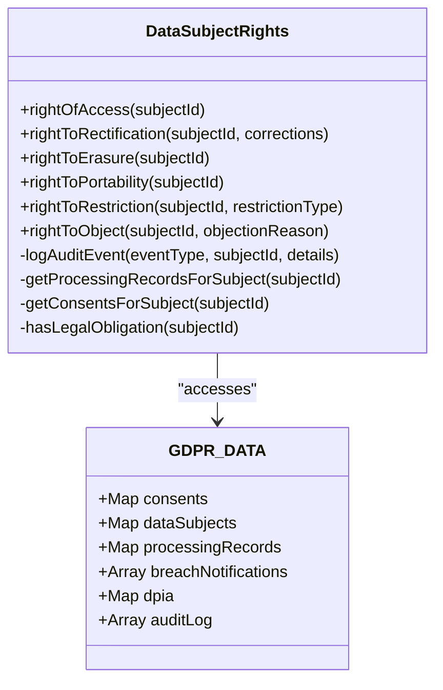
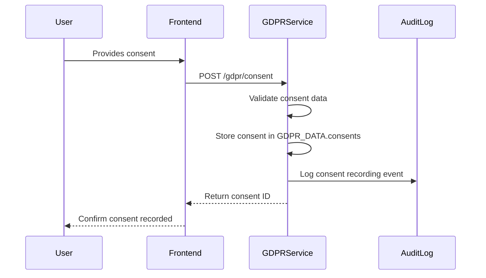
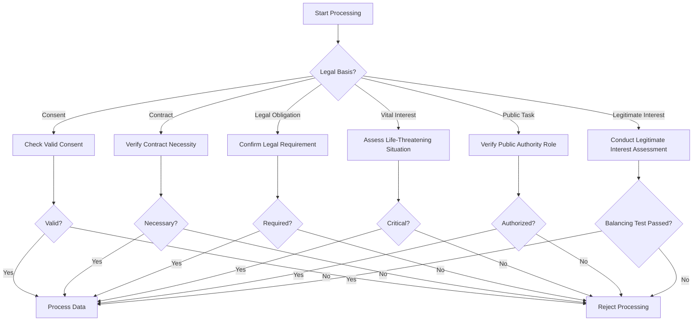
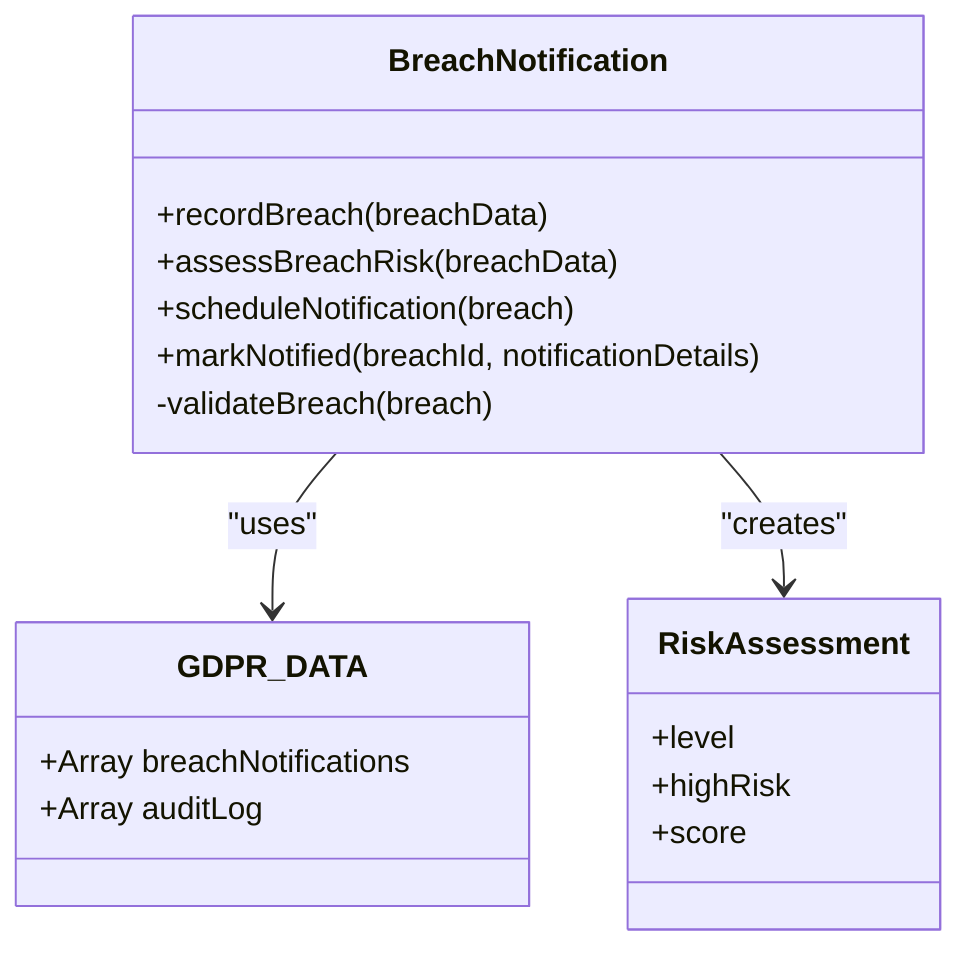
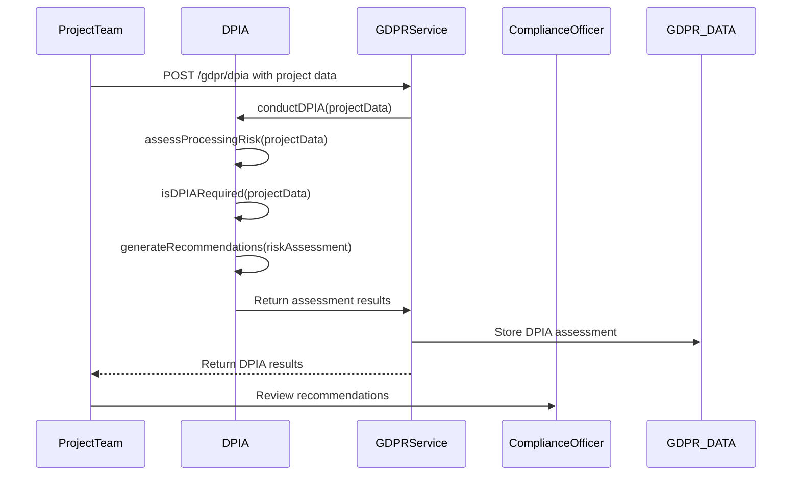
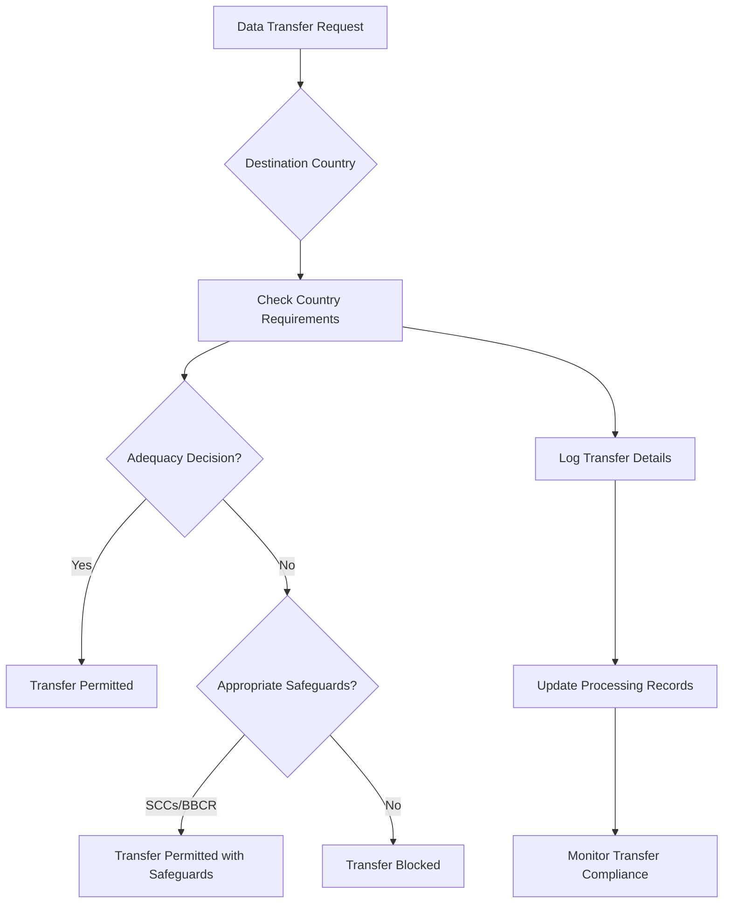
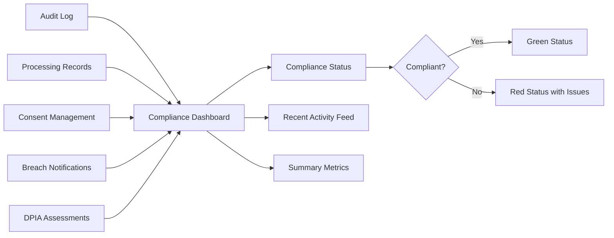

# GDPR Compliance

<cite>
**Referenced Files in This Document**   
- [index.js](file://organs/gdpr-compliance/index.js)
- [docker-compose.compliance.yml](file://vessels/docker-compose.compliance.yml)
- [global-compliance.js](file://organs/compliance-service/global-compliance.js)
- [country-db.js](file://organs/compliance-service/country-db.js)
</cite>

## Table of Contents
1. [Introduction](#introduction)
2. [Data Subject Rights Implementation](#data-subject-rights-implementation)
3. [Consent Management](#consent-management)
4. [Lawful Processing and Data Minimization](#lawful-processing-and-data-minimization)
5. [Breach Notification System](#breach-notification-system)
6. [Data Protection Impact Assessment (DPIA)](#data-protection-impact-assessment-dpia)
7. [Records of Processing Activities](#records-of-processing-activities)
8. [International Data Transfers and Legitimate Interest](#international-data-transfers-and-legitimate-interest)
9. [Compliance Monitoring and Dashboard](#compliance-monitoring-and-dashboard)
10. [Configuration Guidelines](#configuration-guidelines)

## Introduction
The GDPR Compliance service in Azora OS provides a comprehensive implementation of General Data Protection Regulation requirements. The system is designed to ensure compliance with key GDPR principles including data subject rights, lawful processing, data minimization, and breach notification. The service operates as a dedicated microservice running on port 4080, exposing RESTful endpoints for various compliance operations. It maintains in-memory data structures for consents, data subjects, processing records, breach notifications, DPIA assessments, and audit logs. The implementation follows a modular architecture with distinct classes handling different aspects of GDPR compliance, ensuring separation of concerns and maintainability.

**Section sources**
- [index.js](file://organs/gdpr-compliance/index.js#L0-L47)

## Data Subject Rights Implementation
The GDPR Compliance service implements all data subject rights as specified in Articles 15-21 of the GDPR. The DataSubjectRights class provides methods for handling the right of access, rectification, erasure, restriction of processing, objection, and data portability. When a data subject exercises their right of access, the system returns their personal data along with associated processing records and consents. For rectification requests, the system updates the subject's data and logs the modification. The right to erasure is implemented with checks for legal obligations that might prevent deletion. The system also supports the right to data portability by providing data in a structured JSON format. All data subject requests are logged in the audit trail for accountability and compliance verification.

**Diagram sources**
- [index.js](file://organs/gdpr-compliance/index.js#L49-L182)

**Section sources**
- [index.js](file://organs/gdpr-compliance/index.js#L49-L182)

## Consent Management
The GDPR Compliance service implements a robust consent management system that tracks user consent for data processing activities. The ConsentManager class handles recording, validating, and withdrawing consent. When a user provides consent, the system stores the consent details including the subject ID, purposes, legal basis, and expiry date. The system validates consent requirements before storing them. Users can withdraw their consent at any time, which invalidates the consent record and triggers appropriate data processing restrictions. The system also provides functionality to check if valid consent exists for a specific purpose, enabling lawful processing decisions. All consent activities are logged in the audit trail for compliance monitoring.

**Diagram sources**
- [index.js](file://organs/gdpr-compliance/index.js#L274-L329)
- [index.js](file://organs/gdpr-compliance/index.js#L732-L773)

**Section sources**
- [index.js](file://organs/gdpr-compliance/index.js#L274-L329)
- [index.js](file://organs/gdpr-compliance/index.js#L732-L773)

## Lawful Processing and Data Minimization
The system ensures lawful processing through multiple mechanisms, including consent management, legal basis validation, and data minimization principles. Processing records are maintained in accordance with Article 30 requirements, documenting the controller, purposes, data categories, legal basis, recipients, and retention periods. The system validates that all required fields are present in processing records before storing them. Data minimization is enforced by only collecting and processing data that is necessary for the specified purposes. The system also implements automated deletion workflows based on retention periods, ensuring data is not kept longer than necessary. These processing records can be retrieved for specific controllers or data subjects, facilitating compliance audits.

**Diagram sources**
- [index.js](file://organs/gdpr-compliance/index.js#L374-L426)

**Section sources**
- [index.js](file://organs/gdpr-compliance/index.js#L374-L426)

## Breach Notification System
The GDPR Compliance service includes a comprehensive breach notification system that automatically assesses the risk level of security breaches and determines notification requirements. The BreachNotification class handles recording breaches, assessing their risk, and scheduling notifications. When a breach is reported, the system evaluates factors such as sensitive data exposure, number of affected subjects, and encryption status to determine the risk level. High-risk breaches trigger a notification requirement within 72 hours as mandated by Article 33. The system logs all breach details and maintains a history of breach notifications. The implementation includes validation of required breach fields and provides functionality to mark breaches as notified once regulatory and individual notifications have been sent.

**Diagram sources**
- [index.js](file://organs/gdpr-compliance/index.js#L477-L522)
- [index.js](file://organs/gdpr-compliance/index.js#L818-L860)

**Section sources**
- [index.js](file://organs/gdpr-compliance/index.js#L477-L522)
- [index.js](file://organs/gdpr-compliance/index.js#L818-L860)

## Data Protection Impact Assessment (DPIA)
The system implements Data Protection Impact Assessments (DPIA) as required by Article 35 for high-risk processing activities. The DPIA class conducts assessments by evaluating risk factors such as large-scale processing, systematic monitoring, sensitive data processing, and innovative technologies. The assessment generates a risk score and determines if a DPIA is required based on whether the risk level is high. For high-risk processing, the system generates specific recommendations including encryption implementation, security audits, data minimization, and automated deletion mechanisms. Completed DPIAs are stored with their risk assessments and recommendations, and can be retrieved for compliance audits. The system also tracks DPIAs that require review based on their next review date.

**Diagram sources**
- [index.js](file://organs/gdpr-compliance/index.js#L524-L653)

**Section sources**
- [index.js](file://organs/gdpr-compliance/index.js#L524-L653)

## Records of Processing Activities
The GDPR Compliance service maintains comprehensive records of processing activities as required by Article 30. The ProcessingRecords class manages the creation, updating, and retrieval of processing records. Each record includes essential information such as the controller name and contact details, processing purposes, categories of data and data subjects, legal basis, recipient categories, and retention periods. The system validates that all required fields are present before storing a processing record. Records can be retrieved for specific controllers or data subjects, enabling compliance audits and data mapping. The implementation ensures that processing records are complete and accurate, serving as a critical component of the organization's accountability framework.

**Section sources**
- [index.js](file://organs/gdpr-compliance/index.js#L374-L426)

## International Data Transfers and Legitimate Interest
The system addresses international data transfers through integration with the Global Compliance Engine and Country Compliance Database. The global-compliance.js service provides functionality to check compliance requirements for specific countries and operations, including data transfer regulations. The country-db.js maintains detailed compliance requirements for UN member countries, including data protection laws, enforcing bodies, and special requirements. For legitimate interest assessments, the system evaluates whether processing is necessary for legitimate purposes while balancing the interests against data subjects' rights and freedoms. The implementation supports various transfer mechanisms including adequacy decisions, standard contractual clauses, and binding corporate rules, ensuring compliance with Chapter V requirements for international data transfers.

**Diagram sources**
- [global-compliance.js](file://organs/compliance-service/global-compliance.js#L180-L237)
- [country-db.js](file://organs/compliance-service/country-db.js#L219-L243)

**Section sources**
- [global-compliance.js](file://organs/compliance-service/global-compliance.js#L180-L237)
- [country-db.js](file://organs/compliance-service/country-db.js#L219-L243)

## Compliance Monitoring and Dashboard
The GDPR Compliance service includes comprehensive monitoring capabilities through its dashboard endpoint. The system provides a compliance dashboard that displays key metrics including the total number of data subjects, consents, processing records, and breaches. The dashboard also shows recent compliance activities and the current compliance status. The getComplianceStatus function evaluates the overall compliance posture by checking for unnotified high-risk breaches and expired consents still marked as valid. The system maintains an audit log of all compliance-related events, which can be filtered by subject ID or event type. The service is integrated with the automated compliance reporting system through docker-compose.compliance.yml, enabling centralized monitoring and reporting across multiple compliance frameworks.

**Diagram sources**
- [index.js](file://organs/gdpr-compliance/index.js#L856-L894)
- [docker-compose.compliance.yml](file://vessels/docker-compose.compliance.yml#L31-L75)

**Section sources**
- [index.js](file://organs/gdpr-compliance/index.js#L856-L894)
- [docker-compose.compliance.yml](file://vessels/docker-compose.compliance.yml#L31-L75)

## Configuration Guidelines
The GDPR Compliance service is configured through environment variables, with GDPR_PORT as the primary configuration option that determines the service's listening port (default: 4080). The service should be deployed as part of the compliance ecosystem defined in docker-compose.compliance.yml, where it is assigned port 4080 and depends on other compliance services. For optimal performance and security, the service should be configured with appropriate rate limiting, CORS policies, and helmet.js security headers as implemented in the code. The system relies on in-memory data structures, so for production deployments, consideration should be given to integrating with persistent storage solutions. Regular monitoring of the compliance dashboard and audit logs is recommended to ensure ongoing compliance. The service should be tested thoroughly using the integration tests to verify all GDPR requirements are properly implemented.

**Section sources**
- [index.js](file://organs/gdpr-compliance/index.js#L0-L47)
- [docker-compose.compliance.yml](file://vessels/docker-compose.compliance.yml#L31-L75)