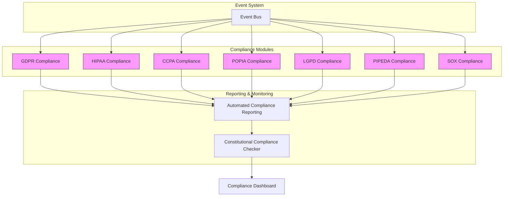
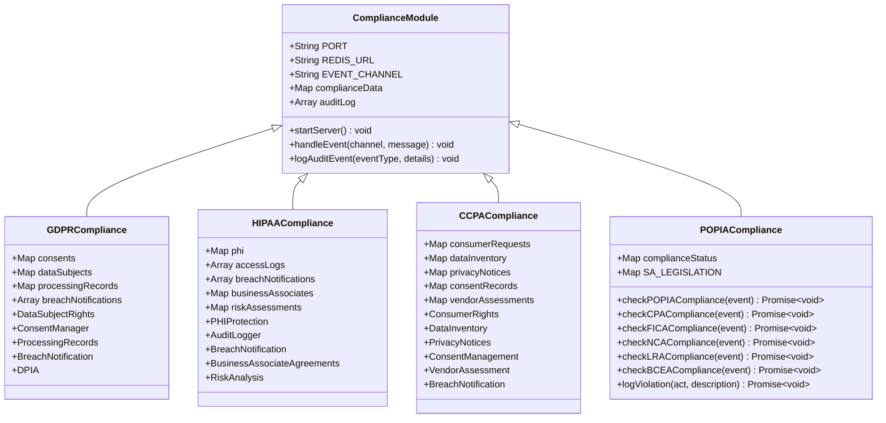
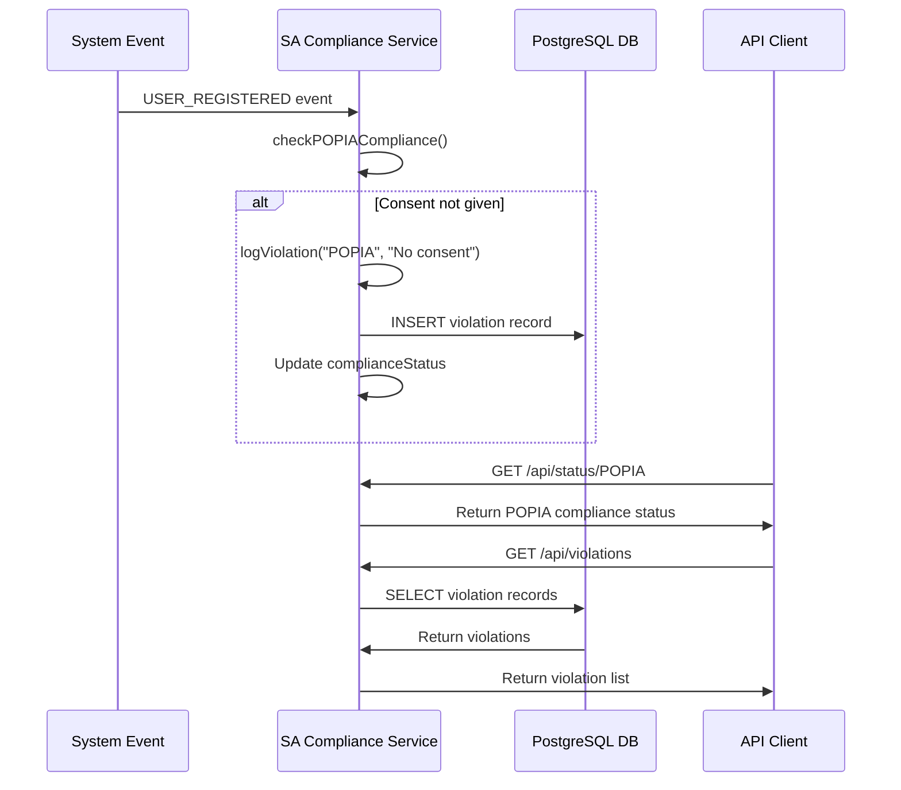
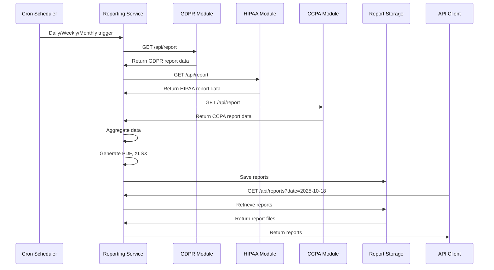
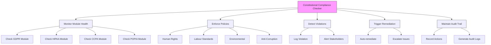

# Regulatory Compliance

<cite>
**Referenced Files in This Document**   
- [south-african-compliance/index.js](file://organs/south-african-compliance/index.js)
- [gdpr-compliance/index.js](file://organs/gdpr-compliance/index.js)
- [hipaa-compliance/index.js](file://organs/hipaa-compliance/index.js)
- [ccpa-compliance/index.js](file://organs/ccpa-compliance/index.js)
- [pipeda-compliance/index.js](file://organs/pipeda-compliance/index.js)
- [lgpd-compliance/index.js](file://organs/lgpd-compliance/index.js)
- [sox-compliance/index.js](file://organs/sox-compliance/index.js)
- [un-global-compact-compliance/index.js](file://organs/un-global-compact-compliance/index.js)
- [automated-compliance-reporting/index.js](file://organs/automated-compliance-reporting/index.js)
- [infrastructure/constitutional-compliance-checker.js](file://infrastructure/constitutional-compliance-checker.js)
</cite>

## Table of Contents
1. [Introduction](#introduction)
2. [Automated Compliance Engine Architecture](#automated-compliance-engine-architecture)
3. [Jurisdiction-Specific Compliance Modules](#jurisdiction-specific-compliance-modules)
4. [South African Compliance Implementation](#south-african-compliance-implementation)
5. [GDPR Implementation](#gdpr-implementation)
6. [Compliance Reporting System](#compliance-reporting-system)
7. [Constitutional Compliance Checker](#constitutional-compliance-checker)
8. [Common Compliance Challenges](#common-compliance-challenges)
9. [Configuring Compliance Rules for New Jurisdictions](#configuring-compliance-rules-for-new-jurisdictions)
10. [Conclusion](#conclusion)

## Introduction

Azora OS implements a comprehensive regulatory compliance framework through automated compliance engines that ensure adherence to major global regulations including GDPR, CCPA, HIPAA, POPIA, and other regional requirements. The system architecture is designed to make compliance "invisible" to operators while maintaining full auditability. Compliance is enforced through jurisdiction-specific modules that integrate with transaction processing and are monitored by a constitutional compliance checker. This document details the architecture, implementation, and operational aspects of the compliance system, with specific examples from South African and GDPR implementations.

## Automated Compliance Engine Architecture

The Azora OS compliance system is built on a modular microservices architecture where each regulation has its dedicated compliance engine. These engines operate as independent services that subscribe to system events and perform real-time compliance checks. The architecture follows an event-driven pattern where compliance services listen to the `azora:events` Redis channel and respond to relevant events such as user registration, transaction processing, and data access requests.

The core components of the compliance architecture include:
- Jurisdiction-specific compliance modules (GDPR, HIPAA, CCPA, etc.)
- Automated compliance reporting service
- Constitutional compliance checker
- Event-driven monitoring system
- Centralized audit logging

Each compliance module implements the specific requirements of its regulation while sharing common patterns for data structures, API endpoints, and audit logging. The modules are designed to be stateless and horizontally scalable, allowing them to handle high volumes of compliance checks without impacting system performance.



**Diagram sources**
- [organs/gdpr-compliance/index.js](file://organs/gdpr-compliance/index.js)
- [organs/hipaa-compliance/index.js](file://organs/hipaa-compliance/index.js)
- [organs/ccpa-compliance/index.js](file://organs/ccpa-compliance/index.js)
- [organs/south-african-compliance/index.js](file://organs/south-african-compliance/index.js)
- [organs/lgpd-compliance/index.js](file://organs/lgpd-compliance/index.js)
- [organs/pipeda-compliance/index.js](file://organs/pipeda-compliance/index.js)
- [organs/sox-compliance/index.js](file://organs/sox-compliance/index.js)
- [organs/automated-compliance-reporting/index.js](file://organs/automated-compliance-reporting/index.js)
- [infrastructure/constitutional-compliance-checker.js](file://infrastructure/constitutional-compliance-checker.js)

**Section sources**
- [organs/gdpr-compliance/index.js](file://organs/gdpr-compliance/index.js)
- [organs/hipaa-compliance/index.js](file://organs/hipaa-compliance/index.js)
- [organs/ccpa-compliance/index.js](file://organs/ccpa-compliance/index.js)
- [organs/south-african-compliance/index.js](file://organs/south-african-compliance/index.js)

## Jurisdiction-Specific Compliance Modules

Azora OS implements jurisdiction-specific compliance modules as independent microservices, each dedicated to a specific regulation. These modules follow a consistent design pattern while implementing the unique requirements of their respective regulations. The modules are implemented as Express.js applications with standardized API endpoints for health checks, status reporting, and compliance operations.

Each compliance module contains the following key components:
- Regulation-specific data structures and constants
- Business logic for compliance checks and enforcement
- API endpoints for compliance operations
- Audit logging and event handling
- Health checks and monitoring endpoints

The modules are designed to be event-driven, subscribing to the central event bus and responding to relevant system events. For example, when a user registers, the system emits a `USER_REGISTERED` event that is processed by all relevant compliance modules. Each module then performs its specific compliance checks and logs any violations.

The compliance modules are configured through environment variables that specify their operational parameters such as port numbers, database connections, and Redis URLs. This allows for flexible deployment and configuration across different environments.



**Diagram sources**
- [organs/gdpr-compliance/index.js](file://organs/gdpr-compliance/index.js)
- [organs/hipaa-compliance/index.js](file://organs/hipaa-compliance/index.js)
- [organs/ccpa-compliance/index.js](file://organs/ccpa-compliance/index.js)
- [organs/south-african-compliance/index.js](file://organs/south-african-compliance/index.js)

**Section sources**
- [organs/gdpr-compliance/index.js](file://organs/gdpr-compliance/index.js)
- [organs/hipaa-compliance/index.js](file://organs/hipaa-compliance/index.js)
- [organs/ccpa-compliance/index.js](file://organs/ccpa-compliance/index.js)
- [organs/south-african-compliance/index.js](file://organs/south-african-compliance/index.js)

## South African Compliance Implementation

The South African compliance module implements adherence to multiple South African regulations including POPIA (Protection of Personal Information Act), ECT (Electronic Communications and Transactions Act), CPA (Consumer Protection Act), NCA (National Credit Act), FICA (Financial Intelligence Centre Act), LRA (Labour Relations Act), and BCEA (Basic Conditions of Employment Act). The module is implemented as an Express.js service that listens for system events and performs real-time compliance checks.

The implementation uses a comprehensive data structure that defines the key regulations and their requirements:

```javascript
const SA_LEGISLATION = {
    POPIA: { name: "Protection of Personal Information Act", regulations: ["Data privacy", "Consent", "Data breach notifications"], penalties: "Fines up to R10 million or 10 years imprisonment." },
    ECT: { name: "Electronic Communications and Transactions Act", regulations: ["Electronic signatures", "Consumer protection online", "Cryptography"], penalties: "Varies by offense." },
    CPA: { name: "Consumer Protection Act", regulations: ["Right to fair value", "Right to privacy", "Right to choose"], penalties: "Fines up to 10% of annual turnover." },
    NCA: { name: "National Credit Act", regulations: ["Credit agreements", "Interest rates", "Debt counseling"], penalties: "Fines and imprisonment." },
    FICA: { name: "Financial Intelligence Centre Act", regulations: ["Know Your Customer (KYC)", "Reporting suspicious transactions"], penalties: "Severe fines and imprisonment." },
    LRA: { name: "Labour Relations Act", regulations: ["Unfair dismissal", "Collective bargaining", "Strikes and lock-outs"], penalties: "Compensation and reinstatement." },
    BCEA: { name: "Basic Conditions of Employment Act", regulations: ["Working hours", "Leave", "Termination"], penalties: "Fines and imprisonment." },
};
```

The module listens for specific system events and performs targeted compliance checks:
- `USER_REGISTERED` and `NMU_STUDENT_REGISTERED` events trigger POPIA compliance checks for consent
- `BOUNTY_CREATED` events trigger CPA compliance checks for fair value
- `TRANSACTION_PROCESSED` events trigger FICA compliance checks for KYC verification
- Placeholder functions exist for NCA, LRA, and BCEA compliance checks

When a violation is detected, the module logs it to both the in-memory status object and the PostgreSQL database through the database.js module. The API provides endpoints to check the compliance status of specific regulations, retrieve violation logs, and generate compliance reports.



**Diagram sources**
- [organs/south-african-compliance/index.js](file://organs/south-african-compliance/index.js)

**Section sources**
- [organs/south-african-compliance/index.js](file://organs/south-african-compliance/index.js)

## GDPR Implementation

The GDPR compliance module implements comprehensive General Data Protection Regulation compliance with support for all key data subject rights and compliance requirements. The module is implemented as an Express.js service with a modular architecture that separates concerns into distinct classes for data subject rights, consent management, processing records, breach notification, and data protection impact assessment.

The implementation includes support for the following GDPR requirements:

### Data Subject Rights
The module implements all six data subject rights under GDPR:
- **Right of Access (Article 15)**: Data subjects can obtain confirmation and a copy of their personal data
- **Right to Rectification (Article 16)**: Data subjects can have inaccurate data corrected
- **Right to Erasure (Article 17)**: Data subjects can request deletion of their data
- **Right to Restriction (Article 18)**: Data subjects can restrict processing of their data
- **Right to Data Portability (Article 20)**: Data subjects can receive their data in a structured format
- **Right to Object (Article 21)**: Data subjects can object to processing

### Consent Management
The consent management system ensures that all data processing has a valid legal basis and that consent is properly recorded and can be withdrawn. The system validates that consent meets GDPR requirements including:
- Explicit consent is given
- Purpose of processing is specified
- Legal basis for processing is valid
- Consent can be withdrawn at any time

### Data Processing Records (Article 30)
The module maintains a record of all data processing activities including:
- Controller and processor information
- Purposes of processing
- Categories of data and data subjects
- Legal basis for processing
- Retention periods
- Security measures

### Breach Notification (Articles 33-34)
The breach notification system automatically assesses the risk level of data breaches and schedules notifications when required. High-risk breaches must be reported to supervisory authorities within 72 hours and to affected data subjects without undue delay.

### Data Protection Impact Assessment (Article 35)
The DPIA system conducts impact assessments for high-risk processing activities and generates recommendations for risk mitigation.

```mermaid
flowchart TD
A[GDPR Compliance Service] --> B[Data Subject Rights]
A --> C[Consent Management]
A --> D[Processing Records]
A --> E[Breach Notification]
A --> F[DPIA]
B --> B1[Right of Access]
B --> B2[Right to Rectification]
B --> B3[Right to Erasure]
B --> B4[Right to Restriction]
B --> B5[Right to Portability]
B --> B6[Right to Object]
C --> C1[Record Consent]
C --> C2[Withdraw Consent]
C --> C3[Validate Consent]
D --> D1[Record Processing]
D --> D2[Update Processing]
D --> D3[Get Records]
E --> E1[Record Breach]
E --> E2[Assess Risk]
E --> E3[Schedule Notification]
E --> E4[Mark Notified]
F --> F1[Conduct DPIA]
F --> F2[Assess Risk]
F --> F3[Generate Recommendations]
style A fill:#f9f,stroke:#333
style B fill:#eef,stroke:#333
style C fill:#eef,stroke:#333
style D fill:#eef,stroke:#333
style E fill:#eef,stroke:#333
style F fill:#eef,stroke:#333
```



**Diagram sources**
- [organs/gdpr-compliance/index.js](file://organs/gdpr-compliance/index.js)

**Section sources**
- [organs/gdpr-compliance/index.js](file://organs/gdpr-compliance/index.js)

## Compliance Reporting System

The automated compliance reporting system generates comprehensive compliance reports that aggregate data from all jurisdiction-specific compliance modules. The system is implemented as a dedicated microservice that collects compliance data, generates reports in multiple formats, and provides API endpoints for report retrieval and audit.

The reporting system architecture includes the following components:
- Report generation engine
- Data aggregation from compliance modules
- Multiple output formats (JSON, PDF, XLSX)
- Scheduled reporting
- On-demand reporting API
- Report archiving and retention

The system uses several key dependencies for report generation:
- **pdfkit**: For generating PDF reports
- **xlsx**: For generating Excel spreadsheets
- **archiver**: For creating ZIP archives of multiple reports
- **node-cron**: For scheduled report generation
- **express-rate-limit**: For protecting report endpoints from abuse

Reports include comprehensive information such as:
- Compliance status across all regulations
- Violation summaries and details
- Audit trail entries
- Data subject rights requests and responses
- Consent records and withdrawals
- Breach notifications and responses
- Processing activity records

The system supports both scheduled and on-demand reporting. Scheduled reports are generated daily, weekly, and monthly according to organizational requirements, while on-demand reports can be requested through the API for specific time periods or compliance areas.



**Diagram sources**
- [organs/automated-compliance-reporting/index.js](file://organs/automated-compliance-reporting/index.js)
- [organs/gdpr-compliance/index.js](file://organs/gdpr-compliance/index.js)
- [organs/hipaa-compliance/index.js](file://organs/hipaa-compliance/index.js)
- [organs/ccpa-compliance/index.js](file://organs/ccpa-compliance/index.js)

**Section sources**
- [organs/automated-compliance-reporting/index.js](file://organs/automated-compliance-reporting/index.js)

## Constitutional Compliance Checker

The constitutional compliance checker is a central component that monitors all compliance modules and ensures adherence to the Azora Constitution and regulatory policies. The checker operates as a continuous monitoring service that validates the operation of all compliance modules and enforces constitutional principles.

The checker performs several key functions:
- **Module Health Monitoring**: Regularly checks the health and status of all compliance modules
- **Policy Enforcement**: Ensures that all compliance modules adhere to constitutional principles
- **Violation Detection**: Identifies and logs constitutional violations
- **Automated Remediation**: Triggers automated responses to critical violations
- **Audit Trail Maintenance**: Maintains a comprehensive audit trail of all compliance activities

The checker integrates with the United Nations Global Compact principles, implementing checks for human rights, labor standards, environmental responsibility, and anti-corruption measures. This ensures that the system not only complies with legal regulations but also adheres to higher ethical standards.

The implementation includes a comprehensive set of principles mapped to specific compliance requirements:

```javascript
const principles = [
  // Human Rights
  { id: 'UNGC-01', principle: 1, category: 'Human Rights', name: 'Support and respect the protection of internationally proclaimed human rights.' },
  { id: 'UNGC-02', principle: 2, category: 'Human Rights', name: 'Make sure that they are not complicit in human rights abuses.' },
  // Labour
  { id: 'UNGC-03', principle: 3, category: 'Labour', name: 'Uphold the freedom of association and the effective recognition of the right to collective bargaining.' },
  // Environment
  { id: 'UNGC-07', principle: 7, category: 'Environment', name: 'Support a precautionary approach to environmental challenges.' },
  // Anti-Corruption
  { id: 'UNGC-10', principle: 10, category: 'Anti-Corruption', name: 'Work against corruption in all its forms, including extortion and bribery.' },
];
```

The checker provides API endpoints to retrieve the full set of principles and check compliance status, ensuring transparency and accountability in the enforcement of constitutional policies.



**Diagram sources**
- [infrastructure/constitutional-compliance-checker.js](file://infrastructure/constitutional-compliance-checker.js)
- [organs/un-global-compact-compliance/index.js](file://organs/un-global-compact-compliance/index.js)

**Section sources**
- [infrastructure/constitutional-compliance-checker.js](file://infrastructure/constitutional-compliance-checker.js)
- [organs/un-global-compact-compliance/index.js](file://organs/un-global-compact-compliance/index.js)

## Common Compliance Challenges

Azora OS addresses several common compliance challenges through its automated compliance engine architecture. These challenges include cross-border data transfer, user consent management, and the complexity of managing multiple overlapping regulations.

### Cross-Border Data Transfer

Cross-border data transfers present significant compliance challenges due to varying data protection standards across jurisdictions. The LGPD compliance module specifically addresses this challenge by implementing checks for international data transfers:

```javascript
class CrossBorderTransfers {
  static getInadequateCountryTransfers() {
    const inadequateCountries = ['US', 'China', 'Russia'];
    return Array.from(LGPD_DATA.crossBorderTransfers.values())
      .filter(transfer => inadequateCountries.includes(transfer.destinationCountry) &&
                         !transfer.adequacyDecision &&
                         !transfer.standardClauses &&
                         !transfer.bindingCorporateRules);
  }
}
```

The system requires appropriate safeguards for transfers to countries without adequate data protection, such as Standard Contractual Clauses (SCCs) or Binding Corporate Rules (BCRs). Transfers without these safeguards are flagged as violations.

### User Consent Management

User consent management is a critical aspect of compliance with regulations like GDPR, CCPA, and POPIA. The system implements a comprehensive consent management framework that ensures:
- Consent is obtained before data processing
- Consent is specific to the processing purpose
- Consent can be easily withdrawn
- Records of consent are maintained
- Consent is verified before processing

The GDPR compliance module implements robust consent validation:

```javascript
static validateConsent(consent) {
    const required = ['subjectId', 'purposes', 'legalBasis', 'consentGiven'];
    for (const field of required) {
      if (!consent[field]) {
        throw new Error(`Missing required consent field: ${field}`);
      }
    }
    if (!consent.consentGiven) {
      throw new Error('Explicit consent must be given');
    }
}
```

### Managing Overlapping Regulations

Organizations often need to comply with multiple overlapping regulations simultaneously. Azora OS addresses this challenge through its modular architecture where each regulation is implemented as an independent service. This allows organizations to:
- Enable only the regulations relevant to their operations
- Configure each module independently
- Scale modules based on regulatory requirements
- Update modules without affecting other compliance functions

The system also provides a unified compliance dashboard that aggregates status information from all enabled modules, giving administrators a comprehensive view of overall compliance posture.

## Configuring Compliance Rules for New Jurisdictions

Configuring compliance rules for new jurisdictions in Azora OS follows a standardized process that leverages the modular architecture of the compliance system. The process involves creating a new compliance module that implements the specific requirements of the target jurisdiction.

### Step 1: Create the Module Structure

Create a new directory for the compliance module following the naming convention `jurisdiction-compliance`:

```bash
mkdir organs/new-jurisdiction-compliance
cd organs/new-jurisdiction-compliance
npm init -y
```

### Step 2: Implement the Core Compliance Logic

Create an `index.js` file that implements the core compliance logic. The file should follow the standard structure used by other compliance modules:

```javascript
const express = require('express');
const cors = require('cors');
const app = express();

// Define jurisdiction-specific regulations
const JURISDICTION_REGULATIONS = {
  // Define regulations and requirements
};

// Compliance status tracking
let complianceStatus = {
  // Initialize status for each regulation
};

// Event handlers for system events
const handleEvent = async (channel, message) => {
  const event = JSON.parse(message);
  // Implement event-specific compliance checks
};

// API endpoints for compliance operations
app.get('/api/status', (req, res) => {
  res.json(complianceStatus);
});

// Start the service
const startServer = async () => {
  // Initialize event listeners and start server
};
```

### Step 3: Define Regulation-Specific Requirements

Identify the key regulations in the new jurisdiction and define their requirements in the module. For each regulation, specify:
- Name and legal basis
- Key compliance requirements
- Penalties for non-compliance
- Specific data processing restrictions
- Data subject rights

### Step 4: Implement Event-Driven Compliance Checks

Implement event handlers that respond to relevant system events. Common events to monitor include:
- User registration
- Data access requests
- Transaction processing
- Data modification
- System configuration changes

For each event, implement compliance checks that validate adherence to the jurisdiction's regulations.

### Step 5: Implement API Endpoints

Provide standardized API endpoints that allow other system components to interact with the compliance module:
- `/api/health`: Health check endpoint
- `/api/status`: Current compliance status
- `/api/status/:regulation`: Status for specific regulation
- `/api/violations`: List of compliance violations
- `/api/report`: Generate compliance report

### Step 6: Integrate with Reporting System

Ensure the new module provides a `/api/report` endpoint that returns compliance data in a standardized format. This allows the automated compliance reporting service to include the new jurisdiction in its reports.

### Step 7: Register with Constitutional Compliance Checker

Update the constitutional compliance checker to monitor the new compliance module. This ensures that the new module's operation is continuously verified against constitutional principles.

### Step 8: Configure Deployment

Add the new module to the Docker Compose configuration in `vessels/docker-compose.compliance.yml` to ensure it is deployed with the compliance services:

```yaml
services:
  new-jurisdiction-compliance:
    build: ./organs/new-jurisdiction-compliance
    ports:
      - "4090:4090"
    environment:
      - PORT=4090
      - REDIS_URL=redis://redis:6379
    depends_on:
      - redis
```

By following this standardized process, organizations can efficiently configure compliance rules for new jurisdictions while maintaining consistency across their compliance infrastructure.

**Section sources**
- [organs/south-african-compliance/index.js](file://organs/south-african-compliance/index.js)
- [organs/gdpr-compliance/index.js](file://organs/gdpr-compliance/index.js)
- [organs/hipaa-compliance/index.js](file://organs/hipaa-compliance/index.js)
- [organs/ccpa-compliance/index.js](file://organs/ccpa-compliance/index.js)
- [organs/pipeda-compliance/index.js](file://organs/pipeda-compliance/index.js)
- [organs/lgpd-compliance/index.js](file://organs/lgpd-compliance/index.js)
- [organs/sox-compliance/index.js](file://organs/sox-compliance/index.js)
- [infrastructure/constitutional-compliance-checker.js](file://infrastructure/constitutional-compliance-checker.js)

## Conclusion

Azora OS provides a comprehensive regulatory compliance framework through its automated compliance engines that ensure adherence to GDPR, CCPA, HIPAA, POPIA, and other regional regulations. The system's modular architecture allows for jurisdiction-specific compliance modules that integrate seamlessly with transaction processing and are monitored by a constitutional compliance checker.

The key strengths of the compliance system include:
- **Modular Design**: Each regulation is implemented as an independent microservice, allowing for flexible deployment and maintenance
- **Event-Driven Architecture**: Compliance checks are triggered by system events, ensuring real-time monitoring and enforcement
- **Automated Reporting**: Comprehensive reports are generated automatically and can be accessed on-demand
- **Constitutional Oversight**: The constitutional compliance checker ensures adherence to higher ethical principles beyond legal requirements
- **Standardized Interfaces**: Consistent API endpoints and data structures across all compliance modules

The system effectively addresses common compliance challenges such as cross-border data transfer and user consent management through automated checks and enforcement mechanisms. The architecture also supports the addition of new jurisdiction-specific compliance modules through a standardized configuration process.

By implementing compliance as an automated, invisible layer within the operating system, Azora OS enables organizations to focus on their core operations while maintaining confidence in their regulatory compliance posture. The system's design ensures that compliance is not just a checkbox exercise but an integral part of the organization's operational fabric.

**Section sources**
- [organs/south-african-compliance/index.js](file://organs/south-african-compliance/index.js)
- [organs/gdpr-compliance/index.js](file://organs/gdpr-compliance/index.js)
- [organs/hipaa-compliance/index.js](file://organs/hipaa-compliance/index.js)
- [organs/ccpa-compliance/index.js](file://organs/ccpa-compliance/index.js)
- [organs/automated-compliance-reporting/index.js](file://organs/automated-compliance-reporting/index.js)
- [infrastructure/constitutional-compliance-checker.js](file://infrastructure/constitutional-compliance-checker.js)