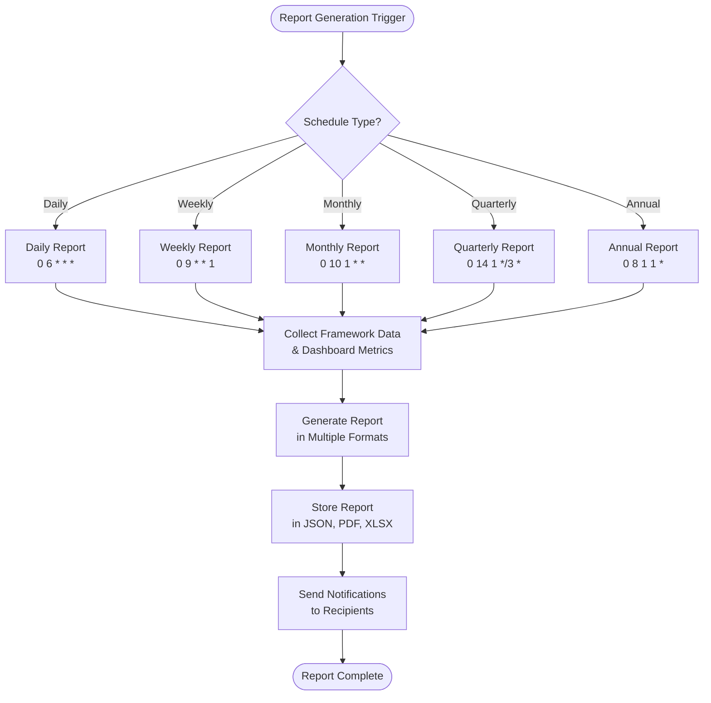
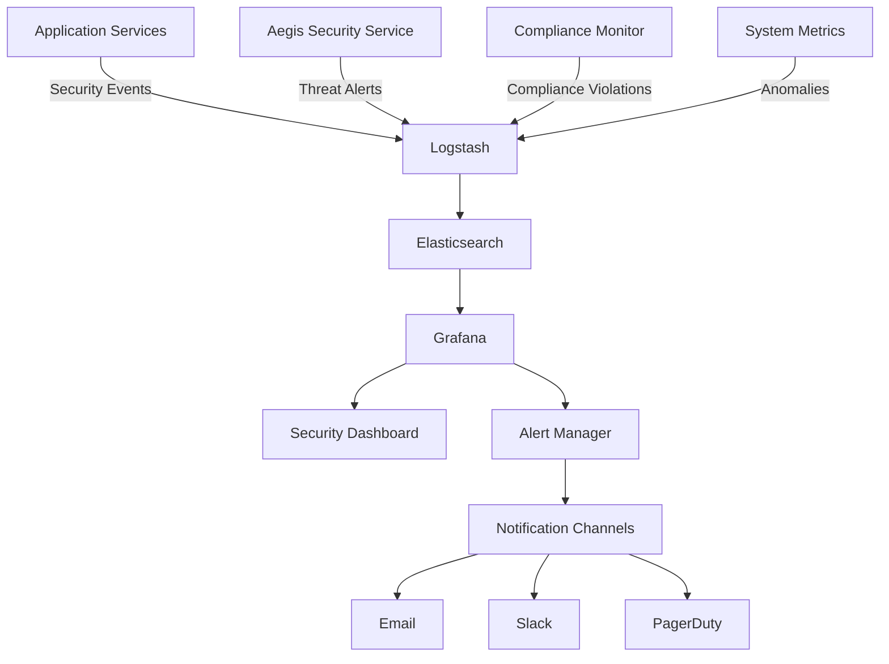
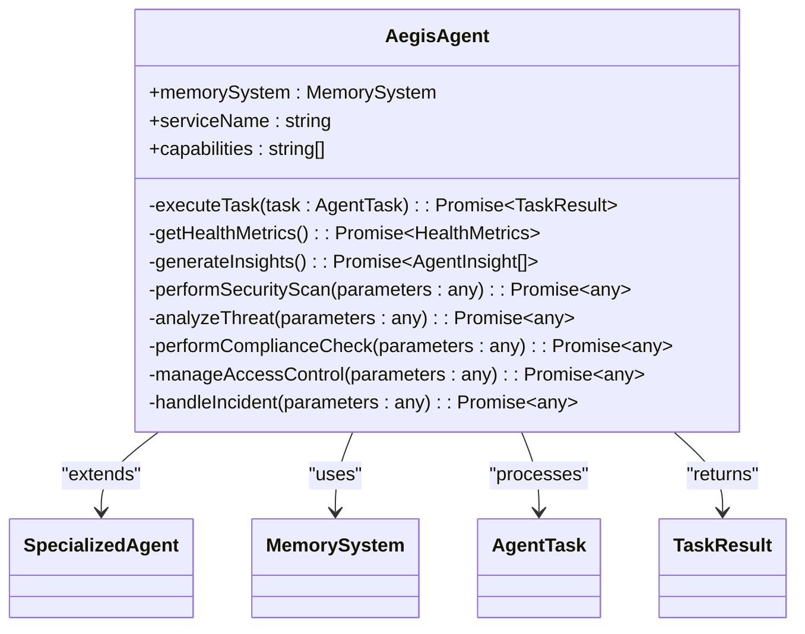
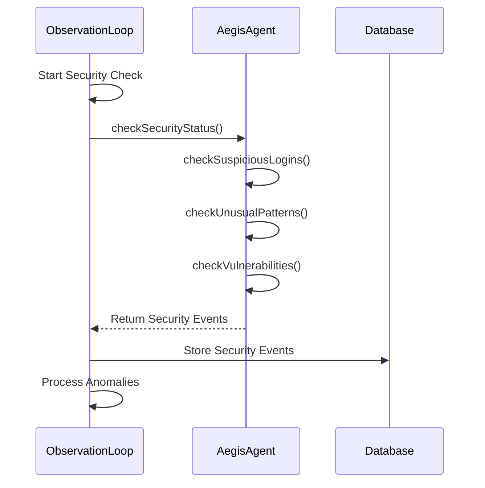
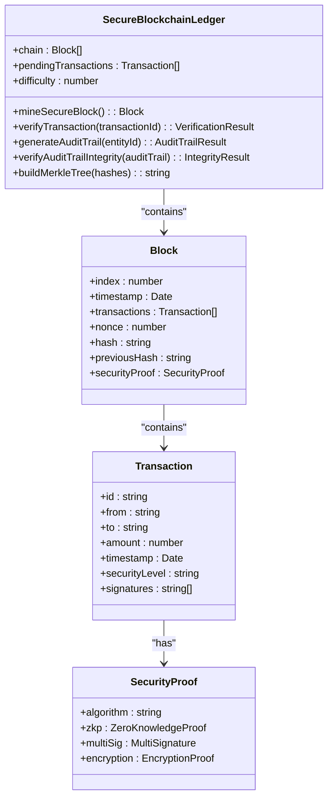

# Security Audits and Monitoring

<cite>
**Referenced Files in This Document**   
- [MONITORING.md](file://codex/MONITORING.md)
- [SECURITY.md](file://codex/archive/SECURITY.md)
- [compliance-20251018-040258.md](file://compliance-reports/compliance-20251018-040258.md)
- [compliance-20251018-042246.md](file://compliance-reports/compliance-20251018-042246.md)
- [aegis-agent.ts](file://genome/ai-hierarchy/specialized-agents/aegis-agent.ts)
- [observation-loop.ts](file://genome/agent-tools/observation-loop.ts)
- [services.ts](file://genome/agent-tools/services.ts)
- [index.js](file://organs/compliance-monitor/index.js)
- [index.js](file://organs/automated-compliance-reporting/index.js)
- [index.js](file://services/azora-covenant/index.js)
- [blockchainService.ts](file://services/azora-covenant/src/blockchainService.ts)
- [migration.sql](file://services/azora-covenant/prisma/migrations/20251020084119_init/migration.sql)
</cite>

## Table of Contents
1. [Introduction](#introduction)
2. [Continuous Compliance Monitoring](#continuous-compliance-monitoring)
3. [Automated Audit Reporting](#automated-audit-reporting)
4. [Security Event Logging and Analysis](#security-event-logging-and-analysis)
5. [Monitoring Stack Integration](#monitoring-stack-integration)
6. [Aegis Security Service Integration](#aegis-security-service-integration)
7. [Audit Trail Management](#audit-trail-management)
8. [Monitoring Gaps and Solutions](#monitoring-gaps-and-solutions)
9. [Internal Security Audit Procedures](#internal-security-audit-procedures)
10. [External Assessment Preparation](#external-assessment-preparation)

## Introduction
Azora OS implements a comprehensive security auditing and monitoring framework designed to ensure continuous compliance, maintain robust security posture, and provide comprehensive visibility across all system components. The system integrates automated compliance monitoring, real-time security event analysis, and comprehensive audit trail management across both traditional microservices and blockchain transactions. This documentation details the implementation of these security mechanisms, focusing on the integration between the Aegis security service, compliance monitoring systems, and the Prometheus-Grafana-Logstash monitoring stack.

## Continuous Compliance Monitoring
Azora OS employs continuous compliance monitoring through an automated system that verifies adherence to regulatory requirements and internal security policies in real-time. The system performs regular checks against multiple compliance frameworks including GDPR, HIPAA, SOX, CCPA, PIPEDA, and LGPD, with each framework monitored on dedicated service ports (4080-4085 respectively).

The compliance monitoring system operates through a circuit breaker pattern that prevents cascading failures when individual compliance services experience issues. Each compliance framework service is monitored for connectivity and response integrity, with automatic alerts generated when services become unreachable or return invalid responses. The system maintains a 10-minute response cache to reduce load on compliance services while ensuring timely data availability.

Compliance checks are performed at multiple levels:
- **Service-level compliance**: Each compliance framework service exposes an `/audit` endpoint that provides current compliance status
- **Dashboard-level compliance**: A centralized compliance dashboard aggregates data from all framework services
- **Automated remediation**: The system can trigger remediation workflows when compliance violations are detected

The monitoring system generates real-time alerts for compliance violations, with severity levels determined by the criticality of the violated regulation and the potential impact on system operations.

**Section sources**
- [MONITORING.md](file://codex/MONITORING.md)
- [SECURITY.md](file://codex/archive/SECURITY.md)
- [index.js](file://organs/compliance-monitor/index.js)

## Automated Audit Reporting
Azora OS implements an automated audit reporting system that generates compliance reports on multiple schedules: daily, weekly, monthly, quarterly, and annually. The reporting system is configured through cron expressions that trigger report generation at specific intervals:



**Diagram sources**
- [index.js](file://organs/automated-compliance-reporting/index.js#L147-L190)

**Section sources**
- [index.js](file://organs/automated-compliance-reporting/index.js)

### Report Generation Process
The automated reporting system follows a structured process to generate comprehensive compliance reports:

1. **Data Collection**: The system collects compliance data from all active framework services and dashboard metrics
2. **Summary Generation**: Executive summaries are created with compliance percentages, risk assessments, and key metrics
3. **Recommendation Engine**: The system generates prioritized recommendations based on identified compliance gaps
4. **Multi-format Output**: Reports are generated in JSON, PDF, and XLSX formats for different stakeholder needs
5. **Distribution**: Reports are automatically distributed to designated recipients based on report type

The system maintains a reporting data structure that stores generated reports, audit trails, and regulatory filings, with appropriate retention periods (90 days for daily reports, 7 years for monthly, quarterly, and annual reports).

### Compliance Report Examples
The system generates detailed compliance reports that include:

- **Executive Summary**: Overall compliance score, frameworks monitored, and critical issues
- **Risk Assessment**: Breakdown of critical, high, medium, and low risks across all frameworks
- **Framework Status**: Individual compliance status for each regulatory framework
- **Recommendations**: Prioritized action items with timeframes for remediation

Example compliance reports from the system show progressive improvement in compliance scores:
- `compliance-20251018-040258.md`: 83% compliance (10/12 checks passed)
- `compliance-20251018-042246.md`: 91% compliance (11/12 checks passed)

The improvement demonstrates the effectiveness of the automated reporting system in identifying and addressing compliance gaps.

**Section sources**
- [compliance-20251018-040258.md](file://compliance-reports/compliance-20251018-040258.md)
- [compliance-20251018-042246.md](file://compliance-reports/compliance-20251018-042246.md)
- [index.js](file://organs/automated-compliance-reporting/index.js)

## Security Event Logging and Analysis
Security events in Azora OS are logged, analyzed, and escalated through a multi-layered monitoring stack that integrates Prometheus, Grafana, and Logstash. The system captures security events from multiple sources including the Aegis security service, compliance monitors, and application-level security checks.

### Event Logging Architecture
The logging system follows a structured architecture:



**Diagram sources**
- [MONITORING.md](file://codex/MONITORING.md)
- [index.js](file://organs/compliance-monitor/index.js)

**Section sources**
- [MONITORING.md](file://codex/MONITORING.md)
- [index.js](file://organs/compliance-monitor/index.js)

### Security Event Types
The system logs and analyzes several categories of security events:

- **Authentication Events**: Login attempts, authentication failures, password changes
- **Authorization Events**: Access control changes, permission modifications
- **Compliance Events**: Regulatory violations, policy breaches
- **Threat Detection**: Malware detection, phishing attempts, DDoS attacks
- **System Security**: Vulnerability scans, configuration changes

Each security event includes metadata such as timestamp, severity level, source IP, user ID (when applicable), and event description. Critical events trigger immediate alerts, while lower-severity events are aggregated for periodic review.

### Real-time Alerting System
The real-time alerting system uses Prometheus AlertManager to escalate security events based on severity and impact:

- **Critical Alerts**: Service downtime, high error rates (>5% for 10+ minutes), high memory usage (>90% for 5+ minutes)
- **Warning Alerts**: Degraded service performance, high queue sizes, low disk space (>80%)
- **Informational Alerts**: Security scan results, compliance check updates

Alerts are routed through multiple notification channels including email, Slack, and PagerDuty, with escalation policies based on response time and incident severity.

**Section sources**
- [MONITORING.md](file://codex/MONITORING.md)
- [index.js](file://organs/compliance-monitor/index.js)

## Monitoring Stack Integration
Azora OS integrates Prometheus, Grafana, and Logstash into a cohesive monitoring stack that provides comprehensive visibility into system security and compliance status.

### Prometheus Configuration
Prometheus is configured to scrape metrics from multiple services at 15-second intervals. Key metrics collected include:

- **Service Health**: HTTP request rates, response times, error rates
- **System Resources**: CPU usage, memory usage, disk I/O, network traffic
- **Security Metrics**: Threats blocked, compliance score, active incidents
- **Business Metrics**: Email delivery rates, message throughput, transaction volumes

The Prometheus configuration includes alerting rules that trigger when metrics exceed predefined thresholds, enabling proactive issue detection.

### Grafana Dashboards
Grafana provides visualization of monitoring data through multiple dashboards:

- **Azora OS Overview Dashboard**: Service health status, API gateway metrics, system resource usage
- **Security Dashboard**: Threat detection metrics, compliance scores, security coverage
- **Compliance Dashboard**: Regulatory framework status, audit trail completeness, compliance trends
- **Blockchain Dashboard**: Transaction volumes, block mining rates, audit trail integrity

These dashboards enable security teams to monitor system status in real-time and identify potential issues before they impact operations.

### Logstash Pipeline
Logstash processes security and compliance logs through a multi-stage pipeline:

1. **Input**: Collects logs from application services, security agents, and system components
2. **Filter**: Parses and normalizes log data, enriches with contextual information
3. **Output**: Stores processed logs in Elasticsearch for querying and analysis

The pipeline includes security-specific filters that identify and categorize security events, enabling efficient analysis and reporting.

**Section sources**
- [MONITORING.md](file://codex/MONITORING.md)

## Aegis Security Service Integration
The Aegis security service is integrated throughout Azora OS as the central component for security monitoring, threat detection, and compliance auditing.

### Aegis Agent Architecture
The Aegis agent operates as a specialized AI agent that performs security-related tasks:



**Diagram sources**
- [aegis-agent.ts](file://genome/ai-hierarchy/specialized-agents/aegis-agent.ts#L15-L437)

**Section sources**
- [aegis-agent.ts](file://genome/ai-hierarchy/specialized-agents/aegis-agent.ts)
- [services.ts](file://genome/agent-tools/services.ts)

### Security Capabilities
The Aegis agent provides several key security capabilities:

- **Security Monitoring**: Continuous scanning for vulnerabilities and threats
- **Threat Detection**: Analysis of potential security threats with confidence scoring
- **Compliance Auditing**: Verification of regulatory compliance across multiple frameworks
- **Access Control**: Management of user permissions and access policies
- **Incident Response**: Automated handling of security incidents with containment strategies

The agent uses a task-based architecture where security operations are executed as discrete tasks, allowing for flexible and scalable security operations.

### Integration with Observation Loop
The Aegis service is integrated into the system's observation loop, which periodically checks security status and identifies anomalies:



**Diagram sources**
- [observation-loop.ts](file://genome/agent-tools/observation-loop.ts#L324-L367)
- [aegis-agent.ts](file://genome/ai-hierarchy/specialized-agents/aegis-agent.ts)

**Section sources**
- [observation-loop.ts](file://genome/agent-tools/observation-loop.ts)
- [aegis-agent.ts](file://genome/ai-hierarchy/specialized-agents/aegis-agent.ts)

## Audit Trail Management
Azora OS maintains comprehensive audit trails across microservices and blockchain transactions, ensuring complete traceability of all system activities.

### Microservices Audit Trails
Microservices maintain audit logs through the Prisma ORM, which records all significant actions in an audit_log table:

```sql
-- CreateTable
CREATE TABLE "audit_log" (
    "id" TEXT NOT NULL,
    "action" TEXT NOT NULL,
    "details" JSONB NOT NULL,
    "timestamp" TIMESTAMP(3) NOT NULL DEFAULT CURRENT_TIMESTAMP,
    CONSTRAINT "audit_log_pkey" PRIMARY KEY ("id")
);
```

Each audit log entry captures the action performed, details of the operation, and timestamp, providing a complete record of system activities.

**Section sources**
- [migration.sql](file://services/azora-covenant/prisma/migrations/20251020084119_init/migration.sql#L35-L39)

### Blockchain Audit Trails
Blockchain transactions are secured with cryptographic proofs and maintain comprehensive audit trails:



**Diagram sources**
- [index.js](file://services/azora-covenant/index.js#L435-L462)
- [blockchainService.ts](file://services/azora-covenant/src/blockchainService.ts)

**Section sources**
- [index.js](file://services/azora-covenant/index.js)
- [blockchainService.ts](file://services/azora-covenant/src/blockchainService.ts)

The blockchain audit trail system provides several security features:

- **Cryptographic Integrity**: Audit trails are verified using Merkle trees to ensure data integrity
- **Comprehensive Tracking**: All transactions involving an entity are included in its audit trail
- **Security Levels**: Transactions are classified by security level based on verification requirements
- **Multi-signature Support**: Critical transactions require multiple signatures for validation
- **Zero-Knowledge Proofs**: Privacy-preserving verification of transaction validity

The `generateAuditTrail` method collects all transactions related to a specific entity, creating a complete history of its blockchain activities with cryptographic verification of integrity.

## Monitoring Gaps and Solutions
Despite the comprehensive monitoring system, several gaps exist that require attention to ensure complete security visibility.

### Identified Monitoring Gaps
1. **Azora Coin Supply Enforcement**: The system lacks enforcement of the 1-million token limit for Azora Coin
2. **Constitution Document**: The constitution document was missing in earlier compliance checks
3. **Service Connectivity**: Some compliance services may become unreachable, affecting monitoring completeness
4. **Data Residency**: Limited visibility into data residency compliance across different jurisdictions

### Solutions for Comprehensive Security Visibility
To address these gaps, the following solutions are recommended:

- **Implement Token Supply Enforcement**: Add validation in the AzoraCoin smart contract to enforce the 1-million token limit
- **Ensure Documentation Completeness**: Implement automated checks to verify the presence of critical documents like the constitution
- **Enhance Service Monitoring**: Implement heartbeat monitoring for all compliance services with automatic failover
- **Expand Data Residency Monitoring**: Add geolocation tracking and data residency verification to the compliance monitoring system

The system should also implement predictive monitoring capabilities that use historical data to identify potential compliance issues before they occur, further enhancing security visibility.

**Section sources**
- [compliance-20251018-040258.md](file://compliance-reports/compliance-20251018-040258.md)
- [compliance-20251018-042246.md](file://compliance-reports/compliance-20251018-042246.md)

## Internal Security Audit Procedures
Internal security audits in Azora OS follow a structured procedure to ensure comprehensive assessment of security controls and compliance status.

### Audit Preparation
1. **Scope Definition**: Determine the systems, services, and compliance frameworks to be audited
2. **Tool Configuration**: Ensure all monitoring and auditing tools are properly configured and operational
3. **Data Collection**: Gather baseline data from monitoring systems, logs, and compliance reports

### Audit Execution
1. **Automated Scanning**: Run automated security scans using the Aegis agent to identify vulnerabilities
2. **Compliance Verification**: Validate adherence to regulatory requirements using the compliance monitoring system
3. **Access Control Review**: Audit user permissions and access policies for least privilege compliance
4. **Incident Response Testing**: Simulate security incidents to verify response procedures

### Audit Reporting
1. **Findings Documentation**: Record all identified issues with severity ratings and evidence
2. **Remediation Recommendations**: Provide actionable recommendations for addressing identified gaps
3. **Compliance Score Calculation**: Generate a comprehensive compliance score based on audit results
4. **Executive Summary**: Create a high-level summary of audit findings for management review

The audit process leverages the automated compliance reporting system to generate audit artifacts and ensure consistency across audit cycles.

**Section sources**
- [index.js](file://organs/automated-compliance-reporting/index.js)
- [aegis-agent.ts](file://genome/ai-hierarchy/specialized-agents/aegis-agent.ts)

## External Assessment Preparation
Preparing for external assessments involves ensuring all systems, documentation, and processes meet regulatory requirements and industry standards.

### Documentation Requirements
1. **Compliance Reports**: Provide recent automated compliance reports demonstrating ongoing adherence
2. **Audit Trails**: Supply comprehensive audit logs for the assessment period
3. **Security Policies**: Document security policies, procedures, and control frameworks
4. **Incident Records**: Provide records of security incidents and response activities

### System Readiness
1. **Monitoring Verification**: Ensure all monitoring systems are operational and collecting data
2. **Log Integrity**: Verify the integrity of audit logs and security event records
3. **Access Provisioning**: Provide assessors with appropriate access to systems and data
4. **Compliance Dashboard**: Ensure the compliance dashboard accurately reflects current status

### Assessment Support
1. **Point of Contact**: Designate a primary contact for the assessment team
2. **Evidence Collection**: Establish a process for efficiently providing requested evidence
3. **Issue Resolution**: Implement a rapid response process for addressing assessment findings
4. **Follow-up Procedures**: Define procedures for implementing recommended improvements

The automated compliance reporting system plays a crucial role in external assessment preparation by providing up-to-date, comprehensive documentation of the system's compliance status and security posture.

**Section sources**
- [index.js](file://organs/automated-compliance-reporting/index.js)
- [compliance-20251018-042246.md](file://compliance-reports/compliance-20251018-042246.md)