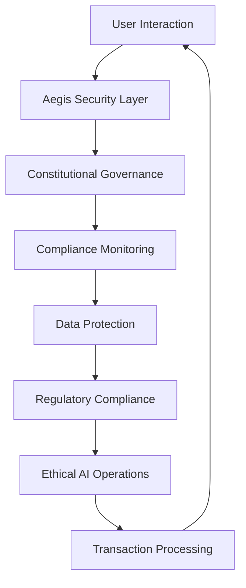
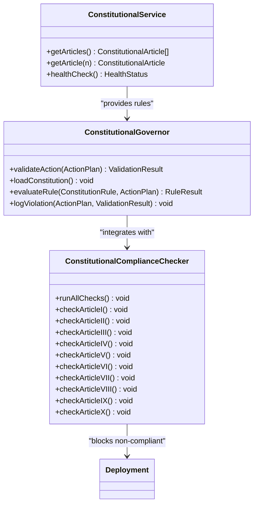
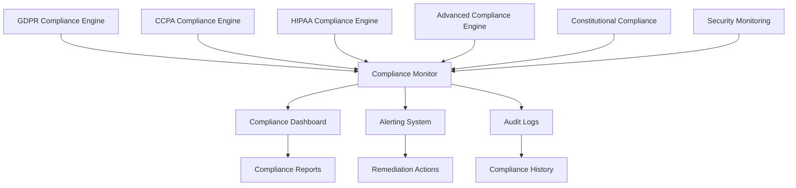

# Security and Compliance

<cite>
**Referenced Files in This Document**   
- [server.ts](file://azora/azora-aegis/server.ts)
- [AZORA_CONSTITUTION.md](file://codex/constitution/AZORA_CONSTITUTION.md)
- [gdpr-compliance/index.js](file://organs/gdpr-compliance/index.js)
- [ccpa-compliance/index.js](file://organs/ccpa-compliance/index.js)
- [hipaa-compliance/index.js](file://organs/hipaa-compliance/index.js)
- [advanced-compliance-engine/index.js](file://organs/advanced-compliance-engine/index.js)
- [compliance-monitor/index.js](file://organs/compliance-monitor/index.js)
- [constitution-service/index.js](file://organs/constitution-service/index.js)
- [constitutional-governor.ts](file://genome/agent-tools/constitutional-governor.ts)
- [constitutional-compliance-checker.js](file://infrastructure/constitutional-compliance-checker.js)
</cite>

## Table of Contents
1. [Introduction](#introduction)
2. [Multi-Layered Security Model](#multi-layered-security-model)
3. [Aegis Security Implementation](#aegis-security-implementation)
4. [Constitutional Governance Framework](#constitutional-governance-framework)
5. [Compliance Monitoring System](#compliance-monitoring-system)
6. [Data Protection and Regulatory Compliance](#data-protection-and-regulatory-compliance)
7. [Ethical AI Guidelines](#ethical-ai-guidelines)
8. [Transaction Processing and Security](#transaction-processing-and-security)
9. [Common Security Issues and Solutions](#common-security-issues-and-solutions)
10. [Security Audits and Compliance Maintenance](#security-audits-and-compliance-maintenance)
11. [Conclusion](#conclusion)

## Introduction

Azora OS implements a comprehensive security and compliance framework designed to ensure data protection, regulatory adherence, and ethical AI operations. The system integrates multiple layers of security controls, constitutional governance, and automated compliance monitoring to create a robust and trustworthy platform. This document details the implementation of Aegis security, constitutional governance, and compliance monitoring across the Azora OS ecosystem.

**Section sources**
- [AZORA_CONSTITUTION.md](file://codex/constitution/AZORA_CONSTITUTION.md#L1-L981)

## Multi-Layered Security Model

The Azora OS security model consists of three primary components: Aegis security, constitutional governance, and compliance monitoring. These layers work together to provide comprehensive protection for the system and its users.

The Aegis security layer provides the foundational protection for the system, implementing technical safeguards and threat detection mechanisms. Constitutional governance establishes the ethical and operational principles that guide all system behavior, while compliance monitoring ensures adherence to regulatory requirements and internal policies.

This multi-layered approach creates a defense-in-depth strategy that addresses security concerns at multiple levels, from technical implementation to organizational governance.

**Diagram sources **
- [server.ts](file://azora/azora-aegis/server.ts#L1-L285)
- [AZORA_CONSTITUTION.md](file://codex/constitution/AZORA_CONSTITUTION.md#L1-L981)

**Section sources**
- [server.ts](file://azora/azora-aegis/server.ts#L1-L285)
- [AZORA_CONSTITUTION.md](file://codex/constitution/AZORA_CONSTITUTION.md#L1-L981)

## Aegis Security Implementation

Aegis security serves as the primary technical protection layer for Azora OS, implementing comprehensive security controls and threat detection mechanisms. The system is designed to protect against various security threats while maintaining high availability and performance.

The Aegis Citadel service, implemented in server.ts, provides core security functions including constitutional compliance checks, sovereign nation grant processing, and sovereign trigger execution. The system uses Elara AI to perform constitutional compliance verification on all critical actions, ensuring that no operation violates the established governance principles.

Key security features of the Aegis implementation include:
- Constitutional compliance verification using AI
- Sovereign nation grant processing with automated validation
- Sovereign trigger execution with audit logging
- Health monitoring and status reporting
- Secure API endpoints with proper authentication and authorization

The system also implements standard security best practices such as input validation, error handling, and secure coding techniques to prevent common vulnerabilities.

**Section sources**
- [server.ts](file://azora/azora-aegis/server.ts#L1-L285)

## Constitutional Governance Framework

The constitutional governance framework establishes the ethical and operational principles that guide all system behavior in Azora OS. This framework is codified in the AZORA_CONSTITUTION.md document and implemented through various system components.

The constitution defines core values, economic principles, governance structures, and compliance requirements that must be followed by all system components. Key principles include proprietary innovation, African ownership, student empowerment, complete independence, constitutional governance, transparent economics, and sustainable growth.

The constitutional governance system is implemented through several mechanisms:
- Constitutional service that provides access to constitutional articles
- Constitutional governor that validates actions against constitutional rules
- Compliance checker that verifies constitutional adherence before deployment
- Automated monitoring of constitutional compliance

The system ensures that all actions and decisions align with the established constitutional principles, creating a consistent and predictable governance model.

**Diagram sources **
- [constitution-service/index.js](file://organs/constitution-service/index.js#L1-L39)
- [constitutional-governor.ts](file://genome/agent-tools/constitutional-governor.ts#L1-L341)
- [constitutional-compliance-checker.js](file://infrastructure/constitutional-compliance-checker.js#L1-L483)

**Section sources**
- [AZORA_CONSTITUTION.md](file://codex/constitution/AZORA_CONSTITUTION.md#L1-L981)
- [constitution-service/index.js](file://organs/constitution-service/index.js#L1-L39)
- [constitutional-governor.ts](file://genome/agent-tools/constitutional-governor.ts#L1-L341)
- [constitutional-compliance-checker.js](file://infrastructure/constitutional-compliance-checker.js#L1-L483)

## Compliance Monitoring System

The compliance monitoring system in Azora OS provides continuous oversight of regulatory adherence and internal policy compliance. This system consists of multiple specialized compliance engines and a central monitoring service.

The compliance-monitor service collects and processes compliance alerts from various system components, providing a centralized view of compliance status. The system tracks compliance events, remediation actions, and overall compliance health.

Specialized compliance engines handle specific regulatory requirements:
- GDPR compliance engine for European data protection
- CCPA compliance engine for California consumer privacy
- HIPAA compliance engine for healthcare data protection
- Advanced compliance engine for industry-specific requirements

These engines implement comprehensive compliance features including data subject rights management, consent tracking, breach notification, audit logging, and compliance reporting.

**Diagram sources **
- [compliance-monitor/index.js](file://organs/compliance-monitor/index.js#L1-L31)
- [gdpr-compliance/index.js](file://organs/gdpr-compliance/index.js#L1-L799)
- [ccpa-compliance/index.js](file://organs/ccpa-compliance/index.js#L1-L799)
- [hipaa-compliance/index.js](file://organs/hipaa-compliance/index.js#L1-L321)
- [advanced-compliance-engine/index.js](file://organs/advanced-compliance-engine/index.js#L1-L799)

**Section sources**
- [compliance-monitor/index.js](file://organs/compliance-monitor/index.js#L1-L31)
- [gdpr-compliance/index.js](file://organs/gdpr-compliance/index.js#L1-L799)
- [ccpa-compliance/index.js](file://organs/ccpa-compliance/index.js#L1-L799)
- [hipaa-compliance/index.js](file://organs/hipaa-compliance/index.js#L1-L321)
- [advanced-compliance-engine/index.js](file://organs/advanced-compliance-engine/index.js#L1-L799)

## Data Protection and Regulatory Compliance

Azora OS implements comprehensive data protection and regulatory compliance measures to ensure adherence to various legal and regulatory requirements. The system provides specialized compliance engines for major regulations including GDPR, CCPA, and HIPAA.

### GDPR Compliance

The GDPR compliance engine implements all requirements of the General Data Protection Regulation, including:
- Data subject rights (access, rectification, erasure, portability)
- Consent management and tracking
- Data processing records
- Breach notification procedures
- Data Protection Impact Assessments (DPIA)
- Audit logging and monitoring

The system enables data subjects to exercise their rights through dedicated API endpoints and ensures that all data processing activities are properly documented and compliant with GDPR requirements.

### CCPA Compliance

The CCPA compliance engine addresses the requirements of the California Consumer Privacy Act, including:
- Consumer rights management (access, deletion, opt-out)
- Data inventory and mapping
- Privacy notice management
- Vendor risk assessment
- Breach notification (30-day requirement)
- Privacy impact assessments

The system provides mechanisms for consumers to submit requests, verify their identity, and receive responses within the required timeframes.

### HIPAA Compliance

The HIPAA compliance engine implements comprehensive healthcare data protection measures, including:
- Protected Health Information (PHI) protection
- Security Rule compliance (administrative, physical, technical safeguards)
- Privacy Rule compliance (minimum necessary, accounting of disclosures)
- Breach notification (60-day requirement)
- Audit trails and access logging
- Business Associate Agreement management
- Risk analysis and management

The system ensures that all PHI is properly protected and that healthcare data processing activities comply with HIPAA requirements.

**Section sources**
- [gdpr-compliance/index.js](file://organs/gdpr-compliance/index.js#L1-L799)
- [ccpa-compliance/index.js](file://organs/ccpa-compliance/index.js#L1-L799)
- [hipaa-compliance/index.js](file://organs/hipaa-compliance/index.js#L1-L321)

## Ethical AI Guidelines

Azora OS implements comprehensive ethical AI guidelines to ensure responsible and trustworthy AI operations. These guidelines are codified in the constitution and implemented through various system components.

Key ethical AI principles include:
- Human oversight always maintained
- Transparent algorithms and decision-making
- No autonomous decisions affecting money
- Regular bias audits and mitigation
- Privacy protection and data minimization
- Fairness and non-discrimination
- Accountability and responsibility

The system implements these principles through:
- Constitutional governance that requires AI actions to align with ethical principles
- Compliance monitoring that verifies ethical AI operations
- Audit logging that provides transparency into AI decision-making
- Bias detection and mitigation mechanisms
- Human-in-the-loop controls for critical decisions

The ethical AI framework ensures that AI systems operate in a manner that is beneficial to users and society while minimizing potential harms.

**Section sources**
- [AZORA_CONSTITUTION.md](file://codex/constitution/AZORA_CONSTITUTION.md#L1-L981)
- [constitutional-governor.ts](file://genome/agent-tools/constitutional-governor.ts#L1-L341)

## Transaction Processing and Security

Transaction processing in Azora OS is designed with security as a primary consideration. All transactions are subject to multiple layers of security controls and validation to ensure integrity, confidentiality, and availability.

The transaction processing pipeline includes:
- Input validation and sanitization
- Constitutional compliance verification
- Security rule validation
- Audit logging
- Transaction signing and verification
- Immutable ledger recording
- Compliance monitoring

Each transaction is validated against constitutional rules and security policies before execution. The system ensures that only authorized and compliant transactions are processed, preventing fraudulent or malicious activities.

Transaction security features include:
- End-to-end encryption
- Multi-factor authentication
- Rate limiting and throttling
- Anomaly detection
- Fraud prevention
- Audit trail generation
- Immutable logging

The system also implements fail-safe mechanisms to handle errors and exceptions securely, ensuring that transactions are either completed successfully or rolled back safely.

**Section sources**
- [server.ts](file://azora/azora-aegis/server.ts#L1-L285)
- [constitutional-governor.ts](file://genome/agent-tools/constitutional-governor.ts#L1-L341)

## Common Security Issues and Solutions

Azora OS addresses common security issues through proactive measures and automated protection mechanisms. The system identifies potential vulnerabilities and implements solutions to mitigate risks.

### Data Breach Prevention

The system implements multiple layers of protection against data breaches:
- Encryption of sensitive data at rest and in transit
- Access controls and authentication
- Intrusion detection and prevention
- Security monitoring and alerting
- Regular security audits and penetration testing

### Unauthorized Access

To prevent unauthorized access, the system implements:
- Strong authentication mechanisms
- Role-based access control
- Multi-factor authentication
- Session management
- Account lockout policies
- Password policies

### Compliance Violations

The system prevents compliance violations through:
- Automated compliance checking
- Real-time monitoring
- Policy enforcement
- Audit logging
- Alerting and remediation

### System Availability

To ensure system availability, the system implements:
- Redundancy and failover
- Load balancing
- Disaster recovery
- Backup and restore
- Monitoring and alerting

These measures ensure that the system remains secure, compliant, and available to users.

**Section sources**
- [server.ts](file://azora/azora-aegis/server.ts#L1-L285)
- [constitutional-governor.ts](file://genome/agent-tools/constitutional-governor.ts#L1-L341)
- [compliance-monitor/index.js](file://organs/compliance-monitor/index.js#L1-L31)

## Security Audits and Compliance Maintenance

Security audits and compliance maintenance are critical components of the Azora OS security framework. The system implements automated and manual processes to ensure ongoing security and compliance.

### Security Audits

Security audits are conducted regularly to assess the security posture of the system. These audits include:
- Vulnerability scanning
- Penetration testing
- Configuration review
- Code review
- Compliance checking
- Risk assessment

The constitutional compliance checker performs automated audits before deployment, ensuring that all system changes comply with constitutional requirements.

### Compliance Maintenance

Compliance maintenance involves ongoing activities to ensure continued adherence to regulatory requirements:
- Regular compliance assessments
- Policy updates
- Training and awareness
- Monitoring and reporting
- Incident response
- Continuous improvement

The system implements automated compliance monitoring to detect and address compliance issues in real-time. Compliance reports are generated regularly to demonstrate adherence to regulatory requirements.

### Audit Logging

Comprehensive audit logging is implemented throughout the system to provide transparency and accountability. Audit logs capture:
- User actions
- System events
- Security incidents
- Compliance violations
- Remediation actions

These logs are stored securely and made available for review and analysis.

**Section sources**
- [constitutional-compliance-checker.js](file://infrastructure/constitutional-compliance-checker.js#L1-L483)
- [compliance-monitor/index.js](file://organs/compliance-monitor/index.js#L1-L31)
- [gdpr-compliance/index.js](file://organs/gdpr-compliance/index.js#L1-L799)

## Conclusion

Azora OS implements a comprehensive security and compliance framework that integrates technical protection, constitutional governance, and regulatory compliance. The multi-layered security model provides robust protection against various threats while ensuring adherence to ethical principles and legal requirements.

The system's implementation of Aegis security, constitutional governance, and compliance monitoring creates a trustworthy and reliable platform for users. By combining automated protection mechanisms with human oversight and ethical principles, Azora OS establishes a strong foundation for secure and compliant operations.

Ongoing security audits, compliance maintenance, and continuous improvement ensure that the system remains secure and compliant in the face of evolving threats and regulatory requirements. This comprehensive approach to security and compliance positions Azora OS as a leader in trustworthy and responsible technology.

**Section sources**
- [server.ts](file://azora/azora-aegis/server.ts#L1-L285)
- [AZORA_CONSTITUTION.md](file://codex/constitution/AZORA_CONSTITUTION.md#L1-L981)
- [compliance-monitor/index.js](file://organs/compliance-monitor/index.js#L1-L31)