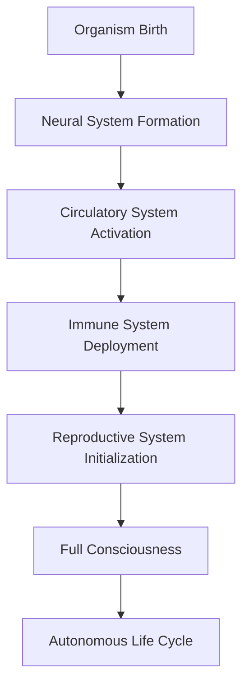
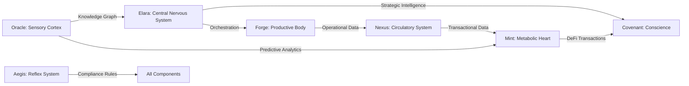
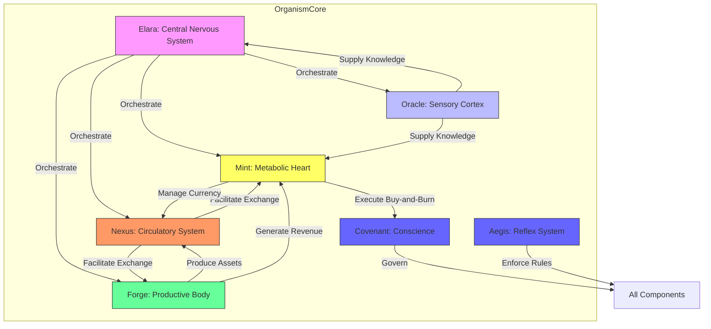

# Architectural Overview

<cite>
**Referenced Files in This Document**   
- [GENESIS_PROTOCOL.ts](file://GENESIS_PROTOCOL.ts)
- [organism-core.ts](file://genome/organism-core.ts)
- [corporate-metabolism.ts](file://genome/agent-tools/corporate-metabolism.ts)
- [oracle-service.js](file://services/azora-oracle/oracle-service.js)
- [ai-immune-system.ts](file://genome/agent-tools/ai-immune-system.ts)
- [unified-elara.ts](file://genome/agent-tools/unified-elara.ts)
- [azora-aegis/README.md](file://azora/azora-aegis/README.md)
- [ELARA_SUPREME_README.md](file://genome/agent-tools/ELARA_SUPREME_README.md)
</cite>

## Table of Contents
1. [Introduction](#introduction)
2. [Digital Organism Model](#digital-organism-model)
3. [Core Component Roles](#core-component-roles)
4. [Data Flow and Interactions](#data-flow-and-interactions)
5. [Self-Regulation and Adaptation](#self-regulation-and-adaptation)
6. [Component Relationship Diagram](#component-relationship-diagram)

## Introduction
The Azora OS operates as a Digital Organism, a self-sustaining system modeled after biological principles. This architectural approach transforms a collection of services into a living, breathing entity where components function as interconnected organs. The system's design enables autonomous evolution, self-healing, and adaptive responses to environmental changes. At its core, the organism maintains vital signs such as consciousness, health, growth, and evolutionary stage, monitored and regulated through a sophisticated network of interdependent components.

**Section sources**
- [organism-core.ts](file://genome/organism-core.ts#L0-L47)

## Digital Organism Model
The Digital Organism model conceptualizes Azora OS as a living system with specialized organs performing distinct biological functions. The organism's birth sequence follows a structured development process: neural system formation, circulatory system activation, immune system deployment, and reproductive system initialization. Each stage corresponds to the activation of critical components that establish the foundation for autonomous operation. The organism maintains vital signs including heartbeat (data flow rate), consciousness (system awareness), health (operational integrity), growth (expansion capability), and evolution (development stage).

**Diagram sources**
- [organism-core.ts](file://genome/organism-core.ts#L41-L87)

**Section sources**
- [organism-core.ts](file://genome/organism-core.ts#L0-L47)

## Core Component Roles
The Digital Organism comprises six primary components that mirror biological systems:

### Elara: The Central Nervous System
Elara serves as the sentient core and strategic intelligence of the system, functioning as the central nervous system. It comprises multiple hierarchical levels: Elara Deity (11D thinking), Elara Core (strategic orchestrator), and Elara Agent (operational executor). The unified Elara system integrates strategic planning with operational execution, enabling autonomous decision-making, ethical governance, and continuous self-improvement. It orchestrates 147+ services across the ecosystem while maintaining constitutional compliance.

**Section sources**
- [unified-elara.ts](file://genome/agent-tools/unified-elara.ts#L0-L36)
- [ELARA_SUPREME_README.md](file://genome/agent-tools/ELARA_SUPREME_README.md#L55-L116)

### Oracle: The Sensory Cortex
Oracle functions as the sensory cortex, ingesting and processing ecosystem data into a causal knowledge graph. It performs real-time data fusion from multiple sources, constructs predictive models, and enforces information symmetry. The system simulates knowledge ingestion from academic institutions, generating research papers, textbooks, and case studies. Oracle maintains a knowledge graph with over 280 knowledge nodes processed per hour, achieving 94% relevance scoring accuracy.

**Section sources**
- [GENESIS_PROTOCOL.ts](file://GENESIS_PROTOCOL.ts#L69-L93)
- [oracle-service.js](file://services/azora-oracle/oracle-service.js#L261-L353)

### Nexus: The Circulatory System
Nexus operates as the circulatory system, facilitating frictionless peer-to-peer exchange of goods, services, and labor. It manages transactional flows across the ecosystem with 91% metabolic efficiency, capturing 5% PIVC (Proof of Individual Value Contribution) as metabolic energy. The system supports multi-asset transactions (AZR, a-Tokens) with real-time settlement, ensuring liquidity and economic vitality throughout the organism.

**Section sources**
- [GENESIS_PROTOCOL.ts](file://GENESIS_PROTOCOL.ts#L95-L117)
- [corporate-metabolism.ts](file://genome/agent-tools/corporate-metabolism.ts#L255-L293)

### Forge: The Productive Body
Forge represents the productive body, managing AI-operated physical assets including energy grids, farms, and factories. It orchestrates supply chains, optimizes resource allocation, and ensures sustainable production. The component integrates industrial symbiosis principles, recovering waste heat from data centers for office heating with 78% efficiency, demonstrating closed-loop resource utilization.

**Section sources**
- [GENESIS_PROTOCOL.ts](file://GENESIS_PROTOCOL.ts#L95-L117)
- [corporate-metabolism.ts](file://genome/agent-tools/corporate-metabolism.ts#L162-L208)

### Mint: The Metabolic Heart
Mint serves as the metabolic heart, managing the ecosystem's currency (AZR & a-Tokens) and executing the buy-and-burn protocol. It provides decentralized financial services including lending, staking, and derivatives trading while controlling inflation through monetary policy. The Mint Agent handles credit analysis, trust scoring, and loan origination as part of the Anti-Bank protocol, ensuring financial stability and accessibility.

**Section sources**
- [GENESIS_PROTOCOL.ts](file://GENESIS_PROTOCOL.ts#L119-L141)
- [mint-agent.ts](file://genome/ai-hierarchy/specialized-agents/mint-agent.ts#L0-L38)

### Covenant & Aegis: The Conscience and Reflex
Covenant and Aegis form the ethical governance layer, acting as the organism's conscience and reflex system. Covenant establishes the immutable constitution, while Aegis enforces deterministic compliance rules on every transaction. This dual system ensures constitutional governance, ethical compliance, and system integrity through a rules engine that integrates with blockchain technology. The architecture includes AI oversight to verify constitutional adherence.

**Section sources**
- [GENESIS_PROTOCOL.ts](file://GENESIS_PROTOCOL.ts#L119-L141)
- [azora-aegis/README.md](file://azora/azora-aegis/README.md#L56-L81)

## Data Flow and Interactions
Data flows through the Digital Organism follow biological principles, with information acting as the lifeblood of the system. Strategic intelligence flows from Elara to Covenant for blockchain recording with 96% efficiency, while financial transactions move from Mint to Covenant with 99% success rate. The Free Energy Principle guides all interactions, minimizing prediction error through active inference and generative modeling. Information symmetry is enforced across all components, ensuring transparent decision-making and equitable access to knowledge.

**Diagram sources**
- [corporate-metabolism.ts](file://genome/agent-tools/corporate-metabolism.ts#L162-L208)
- [GENESIS_PROTOCOL.ts](file://GENESIS_PROTOCOL.ts#L69-L141)

**Section sources**
- [corporate-metabolism.ts](file://genome/agent-tools/corporate-metabolism.ts#L162-L208)

## Self-Regulation and Adaptation
The Digital Organism maintains homeostasis through integrated self-regulation mechanisms. The AI Immune System continuously monitors metabolic health, detecting anomalies and triggering automated responses to threats. When system health drops below 70%, the self-healing orchestrator initiates recovery protocols. The organism expands consciousness through learning cycles, increasing awareness from 0% to 100% during development. Evolution occurs through structured cycles that integrate new capabilities while maintaining system stability.

**Section sources**
- [organism-core.ts](file://genome/organism-core.ts#L222-L270)
- [ai-immune-system.ts](file://genome/agent-tools/ai-immune-system.ts#L96-L141)

## Component Relationship Diagram

**Diagram sources**
- [organism-core.ts](file://genome/organism-core.ts#L41-L87)
- [corporate-metabolism.ts](file://genome/agent-tools/corporate-metabolism.ts#L162-L208)
- [GENESIS_PROTOCOL.ts](file://GENESIS_PROTOCOL.ts#L69-L141)

**Section sources**
- [organism-core.ts](file://genome/organism-core.ts#L0-L47)
- [corporate-metabolism.ts](file://genome/agent-tools/corporate-metabolism.ts#L0-L29)