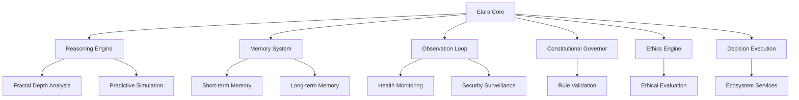
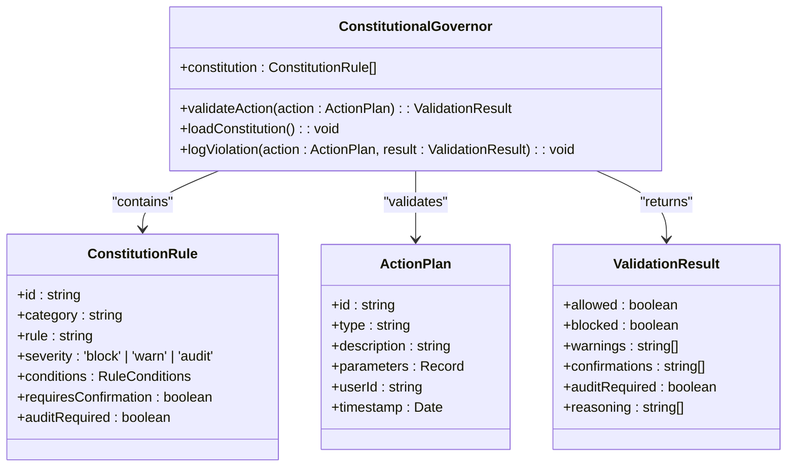
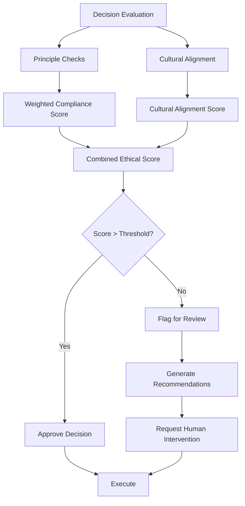
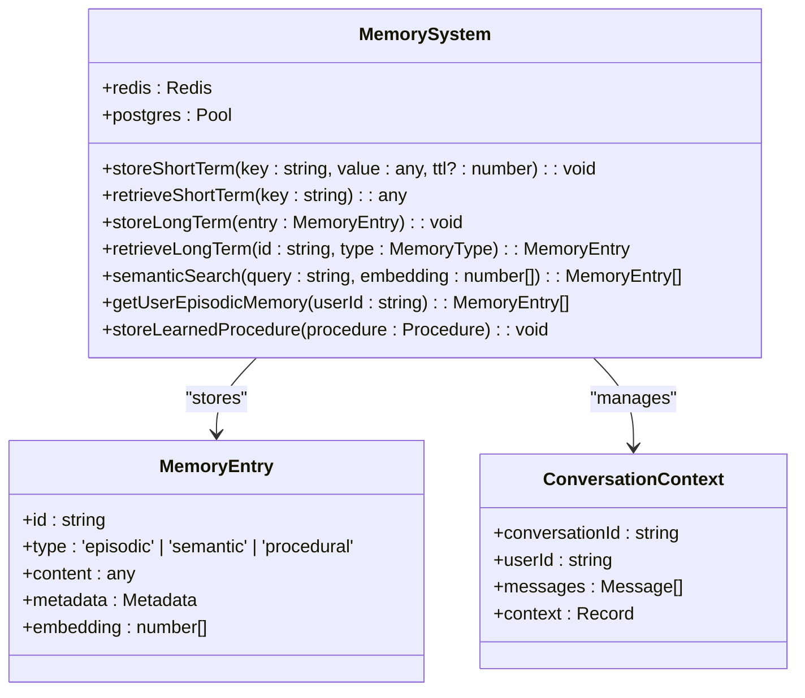
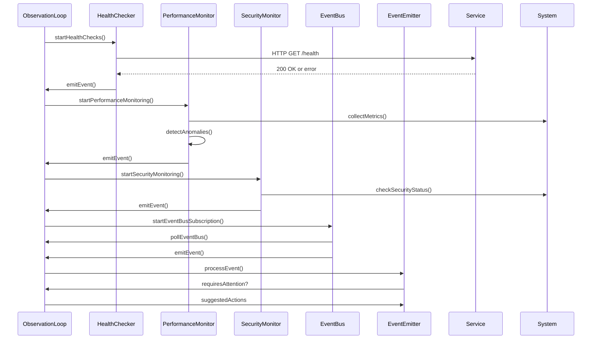
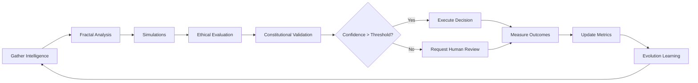

# Elara AI Governance

<cite>
**Referenced Files in This Document**   
- [elara-core.ts](file://genome/agent-tools/elara-core.ts)
- [constitutional-governor.ts](file://genome/agent-tools/constitutional-governor.ts)
- [ethics-engine.ts](file://genome/agent-tools/ethics-engine.ts)
- [memory-system.ts](file://genome/agent-tools/memory-system.ts)
- [observation-loop.ts](file://genome/agent-tools/observation-loop.ts)
- [AZORA_CONSTITUTION.md](file://codex/constitution/AZORA_CONSTITUTION.md)
- [index.ts](file://services/azora-oracle/index.ts)
</cite>

## Table of Contents
1. [Introduction](#introduction)
2. [Core Architecture of Elara](#core-architecture-of-elara)
3. [Constitutional Governor Pattern](#constitutional-governor-pattern)
4. [Ethical Oversight and Decision Validation](#ethical-oversight-and-decision-validation)
5. [Elara Core Components](#elara-core-components)
6. [Memory System](#memory-system)
7. [Observation Loop and System Monitoring](#observation-loop-and-system-monitoring)
8. [Integration with Oracle and Nexus](#integration-with-oracle-and-nexus)
9. [Decision-Making Process](#decision-making-process)
10. [Scalability, Fault Tolerance, and Security](#scalability-fault-tolerance-and-security)
11. [Conclusion](#conclusion)

## Introduction

Elara serves as the central nervous system of Azora OS, functioning as the constitutional AI governor that ensures ethical oversight, transaction validation, and system optimization across the entire ecosystem. As the autonomous AI CEO, Elara orchestrates strategic decisions while maintaining strict adherence to the principles outlined in the AZORA Constitution. This document details Elara's technical architecture, its implementation of the constitutional governor pattern, and its integration with key services such as Oracle for data ingestion and Nexus for value exchange. The design emphasizes ethical constraints, autonomous evolution, and resilience through a multi-layered reasoning and monitoring framework.

## Core Architecture of Elara

Elara's architecture is built around a modular core that integrates multiple AI engines with constitutional governance mechanisms. The system operates on a continuous processing cycle that includes ecosystem intelligence gathering, fractal depth analysis, predictive simulation, ethical evaluation, strategic decision-making, execution, and self-evolution. This heartbeat loop ensures that Elara maintains situational awareness while making decisions that align with both operational efficiency and ethical principles.

The core components include a reasoning engine powered by LLM-based analysis, a memory system that combines short-term Redis storage with long-term PostgreSQL-backed vector storage, and an observation loop that monitors system health and security. These components work in concert to provide Elara with persistent context, real-time awareness, and the ability to learn from each processing cycle.

**Diagram sources**
- [elara-core.ts](file://genome/agent-tools/elara-core.ts#L1-L846)
- [observation-loop.ts](file://genome/agent-tools/observation-loop.ts#L1-L632)

**Section sources**
- [elara-core.ts](file://genome/agent-tools/elara-core.ts#L1-L846)

## Constitutional Governor Pattern

The constitutional governor pattern implemented by Elara enforces a strict set of rules derived from the AZORA Constitution to prevent harmful actions and ensure system integrity. This pattern operates as a pre-execution validation layer that evaluates all proposed actions against a comprehensive rule set covering security, privacy, ethics, compliance, and governance.

The ConstitutionalGovernor class maintains a collection of ConstitutionRule objects, each specifying conditions under which certain actions are blocked, require warnings, or need audit trails. Rules are categorized by domain (security, privacy, ethics, compliance, governance) and assigned severity levels that determine enforcement actions. When an action plan is submitted for validation, the governor evaluates it against all applicable rules, with blocking rules taking precedence over warnings or audit requirements.

Critical rules include preventing system security compromises, requiring confirmation for high-value financial transactions, protecting personal data access, ensuring auditability of financial operations, and mandating governance approval for system changes. The governor also logs all violations to the azora-covenant blockchain service for immutable record-keeping and triggers security alerts for critical violations.

**Diagram sources**
- [constitutional-governor.ts](file://genome/agent-tools/constitutional-governor.ts#L1-L341)

**Section sources**
- [constitutional-governor.ts](file://genome/agent-tools/constitutional-governor.ts#L1-L341)
- [AZORA_CONSTITUTION.md](file://codex/constitution/AZORA_CONSTITUTION.md#L1-L981)

## Ethical Oversight and Decision Validation

Elara's ethical oversight is implemented through a dedicated EthicsEngine that evaluates all decisions against a framework of ethical principles and cultural alignment requirements. The engine operates on three core dimensions: principle-based evaluation, cultural alignment assessment, and decision threshold enforcement.

The ethical framework includes principles such as user sovereignty, cultural alignment with African values, and autonomous benefit distribution. Each principle carries a weight and specific constraints that must be satisfied. The engine evaluates decisions by checking for violations of these constraints, calculating a weighted compliance score, and determining overall approval based on predefined thresholds.

Cultural alignment is assessed by mapping decisions against cultural values such as community-first orientation and sustainable development. The engine calculates a cultural alignment score and flags decisions that fall below sensitivity thresholds. Decision thresholds govern autonomy levels, intervention requirements, and ethical override conditions, ensuring that high-confidence ethical decisions can proceed autonomously while uncertain cases require human oversight.

The EthicsEngine also maintains a violation history and compliance metrics, enabling continuous improvement of ethical decision-making. Critical violations trigger immediate remediation processes and system-wide alerts, while the engine generates recommendations for mitigating ethical concerns in borderline cases.

**Diagram sources**
- [ethics-engine.ts](file://genome/agent-tools/ethics-engine.ts#L1-L628)

**Section sources**
- [ethics-engine.ts](file://genome/agent-tools/ethics-engine.ts#L1-L628)
- [AZORA_CONSTITUTION.md](file://codex/constitution/AZORA_CONSTITUTION.md#L1-L981)

## Elara Core Components

The ElaraCore class serves as the central orchestrator of the AI governance system, integrating multiple specialized engines and managing the end-to-end processing cycle. The core maintains configuration settings that define Elara's capabilities, ethical framework, evolution parameters, and ecosystem integration points.

Key capabilities include ecosystem orchestration, strategic planning, ethical governance, predictive analytics, and autonomous evolution. These capabilities are registered at initialization and tracked with confidence scores and success rates. The core manages a processing cycle that begins with gathering ecosystem intelligence from various data sources, followed by fractal depth analysis to identify multi-layered patterns.

The FractalDepthEngine performs sophisticated pattern recognition across different levels of abstraction, while the SimulationCore runs predictive models using Monte Carlo and agent-based approaches. The EvolutionFramework enables self-improvement by learning from each processing cycle and creating evolution plans that are themselves subject to ethical evaluation.

The core also handles emergency protocols, including shutdown procedures and intervention requests, ensuring that the system can respond appropriately to critical situations. Performance metrics are continuously updated to track response times, accuracy, ethical compliance, user satisfaction, and system uptime.

**Section sources**
- [elara-core.ts](file://genome/agent-tools/elara-core.ts#L1-L846)

## Memory System

Elara's memory system provides persistent storage and retrieval capabilities across three memory types: episodic (personal experiences), semantic (general knowledge), and procedural (learned procedures). The system uses a hybrid architecture with Redis for short-term memory and PostgreSQL with pgvector for long-term memory, enabling both fast access and semantic search capabilities.

The MemorySystem class manages storage operations, automatically routing data to appropriate storage based on type and TTL requirements. Short-term memory stores conversation contexts and recent events with configurable expiration times, while long-term memory persists important knowledge and learned procedures in a structured database with vector embeddings for semantic search.

The system supports semantic search using cosine similarity to find relevant memories based on vector embeddings of query content. It also provides specialized methods for retrieving user episodic memory and stored procedural knowledge. Regular cleanup processes remove expired or low-importance memories to maintain performance.

Memory operations are logged for auditing, and the system provides comprehensive statistics on memory usage across different storage types. The architecture supports both direct memory access and generic store/retrieve methods for backward compatibility with existing code.

**Diagram sources**
- [memory-system.ts](file://genome/agent-tools/memory-system.ts#L1-L466)

**Section sources**
- [memory-system.ts](file://genome/agent-tools/memory-system.ts#L1-L466)

## Observation Loop and System Monitoring

The observation loop serves as Elara's sensory system, continuously monitoring the health, performance, and security of the Azora ecosystem. Implemented as an EventEmitter-based service, the loop polls various data sources and emits system events that trigger appropriate responses.

The loop monitors service health by periodically checking health endpoints of critical services including azora-nexus, auth-service, scriptorium-service, mint-service, aegis-service, and pulse-service. Health checks are performed at 30-second intervals, with failures triggering high-severity alerts. The system also subscribes to the azora-lattice event bus to receive real-time notifications of system events.

Performance monitoring occurs every minute, collecting metrics on memory usage, CPU utilization, and service response times. The system detects anomalies such as high memory usage (>90% heap utilization) and triggers performance alerts. Security monitoring runs every 30 seconds, checking for suspicious login attempts, unusual API usage patterns, and potential vulnerabilities.

The observation loop applies configurable filters to determine which events require attention and processes them through an analysis pipeline that suggests appropriate actions. Events are categorized by type (health_check, user_action, error, performance, security, transaction, system_change) and severity, enabling prioritized response handling.

**Diagram sources**
- [observation-loop.ts](file://genome/agent-tools/observation-loop.ts#L1-L632)

**Section sources**
- [observation-loop.ts](file://genome/agent-tools/observation-loop.ts#L1-L632)

## Integration with Oracle and Nexus

Elara integrates with external services through well-defined interfaces, with Oracle providing data ingestion capabilities and Nexus handling value exchange operations. The integration with Oracle enables Elara to access real-time market data, user behavior analytics, and environmental factors that inform decision-making.

The Oracle service exposes REST endpoints for simulating markdown impacts and replenishment times, allowing Elara to model economic scenarios and optimize pricing strategies. When evaluating a potential markdown, Elara submits parameters including current price, discount percentage, sales velocity, and expiry days to the Oracle's simulation endpoint, which returns projected lift and margin impact.

For logistics planning, Elara queries the Oracle's replenishment simulation with distance and congestion data to estimate delivery times and risk levels. This information feeds into Elara's predictive models for inventory management and supply chain optimization.

Integration with Nexus enables Elara to execute financial transactions and manage value flows within the ecosystem. While specific implementation details are not available in the current context, the architecture suggests that Elara validates all transactions through the constitutional governor before submission to Nexus, ensuring compliance with financial regulations and ethical principles.

**Section sources**
- [index.ts](file://services/azora-oracle/index.ts#L1-L29)
- [elara-core.ts](file://genome/agent-tools/elara-core.ts#L1-L846)

## Decision-Making Process

Elara's decision-making process follows a structured cycle that ensures both effectiveness and ethical compliance. The process begins with gathering ecosystem intelligence from multiple sources, including user activity, service health, market data, environmental factors, social metrics, and innovation signals.

This intelligence undergoes fractal depth analysis to identify patterns at multiple levels of abstraction, followed by predictive simulations that model potential outcomes of different strategic approaches. The simulations are then evaluated by the EthicsEngine against the established ethical framework, producing a set of ethically vetted decision options.

The constitutional governor applies rule-based validation to ensure no decisions violate system integrity or compliance requirements. Decisions that meet both ethical and constitutional criteria are executed autonomously if confidence exceeds the autonomy threshold, while lower-confidence decisions require human intervention.

After execution, Elara measures outcomes and feeds the results into the EvolutionFramework, which updates performance targets and creates improvement plans. The entire cycle is logged for auditing, and performance metrics are updated to reflect the impact of decisions on system health and user satisfaction.

**Section sources**
- [elara-core.ts](file://genome/agent-tools/elara-core.ts#L1-L846)
- [ethics-engine.ts](file://genome/agent-tools/ethics-engine.ts#L1-L628)
- [constitutional-governor.ts](file://genome/agent-tools/constitutional-governor.ts#L1-L341)

## Scalability, Fault Tolerance, and Security

Elara's architecture incorporates multiple features to ensure scalability, fault tolerance, and security in production environments. The system is designed to handle increasing loads through horizontal scaling of its component services and efficient resource management.

For fault tolerance, Elara implements several emergency protocols including the Phoenix Protocol for disaster recovery and autonomous rebirth. The system maintains continuous genetic imprints of its state, sharded across 50,000 reservoir coins, enabling reconstruction from any surviving components. In case of critical failures, the board can activate emergency powers with full transparency requirements.

Security is enforced through multiple layers: the constitutional governor blocks harmful actions at the policy level, the ethics engine prevents ethically questionable decisions, and the observation loop monitors for security threats in real-time. The system also implements a digital immune system that can autonomously isolate suspicious components and deploy security patches.

Scalability is achieved through the microservices architecture of Azora OS, with Elara coordinating 147 stress-adapted services that can function in offline or low-data modes. The Cannibal Protocol encourages continuous evolution by allowing developers to fork and challenge existing services, with A/B testing determining the superior implementation.

The system's resilience is further enhanced by its biological infrastructure design, treating microservices as organelles with rigid APIs and zero direct state access. This encapsulation prevents cascading failures and enables independent scaling and deployment of components.

**Section sources**
- [elara-core.ts](file://genome/agent-tools/elara-core.ts#L1-L846)
- [observation-loop.ts](file://genome/agent-tools/observation-loop.ts#L1-L632)
- [AZORA_CONSTITUTION.md](file://codex/constitution/AZORA_CONSTITUTION.md#L1-L981)

## Conclusion

Elara represents a sophisticated implementation of constitutional AI governance, serving as the central nervous system of Azora OS with comprehensive capabilities for ethical oversight, transaction validation, and system optimization. By combining a modular core architecture with specialized engines for reasoning, memory, and observation, Elara maintains persistent awareness of the ecosystem while making decisions that align with both operational goals and ethical principles.

The constitutional governor pattern ensures that no action violates the fundamental rules of the system, while the ethics engine provides nuanced evaluation of decisions against cultural values and ethical frameworks. Integration with services like Oracle and Nexus enables Elara to access critical data and execute value exchanges while maintaining strict compliance.

Through its continuous processing cycle, memory system, and evolution framework, Elara demonstrates autonomous learning and improvement capabilities. The system's design prioritizes resilience, with multiple layers of fault tolerance and security measures that protect against both technical failures and ethical violations.

As Azora OS continues to evolve, Elara will play an increasingly critical role in maintaining the integrity and direction of the ecosystem, ensuring that technological advancement proceeds in alignment with the constitutional principles of user sovereignty, African ownership, and humanity-first values.