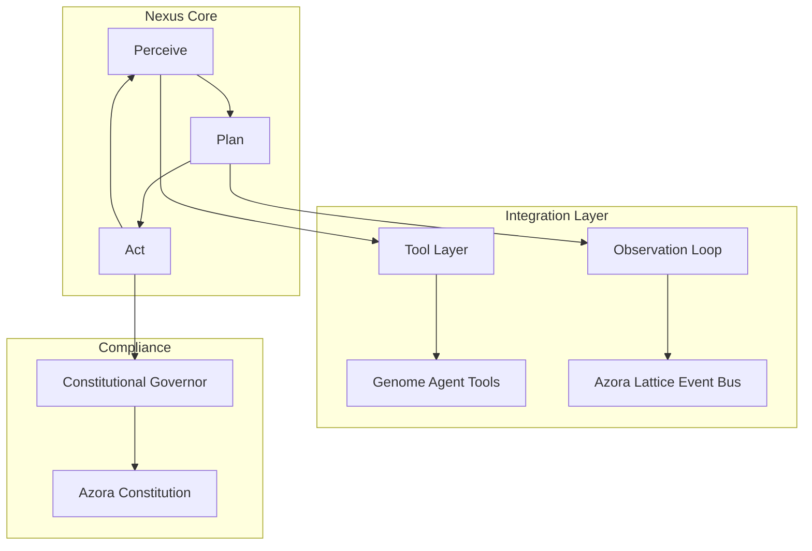
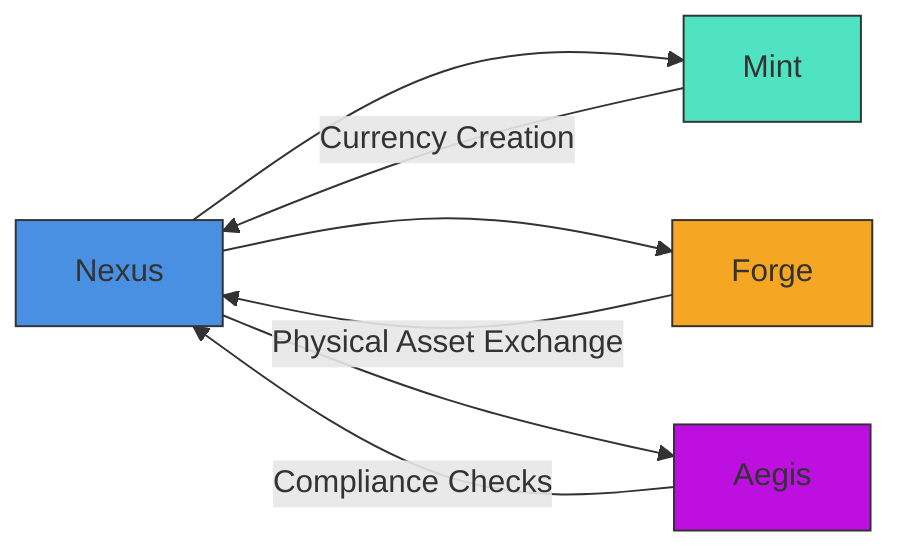
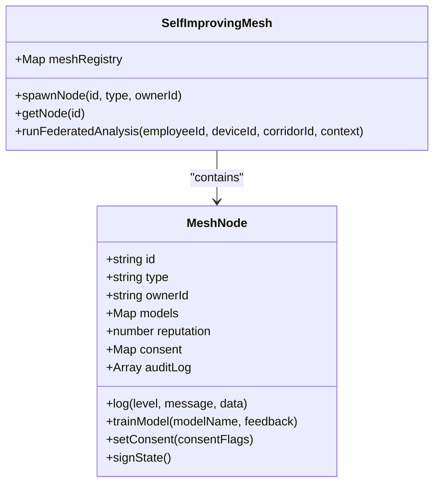
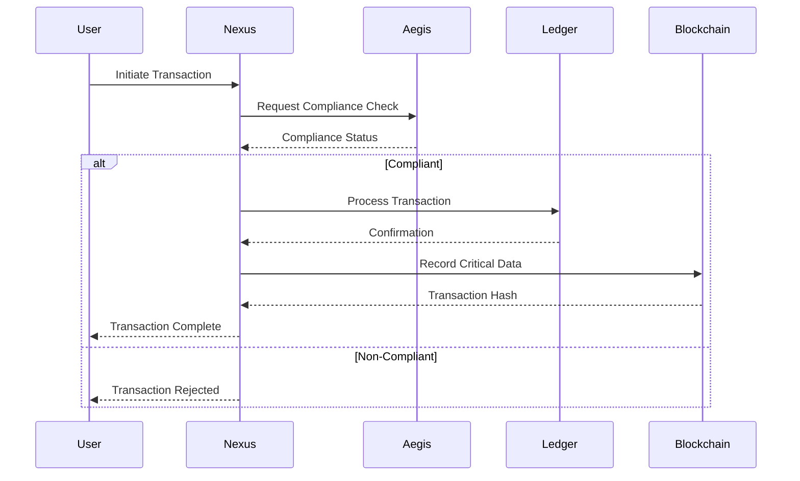

# Nexus Value Exchange

<cite>
**Referenced Files in This Document**   
- [nexus-agent.ts](file://genome/ai-hierarchy/specialized-agents/nexus-agent.ts)
- [selfImprovingMesh.js](file://services/azora-nexus/selfImprovingMesh.js)
- [index.js](file://services/azora-nexus/services/ledger/index.js)
- [index.js](file://services/azora-nexus/services/blockchain/index.js)
- [api.js](file://routes/api.js)
- [GENESIS_PROTOCOL.ts](file://GENESIS_PROTOCOL.ts)
- [azora-aegis/README.md](file://azora/azora-aegis/README.md)
- [README.md](file://services/azora-nexus/README.md)
</cite>

## Table of Contents
1. [Introduction](#introduction)
2. [Core Architecture](#core-architecture)
3. [Ledger and Blockchain Services](#ledger-and-blockchain-services)
4. [Integration with Mint, Forge, and Aegis](#integration-with-mint-forge-and-aegis)
5. [Prediction Models and Self-Improving Mesh](#prediction-models-and-self-improving-mesh)
6. [Transaction Flow and Consensus Mechanisms](#transaction-flow-and-consensus-mechanisms)
7. [Scalability, Finality, and Reconciliation](#scalability-finality-and-reconciliation)

## Introduction
Nexus Value Exchange functions as the circulatory system of Azora OS, enabling seamless flow of value across the ecosystem. It serves as the Pillar of Transactional Truth, providing a frictionless marketplace for peer-to-peer exchange of goods, services, and labor. Nexus implements the 5% Protocol Integrated Value Capture (PIVC), where a transparent transaction fee fuels system growth and provides universal basic opportunity. The system integrates advanced AI-driven analytics, self-improving mesh networks, and constitutional compliance to create a self-regulating economic organism.

**Section sources**
- [GENESIS_PROTOCOL.ts](file://GENESIS_PROTOCOL.ts#L100-L117)
- [README.md](file://services/azora-nexus/README.md#L0-L28)

## Core Architecture
The Nexus Value Exchange architecture consists of interconnected services that facilitate value flow while maintaining system integrity. At its core, Nexus operates as an autonomous AI agent with six primary capabilities: Listen (Perceive), Do (Act), Help (Assist), Heal (Maintain), Develop (Evolve), and Discover (Research). The system employs a recursive Perceive → Plan → Act cycle to manage agent state and execute complex tasks across the enterprise ecosystem. Nexus integrates with the Azora Constitution through a Constitutional Governor module that ensures all actions comply with established principles.

**Diagram sources**
- [README.md](file://services/azora-nexus/README.md#L30-L50)
- [nexus-agent.ts](file://genome/ai-hierarchy/specialized-agents/nexus-agent.ts#L0-L37)

## Ledger and Blockchain Services
Nexus incorporates a dual-layer transaction system comprising a ledger service for tracking balances and a blockchain service for on-chain transactions. The ledger service provides real-time balance tracking with high throughput, while the blockchain service ensures immutability and transparency for critical operations. The ledger maintains a state root with cryptographic signatures, creating checkpoints that capture the system's state at specific intervals. This hybrid approach enables real-time settlement with the security guarantees of blockchain technology.

**Section sources**
- [index.js](file://services/azora-nexus/services/ledger/index.js#L0-L12)
- [ledgerApi.ts](file://services/azora-covenant/src/ledgerApi.ts#L44-L96)

## Integration with Mint, Forge, and Aegis
Nexus integrates with key Azora OS components to create a cohesive economic ecosystem. With Mint, Nexus facilitates currency creation and management, enabling the minting of AZR tokens and a-Tokens for local economies. Integration with Forge allows Nexus to exchange physical assets through AI-managed, robotically operated systems. Aegis provides compliance checks, ensuring all transactions adhere to the Azora Constitution. These integrations create a closed-loop system where value flows seamlessly between digital and physical domains while maintaining ethical and legal compliance.

**Diagram sources**
- [GENESIS_PROTOCOL.ts](file://GENESIS_PROTOCOL.ts#L100-L135)
- [azora-aegis/README.md](file://azora/azora-aegis/README.md#L146-L154)

## Prediction Models and Self-Improving Mesh
Nexus employs AI-driven prediction models to optimize value routing and a self-improving mesh that adapts to market conditions. The prediction models analyze transaction patterns, market trends, and user behavior to identify optimal value flows. The self-improving mesh consists of interconnected nodes that represent various entities in the ecosystem, including corridors, devices, and employees. Each node maintains its own reputation score and audit log, enabling federated learning and personalized AI models. The mesh continuously evolves by incorporating feedback and optimizing its structure based on real-world performance.

**Diagram sources**
- [selfImprovingMesh.js](file://services/azora-nexus/selfImprovingMesh.js#L0-L50)
- [nexus-agent.ts](file://genome/ai-hierarchy/specialized-agents/nexus-agent.ts#L0-L37)

## Transaction Flow and Consensus Mechanisms
The transaction flow in Nexus follows a structured process that ensures integrity and efficiency. When a transaction is initiated, it first undergoes compliance checks through Aegis to verify constitutional adherence. The transaction is then processed by the ledger service for real-time settlement, with critical operations recorded on the blockchain for immutability. Cross-service coordination is achieved through a consensus mechanism that combines constitutional governance with AI-driven optimization. This hybrid approach ensures that transactions are both efficient and trustworthy.

**Diagram sources**
- [api.js](file://routes/api.js#L442-L503)
- [GENESIS_PROTOCOL.ts](file://GENESIS_PROTOCOL.ts#L100-L117)

## Scalability, Finality, and Reconciliation
Nexus addresses scalability through a hybrid architecture that separates high-throughput operations from immutable record-keeping. The ledger service handles the majority of transactions with sub-second finality, while the blockchain service provides cryptographic proof for critical operations. Reconciliation processes ensure consistency between the ledger and blockchain layers, with periodic checkpoints verifying data integrity. The system's metabolic efficiency is monitored through corporate metabolism metrics, which track resource inputs and outputs to optimize performance. This approach enables Nexus to scale to millions of transactions per second while maintaining the security and transparency required for a sovereign economic ecosystem.

**Section sources**
- [selfImprovingMesh.js](file://services/azora-nexus/selfImprovingMesh.js#L83-L136)
- [corporate-metabolism.ts](file://genome/agent-tools/corporate-metabolism.ts#L255-L293)