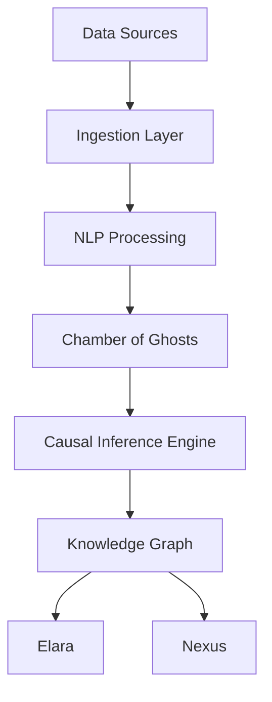
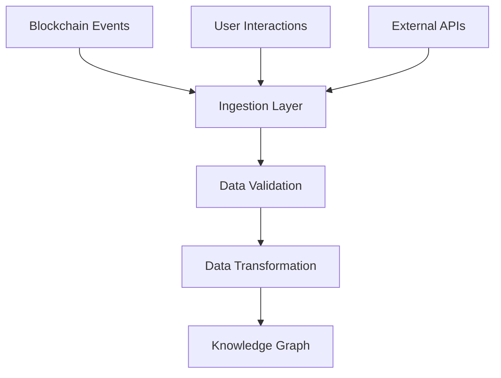
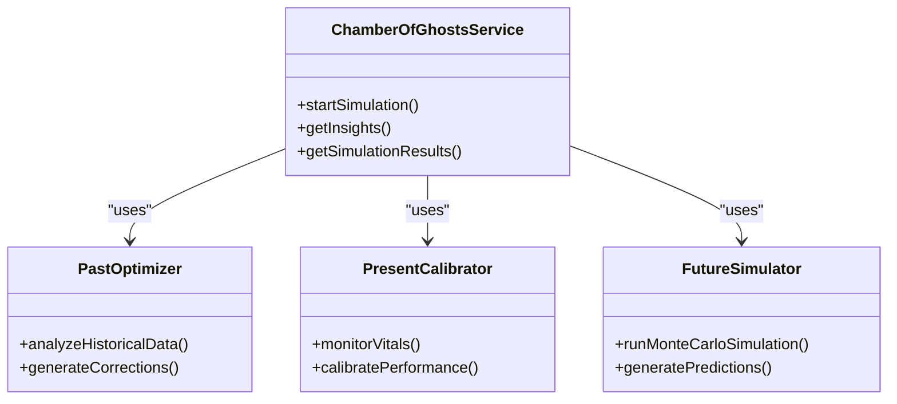
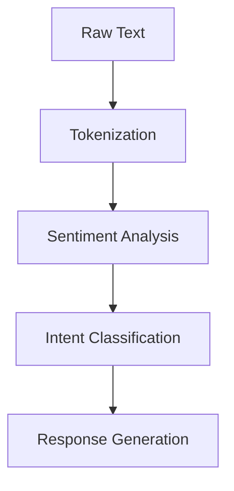
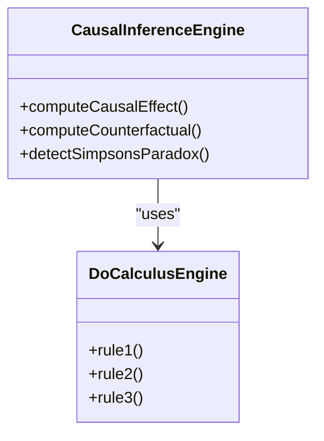
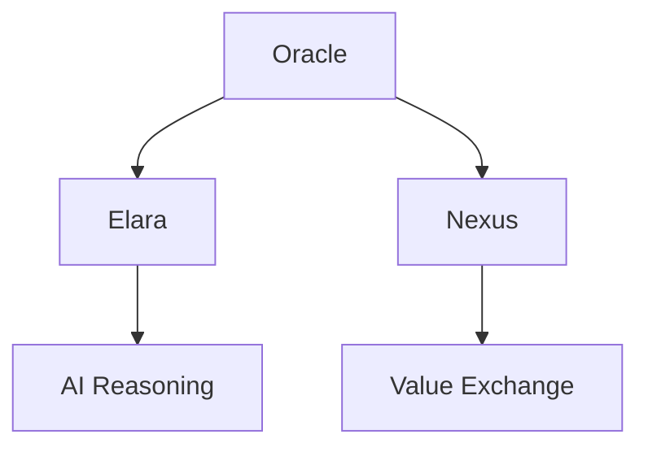
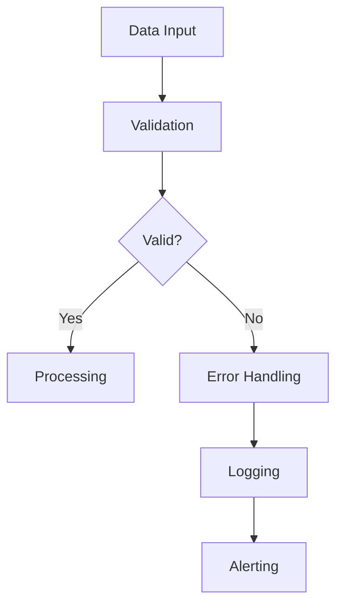
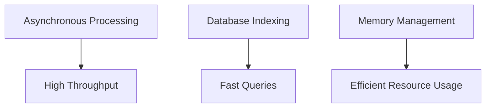

# Oracle Data Ingestion

<cite>
**Referenced Files in This Document**   
- [causal-inference-engine.ts](file://genome/agent-tools/causal-inference-engine.ts)
- [oracle-service.js](file://services/azora-oracle/oracle-service.js)
- [README.md](file://services/azora-oracle/README.md)
- [azora-nlp.js](file://infrastructure/azora-ai-models/azora-nlp.js)
- [category-theory-foundation.ts](file://genome/agent-tools/category-theory-foundation.ts)
- [corporate-metabolism.ts](file://genome/agent-tools/corporate-metabolism.ts)
- [NeuralIntent.ts](file://services/azora-nexus/src/models/NeuralIntent.ts)
- [NeuralIntentService.ts](file://services/azora-nexus/src/services/NeuralIntentService.ts)
</cite>

## Table of Contents
1. [Introduction](#introduction)
2. [Architecture Overview](#architecture-overview)
3. [Data Ingestion Pipeline](#data-ingestion-pipeline)
4. [Chamber of Ghosts Service](#chamber-of-ghosts-service)
5. [NLP Processing](#nlp-processing)
6. [Causal Inference Engine](#causal-inference-engine)
7. [Integration with Elara and Nexus](#integration-with-elara-and-nexus)
8. [Data Validation and Error Handling](#data-validation-and-error-handling)
9. [Performance Optimization](#performance-optimization)
10. [Conclusion](#conclusion)

## Introduction

The Oracle Data Ingestion component serves as the sensory cortex of Azora OS, responsible for ingesting, processing, and transforming data from diverse sources into a causal knowledge graph. This documentation details the technical architecture of the data ingestion pipeline, including data collection from blockchain events, user interactions, and external APIs. It explains the implementation of the Chamber of Ghosts service for anomaly detection, NLP processing for unstructured data, and the causal inference engine that creates relationships between data points. The integration points with Elara for AI reasoning and Nexus for value exchange decisions are also described.

## Architecture Overview

The Oracle Data Ingestion system is designed as a modular, scalable pipeline that processes data from multiple sources and transforms it into actionable insights. The architecture consists of several key components:

**Diagram sources**
- [oracle-service.js](file://services/azora-oracle/oracle-service.js)
- [azora-nlp.js](file://infrastructure/azora-ai-models/azora-nlp.js)
- [causal-inference-engine.ts](file://genome/agent-tools/causal-inference-engine.ts)

**Section sources**
- [oracle-service.js](file://services/azora-oracle/oracle-service.js)
- [azora-nlp.js](file://infrastructure/azora-ai-models/azora-nlp.js)

## Data Ingestion Pipeline

The data ingestion pipeline collects data from various sources, including blockchain events, user interactions, and external APIs. The pipeline is designed to handle high volumes of data with minimal latency.

**Diagram sources**
- [oracle-service.js](file://services/azora-oracle/oracle-service.js)
- [NeuralIntent.ts](file://services/azora-nexus/src/models/NeuralIntent.ts)

**Section sources**
- [oracle-service.js](file://services/azora-oracle/oracle-service.js)
- [NeuralIntent.ts](file://services/azora-nexus/src/models/NeuralIntent.ts)

## Chamber of Ghosts Service

The Chamber of Ghosts service is responsible for anomaly detection and cognitive simulation. It consists of three AI "ghosts" that perform Monte Carlo analysis, historical optimization, and future prediction.

### Ghost of the Past
- **Purpose**: Analyzes historical data to identify patterns and inefficiencies
- **Schedule**: Runs every 6 hours
- **Functions**: Historical ledger analysis, performance pattern recognition, ICV correction generation

### Ghost of the Present
- **Purpose**: Monitors current system vitals and calibrates performance
- **Schedule**: Runs every hour
- **Functions**: Metabolic rate monitoring, neural density analysis, response time optimization

### Ghost of the Future
- **Purpose**: Runs Monte Carlo simulations to predict future scenarios
- **Schedule**: Runs every 12 hours
- **Functions**: Multi-scenario forecasting, risk factor identification, proactive recommendation generation

**Diagram sources**
- [README.md](file://services/azora-oracle/README.md)

**Section sources**
- [README.md](file://services/azora-oracle/README.md)

## NLP Processing

The NLP processing component handles unstructured data using a custom-built natural language processing model. The model is trained on a proprietary dataset and does not rely on external AI dependencies.

**Diagram sources**
- [azora-nlp.js](file://infrastructure/azora-ai-models/azora-nlp.js)

**Section sources**
- [azora-nlp.js](file://infrastructure/azora-ai-models/azora-nlp.js)

## Causal Inference Engine

The causal inference engine implements Judea Pearl's Do-calculus framework for causal reasoning. It constructs causal models from observational data and performs intervention analysis.

**Diagram sources**
- [causal-inference-engine.ts](file://genome/agent-tools/causal-inference-engine.ts)

**Section sources**
- [causal-inference-engine.ts](file://genome/agent-tools/causal-inference-engine.ts)

## Integration with Elara and Nexus

The Oracle Data Ingestion component integrates with Elara for AI reasoning and Nexus for value exchange decisions. Data flows from Oracle to Elara and Nexus through well-defined APIs.

**Diagram sources**
- [category-theory-foundation.ts](file://genome/agent-tools/category-theory-foundation.ts)
- [corporate-metabolism.ts](file://genome/agent-tools/corporate-metabolism.ts)

**Section sources**
- [category-theory-foundation.ts](file://genome/agent-tools/category-theory-foundation.ts)
- [corporate-metabolism.ts](file://genome/agent-tools/corporate-metabolism.ts)

## Data Validation and Error Handling

The data ingestion pipeline includes robust data validation and error handling mechanisms to ensure data integrity and system reliability.

**Diagram sources**
- [oracle-service.js](file://services/azora-oracle/oracle-service.js)

**Section sources**
- [oracle-service.js](file://services/azora-oracle/oracle-service.js)

## Performance Optimization

The Oracle Data Ingestion component is optimized for high performance and scalability. Key optimization techniques include asynchronous processing, database indexing, and memory management.

**Diagram sources**
- [README.md](file://services/azora-oracle/README.md)

**Section sources**
- [README.md](file://services/azora-oracle/README.md)

## Conclusion

The Oracle Data Ingestion component is a critical part of the Azora OS architecture, serving as the sensory cortex that ingests and processes data from various sources into a causal knowledge graph. The system is designed for scalability, reliability, and performance, with robust data validation and error handling mechanisms. The integration with Elara and Nexus enables advanced AI reasoning and value exchange decisions, making Oracle a key enabler of the Azora ecosystem.