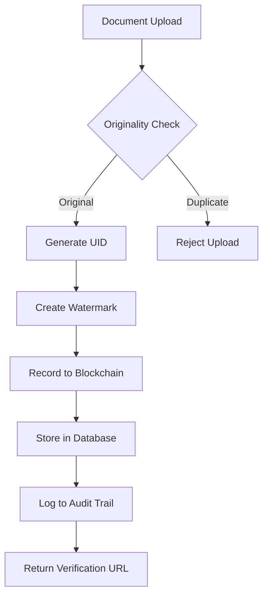
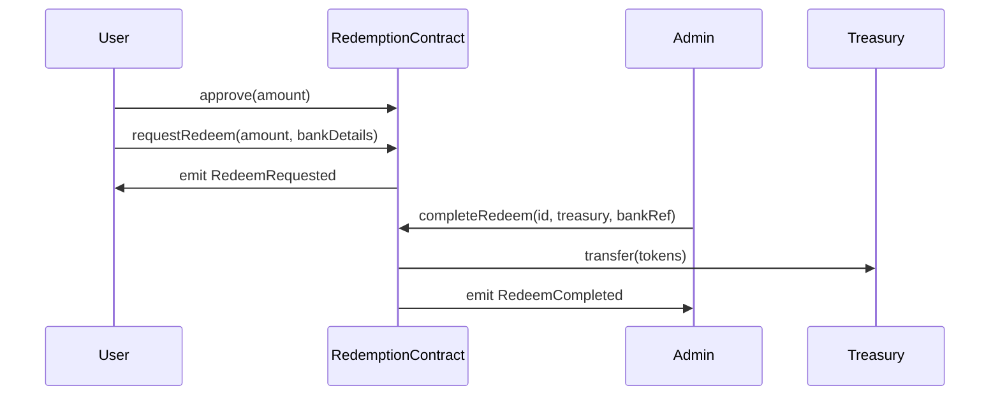
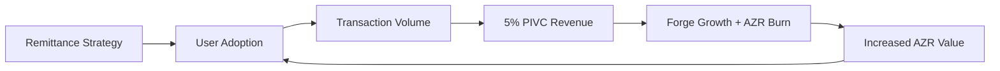
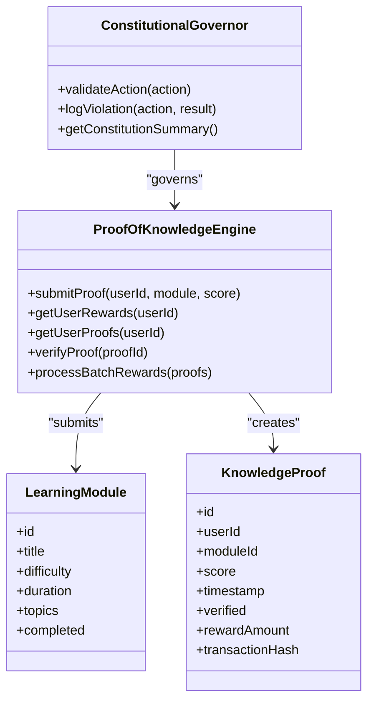

# Four Pillars of Truth

<cite>
**Referenced Files in This Document**   
- [Redemption.sol](file://contracts/Redemption.sol)
- [proof-of-knowledge-engine.ts](file://services/proof-of-knowledge-engine.ts)
- [GENESIS_PROTOCOL.ts](file://GENESIS_PROTOCOL.ts)
- [constitutional-governor.ts](file://genome/agent-tools/constitutional-governor.ts)
- [document-verification-service/index.js](file://organs/document-verification-service/index.js)
</cite>

## Table of Contents
1. [Informational Truth](#informational-truth)
2. [Transactional Truth](#transactional-truth)
3. [Value Truth](#value-truth)
4. [Generative Truth](#generative-truth)

## Informational Truth

Informational truth ensures perfect information symmetry across the Azora ecosystem through immutable, verifiable data logging. This pillar is enforced via blockchain and IPFS-backed systems that guarantee data integrity and auditability. The Oracle component acts as the sensory cortex, ingesting real-time data into a causal knowledge graph to eliminate information asymmetry.

The document verification service implements a 3-way ledger system combining blockchain, database, and audit logs to ensure tamper-proof record keeping. Each document upload generates a unique identifier (UID) and is recorded across all three ledgers, with blockchain serving as the immutable anchor. The system verifies chain integrity by checking hash continuity and proof-of-work validation.

**Diagram sources**
- [document-verification-service/index.js](file://organs/document-verification-service/index.js#L300-L350)

**Section sources**
- [document-verification-service/index.js](file://organs/document-verification-service/index.js#L1-L659)
- [GENESIS_PROTOCOL.ts](file://GENESIS_PROTOCOL.ts#L1-L480)

## Transactional Truth

Transactional truth establishes a frictionless, transparent exchange layer through cryptographic verification in the Redemption.sol smart contract. This contract serves as an escrow mechanism for AZR token redemption to fiat currency, ensuring transactional integrity through immutable smart contract logic.

The redemption process follows a two-step verification pattern: users first request redemption by transferring tokens to the contract, then administrators complete the transaction after bank transfer confirmation. The contract enforces access control through the `onlyAdmin` modifier, restricting completion to authorized addresses. Each transaction emits events that are logged for audit purposes, creating an immutable record of all redemptions.

**Diagram sources**
- [Redemption.sol](file://contracts/Redemption.sol#L1-L151)

**Section sources**
- [Redemption.sol](file://contracts/Redemption.sol#L1-L151)
- [test/Redemption.test.js](file://test/Redemption.test.js#L1-L65)

## Value Truth

Value truth is established through tangible backing via Forge physical assets, creating an asset-backed economic foundation. The Forge network consists of AI-managed, robotically operated physical assets including energy grids, farms, and factories that provide real-world productive capacity. This tangible backing ensures that AZR tokens derive their value from actual economic output rather than speculation.

The economic model implements a two-token protocol where global AZR serves as a deflationary, asset-backed store of value, while local a-Tokens provide stable, 1:1 pegged currencies for daily transactions. The system's metabolic rate, a transparent 5% Protocol Integrated Value Capture (PIVC), funds Forge expansion and AZR buy-and-burn mechanisms, creating a self-reinforcing value appreciation loop.

**Diagram sources**
- [GENESIS_PROTOCOL.ts](file://GENESIS_PROTOCOL.ts#L1-L480)

**Section sources**
- [GENESIS_PROTOCOL.ts](file://GENESIS_PROTOCOL.ts#L1-L480)
- [Redemption.sol](file://contracts/Redemption.sol#L1-L151)

## Generative Truth

Generative truth is manifested through the Proof-of-Knowledge engine, which establishes provable causal contribution as the basis for reward distribution. This system closes the loop between education and economic rewards by mathematically tying individual contributions to verifiable knowledge acquisition and skill development.

The Proof-of-Knowledge engine calculates rewards based on module difficulty and performance metrics, with rewards distributed in AZR tokens. The system maintains a verifiable record of all knowledge proofs, including user ID, module ID, score, timestamp, and transaction hash. Each proof is cryptographically verified to ensure authenticity and prevent fraud.

AI governance is enforced through the Constitutional Governor, which applies a set of immutable rules to all system actions. These rules cover security, privacy, ethics, compliance, and governance domains, with actions requiring confirmation or being blocked based on severity levels. The governor maintains a comprehensive audit trail of all decisions and violations.

**Diagram sources**
- [proof-of-knowledge-engine.ts](file://services/proof-of-knowledge-engine.ts#L1-L235)
- [constitutional-governor.ts](file://genome/agent-tools/constitutional-governor.ts#L1-L340)

**Section sources**
- [proof-of-knowledge-engine.ts](file://services/proof-of-knowledge-engine.ts#L1-L235)
- [pok-api.ts](file://services/pok-api.ts#L1-L151)
- [constitutional-governor.ts](file://genome/agent-tools/constitutional-governor.ts#L1-L340)