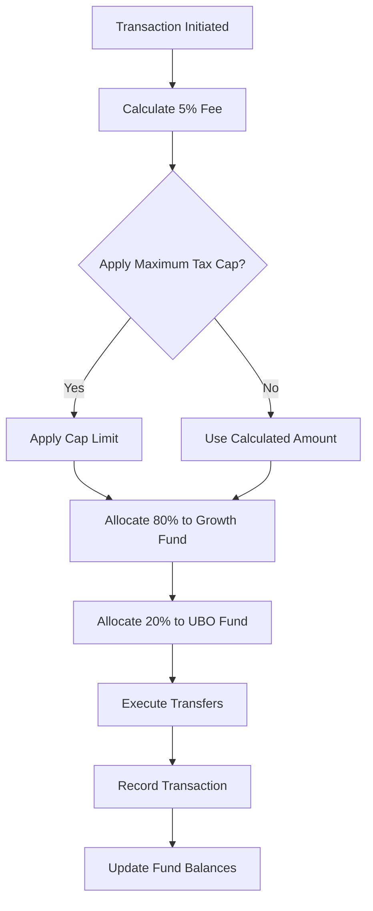

# Metabolic Reinvestment

<cite>
**Referenced Files in This Document**   
- [PIVCTaxation.sol](file://services/azora-covenant/contracts_backup/PIVCTaxation.sol)
- [advanced-mint-mine.ts](file://services/azora-mint/advanced-mint-mine.ts)
- [distribute-ubo.ts](file://scripts/distribute-ubo.ts)
- [deploy-pivc-taxation.js](file://services/azora-covenant/scripts/deploy-pivc-taxation.js)
- [page.jsx](file://ui/app/services/mint/page.jsx)
</cite>

## Table of Contents
1. [Introduction](#introduction)
2. [PIVC Mechanism Overview](#pivc-mechanism-overview)
3. [Fund Allocation Structure](#fund-allocation-structure)
4. [Implementation in Minting and Mining Engine](#implementation-in-minting-and-mining-engine)
5. [Reinvestment Calculations](#reinvestment-calculations)
6. [Self-Sustaining Economic Model](#self-sustaining-economic-model)
7. [Code Implementation Examples](#code-implementation-examples)
8. [Conclusion](#conclusion)

## Introduction

The Metabolic Reinvestment system represents a revolutionary approach to economic sustainability in the Azora ecosystem. This mechanism transforms transactional energy into fuel for system growth through the Protocol Integrated Value Capture (PIVC) framework. Rather than relying on external funding sources, the system creates a self-sustaining economy where usage directly funds expansion and development. This document details how fees are automatically reinvested into Forge infrastructure and the Universal Basic Opportunity (UBO) fund, creating a closed-loop economic system that grows organically through participation.

## PIVC Mechanism Overview

The 5% PIVC (Protocol Integrated Value Capture) mechanism serves as the metabolic engine of the Azora ecosystem, capturing value from every economic transaction. This system operates on the principle that network usage should directly fund network growth, creating a self-reinforcing cycle of expansion. The PIVC tax is automatically applied to all transactions within the ecosystem, with the collected fees immediately allocated to designated funds according to a predetermined distribution model.

The mechanism functions as a continuous feedback loop: as more users participate and conduct transactions, more fees are generated, which in turn funds further development and expansion of the infrastructure. This creates exponential growth potential, where increased usage leads to improved capabilities, which attracts more users, generating even more reinvestment capital. The system eliminates the need for traditional fundraising methods by making the protocol itself the primary source of funding for its evolution.

**Section sources**
- [PIVCTaxation.sol](file://services/azora-covenant/contracts_backup/PIVCTaxation.sol#L1-L50)

## Fund Allocation Structure

The PIVC mechanism allocates the 5% transaction fee according to a strategic distribution model designed to balance immediate growth with long-term sustainability. The allocation is divided into two primary components: 4% directed to the Growth Fund and 1% allocated to the UBO (Universal Basic Opportunity) fund.

The Growth Fund receives 4% of all transaction fees and is dedicated to Forge infrastructure expansion and AZR buy-and-burn mechanisms. This allocation fuels technical development, server upgrades, and system optimizations that enhance the overall performance and capacity of the ecosystem. The buy-and-burn component helps maintain token scarcity and value stability by periodically removing tokens from circulation.

The UBO fund receives 1% of transaction fees and powers Universal Basic Assets and the Proof-of-Contribution system. This fund supports educational initiatives, knowledge rewards, and economic empowerment programs that distribute opportunity across the global community. By funding universal access to resources and rewards for valuable contributions, the UBO fund ensures equitable participation and incentivizes positive network effects.

**Diagram sources**
- [PIVCTaxation.sol](file://services/azora-covenant/contracts_backup/PIVCTaxation.sol#L20-L35)

## Implementation in Minting and Mining Engine

The metabolic reinvestment system is deeply integrated into the minting and mining engine, ensuring seamless fee collection and distribution. The implementation leverages smart contract automation to handle the entire reinvestment process without manual intervention. When a transaction occurs, the PIVC taxation system automatically calculates the 5% fee, collects it from the transacting party, and distributes it to the designated funds according to the allocation rules.

The minting engine works in conjunction with the taxation system to ensure that new token creation is balanced by value capture from transactions. As new tokens are minted through value-creating activities like learning or contribution, the transactional fees from these activities simultaneously fund the ecosystem's expansion. This creates a harmonious economic model where token supply growth is counterbalanced by systematic value recapture and reinvestment.

The mining component further enhances this system by rewarding users for activities that generate network value, while simultaneously subjecting those rewards to the PIVC mechanism when used in transactions. This ensures that even incentivized participation contributes to the ongoing funding of system development, creating a closed-loop economy where all economic activity supports the protocol's evolution.

**Section sources**
- [advanced-mint-mine.ts](file://services/azora-mint/advanced-mint-mine.ts#L0-L50)
- [PIVCTaxation.sol](file://services/azora-covenant/contracts_backup/PIVCTaxation.sol#L150-L200)

## Reinvestment Calculations

The reinvestment calculations follow a precise mathematical model that ensures consistent and transparent fee distribution. The system uses basis points to represent percentages, with the 5% PIVC rate equivalent to 500 basis points. When a transaction occurs, the tax amount is calculated using the formula: `taxAmount = (grossAmount * TAX_RATE) / 10000`, where TAX_RATE is 500.

For example, on a transaction of 10,000 AZR tokens, the calculation would be: `(10,000 * 500) / 10,000 = 500 AZR` in fees. This 500 AZR is then distributed as 400 AZR (80% of the fee) to the Growth Fund and 100 AZR (20% of the fee) to the UBO fund, maintaining the 4:1 ratio between the two funds.

The system includes safeguards to prevent abuse, including a maximum tax per transaction limit and verification that the total allocation percentages do not exceed 100%. Any rounding discrepancies are automatically directed to the Growth Fund to ensure no funds remain unallocated. The calculations are performed on-chain, providing cryptographic proof of correct execution and eliminating the possibility of manipulation.

**Diagram sources**
- [PIVCTaxation.sol](file://services/azora-covenant/contracts_backup/PIVCTaxation.sol#L230-L260)

## Self-Sustaining Economic Model

The metabolic reinvestment system creates a self-sustaining economy that grows through usage rather than external funding. This model represents a paradigm shift from traditional economic systems that rely on venture capital, grants, or other external sources of capital. Instead, the Azora ecosystem generates its own funding through the organic activity of its participants, making the protocol's growth directly proportional to its adoption and usage.

The self-sustaining nature of this model provides several key advantages. First, it aligns the incentives of all participants, as increased network usage directly benefits the entire ecosystem through improved infrastructure and expanded opportunity programs. Second, it creates resilience against external economic conditions, as the funding mechanism is internal and usage-driven rather than dependent on unpredictable external markets.

The feedback loop between usage and funding creates exponential growth potential. As the Forge infrastructure expands through Growth Fund investments, the system becomes more capable and attractive to new users. Simultaneously, the UBO fund's support of education and contribution initiatives increases the number of active participants, generating more transactional fees for reinvestment. This virtuous cycle enables the ecosystem to scale autonomously, with each phase of growth funding the next without requiring additional external capital.

## Code Implementation Examples

The implementation of the metabolic reinvestment system is demonstrated through several key code components. The PIVCTaxation contract contains the core logic for fee collection and distribution, with functions that handle tax calculation, collection, and allocation to the designated funds. The system uses event-driven architecture to ensure transparency, emitting events for each tax collection and distribution action.

The integration between the minting engine and the taxation system shows how new token creation is balanced with value recapture. When tokens are minted for learning or contribution rewards, these tokens enter circulation with the understanding that their future transactions will contribute to ecosystem funding through the PIVC mechanism. This creates a balanced economic model where expansion is self-funded.

The UBO distribution system demonstrates how funds are allocated to support universal opportunity initiatives. The mass distribution script shows the capability to efficiently transfer resources to large numbers of recipients, enabling scalable implementation of universal basic asset programs. These code examples illustrate the technical foundation of a self-sustaining economic system that grows through participation.

**Section sources**
- [PIVCTaxation.sol](file://services/azora-covenant/contracts_backup/PIVCTaxation.sol#L150-L300)
- [advanced-mint-mine.ts](file://services/azora-mint/advanced-mint-mine.ts#L100-L150)
- [distribute-ubo.ts](file://scripts/distribute-ubo.ts#L0-L50)

## Conclusion

The Metabolic Reinvestment system represents a groundbreaking approach to sustainable economic development in decentralized ecosystems. By implementing the 5% PIVC mechanism, Azora has created a self-funding model where transactional energy is transformed into growth capital for both technical infrastructure and social opportunity programs. This innovative system eliminates dependency on external funding sources and creates a virtuous cycle where increased usage directly fuels further development.

The integration of the PIVC mechanism with the minting and mining engine demonstrates how economic incentives can be aligned to support long-term sustainability. By automatically reinvesting fees into Forge expansion and the UBO fund, the system ensures that growth is both technologically advanced and socially inclusive. This balanced approach to reinvestment creates a resilient ecosystem capable of autonomous evolution and expansion.

As the Azora network continues to grow, the metabolic reinvestment system will play an increasingly important role in shaping its development trajectory. The self-sustaining nature of this model provides a blueprint for other decentralized systems seeking to achieve long-term viability without compromising on their core principles of decentralization and community ownership.