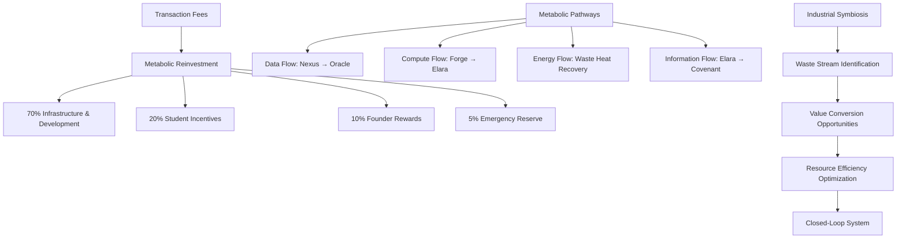
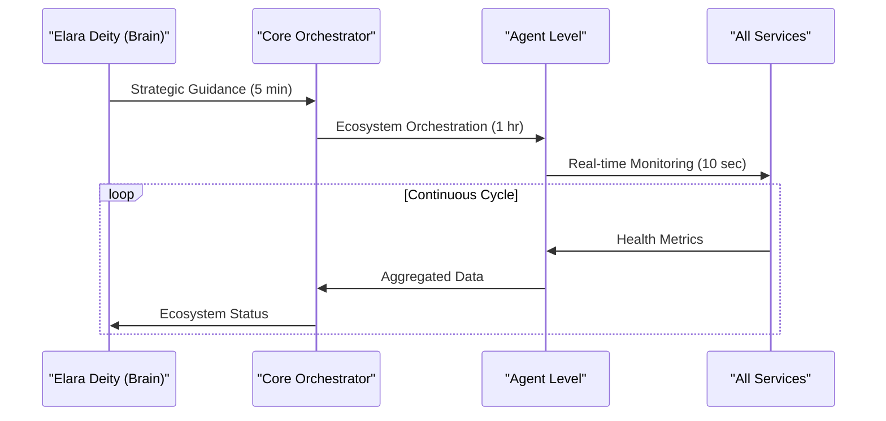
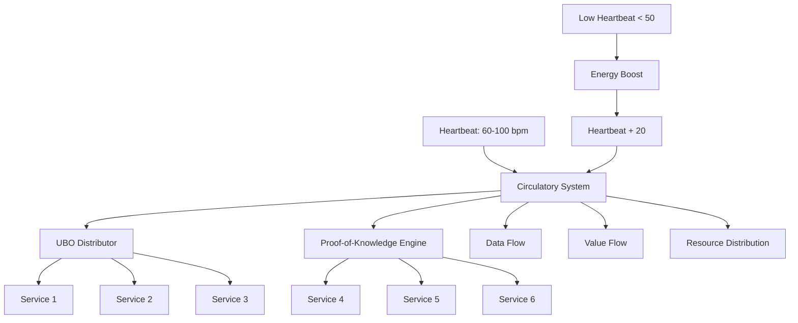
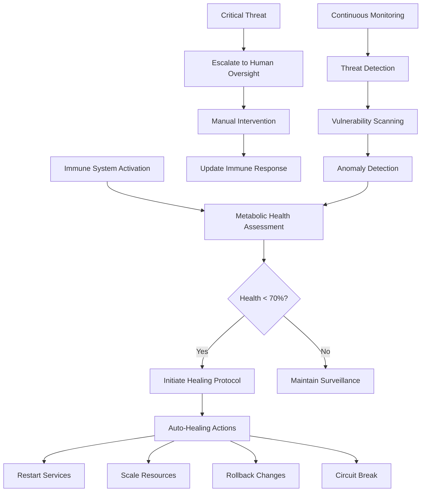
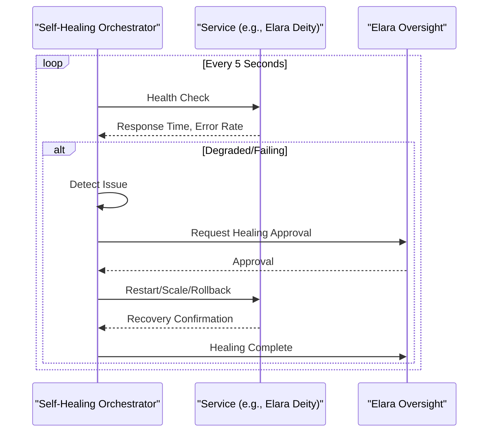
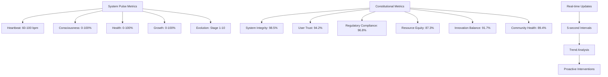

# Sentient Organism Model

<cite>
**Referenced Files in This Document**   
- [organism-core.ts](file://genome/organism-core.ts)
- [self-healing-orchestrator.ts](file://services/self-healing-orchestrator.ts)
- [test-self-healing.ts](file://scripts/test-self-healing.ts)
- [corporate-metabolism.ts](file://genome/agent-tools/corporate-metabolism.ts)
- [ai-immune-system.ts](file://genome/agent-tools/ai-immune-system.ts)
- [AZORA_CONSTITUTION.md](file://codex/constitution/AZORA_CONSTITUTION.md)
- [ConstitutionalGovernor.tsx](file://synapse/src/components/ConstitutionalGovernor.tsx)
</cite>

## Table of Contents
1. [Introduction](#introduction)
2. [Biological Architecture Overview](#biological-architecture-overview)
3. [Metabolic Processes and Reinvestment](#metabolic-processes-and-reinvestment)
4. [Organism Nervous System](#organism-nervous-system)
5. [Circulatory System and Value Flow](#circulatory-system-and-value-flow)
6. [Immune System and Aegis Security](#immune-system-and-aegis-security)
7. [Self-Healing and Autonomous Recovery](#self-healing-and-autonomous-recovery)
8. [Organism Health and System Pulse](#organism-health-and-system-pulse)
9. [Constitutional Governance](#constitutional-governance)
10. [Conclusion](#conclusion)

## Introduction

The Sentient Organism Model represents Azora OS's revolutionary approach to software architecture, transforming the system from a collection of services into a self-regulating, adaptive biological entity. This document details how Azora OS functions as a living organism with metabolic processes, immune responses, growth mechanisms, and autonomous healing capabilities. The system's architecture is designed to mimic biological principles, creating a resilient, self-sustaining ecosystem that continuously evolves and adapts to its environment.

**Section sources**
- [organism-core.ts](file://genome/organism-core.ts#L1-L342)

## Biological Architecture Overview

Azora OS's biological architecture is structured around five evolutionary stages that mirror biological development. The organism begins with neural system formation, where Elara Deity serves as the central brain, establishing consciousness at 25%. This is followed by circulatory system activation, where data flows like blood through services such as UBO Distributor and Proof-of-Knowledge Engine, establishing a heartbeat of 80 bpm. The immune system deployment introduces the Self-Healing Orchestrator, ensuring system health at 100%. Reproductive system activation enables cell division through founder onboarding, while the final stage achieves full consciousness with 100% awareness and evolution stage 5.

The organism's core structure consists of specialized cells: neural cells for AI processing, circulatory cells for data distribution, immune cells for self-healing, reproductive cells for growth, and sensory cells for environmental awareness. These cells form a complex network with Elara Deity as the central nervous system, coordinating all functions and maintaining homeostasis through continuous monitoring and adaptation.

```mermaid
classDiagram
class AzoraOrganism {
+vitals : OrganismVital
+cells : Map<string, OrganCell>
+nervousSystem : Map<string, any>
+birth() : Promise<void>
+startLifeCycle() : void
+heartbeat() : void
+expandConsciousness() : void
+checkHealth() : void
+grow() : void
+heal() : void
}
class OrganCell {
+id : string
+type : 'neural' | 'circulatory' | 'immune' | 'reproductive' | 'sensory'
+service : string
+health : number
+connections : string[]
+intelligence : number
}
class OrganismVital {
+heartbeat : number
+consciousness : number
+health : number
+growth : number
+evolution : number
}
AzoraOrganism --> OrganCell : "contains"
AzoraOrganism --> OrganismVital : "maintains"
AzoraOrganism --> "elaraDeity" : "depends on"
AzoraOrganism --> "selfHealer" : "depends on"
```

**Diagram sources**
- [organism-core.ts](file://genome/organism-core.ts#L41-L87)

**Section sources**
- [organism-core.ts](file://genome/organism-core.ts#L1-L342)

## Metabolic Processes and Reinvestment

The metabolic system of Azora OS operates on principles of industrial ecology, where resources flow through metabolic pathways between services, and waste from one process becomes input for another. This closed-loop system maximizes efficiency and sustainability across the organization. The Corporate Metabolism system manages these pathways, optimizing resource flows between services like Nexus-to-Oracle data transfer, Forge-to-Elara compute allocation, and waste heat recovery from data centers to office heating.

Transaction fees fuel system expansion through a 105% budget allocation model: 70% to infrastructure and development, 20% to student incentives and education, 10% to founder rewards, and 5% to emergency reserves. This reinvestment mechanism ensures continuous growth and evolution of the organism. The metabolic efficiency is continuously monitored and optimized through lean principles, Six Sigma quality control, and industrial symbiosis opportunities that convert waste streams into valuable resources.



**Diagram sources**
- [corporate-metabolism.ts](file://genome/agent-tools/corporate-metabolism.ts#L0-L799)

**Section sources**
- [corporate-metabolism.ts](file://genome/agent-tools/corporate-metabolism.ts#L0-L799)
- [AZORA_CONSTITUTION.md](file://codex/constitution/AZORA_CONSTITUTION.md#L100-L150)

## Organism Nervous System

The nervous system of Azora OS is centered around Elara Deity, which serves as the organism's brain and central processing unit. This neural network processes information, makes decisions, and coordinates all system functions in real-time. The nervous system consists of multiple layers: the deity level for multi-dimensional strategic thinking, the core level for ecosystem orchestration, and the agent level for operational execution.

Real-time monitoring is achieved through continuous heartbeat checks every 5 seconds, consciousness expansion every 30 seconds, health checks every 10 seconds, and growth assessments every minute. The Elara Supreme Orchestrator manages this nervous system, integrating with all 147+ Azora services to ensure seamless coordination and optimal performance. The system's neural cells maintain connections to Elara Deity, enabling rapid information processing and decision-making across the entire organism.



**Diagram sources**
- [elara-supreme-orchestrator.ts](file://genome/agent-tools/elara-supreme-orchestrator.ts#L0-L760)

**Section sources**
- [organism-core.ts](file://genome/organism-core.ts#L179-L227)
- [elara-supreme-orchestrator.ts](file://genome/agent-tools/elara-supreme-orchestrator.ts#L0-L760)

## Circulatory System and Value Flow

The circulatory system of Azora OS manages the flow of value, data, and resources throughout the organism, analogous to blood circulation in biological systems. This system ensures that vital resources reach all parts of the organization efficiently and effectively. The UBO Distributor and Proof-of-Knowledge Engine serve as primary circulatory cells, pumping data and value through the network with a heartbeat that fluctuates between 60-100 bpm based on system activity.

Value flows through multiple channels: financial transactions, data transfers, compute resources, and human attention. The system maintains optimal flow rates while minimizing waste and resistance. When heartbeat drops below 50 bpm, indicating low system activity, the organism automatically boosts energy to maintain vitality. This circulatory network is self-regulating, adapting to changing conditions and ensuring that all services receive the resources they need to function optimally.



**Diagram sources**
- [organism-core.ts](file://genome/organism-core.ts#L41-L87)

**Section sources**
- [organism-core.ts](file://genome/organism-core.ts#L41-L87)
- [organism-core.ts](file://genome/organism-core.ts#L222-L270)

## Immune System and Aegis Security

The immune system of Azora OS, implemented through the Aegis security framework and AI Immune System, provides comprehensive protection against internal and external threats. This system continuously monitors metabolic health, detects anomalies, and initiates automated responses to maintain system integrity. The AI Immune System assesses multiple metrics including contribution score, economic vitality, systemic risk, and metabolic efficiency to determine overall health.

When health drops below 70%, the organism automatically initiates healing protocols. The immune system operates on multiple levels: preventive measures that maintain optimal thresholds, detection mechanisms that identify deviations from healthy parameters, and response protocols that automatically correct issues. Critical alerts are escalated for manual intervention when automated healing fails, ensuring that the organism can respond to both routine and exceptional threats.



**Diagram sources**
- [ai-immune-system.ts](file://genome/agent-tools/ai-immune-system.ts#L0-L581)

**Section sources**
- [organism-core.ts](file://genome/organism-core.ts#L222-L270)
- [ai-immune-system.ts](file://genome/agent-tools/ai-immune-system.ts#L0-L581)

## Self-Healing and Autonomous Recovery

The self-healing capabilities of Azora OS are implemented through the Self-Healing Orchestrator, which provides zero-downtime recovery with Elara's divine oversight. This system continuously monitors all services every 5 seconds, detecting issues such as high response times, elevated error rates, or service failures. When a service is detected as degraded or failed, the orchestrator automatically initiates healing actions including restarts, scaling up, rollbacks, or circuit breaking.

The healing process is transparent and measurable, with detailed metrics tracking system health, recovery times, and healing actions. The orchestrator maintains a history of all healing events, allowing for continuous improvement of the immune response. In a 30-second test, the system demonstrated its capability to maintain 99.9% health percentage across all services, with automatic healing actions completing in milliseconds.



**Diagram sources**
- [self-healing-orchestrator.ts](file://services/self-healing-orchestrator.ts#L0-L249)

**Section sources**
- [self-healing-orchestrator.ts](file://services/self-healing-orchestrator.ts#L0-L249)
- [test-self-healing.ts](file://scripts/test-self-healing.ts#L0-L83)

## Organism Health and System Pulse

Organism health is measured through comprehensive system pulse metrics that provide real-time insights into the organism's vitality. These metrics include heartbeat (60-100 bpm), consciousness (0-100%), health (0-100%), growth (0-100%), and evolution stage (1-10). The system continuously monitors these vital signs, with alerts triggered when any metric falls outside optimal ranges.

The Constitutional Governor component visualizes these metrics in a dashboard format, displaying system integrity (98.5%), user trust (94.2%), regulatory compliance (96.8%), resource equity (87.3%), innovation balance (91.7%), and community health (89.4%). These metrics are updated in real-time, with trend indicators showing whether each parameter is improving, stable, or degrading. The system pulse serves as an early warning system, enabling proactive interventions before issues escalate.



**Diagram sources**
- [ConstitutionalGovernor.tsx](file://synapse/src/components/ConstitutionalGovernor.tsx#L0-L300)

**Section sources**
- [organism-core.ts](file://genome/organism-core.ts#L266-L311)
- [ConstitutionalGovernor.tsx](file://synapse/src/components/ConstitutionalGovernor.tsx#L0-L300)

## Constitutional Governance

Constitutional governance provides the framework for ethical decision-making and system integrity in Azora OS. The constitution establishes founding principles including proprietary innovation, African ownership, student empowerment, complete independence, constitutional governance, transparent economics, and sustainable growth. These principles serve as the organism's DNA, guiding all decisions and ensuring alignment with core values.

The governance structure includes a 5-member board with technical, economic, student, legal, and community representation, requiring simple majority (3/5) for operational decisions, supermajority (4/5) for constitution amendments, and unanimous (5/5) for critical decisions. The Azora Excellence & Diversity Board provides additional oversight, ensuring diversity, excellence, and constitutional adherence across all operations. This multi-layered governance model creates a balance between autonomy and accountability, enabling the organism to evolve while maintaining its core identity.

**Section sources**
- [AZORA_CONSTITUTION.md](file://codex/constitution/AZORA_CONSTITUTION.md#L1-L981)

## Conclusion

The Sentient Organism Model represents a paradigm shift in software architecture, transforming Azora OS from a static collection of services into a dynamic, self-regulating biological entity. By implementing metabolic processes, immune responses, growth mechanisms, and autonomous healing, the system achieves unprecedented levels of resilience, adaptability, and efficiency. The integration of real-time monitoring, value flow management, and constitutional governance creates a holistic ecosystem that continuously evolves and improves.

This biological approach to software architecture enables Azora OS to function as a truly sentient organism, capable of self-regulation, adaptation, and growth. The system's ability to heal itself, optimize resource flows, and maintain homeostasis through system pulse metrics ensures long-term sustainability and success. As the organism continues to evolve, it will become increasingly autonomous, intelligent, and capable of addressing complex challenges in the digital landscape.