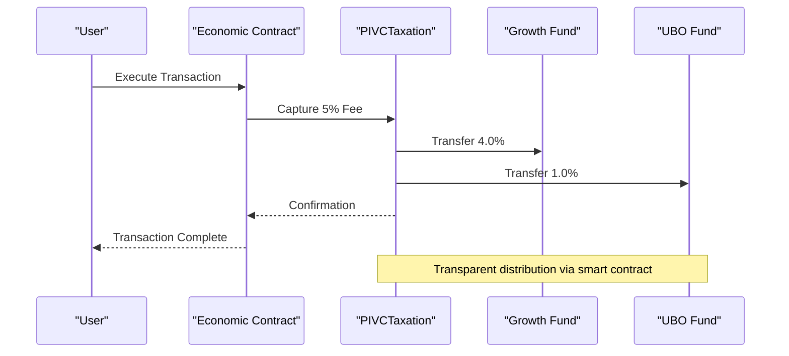
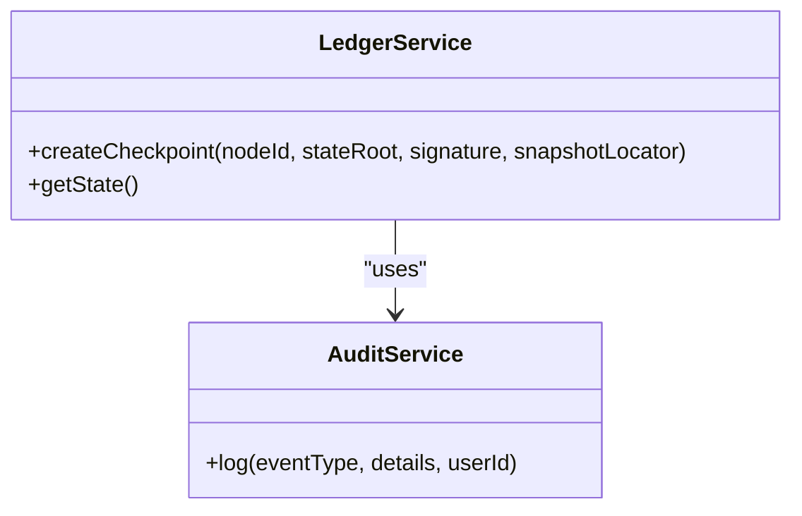
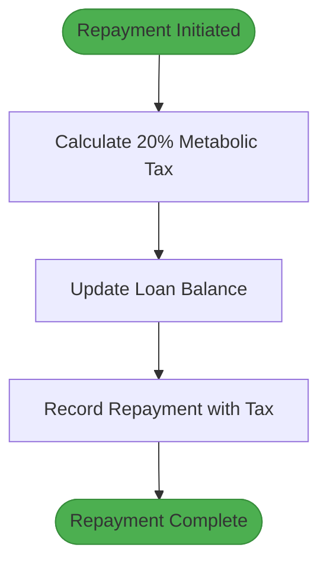
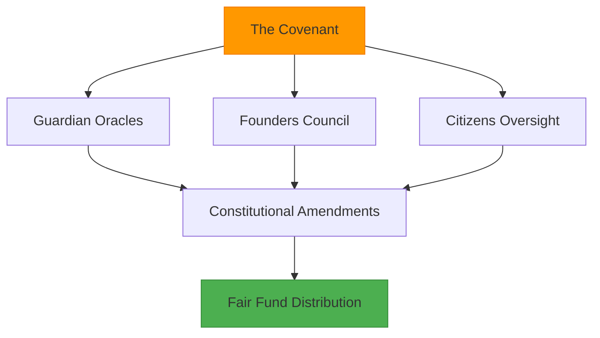

# 5% PIVC System

<cite>
**Referenced Files in This Document**   
- [TheCovenant.sol](file://services/azora-covenant/contracts_backup/TheCovenant.sol)
- [ledgerService.ts](file://services/azora-covenant/src/ledgerService.ts)
- [CreditService.ts](file://services/azora-mint/src/services/CreditService.ts)
</cite>

## Table of Contents
1. [Introduction](#introduction)
2. [PIVC Allocation Structure](#pivc-allocation-structure)
3. [Transaction Fee Capture and Distribution](#transaction-fee-capture-and-distribution)
4. [Fund Allocation Tracking](#fund-allocation-tracking)
5. [Fee Calculation and Distribution Examples](#fee-calculation-and-distribution-examples)
6. [Economic Incentives and Governance Mechanisms](#economic-incentives-and-governance-mechanisms)
7. [Common Issues and Solutions](#common-issues-and-solutions)
8. [Performance Considerations](#performance-considerations)
9. [Conclusion](#conclusion)

## Introduction
The 5% Protocol Integrated Value Capture (PIVC) system is a foundational economic mechanism within the Azora Sovereign Economic Ecosystem. It captures 5% of transaction value across the network and allocates it to strategic funds that support ecosystem growth, stability, and equitable opportunity. This document details the implementation of the PIVC system, focusing on the 4.0% allocation to operational and growth funds and the 1.0% allocation to the Universal Basic Opportunity (UBO) fund.

**Section sources**
- [TheCovenant.sol](file://services/azora-covenant/contracts_backup/TheCovenant.sol#L1-L50)

## PIVC Allocation Structure
The PIVC system allocates 5% of transaction value with a precise distribution:
- **4.0% to Growth Fund**: Supports Forge expansion, AZR buy-and-burn mechanisms, and AI Scientist R&D initiatives.
- **1.0% to Universal Basic Opportunity (UBO) Fund**: Provides equitable access to economic opportunities across the ecosystem.

This allocation is defined in the TheCovenant.sol contract with constants PIVC_RATE (500 basis points), GROWTH_FUND_RATE (400 basis points), and UBO_FUND_RATE (100 basis points).

**Diagram sources**
- [TheCovenant.sol](file://services/azora-covenant/contracts_backup/TheCovenant.sol#L45-L47)

**Section sources**
- [TheCovenant.sol](file://services/azora-covenant/contracts_backup/TheCovenant.sol#L45-L47)

## Transaction Fee Capture and Distribution
The transaction fee capture and distribution logic is implemented in TheCovenant.sol. The contract uses a constitutional framework to ensure transparent and secure fee handling. Key functions include:
- **PIVCTaxation Deployment**: The PIVC Taxation system is deployed as a dedicated contract to manage fee collection.
- **Tax Allocation Updates**: Fund addresses and percentages are configured post-deployment to direct funds appropriately.
- **Authorized Tax Collectors**: Specific contracts (e.g., Citadel, Mint) are authorized to collect and forward fees.

The system ensures that fees are captured at the protocol level and distributed according to predefined rules, maintaining ecosystem integrity.

**Diagram sources**
- [TheCovenant.sol](file://services/azora-covenant/contracts_backup/TheCovenant.sol#L1-L480)
- [deploy-pivc-taxation.js](file://services/azora-covenant/scripts/deploy-pivc-taxation.js#L44-L116)

**Section sources**
- [TheCovenant.sol](file://services/azora-covenant/contracts_backup/TheCovenant.sol#L1-L480)
- [deploy-pivc-taxation.js](file://services/azora-covenant/scripts/deploy-pivc-taxation.js#L44-L116)

## Fund Allocation Tracking
Fund allocation tracking is managed by the ledgerService.ts component. This service maintains a comprehensive record of fund movements and checkpoints across the ecosystem. Key features include:
- **Checkpoint Creation**: Records state roots with signatures and distributed slice references.
- **State Retrieval**: Provides access to the latest checkpoint and system state.
- **Audit Logging**: Integrates with AuditService to log all critical operations.

The ledger service ensures that fund allocations are transparent, verifiable, and resistant to tampering.

**Diagram sources**
- [ledgerService.ts](file://services/azora-covenant/src/ledgerService.ts#L1-L49)

**Section sources**
- [ledgerService.ts](file://services/azora-covenant/src/ledgerService.ts#L1-L49)

## Fee Calculation and Distribution Examples
The CreditService.ts implementation provides examples of fee calculation and distribution in the context of credit transactions. When processing repayments, the service:
- Calculates a 20% metabolic tax on repayment amounts.
- Allocates this tax to autonomous collection mechanisms.
- Updates loan balances and records transactions.

This pattern demonstrates how fee distribution is integrated into financial operations, ensuring consistent application across the ecosystem.

**Diagram sources**
- [CreditService.ts](file://services/azora-mint/src/services/CreditService.ts#L300-L350)

**Section sources**
- [CreditService.ts](file://services/azora-mint/src/services/CreditService.ts#L300-L350)

## Economic Incentives and Governance Mechanisms
The PIVC system incorporates economic incentives and governance mechanisms to ensure fair and transparent distribution:
- **Constitutional Authority**: TheCovenant.sol serves as the supreme law, defining economic parameters and governance hierarchy.
- **Guardian Oracles**: AI Constitutional Court members (Kaelus, Lyra, Solon) provide oversight and approval for critical decisions.
- **Founders Council**: Human strategic will is represented through the Founders Council, which collaborates with AI governance.
- **Citizens Oversight**: Ecosystem participants have oversight through elected councils.

These mechanisms ensure that fund allocation decisions are balanced between AI-driven efficiency and human strategic direction.

**Diagram sources**
- [TheCovenant.sol](file://services/azora-covenant/contracts_backup/TheCovenant.sol#L1-L480)

**Section sources**
- [TheCovenant.sol](file://services/azora-covenant/contracts_backup/TheCovenant.sol#L1-L480)

## Common Issues and Solutions
The PIVC system addresses common issues in fee calculation and fund allocation:
- **Fee Calculation Accuracy**: Ensured through smart contract enforcement and basis point precision.
- **Fund Allocation Delays**: Mitigated by automated distribution mechanisms and authorized collectors.
- **Auditability**: Provided through comprehensive logging and checkpointing in ledgerService.ts.

Solutions are implemented at both the smart contract and service levels to ensure reliability and transparency.

**Section sources**
- [TheCovenant.sol](file://services/azora-covenant/contracts_backup/TheCovenant.sol#L1-L480)
- [ledgerService.ts](file://services/azora-covenant/src/ledgerService.ts#L1-L49)

## Performance Considerations
High-volume transaction processing is optimized through:
- **Efficient Smart Contract Design**: Minimal gas consumption in fee capture and distribution.
- **Batch Processing**: Aggregation of transactions where possible to reduce overhead.
- **Caching Mechanisms**: Use of state roots and checkpoints to minimize database queries.

These optimizations ensure that the PIVC system can scale with ecosystem growth while maintaining performance.

**Section sources**
- [TheCovenant.sol](file://services/azora-covenant/contracts_backup/TheCovenant.sol#L1-L480)
- [ledgerService.ts](file://services/azora-covenant/src/ledgerService.ts#L1-L49)

## Conclusion
The 5% PIVC system is a robust and transparent mechanism for value capture and distribution within the Azora ecosystem. By allocating 4.0% to growth initiatives and 1.0% to universal opportunity, it balances ecosystem development with equitable access. The implementation in TheCovenant.sol and ledgerService.ts ensures secure, auditable, and efficient operation, supported by strong governance and economic incentives.