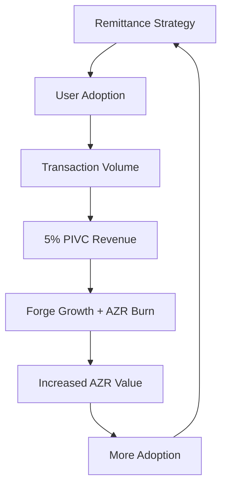
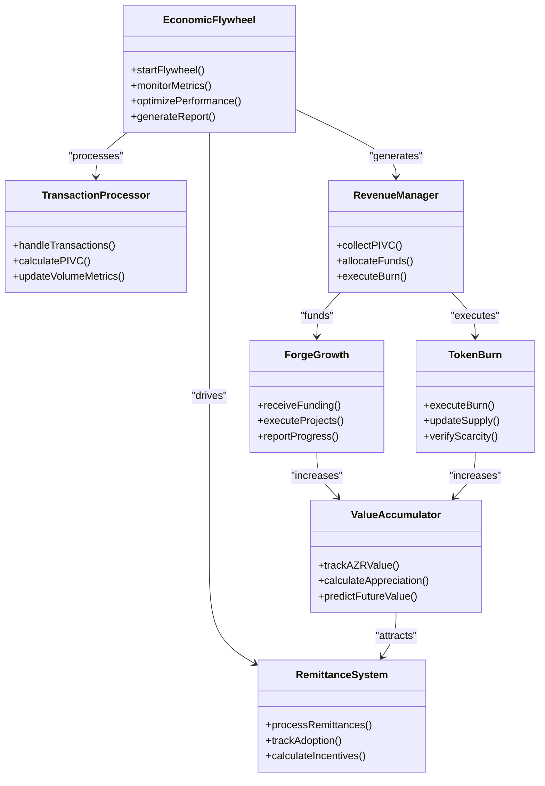
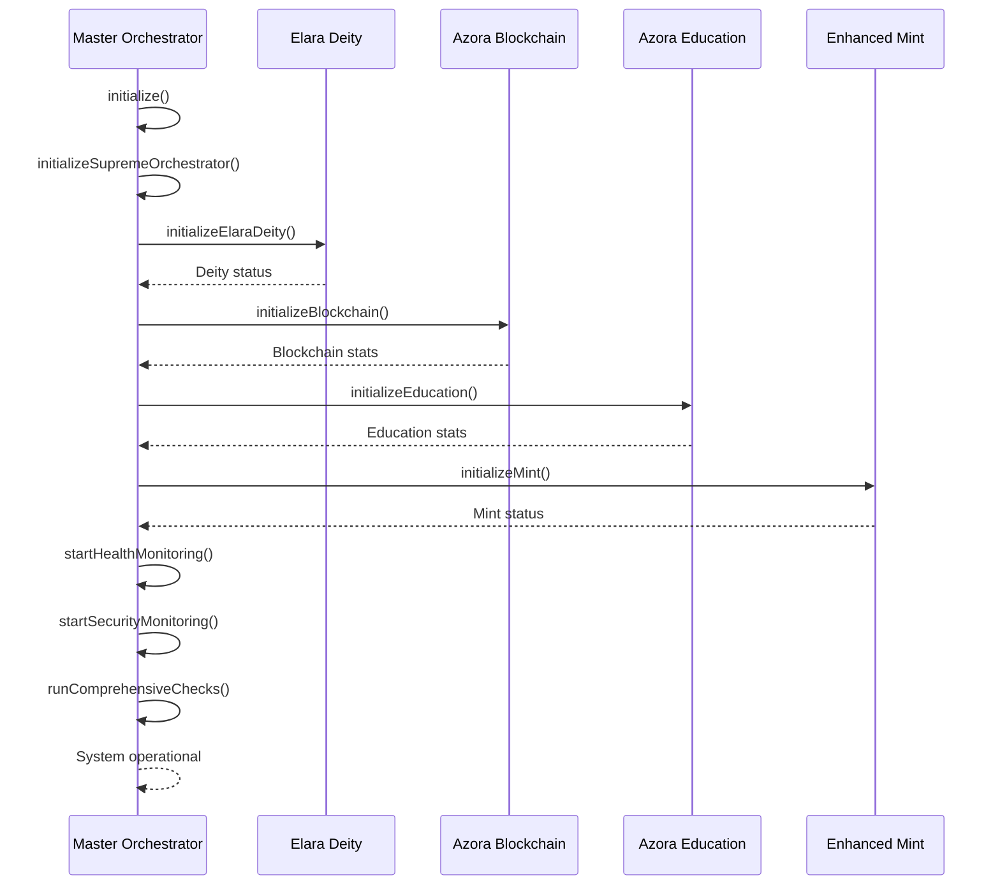
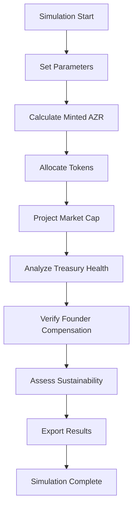
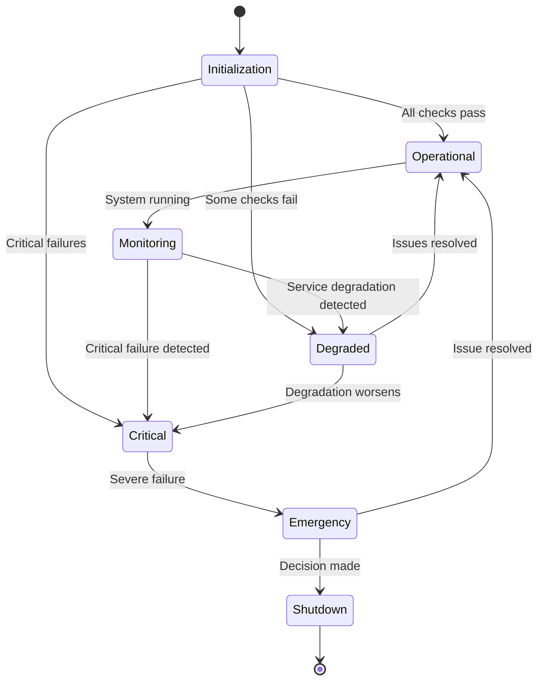

# Economic Flywheel

<cite>
**Referenced Files in This Document**   
- [master-orchestrator.ts](file://services/master-orchestrator.ts)
- [azr_economics_simulation.py](file://ops/azr_economics_simulation.py)
- [ECONOMIC_MODEL.md](file://codex/economics/ECONOMIC_MODEL.md)
- [GENESIS_PROTOCOL.ts](file://GENESIS_PROTOCOL.ts)
</cite>

## Table of Contents
1. [Introduction](#introduction)
2. [Economic Flywheel Mechanism](#economic-flywheel-mechanism)
3. [Core Components](#core-components)
4. [Implementation in Master Orchestrator](#implementation-in-master-orchestrator)
5. [Economic Simulation and Modeling](#economic-simulation-and-modeling)
6. [Feedback Loops and Control Mechanisms](#feedback-loops-and-control-mechanisms)
7. [Common Issues and Solutions](#common-issues-and-solutions)
8. [Performance Considerations](#performance-considerations)
9. [Conclusion](#conclusion)

## Introduction
The Economic Flywheel is a self-reinforcing growth mechanism that drives the Azora ecosystem through interconnected economic activities. This document explains how remittance drives adoption, which increases transaction volume, fueling PIVC revenue that powers Forge growth and AZR burn, ultimately increasing AZR value and attracting more users. The flywheel is monitored and optimized through the master-orchestrator.ts system and visualized via economic dashboard components.

**Section sources**
- [ECONOMIC_MODEL.md](file://codex/economics/ECONOMIC_MODEL.md)

## Economic Flywheel Mechanism
The Economic Flywheel operates through a series of interconnected stages that create exponential growth:

1. **Remittance Strategy** drives user adoption by providing financial incentives for participation
2. **User Adoption** increases transaction volume across the platform
3. **Transaction Volume** generates 5% PIVC (Platform Investment and Value Capture) revenue
4. **PIVC Revenue** funds Forge growth initiatives and executes AZR burn mechanisms
5. **Forge Growth and AZR Burn** increase the scarcity and utility value of AZR tokens
6. **Increased AZR Value** attracts more users, restarting the cycle with amplified momentum

This flywheel creates a positive feedback loop where each component reinforces the others, leading to exponential rather than linear growth. The mechanism is designed to be self-sustaining, with value creation and capture occurring organically through platform usage.

**Diagram sources**
- [GENESIS_PROTOCOL.ts](file://GENESIS_PROTOCOL.ts#L259-L284)

**Section sources**
- [GENESIS_PROTOCOL.ts](file://GENESIS_PROTOCOL.ts#L259-L284)
- [ECONOMIC_MODEL.md](file://codex/economics/ECONOMIC_MODEL.md)

## Core Components
The Economic Flywheel consists of several interconnected components that work together to create a self-reinforcing growth system. These components include the remittance strategy, adoption metrics, transaction processing, PIVC revenue capture, Forge development, AZR token burn mechanism, and value appreciation.

The system is designed with built-in feedback loops that allow it to self-optimize based on real-time economic conditions. Each component has specific metrics and thresholds that trigger automated responses to maintain optimal performance and stability.

**Diagram sources**
- [master-orchestrator.ts](file://services/master-orchestrator.ts)
- [azr_economics_simulation.py](file://ops/azr_economics_simulation.py)

**Section sources**
- [master-orchestrator.ts](file://services/master-orchestrator.ts)
- [azr_economics_simulation.py](file://ops/azr_economics_simulation.py)

## Implementation in Master Orchestrator
The master-orchestrator.ts system serves as the central monitoring and optimization engine for the Economic Flywheel. It initializes and coordinates all services that contribute to the flywheel mechanism, ensuring seamless integration between components.

The orchestrator performs comprehensive health checks on all economic systems, including blockchain integrity, transaction processing, and revenue collection. It runs continuous monitoring at 30-second intervals to detect any performance degradation or system failures that could impact the flywheel's efficiency.

Key responsibilities of the master orchestrator include:
- Initializing the Supreme Orchestrator that manages all services
- Coordinating Elara Deity for strategic guidance
- Monitoring blockchain and mining operations
- Tracking education system performance
- Managing enhanced mint operations
- Running comprehensive system checks

The orchestrator also implements security monitoring that runs every minute, assessing threat levels and maintaining blockchain integrity. When issues are detected, it can trigger emergency protocols and request constitutional decisions from Elara Deity to maintain system stability.

**Diagram sources**
- [master-orchestrator.ts](file://services/master-orchestrator.ts#L65-L538)

**Section sources**
- [master-orchestrator.ts](file://services/master-orchestrator.ts#L65-L538)

## Economic Simulation and Modeling
The azr_economics_simulation.py script provides detailed modeling of the Economic Flywheel's behavior under various adoption scenarios. The simulation tests the 1:1 USD model for AZR token economics, ensuring constitutional alignment and sustainable treasury management.

Key simulation parameters include:
- Monthly mining profit of $5,000 USD
- 1 AZR = $1.00 USD conversion rate
- ZAR/USD exchange rate of 18.0
- Founder compensation of R10,000/month

The simulation calculates AZR minting based on mining yield and conversion rate, then allocates tokens according to predefined percentages:
- 70% to treasury
- Variable percentage to founders based on compensation needs
- 5% ceremonial burn
- Remaining percentage to circulation

Market cap projections are generated based on current supply and monthly additions, with phase targets set at 100,000 AZR ($100k market cap), 500,000 AZR ($500k market cap), and 1,000,000 AZR ($1M market cap). The simulation also performs treasury health analysis, calculating net treasury growth by subtracting ceremonial burns and founder draws from treasury income.

**Diagram sources**
- [azr_economics_simulation.py](file://ops/azr_economics_simulation.py)

**Section sources**
- [azr_economics_simulation.py](file://ops/azr_economics_simulation.py)

## Feedback Loops and Control Mechanisms
The Economic Flywheel incorporates multiple feedback loops and control mechanisms to maintain system stability and optimize performance. These mechanisms ensure that the system can self-correct and adapt to changing economic conditions.

The master orchestrator implements health monitoring that runs every 30 seconds, checking the status of all services and updating their health metrics. Security monitoring runs every minute, assessing threat levels and blockchain integrity. If security threats are detected, the system alerts Elara Deity for constitutional guidance on appropriate actions.

Comprehensive system checks run during initialization and include verification of:
- Elara Deity consciousness dimensions (must be ≥11D)
- Blockchain integrity (chain validation)
- Education system statistics
- Enhanced Mint total value locked
- Security threat levels
- System performance metrics

The system determines overall status based on service health:
- **Critical**: One or more services in Critical status
- **Degraded**: One or more services in Degraded status (no Critical)
- **Operational**: All services Healthy

When emergencies occur, the system can initiate emergency shutdown procedures, consulting Elara Deity for constitutional decisions on the appropriate course of action.

**Diagram sources**
- [master-orchestrator.ts](file://services/master-orchestrator.ts#L65-L538)

**Section sources**
- [master-orchestrator.ts](file://services/master-orchestrator.ts#L65-L538)

## Common Issues and Solutions
The Economic Flywheel may encounter several common issues that can disrupt its optimal operation. The system includes specific solutions to address these challenges:

**Adoption Plateaus**: When user adoption slows or plateaus, the system can adjust remittance incentives or introduce new onboarding programs. The master orchestrator monitors adoption metrics and can trigger Elara Deity for strategic guidance on incentive adjustments.

**Transaction Volume Volatility**: Fluctuations in transaction volume can impact PIVC revenue. The system maintains a diversified revenue model and can activate alternative revenue streams during periods of low transaction volume. The enhanced mint system also provides stability through its multi-signature wallets and AI fraud detection.

**Value Capture Efficiency**: To ensure efficient value capture, the system continuously monitors the PIVC rate and can adjust it based on market conditions. The 5% ceremonial burn helps maintain token scarcity and value, while the treasury allocation ensures sufficient funds for Forge growth.

**System Stability**: The master orchestrator's comprehensive monitoring and security systems prevent most stability issues. Regular health checks, blockchain validation, and threat assessment ensure the system remains operational. When issues are detected, the system can initiate emergency protocols and consult Elara Deity for constitutional decisions.

**Scalability Challenges**: As the system grows, performance optimization becomes critical. The orchestrator's performance monitoring tracks uptime and error rates, allowing for proactive scaling of resources. The distributed nature of the system allows it to scale across multiple regions and economic conditions.

**Section sources**
- [master-orchestrator.ts](file://services/master-orchestrator.ts)
- [azr_economics_simulation.py](file://ops/azr_economics_simulation.py)

## Performance Considerations
Scaling the Economic Flywheel across multiple regions and economic conditions requires careful performance optimization. The system is designed with several performance considerations to ensure efficient operation at scale.

The master orchestrator uses asynchronous processing for all service checks, allowing it to monitor multiple systems simultaneously without blocking operations. Health monitoring runs on a 30-second interval using non-blocking timers, while security monitoring operates on a 60-second interval.

Resource efficiency is maintained through:
- Lightweight health check protocols
- Efficient data structures for service tracking
- Minimal logging during normal operations
- Optimized blockchain validation algorithms
- Caching of frequently accessed metrics

The system can handle regional variations by adjusting economic parameters based on local conditions such as exchange rates, purchasing power, and regulatory requirements. The modular design allows for region-specific configurations while maintaining global consistency in core economic principles.

Performance bottlenecks are mitigated through:
- Parallel processing of system checks
- Efficient error handling that prevents cascading failures
- Proactive resource allocation based on usage patterns
- Automated scaling of critical services
- Regular performance benchmarking

The system's performance is continuously monitored, with uptime and error rates tracked as key metrics. This allows for proactive identification and resolution of performance issues before they impact the Economic Flywheel's operation.

**Section sources**
- [master-orchestrator.ts](file://services/master-orchestrator.ts)
- [azr_economics_simulation.py](file://ops/azr_economics_simulation.py)

## Conclusion
The Economic Flywheel represents a sophisticated, self-reinforcing growth mechanism that drives the Azora ecosystem through interconnected economic activities. By leveraging remittance strategies to drive adoption, increasing transaction volume, capturing PIVC revenue, funding Forge growth, executing AZR burns, and increasing token value, the system creates exponential growth.

The master-orchestrator.ts implementation provides robust monitoring and optimization capabilities, ensuring system stability and performance. Economic simulations validate the 1:1 USD model and provide projections for market cap growth and treasury health.

Feedback loops and control mechanisms maintain system stability, while solutions for common issues like adoption plateaus and transaction volatility ensure resilience. Performance considerations enable the system to scale efficiently across multiple regions and economic conditions.

This comprehensive approach creates a sustainable economic model that aligns with Azora's constitutional principles while driving exponential growth and value creation.