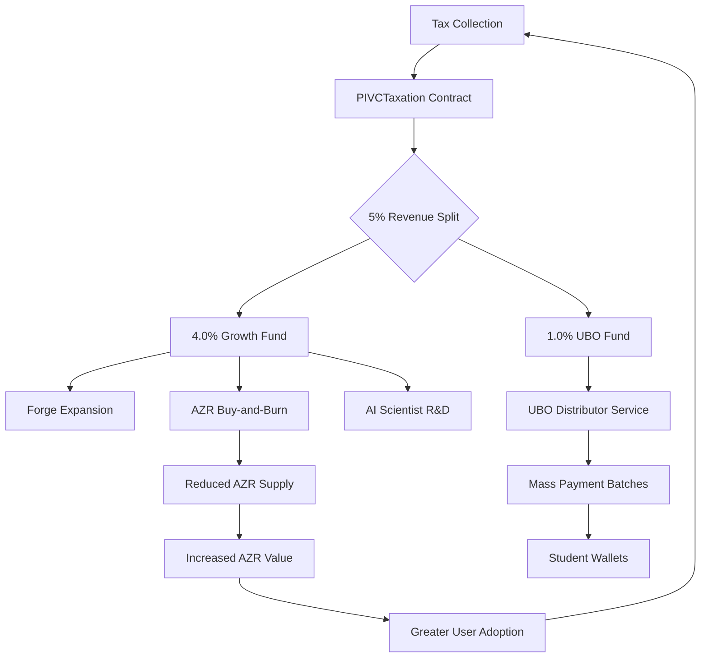

# Economic Model

<cite>
**Referenced Files in This Document**   
- [ECONOMIC_MODEL.md](file://codex/economics/ECONOMIC_MODEL.md)
- [AzoraCoin.sol](file://services/azora-covenant/contracts/AzoraCoin.sol)
- [PIVCTaxation.sol](file://services/azora-covenant/contracts_backup/PIVCTaxation.sol)
- [StabilityFund.sol](file://services/azora-covenant/contracts_backup/StabilityFund.sol)
- [distribute-ubo.ts](file://scripts/distribute-ubo.ts)
- [ubo-distributor.ts](file://services/ubo-distributor.ts)
</cite>

## Table of Contents
1. [Two-Token Protocol](#two-token-protocol)
2. [5% Protocol Integrated Value Capture (PIVC)](#5-protocol-integrated-value-capture-pivc)
3. [Flywheel Effect and Economic Dynamics](#flywheel-effect-and-economic-dynamics)
4. [Implementation Details](#implementation-details)

## Two-Token Protocol

The Azora economic model is built on a dual-token architecture designed to separate store-of-value functions from transactional utility. This Two-Token Protocol consists of the global AZR token and local a-Tokens, enabling both long-term value appreciation and frictionless daily transactions.

The AZR token serves as a deflationary, asset-backed store of value with a fixed maximum supply of 1,000,000 tokens. As defined in the AzoraCoin smart contract, no further minting is possible beyond this cap, creating inherent scarcity. The token is initially minted to the contract deployer (Treasury) and can only be transferred through authorized mechanisms. This scarcity is further enhanced by a burning mechanism where a portion of transaction fees is permanently removed from circulation, increasing the value of remaining tokens over time.

In contrast, local a-Tokens are stable tokens pegged 1:1 to various fiat currencies or assets, designed specifically for daily transactions within the Azora ecosystem. These tokens facilitate price stability for users while allowing the AZR token to appreciate independently as a long-term investment. The separation enables users to transact without exposure to volatility while still benefiting from the appreciation of the underlying AZR asset through the economic mechanisms built into the system.

This architectural separation allows the system to function as both a robust financial infrastructure and an appreciating digital asset, serving different user needs through specialized token functions.

**Section sources**
- [ECONOMIC_MODEL.md](file://codex/economics/ECONOMIC_MODEL.md#L1-L356)
- [AzoraCoin.sol](file://services/azora-covenant/contracts/AzoraCoin.sol#L1-L26)

## 5% Protocol Integrated Value Capture (PIVC)

The 5% Protocol Integrated Value Capture (PIVC) replaces traditional taxation with an automated, transparent revenue mechanism that funds ecosystem growth and social programs. This system captures 5% of the value from every transaction within the Azora network, distributing it according to a constitutionally mandated allocation framework.

The PIVC distribution is precisely defined in the PIVCTaxation smart contract, which implements a 500 basis point tax rate (5%) on all eligible transactions. The revenue is allocated as follows: 4.0% to operational and growth funds, and 1.0% to the Universal Basic Opportunity (UBO) fund. This allocation is hardcoded into the contract's initialization function, ensuring transparency and immutability.

The 4.0% growth allocation funds critical ecosystem development initiatives including Forge expansion, AZR buy-and-burn mechanisms, and AI Scientist R&D. This creates a self-reinforcing cycle where transaction volume directly fuels platform improvement and token value appreciation. The 1.0% UBO allocation powers the Universal Basic Assets program, providing economic empowerment to participants through direct distributions.

The system includes sophisticated governance features such as tax exemptions, emergency controls, and audit trails. Authorized contracts can collect taxes, which are then automatically distributed according to the predefined allocations. Every tax transaction is recorded on-chain with a unique identifier, timestamp, and cryptographic hash, ensuring complete transparency and auditability.

**Section sources**
- [ECONOMIC_MODEL.md](file://codex/economics/ECONOMIC_MODEL.md#L1-L356)
- [PIVCTaxation.sol](file://services/azora-covenant/contracts_backup/PIVCTaxation.sol#L1-L483)

## Flywheel Effect and Economic Dynamics

The Azora economic model creates a powerful flywheel effect where each component reinforces the others, driving exponential growth and adoption. This self-reinforcing cycle begins with remittance and cross-border transactions that attract new users to the platform.

As more users join and transaction volume increases, the PIVC system captures greater revenue from the 5% value capture. This revenue directly fuels Forge expansion, enabling the development of new features and services that make the platform more valuable. A portion of the revenue also executes AZR buy-and-burn operations, reducing the circulating supply of the deflationary AZR token and increasing its scarcity and market value.

The rising value of AZR creates a powerful incentive for additional users to join the ecosystem, either as investors seeking appreciation or as participants wanting to benefit from the growing network effects. This increased adoption leads to even higher transaction volumes, which in turn generates more PIVC revenue, restarting the cycle at a higher level.

Concurrently, the 1.0% UBO allocation ensures that economic benefits are distributed broadly through the Universal Basic Opportunity fund. The distribute-ubo.ts script demonstrates how the system can efficiently distribute tokens to large populations, with the UBODistributor service capable of processing millions of payments in optimized batches. This inclusive distribution mechanism creates a virtuous cycle of participation and economic activation, where empowered users contribute more to the ecosystem, further increasing transaction volume and value creation.

**Section sources**
- [ECONOMIC_MODEL.md](file://codex/economics/ECONOMIC_MODEL.md#L1-L356)
- [distribute-ubo.ts](file://scripts/distribute-ubo.ts#L1-L84)
- [ubo-distributor.ts](file://services/ubo-distributor.ts#L1-L197)

## Implementation Details

The economic model is implemented through a combination of smart contracts and backend services that work together to enforce the protocol rules and execute economic functions.

The core AZR token is implemented in the AzoraCoin.sol contract as an ERC20-compliant token with a fixed maximum supply of 1,000,000 tokens. The contract inherits from OpenZeppelin's ERC20 and Ownable implementations, ensuring security and standard compliance. The constructor mints an initial allocation to the deployer, with a safeguard preventing any future minting that would exceed the maximum supply.

The PIVC taxation system is implemented in the PIVCTaxation.sol contract, which acts as a decentralized tax authority. The contract defines tax allocations as structured data with recipient addresses, percentage allocations, and purpose descriptions. The collectTax function is called by authorized contracts during transactions, transferring the 5% fee to the tax contract and automatically distributing it according to the predefined allocations. The system includes emergency controls that allow temporary deactivation of taxation if needed for system stability.

For economic stability during market stress, the StabilityFund.sol contract implements a circuit breaker mechanism that diverts 25% of growth fund revenues into a reserve fund. This fund is protected by constitutional supermajority requirements for withdrawals, ensuring that crisis reserves can only be accessed with broad consensus.

The UBO distribution system is implemented in the ubo-distributor.ts service, which processes mass payments to students and other participants. The system batches payments for efficiency, with each batch containing up to 10,000 transactions. The service emits events for monitoring and maintains comprehensive statistics on distribution metrics including success rates, throughput, and total amounts distributed.

These components work together to create a resilient, transparent economic system where value creation, distribution, and reinvestment are automated and verifiable.

**Diagram sources**
- [PIVCTaxation.sol](file://services/azora-covenant/contracts_backup/PIVCTaxation.sol#L1-L483)
- [AzoraCoin.sol](file://services/azora-covenant/contracts/AzoraCoin.sol#L1-L26)
- [ubo-distributor.ts](file://services/ubo-distributor.ts#L1-L197)

**Section sources**
- [AzoraCoin.sol](file://services/azora-covenant/contracts/AzoraCoin.sol#L1-L26)
- [PIVCTaxation.sol](file://services/azora-covenant/contracts_backup/PIVCTaxation.sol#L1-L483)
- [StabilityFund.sol](file://services/azora-covenant/contracts_backup/StabilityFund.sol#L1-L504)
- [distribute-ubo.ts](file://scripts/distribute-ubo.ts#L1-L84)
- [ubo-distributor.ts](file://services/ubo-distributor.ts#L1-L197)