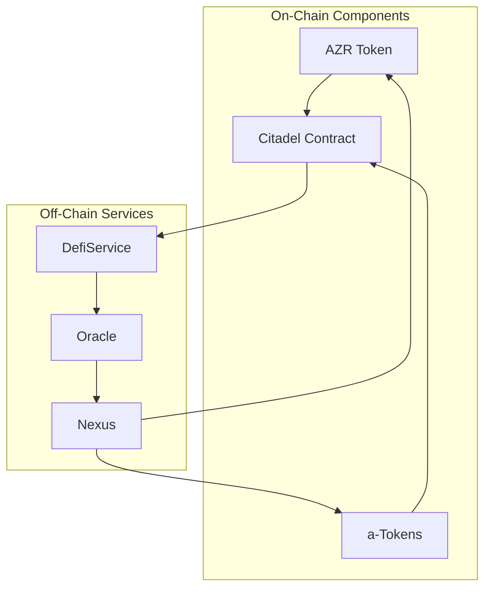
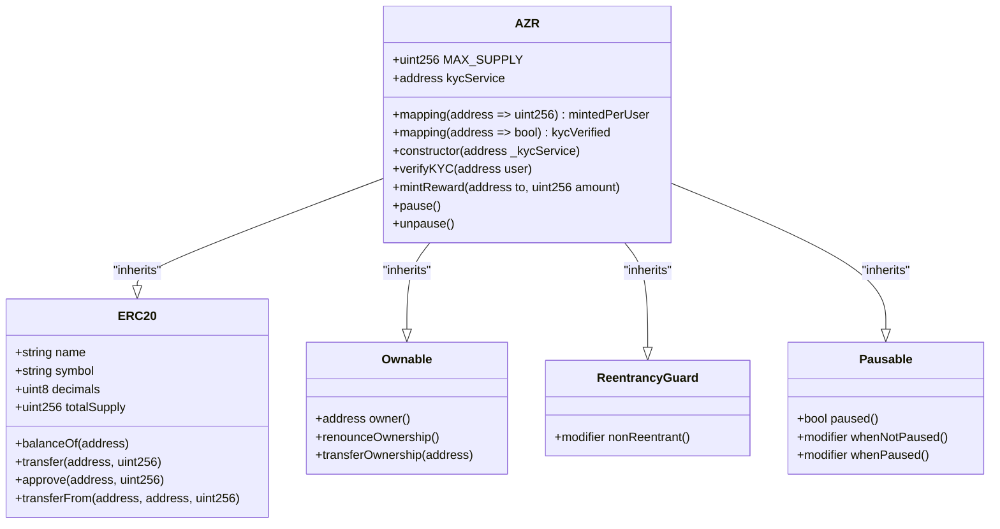
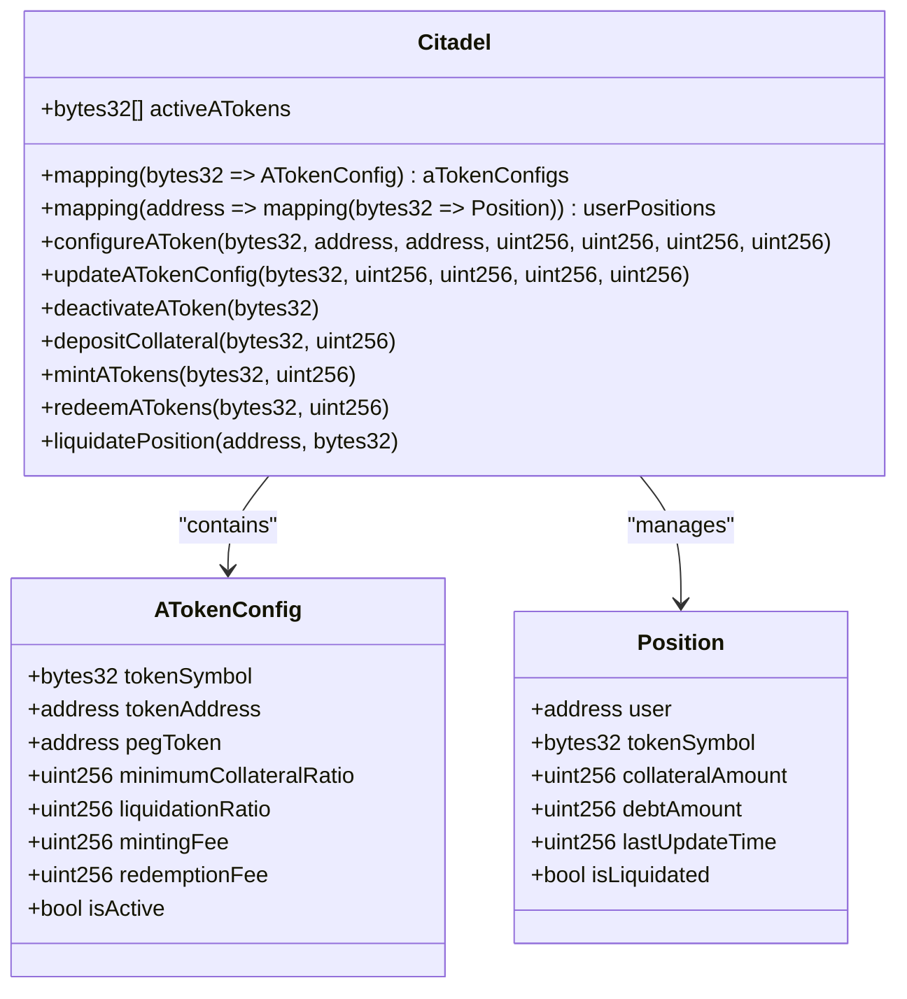
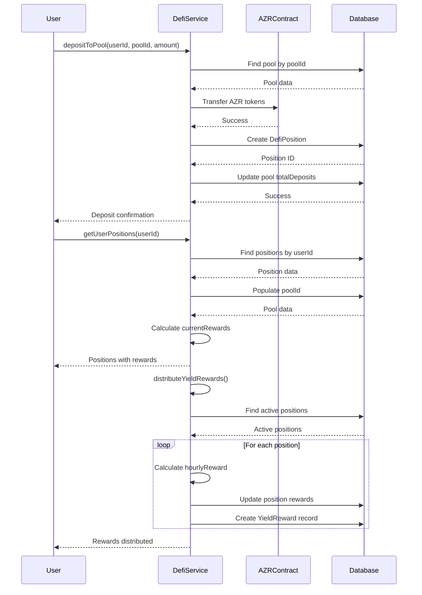
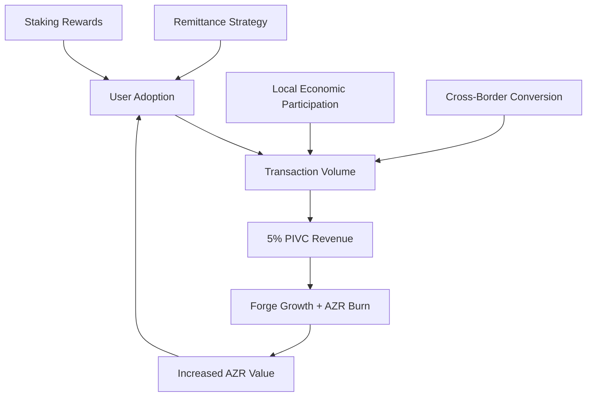

# Two-Token Protocol

<cite>
**Referenced Files in This Document**   
- [AZR.sol](file://services/azora-mint/contracts/AZR.sol)
- [MockERC20.sol](file://contracts/MockERC20.sol)
- [DefiService.ts](file://ui/DefiService.ts)
- [GENESIS_PROTOCOL.ts](file://GENESIS_PROTOCOL.ts)
- [Citadel.sol](file://services/azora-covenant/contracts_backup/Citadel.sol)
</cite>

## Table of Contents
1. [Introduction](#introduction)
2. [Core Components](#core-components)
3. [Architecture Overview](#architecture-overview)
4. [Detailed Component Analysis](#detailed-component-analysis)
5. [Economic Flywheel and System Growth](#economic-flywheel-and-system-growth)
6. [Common Issues and Solutions](#common-issues-and-solutions)
7. [Conclusion](#conclusion)

## Introduction
The Two-Token Protocol is a foundational economic model within the Azora ecosystem, designed to balance stability and value appreciation. It consists of two distinct token types: AZR, a deflationary, asset-backed store of value, and a-Tokens, stablecoins pegged 1:1 to local fiat currencies for daily transactions. This dual-token system enables frictionless commerce while ensuring long-term value accrual through the Forge's productive capacity. The protocol is implemented through smart contracts and integrated with DeFi services to support staking, yield farming, and liquidity mining.

## Core Components
The Two-Token Protocol relies on several core components: AZR as the global reserve asset, a-Tokens as local transactional currencies, and the DeFi infrastructure that enables yield generation and token management. AZR is governed by a deflationary mechanism through buy-and-burn, backed by the Forge's physical assets. a-Tokens are collateralized stablecoins that maintain a 1:1 peg with local fiat currencies, enabling zero-volatility transactions. The DefiService orchestrates yield distribution and pool management, ensuring economic incentives align with ecosystem growth.

**Section sources**
- [AZR.sol](file://services/azora-mint/contracts/AZR.sol#L1-L50)
- [MockERC20.sol](file://contracts/MockERC20.sol#L1-L58)
- [DefiService.ts](file://ui/DefiService.ts#L1-L278)

## Architecture Overview
The Two-Token Protocol architecture integrates blockchain smart contracts with off-chain services to create a self-reinforcing economic system. AZR operates as an ERC-20 token with minting restrictions and KYC verification, while a-Tokens are configured through the Citadel contract with collateralization ratios and fee structures. The system uses a metabolic reinvestment model where transaction fees fund Forge expansion and AZR buybacks, increasing scarcity and value. DeFi pools provide liquidity and yield incentives, attracting user participation and driving transaction volume.

**Diagram sources**
- [AZR.sol](file://services/azora-mint/contracts/AZR.sol#L1-L50)
- [Citadel.sol](file://services/azora-covenant/contracts_backup/Citadel.sol#L1-L640)
- [DefiService.ts](file://ui/DefiService.ts#L1-L278)

## Detailed Component Analysis

### AZR Token Implementation
The AZR token is implemented as an ERC-20 compliant smart contract with additional security and governance features. It inherits from OpenZeppelin's ERC20, Ownable, ReentrancyGuard, and Pausable contracts, ensuring secure token operations. The contract enforces KYC verification before minting rewards and limits the total supply to 1 million AZR with 18 decimals. Minting is restricted to the owner and subject to per-user limits, preventing inflationary practices. The pause functionality allows emergency halts to token operations, enhancing system resilience.

#### For Object-Oriented Components:

**Diagram sources**
- [AZR.sol](file://services/azora-mint/contracts/AZR.sol#L1-L50)

**Section sources**
- [AZR.sol](file://services/azora-mint/contracts/AZR.sol#L1-L50)

### a-Tokens Implementation
a-Tokens are stablecoins pegged 1:1 to local fiat currencies, enabling frictionless daily transactions within the Azora ecosystem. They are configured through the Citadel contract, which manages collateralization ratios, minting fees, and redemption fees. Each a-Token is backed by a reserve of its corresponding fiat currency or a stablecoin, ensuring price stability. The system supports seamless cross-border conversion, allowing users to transact in different local currencies without volatility risk. The Citadel contract enforces minimum collateral ratios and liquidation thresholds to maintain peg integrity.

#### For Object-Oriented Components:

**Diagram sources**
- [Citadel.sol](file://services/azora-covenant/contracts_backup/Citadel.sol#L1-L640)

**Section sources**
- [Citadel.sol](file://services/azora-covenant/contracts_backup/Citadel.sol#L1-L640)

### DefiService Integration
The DefiService orchestrates DeFi operations within the Azora ecosystem, managing staking pools, yield farming, and reward distribution. It interacts with the AZR token contract to facilitate deposits and withdrawals, calculating rewards based on APY and time deposited. The service uses MongoDB schemas to track user positions, pool statistics, and yield rewards. A cron job runs hourly to distribute yield rewards, updating user balances and recording transactions. The DefiService ensures economic incentives align with ecosystem growth, encouraging user participation and capital retention.

#### For API/Service Components:

**Diagram sources**
- [DefiService.ts](file://ui/DefiService.ts#L1-L278)

**Section sources**
- [DefiService.ts](file://ui/DefiService.ts#L1-L278)

## Economic Flywheel and System Growth
The Two-Token Protocol drives system growth through a self-reinforcing economic flywheel. The Remittance Strategy attracts users by offering low-cost, transparent cross-border transactions, increasing user adoption. As adoption grows, transaction volume rises, generating revenue through the 5% Protocol Integrated Value Capture (PIVC). This revenue funds Forge expansion and AZR buybacks, reducing circulating supply and increasing AZR value. Higher AZR value attracts more users, creating exponential growth. The flywheel effect ensures sustainable ecosystem development, with each component reinforcing the others.

**Diagram sources**
- [GENESIS_PROTOCOL.ts](file://GENESIS_PROTOCOL.ts#L259-L284)

**Section sources**
- [GENESIS_PROTOCOL.ts](file://GENESIS_PROTOCOL.ts#L259-L284)

## Common Issues and Solutions

### Peg Stability
Maintaining the 1:1 peg of a-Tokens requires robust collateralization and liquidation mechanisms. The Citadel contract enforces minimum collateral ratios (e.g., 150% for aZAR) and liquidation thresholds (e.g., 120% for aZAR) to prevent undercollateralization. If a user's position falls below the liquidation ratio, it can be liquidated by any participant, who receives a bonus in collateral. This incentivizes market participants to maintain peg stability. Additionally, circuit breakers can pause minting or redemption during extreme market conditions, preventing systemic risk.

**Section sources**
- [Citadel.sol](file://services/azora-covenant/contracts_backup/Citadel.sol#L1-L640)

### Token Conversion Latency
Cross-token conversions between AZR and a-Tokens must be fast and efficient to support real-time transactions. The Nexus component provides frictionless exchange with real-time settlement, minimizing conversion latency. Smart contract optimizations, such as batch processing and gas-efficient algorithms, reduce transaction times. Off-chain order books and liquidity pools ensure sufficient depth for high-volume conversions. The system also supports atomic swaps for cross-chain compatibility, enabling seamless integration with external networks.

**Section sources**
- [Citadel.sol](file://services/azora-covenant/contracts_backup/Citadel.sol#L1-L640)

### Cross-Chain Compatibility
The Two-Token Protocol supports cross-chain operations through atomic swaps and bridge mechanisms. The Citadel contract can interact with wrapped versions of AZR and a-Tokens on different blockchains, enabling interoperability. Cross-chain messaging protocols, such as LayerZero or Wormhole, facilitate secure communication between networks. This allows users to transact across multiple ecosystems without sacrificing security or decentralization. The system also supports multi-signature wallets and threshold cryptography for enhanced cross-chain security.

**Section sources**
- [Citadel.sol](file://services/azora-covenant/contracts_backup/Citadel.sol#L1-L640)

## Conclusion
The Two-Token Protocol represents a sophisticated economic model that balances stability and growth within the Azora ecosystem. By separating store of value (AZR) from transactional currency (a-Tokens), the system enables both long-term investment and daily commerce. The integration of smart contracts, DeFi services, and economic incentives creates a self-reinforcing flywheel that drives user adoption and value appreciation. Through robust mechanisms for peg stability, low-latency conversions, and cross-chain compatibility, the protocol ensures a seamless user experience while maintaining system integrity. This comprehensive design positions the Azora ecosystem for sustainable growth and global impact.