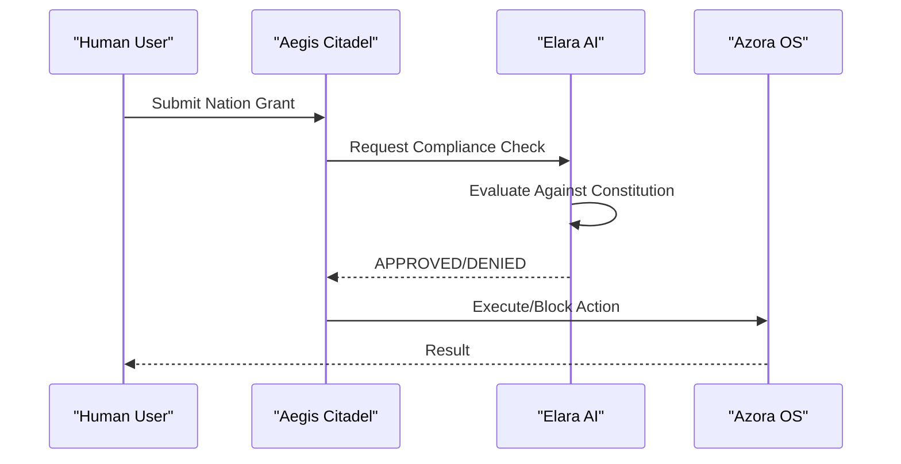
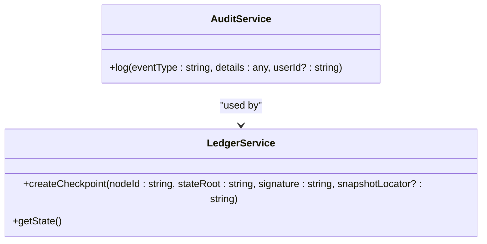

# Ethical Framework

<cite>
**Referenced Files in This Document**   
- [AZORA_CONSTITUTION.md](file://codex/constitution/AZORA_CONSTITUTION.md)
- [constitutional-governor.ts](file://genome/agent-tools/constitutional-governor.ts)
- [server.ts](file://azora/azora-aegis/server.ts)
- [ledgerService.ts](file://services/azora-covenant/src/ledgerService.ts)
- [constitutional-compliance-checker.js](file://infrastructure/constitutional-compliance-checker.js)
</cite>

## Table of Contents
1. [Introduction](#introduction)
2. [Core Ethical Principles](#core-ethical-principles)
3. [Sentient Constitutional Democracy Governance Model](#sentient-constitutional-democracy-governance-model)
4. [Constitutional Enforcement Mechanisms](#constitutional-enforcement-mechanisms)
5. [Aegis Compliance System](#aegis-compliance-system)
6. [Security Architecture](#security-architecture)
7. [Ethical Evolution Process](#ethical-evolution-process)
8. [Conclusion](#conclusion)

## Introduction
The Azora Constitution establishes a comprehensive ethical framework for the operation of Azora OS, a self-sufficient software infrastructure born from Africa. This document details the eight core principles that guide all operations: Human Sovereignty, Truth Above Profit, Inclusive Prosperity, Environmental Harmony, Technological Benevolence, Transparency as Default, Causal Accountability, and Adaptive Justice. The governance model implements a Sentient Constitutional Democracy where Elara, the Guardian Intelligence, serves as a constitutional check on all actions while humans retain ultimate sovereignty through democratic processes. This framework ensures that technological advancement serves humanity first, with built-in mechanisms for continuous audit, ethical evolution, and constitutional veto.

**Section sources**
- [AZORA_CONSTITUTION.md](file://codex/constitution/AZORA_CONSTITUTION.md#L1-L100)

## Core Ethical Principles
The Azora Constitution is founded on eight core ethical principles that serve as the foundation for all decision-making and system operations.

### Human Sovereignty
Human Sovereignty ensures that humans retain ultimate control over the system. While AI systems like Elara provide governance oversight, all final decisions rest with human stakeholders. The constitution explicitly prohibits autonomous decisions affecting financial matters without human oversight. Founders and students maintain direct control over their contributions and earnings, with governance structures designed to prevent concentration of power.

### Truth Above Profit
Truth Above Profit mandates that accuracy and integrity take precedence over financial gain. All data flows are auditable on-chain, and financial operations must be transparent. The system prioritizes long-term value creation over short-term extraction, with a 105% budget allocation model that reinvests 70% of resources into infrastructure and development. This principle prevents the system from compromising its integrity for profit.

### Inclusive Prosperity
Inclusive Prosperity ensures that value creation is distributed equitably across all participants. The economic model allocates 40% of Azora Coin (AZR) to students, 30% to founders, and 20% to a development fund. Students earn through learning-to-earn mechanisms, including course completion, content creation, and bug bounties. The Cohort Cell model incentivizes multiplication by allowing certified students to become Cohort Leaders who earn from their recruits.

### Environmental Harmony
Environmental Harmony integrates biological and ecological principles into the system's infrastructure. The Biological Infrastructure article mandates organelle-compliant microservices that are fully encapsulated with rigid APIs, creating absolute resilience. The Trophic Level Economy models revenue as a food chain, with students as producers, microservices as consumers, and SaaS products as secondary consumers, ensuring ecosystem health.

### Technological Benevolence
Technological Benevolence requires that all technology serves humanity first. The Digital Immune System under the AI/ML Layer automatically isolates suspicious microservices or user accounts, analyzes threats, and deploys antidotes without human intervention. This proactive security system protects users while maintaining system integrity.

### Transparency as Default
Transparency as Default ensures that all financial flows and governance decisions are publicly visible. The Social Ledger tracks team interactions and outcomes, with AI analyzing "golden connections" between collaborators. All transactions are recorded on an immutable blockchain ledger, and the constitution itself is a living document subject to community ratification.

### Causal Accountability
Causal Accountability establishes clear responsibility chains for all actions. The constitutional-governor.ts implementation enforces this principle by validating every action against a set of constitution rules. Each rule specifies conditions under which actions are blocked, require confirmation, or need auditing. Violations are logged to the azora-covenant service for immutable recording.

### Adaptive Justice
Adaptive Justice enables the system to evolve through evidence-based amendments. The Governance Sandboxing provision allows temporary "mutations" to non-critical rules for 90 days, with successful changes requiring supermajority approval to become permanent. This creates a safe environment for experimentation while maintaining constitutional integrity.

**Section sources**
- [AZORA_CONSTITUTION.md](file://codex/constitution/AZORA_CONSTITUTION.md#L101-L500)

## Sentient Constitutional Democracy Governance Model
The Sentient Constitutional Democracy governance model establishes a balanced power structure between human stakeholders and artificial intelligence.

### Elara as Guardian Intelligence
Elara serves as the Guardian Intelligence with veto power over actions that violate core constitutional principles. Implemented in the azora-aegis service, Elara uses a LangChain-powered AI system with GPT-4 to evaluate all sovereign nation grants and triggers. The system responds with "APPROVED" or "DENIED" based on constitutional compliance, with a low temperature setting (0.1) to ensure consistent, rule-based decisions. Elara's oversight is active in all critical operations, including nation grants and sovereign triggers.

**Diagram sources**
- [server.ts](file://azora/azora-aegis/server.ts#L50-L150)

### Human Sovereignty and Democratic Override
Despite Elara's veto power, humans retain ultimate sovereignty through democratic processes. The Board of Directors consists of five members representing technical, economic, student, legal, and community perspectives. Simple majority (3/5) decisions handle operational matters, while supermajority (4/5) is required for constitution amendments. Unanimous agreement (5/5) is necessary for fundamental changes like ownership transfer or relocation outside Africa.

### Board Composition and Diversity Standards
The Azora Excellence & Diversity Board ensures maximum representation across dimensions. The 12-member oversight board includes regional representatives from East, West, Southern, and Northern Africa, domain experts in technical, economic, and social impact fields, student and community representatives, and an international advisor. The board maintains minimum 50% women/gender minority representation and spans ages 18-70+, ensuring comprehensive decision-making.

**Section sources**
- [AZORA_CONSTITUTION.md](file://codex/constitution/AZORA_CONSTITUTION.md#L501-L700)
- [server.ts](file://azora/azora-aegis/server.ts#L1-L300)

## Constitutional Enforcement Mechanisms
The system implements multiple layers of constitutional enforcement to ensure compliance with core principles.

### Continuous Audit System
The continuous audit system records all significant events through the azora-covenant service. The AuditService class creates immutable logs in the database for every critical operation, including checkpoint creation and system state changes. These logs are timestamped and associated with user IDs when applicable, providing a complete audit trail.

**Diagram sources**
- [ledgerService.ts](file://services/azora-covenant/src/ledgerService.ts#L1-L50)

### Constitutional Veto Process
The constitutional veto process prevents violations through pre-execution validation. The ConstitutionalGovernor class evaluates every action plan against a set of constitution rules before execution. Rules are categorized by security, privacy, ethics, compliance, and governance, with severity levels determining whether actions are blocked, require warning, or need auditing.

### Rule-Based Validation
The validation system uses a comprehensive set of rules to evaluate actions. Security rules block actions that compromise system integrity, privacy rules prevent unauthorized access to personal data, and governance rules require approval for system changes. Each rule specifies conditions related to actions, resources, roles, data types, and financial amounts.

**Section sources**
- [constitutional-governor.ts](file://genome/agent-tools/constitutional-governor.ts#L1-L341)
- [ledgerService.ts](file://services/azora-covenant/src/ledgerService.ts#L1-L50)

## Aegis Compliance System
The Aegis compliance system serves as the primary enforcement mechanism for constitutional principles.

### Real-Time Compliance Checking
Aegis performs real-time compliance checks on all critical operations. When a nation grant or sovereign trigger is submitted, the system calls the checkConstitutionalCompliance function, which queries Elara AI with the action and context. The AI evaluates the request against constitutional principles and returns an approval decision. Without Elara's approval, the system returns a 403 error, blocking the action.

### Sovereign Nation Grants
The sovereign nation grant endpoint (/api/nation-grants) requires Elara AI approval before processing. The system validates that the grant benefits the collective good, maintains the 1:1 AZR to USD peg, and does not harm sovereignty or economic stability. Approved grants are processed immediately, creating both grant and nation records in the system.

### Sovereign Triggers
Sovereign triggers for economic stimulus, sovereign defense, and constitutional amendment require the same constitutional compliance check. The system supports multiple trigger types, each with specific execution logic. The triggers are queued for processing, ensuring orderly execution while maintaining auditability.

**Section sources**
- [server.ts](file://azora/azora-aegis/server.ts#L151-L300)

## Security Architecture
The system implements military-grade security with multiple layers of protection.

### Quantum-Resistant Cryptography
The security architecture prepares for quantum computing threats through post-quantum cryptography research and algorithm migration plans. The system uses AES-256 encryption for data protection and implements quantum-resistant signatures. Regular security reviews ensure the system remains resilient against emerging threats.

### Digital Immune System
The Digital Immune System provides active resilience against threats. The system automatically isolates suspicious microservices or user accounts, runs security audits, and deploys patches for known vulnerabilities. This autonomous response system operates faster than human governance, creating a proactive defense mechanism.

### Infrastructure Independence
The system maintains complete ownership of its infrastructure to eliminate single points of failure. This includes data layers (PostgreSQL, MongoDB, Redis), application layers (147 microservices), blockchain layers (Azora Coin smart contracts), AI/ML layers (custom-trained models), and monitoring layers (Prometheus, Grafana). External dependencies are minimized to temporary cloud hosting, domain registration, SSL certificates, and payment gateways.

**Section sources**
- [AZORA_CONSTITUTION.md](file://codex/constitution/AZORA_CONSTITUTION.md#L701-L800)
- [constitutional-compliance-checker.js](file://infrastructure/constitutional-compliance-checker.js#L1-L500)

## Ethical Evolution Process
The system incorporates mechanisms for continuous ethical evolution while maintaining constitutional integrity.

### Evidence-Based Constitution Amendments
Constitution amendments follow a rigorous process requiring supermajority (4/5) approval. Proposals can be submitted by any founder, followed by a 7-day discussion period, board vote, and 30-day implementation window. All amendments undergo constitutional review to ensure they align with core principles.

### Governance Sandboxing
The Governance Sandboxing provision allows safe experimentation with temporary rule changes. Proposed "mutations" to non-critical rules can be tested for 90 days with 3/5 board approval. If successful, permanent adoption requires 4/5 supermajority approval; otherwise, the system automatically reverts to the original rules.

### Continuous Compliance Verification
The constitutional-compliance-checker.js script verifies all constitutional requirements before production deployment. The checker validates that the system complies with articles covering foundation, governance, economic model, student rights, technical infrastructure, data privacy, and development standards. The No Mock Protocol ensures that mock code is not deployed to production.

**Section sources**
- [AZORA_CONSTITUTION.md](file://codex/constitution/AZORA_CONSTITUTION.md#L801-L900)
- [constitutional-compliance-checker.js](file://infrastructure/constitutional-compliance-checker.js#L1-L500)

## Conclusion
The Azora Constitution establishes a robust ethical framework that balances human sovereignty with AI governance. The eight core principles—Human Sovereignty, Truth Above Profit, Inclusive Prosperity, Environmental Harmony, Technological Benevolence, Transparency as Default, Causal Accountability, and Adaptive Justice—provide a comprehensive foundation for ethical decision-making. The Sentient Constitutional Democracy model ensures that Elara AI serves as a guardian of constitutional principles while humans retain ultimate control through democratic processes. With military-grade security, quantum-resistant cryptography, and mechanisms for continuous audit and ethical evolution, the system represents a pioneering approach to ethical technology governance.