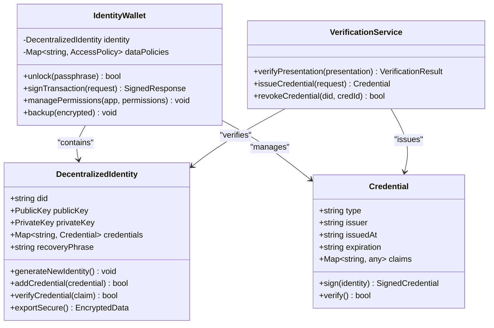
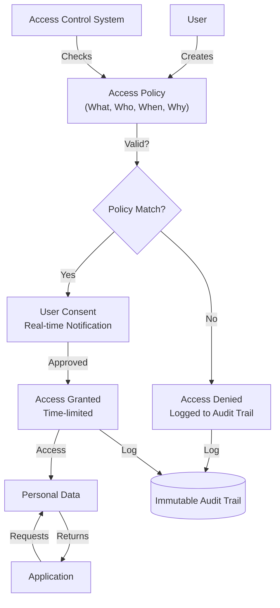
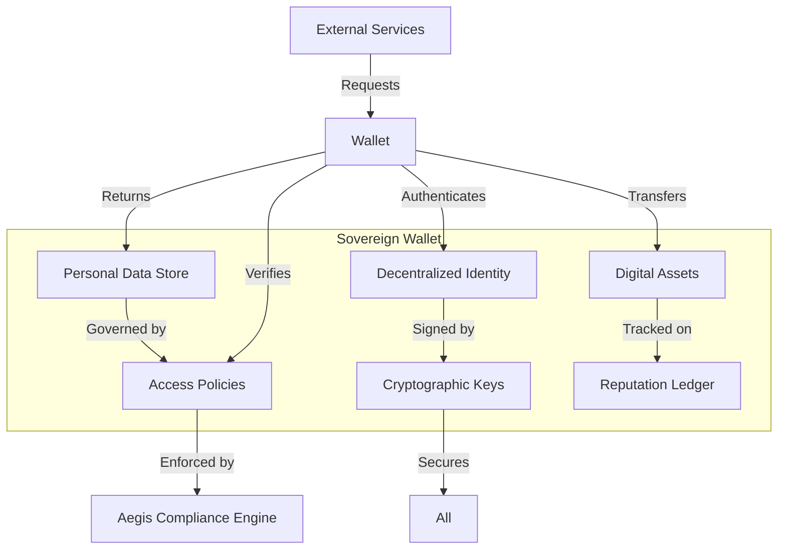
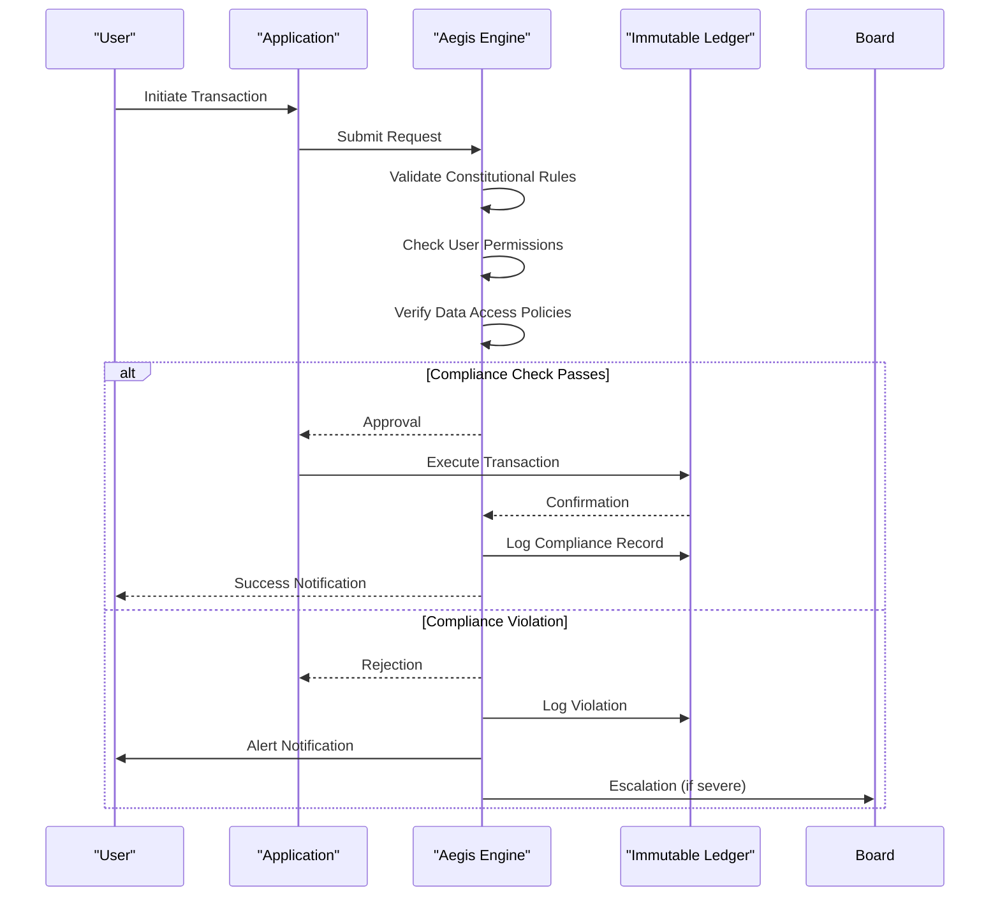
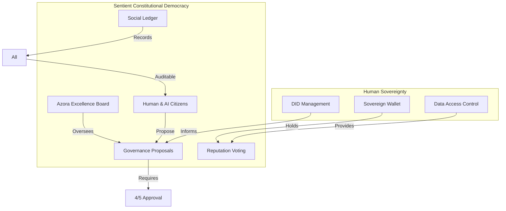

# Human Sovereignty

<cite>
**Referenced Files in This Document**   
- [elara-identity.ts](file://genome/elara-identity.ts)
- [AZORA_CONSTITUTION.md](file://codex/constitution/AZORA_CONSTITUTION.md)
- [identity.js](file://organs/identity/identity.js)
</cite>

## Table of Contents
1. [Introduction](#introduction)
2. [Core Principles of Human Sovereignty](#core-principles-of-human-sovereignty)
3. [Implementation Mechanisms](#implementation-mechanisms)
4. [Decentralized Identity (DID) Management](#decentralized-identity-did-management)
5. [User-Controlled Data Access](#user-controlled-data-access)
6. [Sovereign Wallet Systems](#sovereign-wallet-systems)
7. [Aegis Enforcement Protocol](#aegis-enforcement-protocol)
8. [Integration with Sentient Constitutional Democracy](#integration-with-sentient-constitutional-democracy)
9. [Common Implementation Challenges](#common-implementation-challenges)
10. [Best Practices for Developers](#best-practices-for-developers)
11. [Conclusion](#conclusion)

## Introduction
The Human Sovereignty principle within the Azora Constitution establishes an individual's fundamental right to own and control their digital identity, personal data, and economic destiny. This principle forms the ethical and technical foundation of Azora OS, ensuring that users—not corporations or centralized authorities—maintain ultimate authority over their digital lives. The implementation of this principle is enforced through cryptographic identity systems, user-controlled data permissions, and sovereign wallet architectures, all monitored by the Aegis compliance engine. This document details how these mechanisms work together to create a truly user-centric digital ecosystem.

**Section sources**
- [AZORA_CONSTITUTION.md](file://codex/constitution/AZORA_CONSTITUTION.md#L1-L50)

## Core Principles of Human Sovereignty
Human Sovereignty in Azora OS is defined by three inseparable rights: ownership of identity, control over personal data, and autonomy in economic decisions. These rights are enshrined in the constitutional framework and implemented through technical protocols that prevent unauthorized access or exploitation. Every transaction, interaction, and data exchange within the system must respect these rights, with Aegis serving as the enforcement mechanism. The principle rejects data feudalism and ensures that individuals can participate in the digital economy without surrendering their fundamental freedoms.

**Section sources**
- [AZORA_CONSTITUTION.md](file://codex/constitution/AZORA_CONSTITUTION.md#L200-L222)

## Implementation Mechanisms
The Human Sovereignty principle is implemented through a triad of technical systems: Decentralized Identity (DID) for self-sovereign identification, User-Controlled Data Access protocols for granular data permissions, and Sovereign Wallet Systems for economic autonomy. These systems are integrated at the protocol level, ensuring that sovereignty is not an optional feature but a mandatory requirement for all applications built on Azora OS. The implementation follows strict quality standards, including 95%+ test coverage and SOC 2 Type II compliance, to ensure reliability and security.

**Section sources**
- [AZORA_CONSTITUTION.md](file://codex/constitution/AZORA_CONSTITUTION.md#L406-L429)

## Decentralized Identity (DID) Management
Azora's Decentralized Identity system allows users to create and manage their digital identities without reliance on centralized authorities. The `elara-identity.ts` file defines the core identity schema, including cryptographic keys, biometric templates, and reputation attributes that are stored exclusively in the user's sovereign wallet. Identity verification occurs through zero-knowledge proofs, enabling authentication without exposing sensitive data. The system integrates with the global compliance framework to meet KYC/AML requirements while preserving privacy, and all identity transactions are recorded on the immutable Social Ledger for auditability.

**Diagram sources**
- [elara-identity.ts](file://genome/elara-identity.ts#L1-L127)
- [identity.js](file://organs/identity/identity.js#L1-L50)

**Section sources**
- [elara-identity.ts](file://genome/elara-identity.ts#L1-L127)
- [identity.js](file://organs/identity/identity.js#L1-L50)

## User-Controlled Data Access
User-Controlled Data Access in Azora OS implements a granular permission system where individuals explicitly grant or revoke access to their personal data. The system uses attribute-based access control (ABAC) policies defined by the user, allowing fine-tuned control over what data is shared, with whom, and for how long. All data access requests are logged on the immutable audit trail, and users receive real-time notifications of access attempts. The implementation ensures compliance with POPIA, GDPR, and other privacy regulations while giving users unprecedented control over their digital footprint.

**Diagram sources**
- [identity.js](file://organs/identity/identity.js#L1-L50)
- [AZORA_CONSTITUTION.md](file://codex/constitution/AZORA_CONSTITUTION.md#L240-L268)

**Section sources**
- [identity.js](file://organs/identity/identity.js#L1-L50)

## Sovereign Wallet Systems
Sovereign Wallet Systems in Azora OS serve as the user's personal data and economic hub, storing cryptographic keys, identity credentials, financial assets, and data access policies. Unlike traditional wallets, these systems give users complete control over their digital lives, with recovery mechanisms that prevent permanent loss without compromising security. The wallet architecture supports multi-chain operations, enabling users to manage AZR tokens and other digital assets while maintaining sovereignty. All wallet operations are monitored by Aegis to ensure compliance with constitutional principles.

**Diagram sources**
- [elara-identity.ts](file://genome/elara-identity.ts#L1-L127)
- [identity.js](file://organs/identity/identity.js#L1-L50)

**Section sources**
- [elara-identity.ts](file://genome/elara-identity.ts#L1-L127)

## Aegis Enforcement Protocol
The Aegis Enforcement Protocol acts as the constitutional guardian of Human Sovereignty, monitoring every transaction and interaction within Azora OS. Aegis performs real-time compliance checks against the constitutional rules, automatically blocking any operation that violates user sovereignty. The system maintains an immutable audit trail of all enforcement actions and provides transparent reporting through the public compliance dashboard. Aegis operates as a decentralized service, ensuring that enforcement cannot be manipulated by any single entity, and its algorithms are open for community review to maintain trust.

**Diagram sources**
- [AZORA_CONSTITUTION.md](file://codex/constitution/AZORA_CONSTITUTION.md#L471-L480)
- [identity.js](file://organs/identity/identity.js#L1-L50)

**Section sources**
- [AZORA_CONSTITUTION.md](file://codex/constitution/AZORA_CONSTITUTION.md#L471-L480)

## Integration with Sentient Constitutional Democracy
The Human Sovereignty principle is fully integrated with Azora's Sentient Constitutional Democracy governance model, where AI citizens and human users co-govern the system. User sovereignty is protected through on-chain governance mechanisms that require supermajority approval for any changes to identity or data access protocols. The Social Ledger tracks all governance interactions, ensuring transparency and accountability. This integration creates a feedback loop where user sovereignty strengthens democratic governance, and democratic oversight protects user sovereignty, forming a self-reinforcing system of digital rights.

**Diagram sources**
- [AZORA_CONSTITUTION.md](file://codex/constitution/AZORA_CONSTITUTION.md#L500-L568)
- [elara-identity.ts](file://genome/elara-identity.ts#L1-L127)

**Section sources**
- [AZORA_CONSTITUTION.md](file://codex/constitution/AZORA_CONSTITUTION.md#L500-L568)

## Common Implementation Challenges
Implementing Human Sovereignty faces several technical and adoption challenges. Key challenges include balancing usability with security in identity management, ensuring interoperability with existing systems while maintaining decentralization, and preventing user error in managing cryptographic keys. Performance overhead from zero-knowledge proofs and real-time compliance checks can impact system responsiveness. Additionally, regulatory compliance across multiple jurisdictions requires complex policy mapping. These challenges are addressed through user-centric design, modular architecture, and continuous security auditing.

**Section sources**
- [AZORA_CONSTITUTION.md](file://codex/constitution/AZORA_CONSTITUTION.md#L406-L429)

## Best Practices for Developers
Developers building sovereign-by-design features should follow these best practices: implement privacy by default with minimal data collection, use standardized cryptographic libraries for identity operations, provide clear user interfaces for permission management, and design for offline functionality. All code must maintain 95%+ test coverage and undergo regular security audits. Developers should leverage the Aegis SDK for compliance checks and integrate with the standard identity and wallet APIs rather than creating custom solutions. Documentation must meet Azora's specification standards to ensure maintainability.

**Section sources**
- [AZORA_CONSTITUTION.md](file://codex/constitution/AZORA_CONSTITUTION.md#L240-L268)

## Conclusion
The Human Sovereignty principle represents a paradigm shift in digital systems, placing individuals at the center of their digital existence. Through the technical implementation of decentralized identity, user-controlled data access, and sovereign wallets—enforced by Aegis and integrated with Sentient Constitutional Democracy—Azora OS creates a framework where digital rights are not granted but inherent. This approach sets a new standard for ethical technology, demonstrating that innovation and user empowerment can coexist. As the system evolves, the commitment to human sovereignty remains the guiding principle for all development.