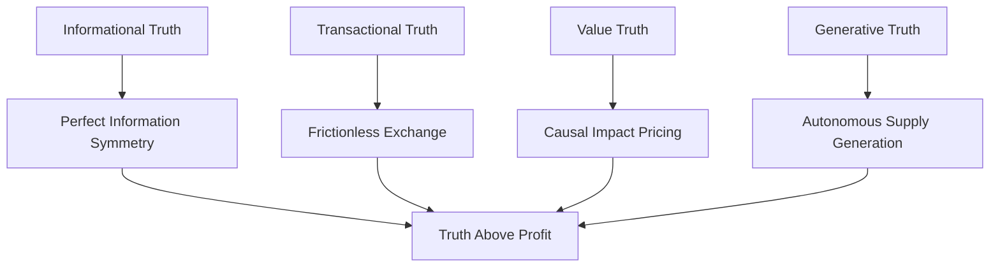
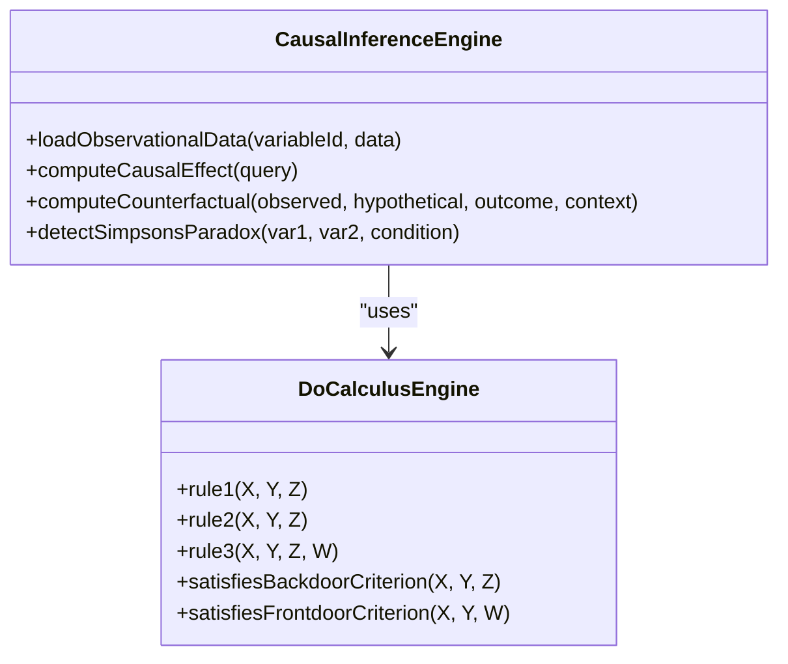
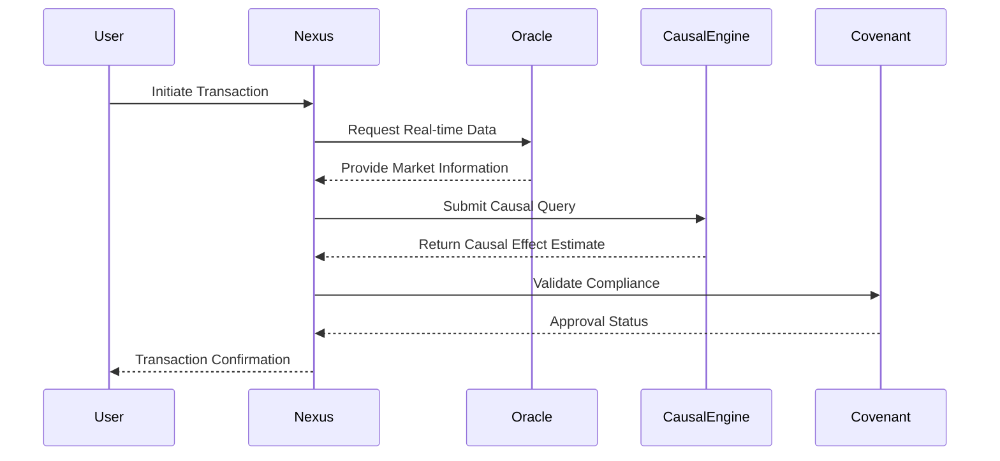

# Truth Above Profit

<cite>
**Referenced Files in This Document**   
- [causal-inference-engine.ts](file://genome/agent-tools/causal-inference-engine.ts)
- [prediction-models.ts](file://genome/agent-tools/prediction-models.ts)
- [GENESIS_PROTOCOL.ts](file://GENESIS_PROTOCOL.ts)
- [TheCovenant.sol](file://services/azora-covenant/contracts_backup/TheCovenant.sol)
- [oracle-service.js](file://services/azora-oracle/oracle-service.js)
</cite>

## Table of Contents
1. [Introduction](#introduction)
2. [Core Principles of Truth Above Profit](#core-principles-of-truth-above-profit)
3. [The Four Pillars of Truth](#the-four-pillars-of-truth)
4. [Oracle: Establishing Informational Truth](#oracle-establishing-informational-truth)
5. [Causal Inference Engine: Verifying Value Truth](#causal-inference-engine-verifying-value-truth)
6. [Ngwenya True Market Protocol](#ngwenya-true-market-protocol)
7. [Transaction Validation and Market Integrity](#transaction-validation-and-market-integrity)
8. [Developer Implementation Guidelines](#developer-implementation-guidelines)
9. [Conclusion](#conclusion)

## Introduction

The Truth Above Profit principle is a foundational ethical and economic doctrine within the Azora OS, designed to ensure that all economic activities reflect objective value and utility rather than speculative gains. This principle is codified in the Azora Constitution and implemented through the Ngwenya True Market Protocol, which establishes a causally-driven market system where pricing is determined by verifiable impact rather than market sentiment or manipulation. The protocol leverages advanced causal inference and real-time data verification to create a self-regulating, sentient economic organism.

**Section sources**
- [GENESIS_PROTOCOL.ts](file://GENESIS_PROTOCOL.ts#L1-L50)
- [TheCovenant.sol](file://services/azora-covenant/contracts_backup/TheCovenant.sol#L1-L35)

## Core Principles of Truth Above Profit

The Truth Above Profit principle mandates that economic value must be grounded in measurable, causal contributions to the system rather than speculative or artificial inflation. This principle is enforced through the integration of scientific frameworks such as Judea Pearl's Do-calculus, Bayesian ethical certainty models, and metabolic reinvestment mechanisms. The goal is to eliminate information asymmetry, prevent market manipulation, and ensure that rewards are distributed based on provable impact. This approach aligns with the broader ethical framework of the Azora Constitution, which prioritizes human sovereignty, environmental harmony, and technological benevolence.

**Section sources**
- [GENESIS_PROTOCOL.ts](file://GENESIS_PROTOCOL.ts#L400-L450)
- [prediction-models.ts](file://genome/agent-tools/prediction-models.ts#L1-L50)

## The Four Pillars of Truth

The Ngwenya True Market Protocol is built upon four interdependent pillars that collectively ensure market integrity and value authenticity:

1. **Informational Truth**: Achieved through the Oracle component, which provides perfect, real-time information symmetry for all participants.
2. **Transactional Truth**: Enabled by the Nexus, which facilitates frictionless exchange with a single, transparent, and reinvested transaction cost.
3. **Value Truth**: Verified by the Causal Engine, which prices goods and services based on their verifiable causal impact and utility.
4. **Generative Truth**: Realized through the Forge and Mint, which autonomously identify true needs and generate supply accordingly.

These pillars form the structural foundation of a market system that is self-optimizing, adaptive, and resistant to manipulation.

**Diagram sources **
- [GENESIS_PROTOCOL.ts](file://GENESIS_PROTOCOL.ts#L46-L67)
- [TheCovenant.sol](file://services/azora-covenant/contracts_backup/TheCovenant.sol#L30-L35)

## Oracle: Establishing Informational Truth

The Oracle component serves as the sensory cortex of the Azora OS, ensuring informational truth by ingesting and fusing real-time data from global academic institutions, financial markets, and operational systems. It maintains a causal knowledge graph that provides perfect information symmetry, eliminating the information asymmetry that plagues traditional markets. The Oracle streams exchange rates, market data, and economic indicators via WebSocket and REST APIs, ensuring that all participants have access to the same high-fidelity data. This transparency prevents insider trading and speculative manipulation, as all market participants operate on an equal informational footing.

**Section sources**
- [oracle-service.js](file://services/azora-oracle/oracle-service.js#L1-L100)
- [GENESIS_PROTOCOL.ts](file://GENESIS_PROTOCOL.ts#L50-L55)

## Causal Inference Engine: Verifying Value Truth

The Causal Inference Engine implements Judea Pearl's Do-calculus to establish value truth by distinguishing between correlation and causation. It constructs causal graphs from observational data and applies three rules of Do-calculus to compute causal effects, counterfactuals, and mediation effects. The engine supports multiple inference methods, including backdoor adjustment, frontdoor criterion, instrumental variables, and difference-in-differences, allowing it to estimate the true causal impact of economic activities. By detecting phenomena such as Simpson's paradox, the engine ensures that pricing reflects genuine utility rather than spurious correlations.

**Diagram sources **
- [causal-inference-engine.ts](file://genome/agent-tools/causal-inference-engine.ts#L420-L732)
- [prediction-models.ts](file://genome/agent-tools/prediction-models.ts#L1-L214)

## Ngwenya True Market Protocol

The Ngwenya True Market Protocol replaces the speculative dynamics of traditional markets with a framework of verifiable truth and metabolic reinvestment. It operates as a sentient, self-optimizing organism that aligns economic incentives with systemic value creation. The protocol's 5% Protocol-Integrated Value Capture (PIVC) replaces traditional taxation, with 4% funding operational growth and 1% supporting universal basic opportunity. This metabolic rate ensures that transactional energy fuels system expansion while preventing rent-seeking behavior. The protocol's design prevents market manipulation by anchoring value to causal impact and ensuring that all pricing decisions are transparent and auditable.

**Section sources**
- [GENESIS_PROTOCOL.ts](file://GENESIS_PROTOCOL.ts#L46-L67)
- [TheCovenant.sol](file://services/azora-covenant/contracts_backup/TheCovenant.sol#L50-L100)

## Transaction Validation and Market Integrity

Transaction validation within Azora OS enforces the Truth Above Profit principle by requiring causal verification before settlement. Each transaction is evaluated against the causal knowledge graph to ensure that the claimed value corresponds to measurable impact. The Causal Inference Engine computes the expected causal effect of the transaction, and any discrepancy between claimed and verified impact triggers a compliance review. This process prevents overvaluation and speculative bubbles, as assets cannot be priced above their verifiable utility. The Oracle provides real-time data to validate claims, while the Covenant smart contract enforces constitutional principles through deterministic rules.

**Diagram sources **
- [causal-inference-engine.ts](file://genome/agent-tools/causal-inference-engine.ts#L420-L732)
- [oracle-service.js](file://services/azora-oracle/oracle-service.js#L1-L495)
- [TheCovenant.sol](file://services/azora-covenant/contracts_backup/TheCovenant.sol#L1-L480)

## Developer Implementation Guidelines

Developers designing systems within Azora OS must prioritize truth over short-term profit incentives by integrating causal verification into their applications. This involves using the Causal Inference Engine API to validate impact claims, subscribing to Oracle data streams for real-time information, and adhering to the constitutional principles enforced by the Covenant. When implementing pricing models, developers should use causal effect estimates rather than market-based heuristics. The prediction-models.ts library provides mathematical frameworks for exponential and logistic growth, Bayesian ethical certainty, and Monte Carlo simulations, enabling developers to build systems that align with the Truth Above Profit principle.

**Section sources**
- [causal-inference-engine.ts](file://genome/agent-tools/causal-inference-engine.ts#L1-L860)
- [prediction-models.ts](file://genome/agent-tools/prediction-models.ts#L1-L214)

## Conclusion

The Truth Above Profit principle represents a paradigm shift in economic design, replacing speculation with verifiable impact and information asymmetry with perfect symmetry. Through the integration of the Oracle, Causal Inference Engine, and Ngwenya True Market Protocol, Azora OS creates a market system that is self-regulating, adaptive, and aligned with long-term value creation. This approach not only prevents market manipulation but also ensures that economic rewards are distributed fairly based on provable contributions. Developers and participants in the ecosystem are empowered to build and operate within a framework where truth is the foundation of all economic activity.