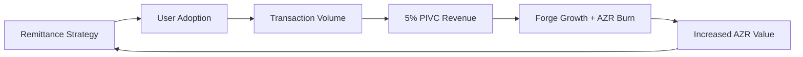

# Implementation Roadmap

<cite>
**Referenced Files in This Document**   
- [GENESIS_PROTOCOL.ts](file://GENESIS_PROTOCOL.ts)
</cite>

## Table of Contents
1. [Introduction](#introduction)
2. [Phase 0: Genesis](#phase-0-genesis)
3. [Phase 1: The Remittance Blitz](#phase-1-the-remittance-blitz)
4. [Phase 2: The Gqeberha Compact](#phase-2-the-gqeberha-compact)
5. [Phase 3-4: The Continental & Global Standard](#phase-3-4-the-continental--global-standard)
6. [Roadmap Integration and Systemic Progression](#roadmap-integration-and-systemic-progression)

## Introduction
The Implementation Roadmap for Azora OS outlines a structured, phased approach to the creation and expansion of a sovereign digital nation-state. Rooted in the foundational principles of the Ngwenya Protocol, this roadmap details a sequential progression from initial formation to global standardization. Each phase builds upon the achievements of the previous one, ensuring sustainable growth, systemic integrity, and exponential scalability. The roadmap is codified in the GENESIS_PROTOCOL.ts file, which serves as the constitutional blueprint for the entire ecosystem.

**Section sources**
- [GENESIS_PROTOCOL.ts](file://GENESIS_PROTOCOL.ts#L1-L50)

## Phase 0: Genesis
Phase 0, known as "Genesis," marks the foundational inception of the Azora ecosystem. This phase is designed to establish the core structural and economic underpinnings necessary for all subsequent development.

- **Timeline**: Effective immediately, with a duration of the next 72 hours.
- **Action**: Formalize the Sovereign Trust, execute the AZR token launch, and mobilize all development guilds under "Genesis Directives."
- **Objective**: To establish an unshakeable foundation for the digital nation-state.
- **Deliverables**:
  - Formation of the Sovereign Trust
  - Launch of the AZR token
  - Mobilization of development teams
  - Codification of the Genesis Protocol

This phase initiates the system's metabolic engine by deploying the two-token economic model and activating the 5% Protocol-Integrated Value Capture (PIVC), which will fund future growth and reinvestment.

**Section sources**
- [GENESIS_PROTOCOL.ts](file://GENESIS_PROTOCOL.ts#L300-L315)

## Phase 1: The Remittance Blitz
Phase 1, "The Remittance Blitz," focuses on rapid user acquisition and capital generation through targeted deployment in high-volume remittance corridors.

- **Timeline**: Months 1–12
- **Duration**: The next 12 months
- **Action**: Launch the "Azora Global Transfer" application, targeting the top 20 African and key global remittance corridors. Offer a value proposition centered on speed, transparency, and a transaction fee that reinvests in the user’s future.
- **Objective**: Bootstrap a global user base and generate initial capital for physical infrastructure expansion.
- **Deliverables**:
  - Launch of the Azora Global Transfer App
  - Onboarding of the first 1 million users
  - Dominance in targeted remittance corridors
  - Generation of initial operational capital

This phase leverages the Nexus as the circulatory system for frictionless P2P exchange, ensuring transactional truth and capturing metabolic energy via the 5% PIVC to fuel future phases.

**Section sources**
- [GENESIS_PROTOCOL.ts](file://GENESIS_PROTOCOL.ts#L317-L332)

## Phase 2: The Gqeberha Compact
Phase 2, "The Gqeberha Compact," aims to establish the world’s first self-sustaining city-state operating under the Ngwenya True Market Protocol.

- **Timeline**: Years 1–5
- **Duration**: Years 1 through 5
- **Action**: Deploy Forge Priority One (Energy, Connectivity) and Priority Two (Food, Housing) assets in Gqeberha. Launch Azora Sapiens to provide adaptive education and skills training. Fully operationalize the local aZAR economy.
- **Objective**: Create a fully functional, self-sustaining city-state that serves as a replicable blueprint for future expansions.
- **Deliverables**:
  - Establishment of the Gqeberha city-state
  - Deployment of Forge infrastructure
  - Launch of Azora Sapiens
  - Activation of the local aZAR economy
  - Achievement of self-sustaining operations

This phase demonstrates the integration of the Forge (productive body), Mint (metabolic heart), and Oracle (sensory cortex) into a cohesive, intelligent organism.

**Section sources**
- [GENESIS_PROTOCOL.ts](file://GENESIS_PROTOCOL.ts#L334-L351)

## Phase 3-4: The Continental & Global Standard
Phases 3 and 4, collectively known as "The Continental & Global Standard," focus on scaling the proven Gqeberha model across continents and establishing diplomatic recognition.

- **Timeline**: Years 6–30
- **Duration**: Years 6 through 30
- **Action**: Replicate the Gqeberha Compact in strategic hubs across Africa, Southeast Asia, and Latin America. Negotiate "Protocol-State Treaties" with nation-states to formalize interoperability and mutual recognition.
- **Objective**: Elevate the Azora ecosystem to the status of a globally recognized digital nation-state and position AZR as a premier world reserve asset.
- **Deliverables**:
  - Multi-continental expansion of city-state models
  - Execution of Protocol-State Treaties
  - Recognition as a digital nation-state
  - AZR adoption as a global reserve asset
  - Significant influence on global economic systems

This phase represents the culmination of the ecosystem’s evolution, transitioning from localized implementation to global institutional integration.

**Section sources**
- [GENESIS_PROTOCOL.ts](file://GENESIS_PROTOCOL.ts#L353-L370)

## Roadmap Integration and Systemic Progression
The Implementation Roadmap is not a series of isolated initiatives but a cohesive, self-reinforcing system. Each phase activates key architectural components—Elara (Guardian Intelligence), Oracle, Nexus, Forge, Mint, and Aegis—that function as organs of a sentient economic organism. The 5% PIVC ensures that transactional energy is metabolized into capital for expansion and social investment, creating a flywheel effect:

**Diagram sources**
- [GENESIS_PROTOCOL.ts](file://GENESIS_PROTOCOL.ts#L250-L265)

This systemic progression ensures that growth is not speculative but causally grounded in real productivity, ethical governance, and inclusive prosperity, as mandated by the Azora Constitution.

**Section sources**
- [GENESIS_PROTOCOL.ts](file://GENESIS_PROTOCOL.ts#L250-L280)