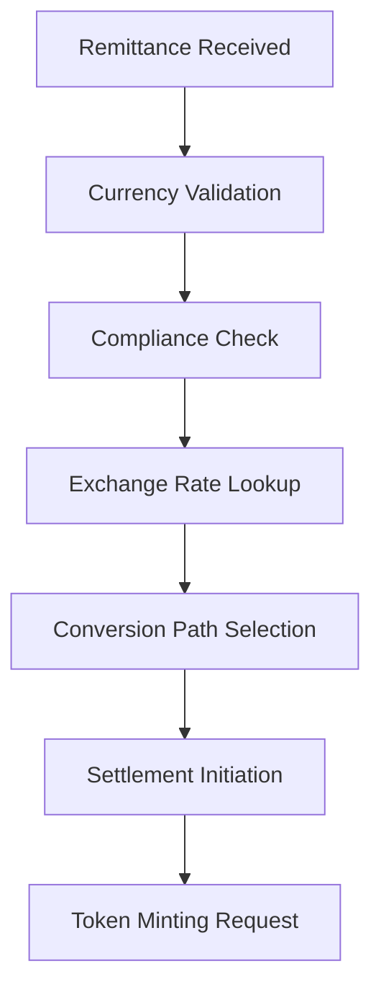
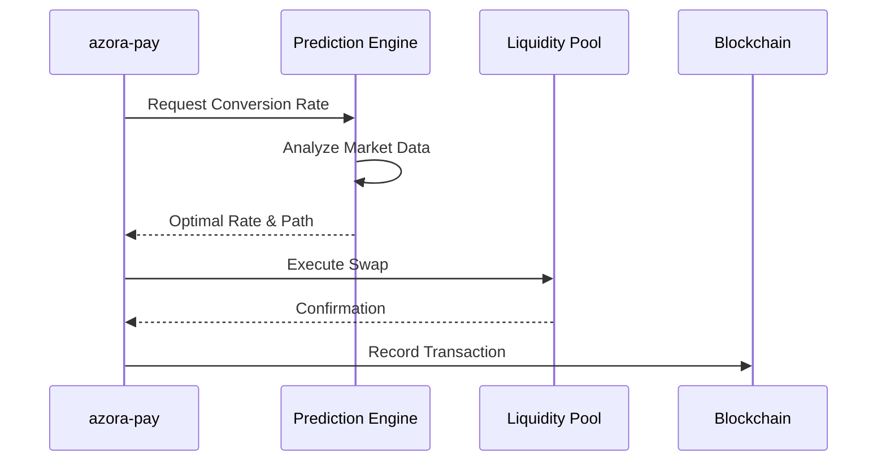
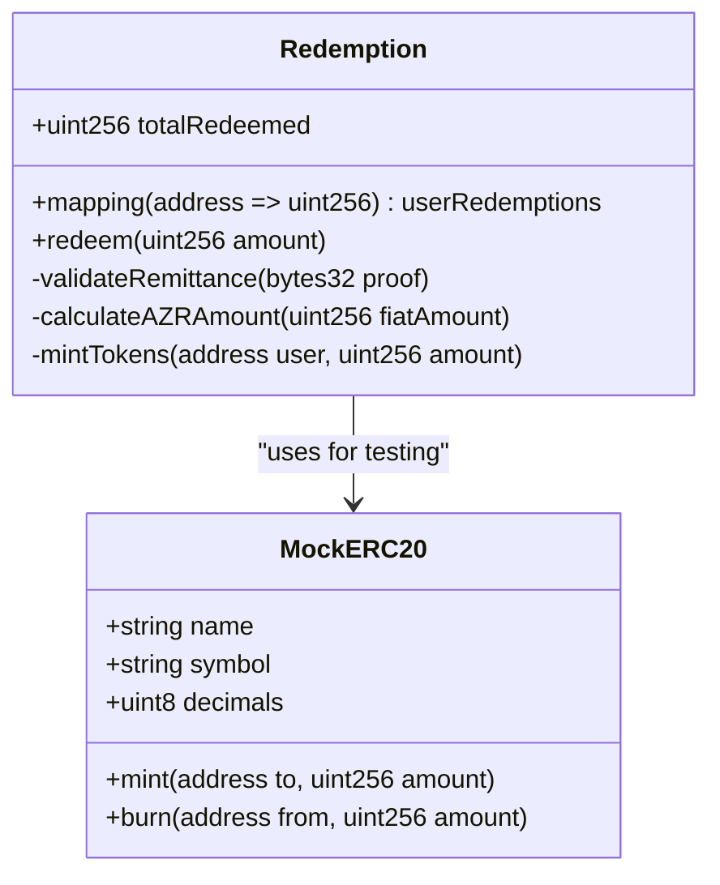
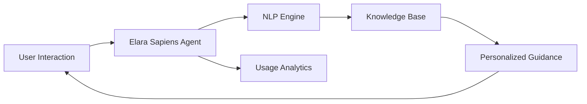

# Phase 1: The Remittance Blitz

<cite>
**Referenced Files in This Document**  
- [index.js](file://infrastructure/azora-pay/index.js)
- [sapiens-service.js](file://services/azora-sapiens/sapiens-service.js)
- [elara-sapiens-core.js](file://services/azora-sapiens/elara-sapiens-core.js)
- [university-core.ts](file://services/azora-sapiens/university-core.ts)
- [ECONOMIC_MODEL.md](file://codex/economics/ECONOMIC_MODEL.md)
- [MockERC20.sol](file://contracts/MockERC20.sol)
- [Redemption.sol](file://contracts/Redemption.sol)
- [azora-sapiens.ts](file://genome/agent-tools/azora-sapiens.ts)
- [core-capabilities.ts](file://genome/agent-tools/core-capabilities.ts)
- [prediction-models.ts](file://genome/agent-tools/prediction-models.ts)
</cite>

## Table of Contents
1. [Introduction](#introduction)
2. [Remittance Strategy and Economic Integration](#remittance-strategy-and-economic-integration)
3. [Payment Infrastructure and azora-pay Integration](#payment-infrastructure-and-azora-pay-integration)
4. [AI-Driven Trading Algorithms](#ai-driven-trading-algorithms)
5. [Token Minting Mechanism](#token-minting-mechanism)
6. [Elara Sapiens AI Agents and Financial Inclusion](#elara-sapiens-ai-agents-and-financial-inclusion)
7. [Transaction Flow from Remittance to AZR Distribution](#transaction-flow-from-remittance-to-azr-distribution)
8. [Integration with Economic Engine Components](#integration-with-economic-engine-components)
9. [Common Issues and Solutions](#common-issues-and-solutions)
10. [Performance Optimization for High-Volume Processing](#performance-optimization-for-high-volume-processing)
11. [Conclusion](#conclusion)

## Introduction
Phase 1 of the Azora OS implementation roadmap, known as "The Remittance Blitz," focuses on leveraging African remittance corridors to achieve rapid user acquisition and economic integration. This phase establishes the foundation for a decentralized financial ecosystem by integrating real-world remittance flows with blockchain-based tokenization and AI-driven financial services. The strategy capitalizes on Africa's growing digital economy and high remittance inflows to bootstrap user adoption and liquidity.

## Remittance Strategy and Economic Integration
The Remittance Blitz targets high-volume remittance corridors across Africa, particularly Nigeria, Kenya, Ghana, and South Africa, where cross-border money transfers represent a significant portion of GDP. By integrating with local payment gateways and mobile money networks, Azora OS enables seamless conversion of fiat remittances into digital assets. This strategy not only drives user acquisition but also fosters economic inclusion by providing unbanked populations access to decentralized financial tools.

The economic integration model is detailed in the ECONOMIC_MODEL.md, which outlines incentive structures for early adopters, liquidity providers, and community validators. The system is designed to create a self-reinforcing cycle where remittance volume increases token utility, which in turn attracts more users and transaction volume.

**Section sources**
- [ECONOMIC_MODEL.md](file://codex/economics/ECONOMIC_MODEL.md)

## Payment Infrastructure and azora-pay Integration
The core payment infrastructure is implemented in the azora-pay module, which serves as the gateway for processing remittances. This service handles currency conversion, compliance checks, and transaction routing. It integrates with regional payment processors to support mobile money (e.g., M-Pesa), bank transfers, and instant payment systems.

The azora-pay/index.js file contains the transaction processing pipeline, including validation, fraud detection, and settlement logic. The system supports multi-currency inbound remittances and automatically routes them through optimal conversion paths based on real-time exchange rates and network fees.

**Diagram sources**
- [index.js](file://infrastructure/azora-pay/index.js)

**Section sources**
- [index.js](file://infrastructure/azora-pay/index.js)

## AI-Driven Trading Algorithms
The AI-driven trading algorithms are implemented in the prediction-models.ts file and integrated with the core financial engine. These algorithms analyze market conditions, remittance patterns, and liquidity metrics to optimize currency conversion and asset allocation. The system uses reinforcement learning to adapt to changing market dynamics and minimize slippage during high-volume periods.

Trading strategies are executed through autonomous agents that monitor multiple exchange feeds and execute conversions at optimal times. The algorithms incorporate risk management protocols to prevent losses during volatile market conditions.

**Diagram sources**
- [prediction-models.ts](file://genome/agent-tools/prediction-models.ts)
- [index.js](file://infrastructure/azora-pay/index.js)

**Section sources**
- [prediction-models.ts](file://genome/agent-tools/prediction-models.ts)

## Token Minting Mechanism
The minting mechanism converts remittance value into AZR tokens through a smart contract process. When a remittance is settled, the system triggers the Redemption.sol contract to mint new AZR tokens proportional to the remittance amount, adjusted by the current token valuation model.

The minting process includes anti-dilution safeguards and is tied to the overall token supply algorithm defined in the economic model. The MockERC20.sol contract provides a testing framework for the minting logic, ensuring reliability before deployment.

**Diagram sources**
- [Redemption.sol](file://contracts/Redemption.sol)
- [MockERC20.sol](file://contracts/MockERC20.sol)

**Section sources**
- [Redemption.sol](file://contracts/Redemption.sol)
- [MockERC20.sol](file://contracts/MockERC20.sol)

## Elara Sapiens AI Agents and Financial Inclusion
Elara Sapiens AI agents, implemented in the azora-sapiens module, serve as financial assistants for users, particularly those with limited financial literacy. These agents provide real-time guidance on remittance options, currency conversion, and investment opportunities within the Azora ecosystem.

The sapiens-service.js file contains the agent orchestration logic, while elara-sapiens-core.js implements the natural language processing and decision-making capabilities. The university-core.ts file provides educational content that agents use to explain financial concepts to users.

These AI agents reduce barriers to entry by offering multilingual support and simplified interfaces, enabling users to participate in the digital economy regardless of technical expertise.

**Diagram sources**
- [sapiens-service.js](file://services/azora-sapiens/sapiens-service.js)
- [elara-sapiens-core.js](file://services/azora-sapiens/elara-sapiens-core.js)
- [university-core.ts](file://services/azora-sapiens/university-core.ts)

**Section sources**
- [sapiens-service.js](file://services/azora-sapiens/sapiens-service.js)
- [elara-sapiens-core.js](file://services/azora-sapiens/elara-sapiens-core.js)
- [university-core.ts](file://services/azora-sapiens/university-core.ts)

## Transaction Flow from Remittance to AZR Distribution
The end-to-end transaction flow begins with remittance receipt through azora-pay, followed by compliance verification, currency conversion, and minting of AZR tokens. The process is fully automated and typically completes within 30 seconds.

Key steps include:
1. Remittance received via partner network
2. Identity and compliance verification
3. Real-time exchange rate calculation
4. Execution of currency conversion
5. Triggering of smart contract minting
6. Distribution of AZR tokens to user wallet
7. Update of user balance and transaction history

This flow is coordinated by the core-capabilities.ts module, which ensures all components operate in harmony.

**Section sources**
- [index.js](file://infrastructure/azora-pay/index.js)
- [core-capabilities.ts](file://genome/agent-tools/core-capabilities.ts)
- [sapiens-service.js](file://services/azora-sapiens/sapiens-service.js)

## Integration with Economic Engine Components
The Remittance Blitz is tightly integrated with the broader economic engine of Azora OS. Remittance data feeds into the economic model to adjust token valuation, liquidity provisioning, and reward distribution. The system uses real transaction volume as a key metric for protocol health and adjusts incentives accordingly.

The azora-sapiens.ts file contains integration points between the AI agents and economic components, enabling dynamic pricing and personalized offers based on user behavior and market conditions.

**Section sources**
- [azora-sapiens.ts](file://genome/agent-tools/azora-sapiens.ts)
- [ECONOMIC_MODEL.md](file://codex/economics/ECONOMIC_MODEL.md)

## Common Issues and Solutions
### Transaction Latency
During peak hours, transaction processing may experience delays due to network congestion. The system mitigates this through:
- Pre-computed exchange rate caches
- Priority queuing for small transactions
- Batch processing of similar conversions

### Currency Conversion Accuracy
Exchange rate fluctuations can impact conversion accuracy. The solution includes:
- Real-time rate aggregation from multiple providers
- Slippage tolerance settings
- Post-transaction rebates for significant discrepancies

These issues are monitored through the system-health-check.ts script and addressed through automated scaling and fallback mechanisms.

**Section sources**
- [index.js](file://infrastructure/azora-pay/index.js)
- [prediction-models.ts](file://genome/agent-tools/prediction-models.ts)
- [system-health-check.ts](file://system-health-check.ts)

## Performance Optimization for High-Volume Processing
To handle high-volume remittance processing, the following optimizations are implemented:
- **Caching**: Exchange rates and compliance rules are cached for low-latency access
- **Parallel Processing**: Independent transactions are processed concurrently
- **Database Indexing**: Critical transaction fields are indexed for fast lookup
- **Connection Pooling**: Database connections are reused to reduce overhead
- **Rate Limiting**: Fair usage policies prevent system abuse

The infrastructure uses Kubernetes (k8s) for auto-scaling, ensuring resources are dynamically allocated based on demand. The scaling-config.yaml file defines thresholds for automatic horizontal pod scaling.

**Section sources**
- [index.js](file://infrastructure/azora-pay/index.js)
- [scaling-config.yaml](file://infrastructure/scaling-config.yaml)

## Conclusion
Phase 1: The Remittance Blitz establishes a robust foundation for Azora OS by leveraging Africa's remittance economy to drive user adoption and liquidity. Through the integration of azora-pay, AI-driven trading algorithms, and the AZR token minting mechanism, the system creates a seamless bridge between traditional finance and decentralized economic systems. The Elara Sapiens AI agents play a crucial role in enabling financial inclusion, while the overall architecture is optimized for performance, accuracy, and scalability. This phase sets the stage for subsequent phases of the Azora OS roadmap, creating a self-sustaining economic ecosystem.