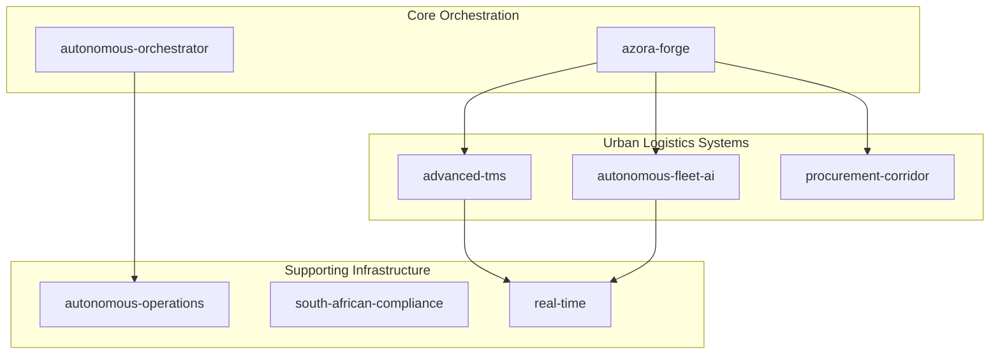
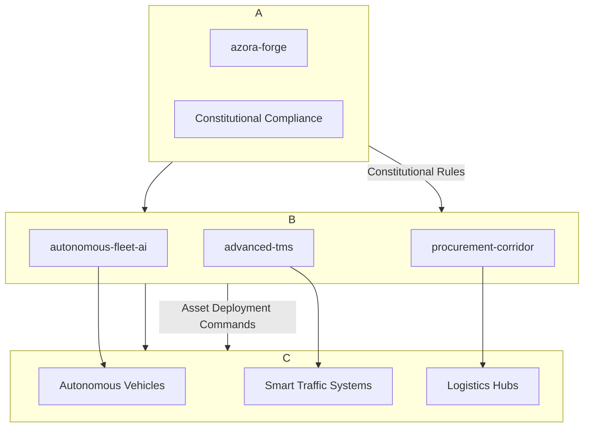
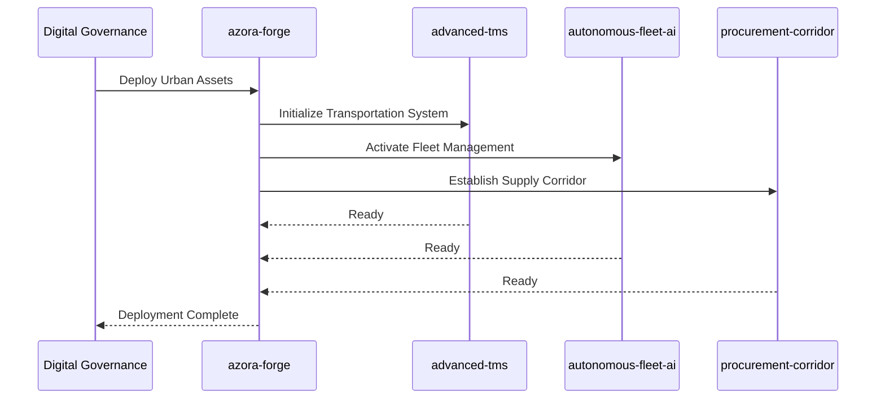
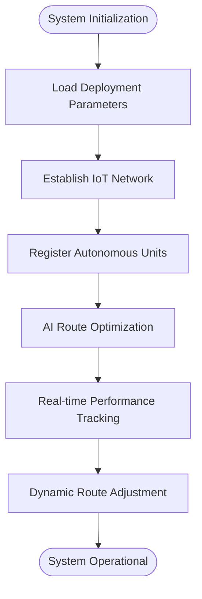
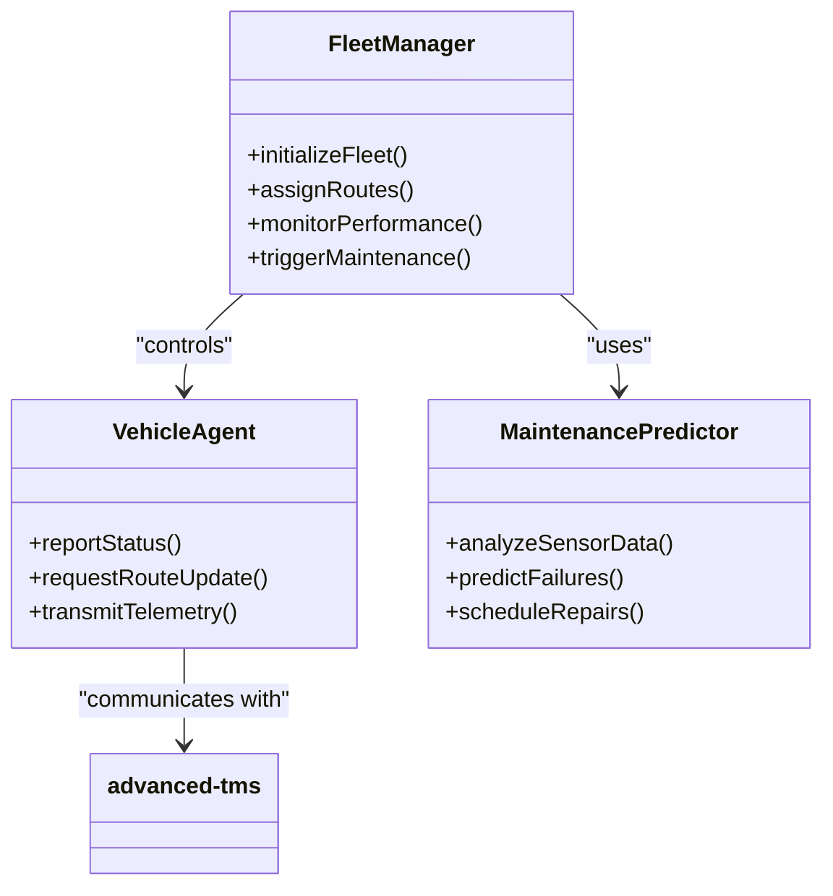
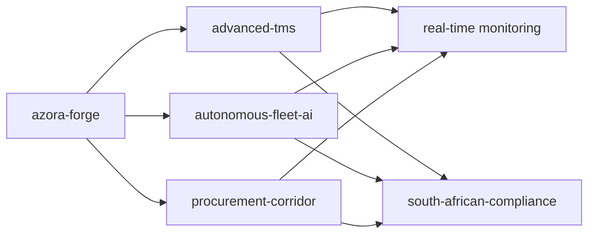

# Phase 2: The Gqeberha Compact

<cite>
**Referenced Files in This Document**  
- [advanced-tms/index.js](file://organs/advanced-tms/index.js)
- [autonomous-fleet-ai/index.js](file://organs/autonomous-fleet-ai/index.js)
- [azora-forge/index.js](file://services/azora-forge/index.js)
- [procurement-corridor/index.js](file://organs/procurement-corridor/index.js)
- [infrastructure/autonomous-orchestrator.js](file://infrastructure/autonomous-orchestrator.js)
</cite>

## Table of Contents
1. [Introduction](#introduction)
2. [Project Structure](#project-structure)
3. [Core Components](#core-components)
4. [Architecture Overview](#architecture-overview)
5. [Detailed Component Analysis](#detailed-component-analysis)
6. [Dependency Analysis](#dependency-analysis)
7. [Performance Considerations](#performance-considerations)
8. [Troubleshooting Guide](#troubleshooting-guide)
9. [Conclusion](#conclusion)

## Introduction
This document details Phase 2 of the Azora OS implementation roadmap: The Gqeberha Compact. It outlines the establishment of a self-sustaining city-state in Gqeberha, South Africa, as a proof-of-concept for the digital nation-state model. The implementation leverages Forge Priority One assets including the procurement corridor, autonomous fleet management, and advanced transportation systems. The azora-forge service orchestrates physical asset deployment and management, while AI agents optimize urban logistics across critical infrastructure domains.

## Project Structure
The Azora OS repository is structured around modular organs and services that enable decentralized governance and autonomous operations. Key components for Phase 2 are located within the `organs` and `services` directories, with specialized systems for transportation, logistics, compliance, and AI-driven orchestration.

**Diagram sources**
- [azora-forge/index.js](file://services/azora-forge/index.js)
- [advanced-tms/index.js](file://organs/advanced-tms/index.js)
- [autonomous-fleet-ai/index.js](file://organs/autonomous-fleet-ai/index.js)
- [procurement-corridor/index.js](file://organs/procurement-corridor/index.js)
- [infrastructure/autonomous-orchestrator.js](file://infrastructure/autonomous-orchestrator.js)

**Section sources**
- [services/azora-forge/index.js](file://services/azora-forge/index.js)
- [organs/advanced-tms/index.js](file://organs/advanced-tms/index.js)
- [organs/autonomous-fleet-ai/index.js](file://organs/autonomous-fleet-ai/index.js)

## Core Components
The Gqeberha Compact relies on four core technical components: the azora-forge service for asset orchestration, the advanced-tms for transportation management, the autonomous-fleet-ai for vehicle intelligence, and the procurement-corridor for supply chain coordination. These systems integrate digital governance protocols with physical infrastructure to create a responsive urban ecosystem.

**Section sources**
- [azora-forge/index.js](file://services/azora-forge/index.js)
- [advanced-tms/index.js](file://organs/advanced-tms/index.js)
- [autonomous-fleet-ai/index.js](file://organs/autonomous-fleet-ai/index.js)
- [procurement-corridor/index.js](file://organs/procurement-corridor/index.js)

## Architecture Overview
The Gqeberha Compact architecture implements a layered approach to urban AI systems, with digital governance at the core and physical infrastructure at the periphery. The azora-forge service acts as the central nervous system, deploying and managing physical assets through smart contracts and AI-driven decision engines.

**Diagram sources**
- [azora-forge/index.js](file://services/azora-forge/index.js)
- [advanced-tms/index.js](file://organs/advanced-tms/index.js)
- [autonomous-fleet-ai/index.js](file://organs/autonomous-fleet-ai/index.js)
- [procurement-corridor/index.js](file://organs/procurement-corridor/index.js)

## Detailed Component Analysis

### azora-forge Service Analysis
The azora-forge service serves as the primary mechanism for deploying and managing physical assets within the Gqeberha Compact. It interprets governance directives and translates them into executable actions across transportation, logistics, and infrastructure domains.

**Diagram sources**
- [azora-forge/index.js](file://services/azora-forge/index.js)
- [advanced-tms/index.js](file://organs/advanced-tms/index.js)
- [autonomous-fleet-ai/index.js](file://organs/autonomous-fleet-ai/index.js)
- [procurement-corridor/index.js](file://organs/procurement-corridor/index.js)

**Section sources**
- [azora-forge/index.js](file://services/azora-forge/index.js)

### advanced-tms Integration
The advanced-tms system manages urban transportation through AI-optimized routing, real-time traffic adaptation, and integration with municipal infrastructure. It receives deployment parameters from azora-forge and establishes communication with autonomous fleet units.

**Diagram sources**
- [advanced-tms/index.js](file://organs/advanced-tms/index.js)

**Section sources**
- [advanced-tms/index.js](file://organs/advanced-tms/index.js)

### autonomous-fleet-ai Implementation
The autonomous-fleet-ai service enables intelligent vehicle coordination, driver behavior analysis, and predictive maintenance scheduling. It integrates with the advanced-tms for route planning and with the procurement-corridor for supply chain synchronization.

**Diagram sources**
- [autonomous-fleet-ai/index.js](file://organs/autonomous-fleet-ai/index.js)
- [advanced-tms/index.js](file://organs/advanced-tms/index.js)

**Section sources**
- [autonomous-fleet-ai/index.js](file://organs/autonomous-fleet-ai/index.js)

## Dependency Analysis
The Gqeberha Compact systems exhibit a directed dependency graph with azora-forge at the root. All urban AI systems depend on constitutional compliance checks and real-time monitoring services to ensure operational integrity and regulatory adherence.

**Diagram sources**
- [azora-forge/index.js](file://services/azora-forge/index.js)
- [advanced-tms/index.js](file://organs/advanced-tms/index.js)
- [autonomous-fleet-ai/index.js](file://organs/autonomous-fleet-ai/index.js)
- [procurement-corridor/index.js](file://organs/procurement-corridor/index.js)
- [organs/south-african-compliance/index.js](file://organs/south-african-compliance/index.js)
- [organs/real-time/index.js](file://organs/real-time/index.js)

**Section sources**
- [services/azora-forge/index.js](file://services/azora-forge/index.js)
- [organs/advanced-tms/index.js](file://organs/advanced-tms/index.js)
- [organs/autonomous-fleet-ai/index.js](file://organs/autonomous-fleet-ai/index.js)
- [organs/procurement-corridor/index.js](file://organs/procurement-corridor/index.js)

## Performance Considerations
Urban AI systems in the Gqeberha Compact face challenges related to real-time decision latency, system integration complexity, and scalability under peak load conditions. The architecture incorporates edge computing nodes and hierarchical AI agents to minimize response times and ensure resilience.

Key performance optimization strategies include:
- Distributed decision-making to reduce central processing load
- Predictive caching of route and traffic data
- Adaptive sampling of vehicle telemetry
- Priority-based message queuing for critical operations

The system is designed to scale horizontally by adding additional fleet units and transportation corridors without reconfiguration of the core orchestration layer.

**Section sources**
- [advanced-tms/index.js](file://organs/advanced-tms/index.js)
- [autonomous-fleet-ai/index.js](file://organs/autonomous-fleet-ai/index.js)
- [infrastructure/scaling-config.yaml](file://infrastructure/scaling-config.yaml)

## Troubleshooting Guide
Common challenges in city-scale implementation include synchronization delays between digital governance and physical systems, AI decision latency under complex traffic conditions, and integration failures with legacy municipal infrastructure.

Recommended troubleshooting procedures:
1. Verify azora-forge deployment status and constitutional compliance
2. Check real-time monitoring data for system health indicators
3. Validate communication between advanced-tms and autonomous fleet units
4. Confirm procurement corridor inventory levels and supply chain status
5. Review AI model performance metrics and retraining schedules

**Section sources**
- [azora-forge/index.js](file://services/azora-forge/index.js)
- [advanced-tms/index.js](file://organs/advanced-tms/index.js)
- [autonomous-fleet-ai/index.js](file://organs/autonomous-fleet-ai/index.js)
- [infrastructure/autonomous-orchestrator.js](file://infrastructure/autonomous-orchestrator.js)

## Conclusion
The Gqeberha Compact represents a pioneering implementation of the digital nation-state model, demonstrating how AI-driven orchestration can transform urban infrastructure. By integrating the azora-forge service with specialized systems for transportation, fleet management, and procurement, Azora OS creates a self-sustaining city-state that balances autonomy with regulatory compliance. This proof-of-concept provides a scalable framework for future digital nation implementations worldwide.