# Category Theory

<cite>
**Referenced Files in This Document**   
- [category-theory-foundation.ts](file://genome/agent-tools/category-theory-foundation.ts)
- [GENESIS_PROTOCOL.ts](file://GENESIS_PROTOCOL.ts)
- [azora-nexus/index.js](file://services/azora-nexus/index.js)
- [azora-forge/index.js](file://services/azora-forge/index.js)
</cite>

## Table of Contents
1. [Introduction](#introduction)
2. [Core Concepts of Category Theory in Azora OS](#core-concepts-of-category-theory-in-azora-os)
3. [Service Modeling as Mathematical Objects](#service-modeling-as-mathematical-objects)
4. [Data Flows as Morphisms](#data-flows-as-morphisms)
5. [Composability and Transformation Principles](#composability-and-transformation-principles)
6. [Universal Properties and Interface Contracts](#universal-properties-and-interface-contracts)
7. [Proof Engine for Architectural Integrity](#proof-engine-for-architectural-integrity)
8. [Digital Organism Integration](#digital-organism-integration)
9. [Common Implementation Issues and Resolutions](#common-implementation-issues-and-resolutions)
10. [Designing New Services Using Category Theory](#designing-new-services-using-category-theory)

## Introduction
Category Theory serves as the foundational mathematical framework for Azora OS, providing a rigorous approach to system architecture and service integration. By modeling services as mathematical objects and data flows as morphisms, Azora OS ensures architectural integrity, prevents integration bugs, and enables provable correctness across its distributed ecosystem. This document explores how Category Theory is implemented within Azora OS to formalize component relationships, support the Digital Organism model, and ensure maximum interoperability and maintainability.

**Section sources**
- [GENESIS_PROTOCOL.ts](file://GENESIS_PROTOCOL.ts#L0-L480)
- [category-theory-foundation.ts](file://genome/agent-tools/category-theory-foundation.ts#L0-L481)

## Core Concepts of Category Theory in Azora OS
The implementation of Category Theory in Azora OS revolves around four core concepts: Objects, Morphisms, Functors, and Natural Transformations. These concepts are directly mapped to system components and behaviors, creating a mathematically sound architecture that eliminates entire classes of integration bugs.

Objects represent Azora services such as Mint, Forge, Nexus, and Covenant. Morphisms represent data flows and transformations between these services. Functors enable mappings between categories for service integrations, while Natural Transformations facilitate service upgrades and optimizations. Adjoints formalize dual relationships such as buy/sell and supply/demand across the system.

This theoretical foundation supports the Digital Organism model by providing a formal language for describing component relationships and interactions across the entire system.

```mermaid
classDiagram
class Object {
+string id
+string name
+string type
+T domain
+Map<string, any> properties
}
class Morphism {
+string id
+string name
+Object source
+Object target
+Function transformation
+properties : {isIdentity, isIsomorphism, isEpimorphism, isMonomorphism}
}
class Category {
+string name
+Set<Object> objects
+Map<string, Morphism> morphisms
+Map<Object, Morphism> identityMorphisms
}
class Functor {
+string name
+Category sourceCategory
+Category targetCategory
+Map<Object, Object> objectMap
+Map<Morphism, Morphism> morphismMap
}
Object --> Category : "contained in"
Morphism --> Category : "contained in"
Functor --> Category : "maps between"
```

**Diagram sources**
- [category-theory-foundation.ts](file://genome/agent-tools/category-theory-foundation.ts#L44-L96)

**Section sources**
- [category-theory-foundation.ts](file://genome/agent-tools/category-theory-foundation.ts#L0-L39)

## Service Modeling as Mathematical Objects
In Azora OS, each service is modeled as a mathematical object within the category framework. The `Object` interface defines the structure of these service representations, including their identity, type, domain, and properties.

Core services such as Mint (DeFi), Forge (AI), Nexus (Analytics), and Covenant (Blockchain) are instantiated as objects within the `AzoraEconomicCategory`. Each object contains metadata properties including status, version, and health metrics, which are maintained in a Map structure for efficient access and modification.

This object-oriented modeling approach enables the system to treat services as first-class mathematical entities, allowing for formal verification of their interactions and relationships within the category.


**Diagram sources**
- [category-theory-foundation.ts](file://genome/agent-tools/category-theory-foundation.ts#L98-L123)

**Section sources**
- [category-theory-foundation.ts](file://genome/agent-tools/category-theory-foundation.ts#L98-L123)
- [GENESIS_PROTOCOL.ts](file://GENESIS_PROTOCOL.ts#L75-L167)

## Data Flows as Morphisms
Data flows between services in Azora OS are modeled as morphisms, which represent transformations from one object to another. The `Morphism` interface defines the structure of these transformations, including source and target objects, a transformation function, and properties that describe the nature of the morphism.

Key data flows in the system include:
- Mint to Covenant: DeFi transactions to blockchain recording
- Nexus to Oracle: Analytics data to knowledge graph enrichment
- Forge to Elara: AI models to superintelligence integration
- Elara to all services: Strategic direction and orchestration

Each morphism contains a transformation function that defines how data is modified as it flows between services. The properties of each morphism indicate whether it is an identity, isomorphism, epimorphism, or monomorphism, providing additional semantic information about the nature of the transformation.

```mermaid
sequenceDiagram
participant Mint as "Mint Service"
participant Covenant as "Covenant Service"
participant Nexus as "Nexus Service"
participant Oracle as "Oracle Service"
participant Forge as "Forge Service"
participant Elara as "Elara Service"
Mint->>Covenant : DeFi Transaction Flow
Nexus->>Oracle : Analytics Data Flow
Forge->>Elara : AI Model Integration
Elara->>Mint : Strategic DeFi Direction
Elara->>Forge : AI Research Direction
Elara->>Nexus : Analytics Strategy
```



**Diagram sources**
- [category-theory-foundation.ts](file://genome/agent-tools/category-theory-foundation.ts#L125-L167)

**Section sources**
- [category-theory-foundation.ts](file://genome/agent-tools/category-theory-foundation.ts#L125-L167)
- [GENESIS_PROTOCOL.ts](file://GENESIS_PROTOCOL.ts#L75-L167)

## Composability and Transformation Principles
Category Theory in Azora OS enables powerful composability through the mathematical composition of morphisms. The `compose` method in the `AzoraEconomicCategory` class allows two morphisms to be combined when the target of the first morphism matches the source of the second.

This composability principle ensures that complex data processing pipelines can be built from simpler transformations while maintaining mathematical correctness. The system verifies that composition is associative, meaning that (f ∘ g) ∘ h = f ∘ (g ∘ h) for any three composable morphisms.

The transformation functions within morphisms define how data is modified as it flows through the system. These functions are pure and deterministic, ensuring predictable behavior and enabling formal verification of data flow correctness.


**Diagram sources**
- [category-theory-foundation.ts](file://genome/agent-tools/category-theory-foundation.ts#L263-L291)

**Section sources**
- [category-theory-foundation.ts](file://genome/agent-tools/category-theory-foundation.ts#L263-L291)

## Universal Properties and Interface Contracts
Universal properties in Category Theory provide a powerful mechanism for defining interface contracts in Azora OS. By leveraging universal properties, the system can ensure that services interact through well-defined, mathematically sound interfaces that prevent integration bugs.

The identity morphism for each object serves as a universal property, ensuring that any morphism composed with an identity morphism remains unchanged. This guarantees that services can be integrated without unintended side effects on data flows.

Interface mismatches are resolved through the use of functors, which provide mappings between different categories. The `ServiceIntegrationFunctor` class implements this concept by mapping objects and morphisms from a source category to a target category, preserving the structure of the category while enabling interoperability between different service domains.

**Section sources**
- [category-theory-foundation.ts](file://genome/agent-tools/category-theory-foundation.ts#L308-L348)

## Proof Engine for Architectural Integrity
Azora OS includes a `CategoryProofEngine` that verifies the mathematical validity of the category structure. This proof engine checks two fundamental axioms of category theory: associativity of morphism composition and the identity laws.

The proof engine systematically tests these axioms by:
1. Verifying associativity for triples of composable morphisms
2. Checking left and right identity laws for all morphisms
3. Validating that the category structure remains consistent over time

When the proof engine detects violations of category axioms, it logs detailed error messages that help developers identify and fix integration issues before they affect system stability.


**Diagram sources**
- [category-theory-foundation.ts](file://genome/agent-tools/category-theory-foundation.ts#L352-L463)

**Section sources**
- [category-theory-foundation.ts](file://genome/agent-tools/category-theory-foundation.ts#L349-L463)

## Digital Organism Integration
The Category Theory foundation directly supports Azora OS's Digital Organism model by formalizing component relationships across the system. Services are not isolated components but interconnected parts of a larger, sentient organism where each interaction follows mathematical laws.

The Digital Organism model treats the entire system as a living entity with:
- **Circulatory System**: Nexus service handling transaction flows
- **Productive Body**: Forge service managing physical assets
- **Sensory Cortex**: Oracle service processing ecosystem data
- **Metabolic Heart**: Mint service managing currency and financial operations

Category Theory provides the formal language to describe how these organ-like components interact, ensuring that the Digital Organism operates as a coherent, self-regulating system.


**Diagram sources**
- [GENESIS_PROTOCOL.ts](file://GENESIS_PROTOCOL.ts#L75-L167)
- [category-theory-foundation.ts](file://genome/agent-tools/category-theory-foundation.ts#L0-L481)

**Section sources**
- [GENESIS_PROTOCOL.ts](file://GENESIS_PROTOCOL.ts#L75-L167)

## Common Implementation Issues and Resolutions
Despite the mathematical rigor of Category Theory, certain implementation issues can arise when integrating services in Azora OS. The most common issues include interface mismatches, incompatible data transformations, and broken composition chains.

These issues are resolved through category-theoretic thinking:
- **Interface mismatches**: Addressed through functors that map between different service interfaces
- **Data transformation errors**: Detected by the proof engine during composition verification
- **Broken composition chains**: Prevented by verifying that target and source objects match before composition

The system's design ensures that these issues are caught early in the development process, often at compile time or during automated testing, rather than manifesting as runtime errors.

**Section sources**
- [category-theory-foundation.ts](file://genome/agent-tools/category-theory-foundation.ts#L263-L291)
- [category-theory-foundation.ts](file://genome/agent-tools/category-theory-foundation.ts#L349-L463)

## Designing New Services Using Category Theory
When designing new services for Azora OS, developers should follow these category-theoretic principles to ensure maximum interoperability and maintainability:

1. **Define the service as an Object**: Specify the service's id, name, type, and domain
2. **Establish identity morphism**: Create an identity morphism that preserves the service's state
3. **Define morphisms to other services**: Specify data flows and transformations to existing services
4. **Verify category axioms**: Ensure that new morphisms satisfy associativity and identity laws
5. **Integrate with proof engine**: Register the service with the CategoryProofEngine for ongoing validation

By following these principles, new services become first-class citizens in the category, seamlessly integrating with the existing Digital Organism while maintaining the mathematical integrity of the entire system.

**Section sources**
- [category-theory-foundation.ts](file://genome/agent-tools/category-theory-foundation.ts#L0-L481)
- [GENESIS_PROTOCOL.ts](file://GENESIS_PROTOCOL.ts#L0-L480)