# Causal Inference

<cite>
**Referenced Files in This Document**   
- [causal-inference-engine.ts](file://genome/agent-tools/causal-inference-engine.ts)
- [elara-core.ts](file://genome/agent-tools/elara-core.ts)
- [oracle-service.js](file://services/azora-oracle/oracle-service.js)
</cite>

## Table of Contents
1. [Introduction](#introduction)
2. [Causal Inference Engine Architecture](#causal-inference-engine-architecture)
3. [Judea Pearl's Do-Calculus Implementation](#judea-pearls-do-calculus-implementation)
4. [Causal vs Correlational Analysis](#causal-vs-correlational-analysis)
5. [Counterfactual Analysis in Practice](#counterfactual-analysis-in-practice)
6. [Integration with Oracle and Elara Systems](#integration-with-oracle-and-elara-systems)
7. [Mitigation of Causal Pitfalls](#mitigation-of-causal-pitfalls)
8. [Performance Optimization](#performance-optimization)
9. [Conclusion](#conclusion)

## Introduction
The Causal Inference system in Azora OS implements Judea Pearl's Do-calculus framework to enable true cause-and-effect reasoning across economic and behavioral data. Unlike traditional correlation-based analytics, this system distinguishes genuine causal relationships from spurious correlations, preventing flawed policy decisions that could arise from misinterpreting data patterns. The causal-inference-engine.ts module serves as the core implementation, providing advanced capabilities for intervention analysis, counterfactual reasoning, and causal effect estimation. This documentation details how the system integrates with the Oracle data service and Elara AI systems to deliver robust causal decision-making across the Azora ecosystem.

## Causal Inference Engine Architecture
The causal inference system is built around a Directed Acyclic Graph (DAG) representation of causal relationships, where nodes represent variables and edges represent causal effects. The architecture consists of three main components: the causal graph model, the Do-calculus engine, and the inference execution layer. The system processes observational data to construct and validate causal models, then applies formal causal rules to answer intervention and counterfactual queries. This architecture enables the system to move beyond simple pattern recognition to true understanding of cause-and-effect mechanisms in complex economic and behavioral systems.

**Diagram sources**
- [causal-inference-engine.ts](file://genome/agent-tools/causal-inference-engine.ts#L40-L100)

**Section sources**
- [causal-inference-engine.ts](file://genome/agent-tools/causal-inference-engine.ts#L1-L150)

## Judea Pearl's Do-Calculus Implementation
The system implements Judea Pearl's three rules of Do-calculus to enable formal causal reasoning. Rule 1 (Insertion/Deletion of Actions) allows the system to determine when observational data can be used to estimate the effect of interventions, specifically when conditioning variables satisfy the backdoor criterion. Rule 2 (Action/Observation Exchange) enables the exchange of actions and observations under certain conditions, while Rule 3 (Insertion/Deletion of Observations) deals with the insertion or deletion of observations in causal queries. These rules are implemented in the DoCalculusEngine class, which provides methods to verify whether the necessary conditions for each rule are met in the causal graph.

The implementation includes sophisticated graph traversal algorithms to identify backdoor paths (paths with arrows into the treatment variable) and frontdoor paths (directed paths from treatment to outcome). The system checks whether proposed conditioning sets satisfy the backdoor criterion by ensuring they block all backdoor paths while containing no descendants of the treatment variable. For the frontdoor criterion, the system verifies that the mediator variable intercepts all directed paths from treatment to outcome, with no unblocked confounding between treatment and mediator, and all confounding between mediator and outcome blocked by the treatment.

```mermaid
flowchart TD
Start([Causal Query]) --> RuleSelection["Select Do-Calculus Rule"]
RuleSelection --> BackdoorCheck{"Backdoor Criterion<br>Satisfied?"}
BackdoorCheck --> |Yes| BackdoorAdjustment["Apply Backdoor Adjustment<br>E[Y|do(X)] = Σ E[Y|X,Z]P(Z)"]
BackdoorCheck --> |No| FrontdoorCheck{"Frontdoor Criterion<br>Satisfied?"}
FrontdoorCheck --> |Yes| FrontdoorAdjustment["Apply Frontdoor Adjustment"]
FrontdoorCheck --> |No| InstrumentalCheck{"Valid Instrumental<br>Variable Available?"}
InstrumentalCheck --> |Yes| IVAnalysis["Instrumental Variable Analysis"]
InstrumentalCheck --> |No| DiDCheck{"Time-Series Data<br>Available?"}
DiDCheck --> |Yes| DiDAnalysis["Difference-in-Differences"]
DiDCheck --> |No| DefaultMethod["Use Backdoor with Warnings"]
BackdoorAdjustment --> Result["Causal Effect Estimate"]
FrontdoorAdjustment --> Result
IVAnalysis --> Result
DiDAnalysis --> Result
DefaultMethod --> Result
Result --> End([Return Result])
```

**Diagram sources**
- [causal-inference-engine.ts](file://genome/agent-tools/causal-inference-engine.ts#L105-L411)

**Section sources**
- [causal-inference-engine.ts](file://genome/agent-tools/causal-inference-engine.ts#L105-L411)

## Causal vs Correlational Analysis
The causal inference engine fundamentally differs from correlational analysis by focusing on intervention effects rather than mere associations. While correlation measures the strength of a relationship between variables, causal inference seeks to understand what would happen if a specific intervention were applied. The system prevents flawed policy decisions by detecting and resolving Simpson's paradox, where the association between two variables reverses when conditioning on a third variable. This capability is crucial in economic and behavioral analysis, where aggregated data can lead to misleading conclusions if underlying causal structures are not properly accounted for.

The engine implements formal methods to distinguish causal relationships from spurious correlations by examining the causal graph structure. For example, it can identify confounding variables that affect both treatment and outcome, which would create a non-causal association between them. By adjusting for these confounders using backdoor or frontdoor criteria, the system can isolate the true causal effect. This approach prevents the common pitfall of assuming causation from correlation, such as incorrectly concluding that increased marketing spend causes higher sales without accounting for seasonal effects that influence both variables.

**Section sources**
- [causal-inference-engine.ts](file://genome/agent-tools/causal-inference-engine.ts#L733-L750)

## Counterfactual Analysis in Practice
Counterfactual analysis in the system enables "what if" reasoning by estimating outcomes under hypothetical interventions. The computeCounterfactual method implements this capability by finding similar cases in observational data and estimating what the outcome would have been under different treatment conditions. This is particularly valuable for compliance monitoring and transaction validation, where the system can assess whether a transaction would have been compliant under different circumstances or whether a policy change would have prevented a compliance violation.

For example, in transaction validation, the system can answer questions like "Would this transaction have been fraudulent if the user's behavior patterns were different?" by comparing the actual transaction to similar historical cases with varying behavior patterns. In compliance monitoring, it can determine "Would this activity have violated regulations if the market conditions were different?" by simulating counterfactual market scenarios. The system uses similarity matching on contextual variables to identify comparable cases and averages their outcomes to estimate the counterfactual result, providing a quantitative basis for these hypothetical assessments.

**Diagram sources**
- [causal-inference-engine.ts](file://genome/agent-tools/causal-inference-engine.ts#L420-L732)

**Section sources**
- [causal-inference-engine.ts](file://genome/agent-tools/causal-inference-engine.ts#L420-L732)

## Integration with Oracle and Elara Systems
The causal inference engine integrates seamlessly with the Oracle data service and Elara AI systems to provide real-time causal decision-making capabilities. The Oracle service supplies the engine with real-time economic indicators, market data, and behavioral metrics, which serve as the observational data for causal analysis. This integration allows the system to continuously update its causal models based on the latest economic conditions and user behaviors, ensuring that causal inferences remain relevant and accurate.

Elara, the AI CEO system, leverages the causal inference engine to make strategic decisions that are grounded in true cause-and-effect relationships rather than correlations. When Elara processes ecosystem intelligence, it can invoke causal queries to understand the potential impact of various interventions, such as policy changes or resource allocations. The causal results inform Elara's decision-making process, ensuring that its recommendations are based on sound causal reasoning. This integration creates a feedback loop where Elara's decisions generate new observational data, which is then used to refine the causal models, creating a continuously improving system for causal decision-making.

**Diagram sources**
- [causal-inference-engine.ts](file://genome/agent-tools/causal-inference-engine.ts)
- [oracle-service.js](file://services/azora-oracle/oracle-service.js)
- [elara-core.ts](file://genome/agent-tools/elara-core.ts)

**Section sources**
- [causal-inference-engine.ts](file://genome/agent-tools/causal-inference-engine.ts)
- [oracle-service.js](file://services/azora-oracle/oracle-service.js)
- [elara-core.ts](file://genome/agent-tools/elara-core.ts)

## Mitigation of Causal Pitfalls
The system employs several strategies to mitigate common causal inference pitfalls such as confounding variables and selection bias. For confounding variables, the engine implements the backdoor criterion to identify appropriate adjustment sets that block non-causal paths between treatment and outcome variables. The system automatically detects potential confounders in the causal graph and recommends conditioning on them to obtain unbiased causal estimates. This prevents the erroneous attribution of effects to variables that are merely correlated through common causes.

To address selection bias, the system incorporates methods like inverse probability weighting and propensity score matching when appropriate. The detectSimpsonsParadox method specifically identifies situations where aggregated data leads to reversed associations, alerting analysts to potential selection bias issues. The engine also checks for positivity violations, ensuring that there are sufficient observations across all levels of treatment and confounding variables, which is essential for valid causal inference. These mitigation strategies are automated within the inference process, reducing the risk of flawed conclusions from biased data.

**Section sources**
- [causal-inference-engine.ts](file://genome/agent-tools/causal-inference-engine.ts#L733-L750)

## Performance Optimization
The causal inference engine is optimized for real-time queries through several performance techniques. The system uses efficient graph traversal algorithms with memoization to avoid redundant calculations when evaluating multiple causal queries on the same graph. For large observational datasets, the engine implements indexing and caching strategies to accelerate data retrieval and similarity matching for counterfactual analysis. The knowledge graph processing leverages parallel computation where possible, particularly in the evaluation of multiple causal paths simultaneously.

The integration with the Oracle service ensures that causal models are updated incrementally rather than recomputed from scratch, significantly reducing computational overhead. The system also employs approximation methods for complex causal queries, providing timely estimates with quantified uncertainty when exact calculations would be too computationally intensive. These optimizations enable the engine to handle real-time causal queries in production environments, supporting decision-making processes that require immediate causal insights without compromising analytical rigor.

**Section sources**
- [causal-inference-engine.ts](file://genome/agent-tools/causal-inference-engine.ts)
- [oracle-service.js](file://services/azora-oracle/oracle-service.js)

## Conclusion
The causal inference system in Azora OS represents a sophisticated implementation of Judea Pearl's Do-calculus framework, enabling true cause-and-effect reasoning across economic and behavioral data. By distinguishing genuine causal relationships from spurious correlations, the system prevents flawed policy decisions that could arise from misinterpreting data patterns. The integration of the causal-inference-engine.ts module with the Oracle data service and Elara AI systems creates a powerful ecosystem for causal decision-making, where real-time data informs strategic choices grounded in sound causal reasoning. Through advanced techniques for counterfactual analysis, confounding control, and performance optimization, the system provides robust causal insights that support the ethical and effective governance of the Azora ecosystem.