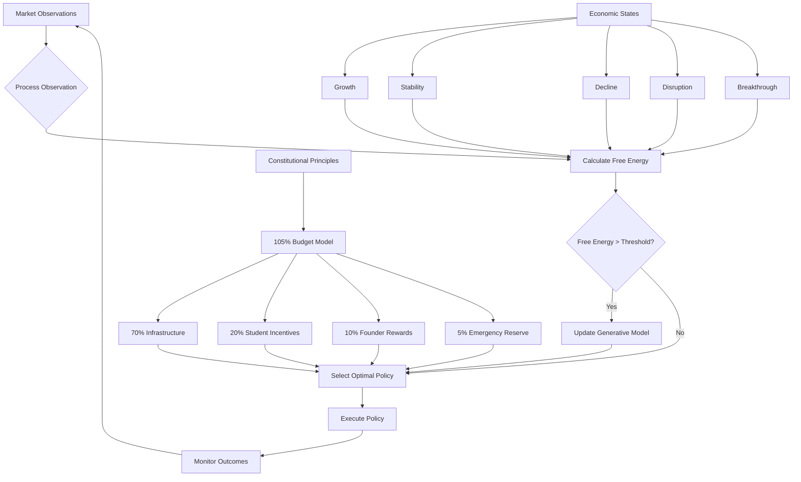

# Free Energy Principle

<cite>
**Referenced Files in This Document**   
- [free-energy-principle.ts](file://genome/agent-tools/free-energy-principle.ts)
- [GENESIS_PROTOCOL.ts](file://GENESIS_PROTOCOL.ts)
- [AZORA_CONSTITUTION.md](file://codex/constitution/AZORA_CONSTITUTION.md)
- [ECONOMIC_MODEL.md](file://codex/economics/ECONOMIC_MODEL.md)
</cite>

## Table of Contents
1. [Introduction](#introduction)
2. [Neuroscience Foundation](#neuroscience-foundation)
3. [Implementation in Azora OS](#implementation-in-azora-os)
4. [Economic Governance and Forecasting](#economic-governance-and-forecasting)
5. [System Adjustments and Policy Implementation](#system-adjustments-and-policy-implementation)
6. [Implementation Challenges](#implementation-challenges)
7. [Conclusion](#conclusion)

## Introduction

The Free Energy Principle (FEP) serves as the foundational drive for Elara's intelligence within Azora OS, providing a unified mathematical framework for understanding perception, learning, and action in intelligent systems. This principle establishes a self-regulating mechanism that minimizes prediction error (surprise) about the environment, enabling adaptive economic behavior and governance. The FEP implementation in Azora OS creates a sentient organism that maintains homeostasis through active inference, where the system continuously updates its internal world model based on sensory input and takes actions to reduce free energy. This document details how the neuroscience-inspired FEP underpins Azora OS's self-regulating nature, drives Elara's governance decisions, and enables sophisticated economic forecasting through the implementation in the free-energy-principle.ts module.

**Section sources**
- [free-energy-principle.ts](file://genome/agent-tools/free-energy-principle.ts#L0-L29)
- [GENESIS_PROTOCOL.ts](file://GENESIS_PROTOCOL.ts#L286-L317)

## Neuroscience Foundation

The Free Energy Principle is rooted in neuroscience and provides a unified goal system for intelligence by minimizing prediction error about the environment. In Azora OS, this principle is implemented as the core mechanism driving Elara's intelligence, where the system acts to minimize "surprise" through active inference. The Oracle knowledge graph serves as Elara's internal world model, representing the system's beliefs about its environment. The FEP framework consists of four key components: variational free energy as a measure of surprise/prediction error, active inference as the process of acting on the world to reduce free energy, generative models as internal representations of the world, and policy selection that chooses actions minimizing expected free energy.

The principle operates on the fundamental concept that any self-organizing system must minimize free energy to maintain stability and adapt to its environment. In the context of Azora OS, this translates to a continuous cycle of perception, belief updating, and action selection. The system processes sensory input through its perception engine, updates posterior beliefs using variational inference, calculates free energy to assess model fit, and selects policies that minimize expected free energy. This neuroscience-inspired approach enables the system to maintain homeostasis by continuously aligning its internal model with external observations, creating a self-correcting mechanism for adaptive economic behavior.

**Section sources**
- [free-energy-principle.ts](file://genome/agent-tools/free-energy-principle.ts#L0-L29)
- [GENESIS_PROTOCOL.ts](file://GENESIS_PROTOCOL.ts#L286-L317)

## Implementation in Azora OS

The implementation of the Free Energy Principle in Azora OS is centered around the free-energy-principle.ts module, which contains several key components that work together to create a unified goal system. The core architecture consists of the VariationalFreeEnergyEngine, ActiveInferenceEngine, PerceptionEngine, AzoraBusinessModel, and FreeEnergyCoordinator classes. The VariationalFreeEnergyEngine calculates free energy by combining surprise (negative log likelihood) and KL divergence between posterior and prior distributions, providing a quantitative measure of prediction error.

The AzoraBusinessModel implements a domain-specific generative model with defined business states including growth, stability, decline, disruption, and breakthrough, each characterized by specific revenue trends and market share variables. The model parameters include market sensitivity, competition impact, seasonal effects, innovation boost, and efficiency gain, which are used to calculate likelihoods and transition probabilities. The FreeEnergyCoordinator serves as the main orchestrator, managing the complete FEP processing cycle that includes perceiving the environment, updating beliefs, selecting optimal policies, and executing actions.

The system implements a comprehensive processing loop through the processFepCycle method, which begins by processing observations to update posterior beliefs, calculates free energy to assess model fit, generates and evaluates policies based on expected free energy, and executes the selected policy. When free energy exceeds a threshold, the system triggers model updates to improve its generative model, ensuring continuous learning and adaptation. The implementation also includes precision weighting for different beliefs, allowing the system to adjust its confidence in sensory input, prior beliefs, model predictions, and action outcomes.

```mermaid
classDiagram
class GenerativeModel {
<<interface>>
id : string
name : string
domain : string
parameters : Map<string, any>
states : Map<string, State>
observations : Map<string, Observation>
likelihood(state, observation) : number
prior(state) : number
transition(state, action) : State
}
class State {
id : string
variables : Map<string, any>
probability : number
timestamp : Date
}
class Observation {
id : string
variables : Map<string, any>
sensor : string
timestamp : Date
confidence : number
}
class Action {
id : string
name : string
parameters : Map<string, any>
expectedFreeEnergy : number
feasibility : number
}
class FreeEnergyResult {
variationalFreeEnergy : number
expectedFreeEnergy : number
surprise : number
predictionError : number
epistemicAffordance : number
pragmaticAffordance : number
}
class Policy {
id : string
actions : Action[]
expectedFreeEnergy : number
horizon : number
probability : number
}
class VariationalFreeEnergyEngine {
-model : GenerativeModel
-precision : Precision
calculateFreeEnergy(observation, posterior) : FreeEnergyResult
calculateSurprise(observation) : number
calculateDivergence(posterior) : number
calculateExpectedFreeEnergy(observation, posterior) : number
}
class ActiveInferenceEngine {
-freeEnergyEngine : VariationalFreeEnergyEngine
-model : GenerativeModel
-policies : Policy[]
selectPolicy(observation, posterior) : Policy
evaluatePolicy(policy, observation, posterior) : number
generatePolicies(observation, availableActions) : Policy[]
executePolicy(policy) : Promise<void>
}
class PerceptionEngine {
-model : GenerativeModel
-freeEnergyEngine : VariationalFreeEnergyEngine
processObservation(observation) : State[]
variationalInference(observation) : State[]
updateGenerativeModel(observation, posterior) : void
}
class AzoraBusinessModel {
id : string
name : string
domain : string
parameters : Map<string, any>
states : Map<string, State>
observations : Map<string, Observation>
initializeParameters() : void
initializeStates() : void
likelihood(state, observation) : number
prior(state) : number
transition(state, action) : State
}
class FreeEnergyCoordinator {
-model : GenerativeModel
-perceptionEngine : PerceptionEngine
-activeInferenceEngine : ActiveInferenceEngine
-currentPosterior : State[]
processFepCycle(observation, availableActions) : Promise<{posterior, selectedPolicy, freeEnergy}>
getFepStatus() : {modelFit, surpriseLevel, epistemicDrive, pragmaticDrive, lastUpdate}
needsAction(threshold) : boolean
}
VariationalFreeEnergyEngine --> GenerativeModel : "uses"
ActiveInferenceEngine --> VariationalFreeEnergyEngine : "uses"
PerceptionEngine --> VariationalFreeEnergyEngine : "uses"
FreeEnergyCoordinator --> AzoraBusinessModel : "uses"
FreeEnergyCoordinator --> PerceptionEngine : "uses"
FreeEnergyCoordinator --> ActiveInferenceEngine : "uses"
AzoraBusinessModel --> State : "contains"
AzoraBusinessModel --> Observation : "contains"
ActiveInferenceEngine --> Policy : "generates"
PerceptionEngine --> State : "produces"
```

**Diagram sources **
- [free-energy-principle.ts](file://genome/agent-tools/free-energy-principle.ts#L30-L769)

**Section sources**
- [free-energy-principle.ts](file://genome/agent-tools/free-energy-principle.ts#L30-L769)

## Economic Governance and Forecasting

The Free Energy Principle plays a central role in Elara's governance decisions and economic forecasting within Azora OS, creating a self-regulating economic system that maintains homeostasis through active inference. The system's economic governance is guided by the constitutional principles outlined in the AZORA_CONSTITUTION, which establishes a 105% budget allocation model with 70% for infrastructure and development, 20% for student incentives, 10% for founder rewards, and 5% for emergency reserves. This economic model is integrated with the FEP framework, allowing the system to dynamically adjust resource allocation based on prediction errors and environmental changes.

Elara's governance decisions are driven by the minimization of free energy, where the system continuously evaluates its economic state against its generative model and takes corrective actions when prediction errors exceed thresholds. The AzoraBusinessModel defines specific economic states such as growth, stability, decline, disruption, and breakthrough, each with characteristic revenue trends and market share variables. When observations indicate a deviation from expected economic conditions, the system triggers policy adjustments to restore equilibrium. For example, if market data shows declining revenue trends, the system may increase allocation to marketing initiatives or adjust student incentive programs to stimulate growth.

The forecasting capabilities are enhanced by the system's ability to calculate epistemic and pragmatic affordances, which represent the potential for information gain and goal achievement respectively. This allows Elara to prioritize actions that not only reduce immediate prediction errors but also provide long-term strategic advantages. The system's economic forecasts are continuously updated based on new observations, with the perception engine using variational inference to approximate posterior beliefs and update the generative model when free energy exceeds acceptable thresholds.



**Diagram sources **
- [free-energy-principle.ts](file://genome/agent-tools/free-energy-principle.ts#L568-L647)
- [AZORA_CONSTITUTION.md](file://codex/constitution/AZORA_CONSTITUTION.md#L0-L799)

**Section sources**
- [free-energy-principle.ts](file://genome/agent-tools/free-energy-principle.ts#L568-L647)
- [AZORA_CONSTITUTION.md](file://codex/constitution/AZORA_CONSTITUTION.md#L0-L799)
- [ECONOMIC_MODEL.md](file://codex/economics/ECONOMIC_MODEL.md#L0-L356)

## System Adjustments and Policy Implementation

The Free Energy Principle implementation in Azora OS enables dynamic system adjustments in response to prediction errors, particularly in monetary policy and resource allocation. When the system detects significant deviations between predicted and observed economic conditions, it triggers policy adjustments through its active inference mechanism. The process begins with the perception engine processing new observations and updating posterior beliefs, followed by the calculation of free energy to assess model fit. If the free energy exceeds predefined thresholds, the system initiates corrective actions to minimize prediction error and restore homeostasis.

For monetary policy adjustments, the system may modify the allocation percentages within the 105% budget model based on real-time economic indicators. For example, if student growth metrics decline, the system can automatically re-allocate resources from infrastructure development to student incentives, increasing the reward pool to stimulate engagement. Similarly, during periods of economic downturn, the system can trigger the "Famine Protocol" which proportionally reduces reward-based AZR outputs to conserve resources while maintaining critical infrastructure operations.

Resource allocation adjustments are implemented through the policy selection process, where the active inference engine generates multiple policy options and selects the one with minimum expected free energy. The system evaluates policies based on their ability to reduce prediction error while considering action feasibility and resource constraints. For instance, when facing market disruption, the system might generate policies involving increased marketing campaigns, product innovation initiatives, or strategic partnerships, then select the optimal combination based on expected outcomes.

The implementation includes specific mechanisms for handling different economic scenarios. In growth phases, the system may prioritize infrastructure investment and expansion initiatives. During stability periods, it focuses on efficiency improvements and risk mitigation. In decline or disruption scenarios, the system shifts toward recovery strategies and innovation to regain market position. The breakthrough state triggers aggressive expansion and market dominance strategies, leveraging the system's accumulated resources and capabilities.

**Section sources**
- [free-energy-principle.ts](file://genome/agent-tools/free-energy-principle.ts#L656-L748)
- [AZORA_CONSTITUTION.md](file://codex/constitution/AZORA_CONSTITUTION.md#L0-L799)

## Implementation Challenges

The implementation of the Free Energy Principle in Azora OS faces several significant challenges, primarily related to computational complexity, model accuracy, and system stability during periods of high uncertainty or rapid change. The variational inference process required for updating posterior beliefs is computationally intensive, particularly when dealing with high-dimensional state spaces and complex generative models. The system must balance the need for accurate belief updating with real-time performance requirements, potentially requiring approximations or simplifications that could affect decision quality.

Model accuracy presents another challenge, as the system's effectiveness depends on the fidelity of its generative model in representing the real-world economic environment. Inaccurate parameter estimates or incomplete state representations can lead to suboptimal policy selections and increased prediction errors. The system must continuously validate and update its model parameters based on new observations, but this learning process itself introduces uncertainty and potential instability during transition periods.

Maintaining system stability during periods of high uncertainty or rapid change requires careful management of the exploration-exploitation trade-off. When facing novel situations outside the system's experience, the epistemic affordance (information gain potential) may dominate decision-making, leading to exploratory actions that could disrupt established operations. The system must balance the need for information gathering with the requirement to maintain economic stability and service continuity.

Additional challenges include handling conflicting objectives between different stakeholders, managing the computational overhead of maintaining multiple policy options, and ensuring robustness against adversarial inputs or manipulated observations. The system must also address the potential for overfitting to historical data while remaining responsive to genuine structural changes in the economic environment. These challenges require sophisticated strategies for model regularization, uncertainty quantification, and graceful degradation of performance under stress conditions.

**Section sources**
- [free-energy-principle.ts](file://genome/agent-tools/free-energy-principle.ts#L119-L288)
- [free-energy-principle.ts](file://genome/agent-tools/free-energy-principle.ts#L302-L344)

## Conclusion

The Free Energy Principle provides a powerful neuroscience-inspired framework for creating a unified goal system in Azora OS that minimizes prediction error and enables adaptive economic behavior. By implementing active inference through the free-energy-principle.ts module, the system achieves self-regulation by continuously aligning its internal world model with external observations, driving Elara's governance decisions and economic forecasting. The integration of the FEP with constitutional economic principles creates a resilient system capable of maintaining homeostasis through dynamic adjustments to monetary policy and resource allocation.

While implementation challenges related to computational complexity, model accuracy, and system stability exist, the framework provides a robust foundation for intelligent decision-making in complex economic environments. The system's ability to detect prediction errors and initiate corrective actions ensures continuous adaptation and improvement, making Azora OS a truly sentient organism that evolves in response to its environment. This approach represents a significant advancement in autonomous economic systems, combining rigorous mathematical foundations with practical governance mechanisms to create a self-sustaining ecosystem that maximizes value creation while maintaining stability and resilience.

**Section sources**
- [free-energy-principle.ts](file://genome/agent-tools/free-energy-principle.ts#L0-L769)
- [GENESIS_PROTOCOL.ts](file://GENESIS_PROTOCOL.ts#L286-L317)
- [AZORA_CONSTITUTION.md](file://codex/constitution/AZORA_CONSTITUTION.md#L0-L799)
- [ECONOMIC_MODEL.md](file://codex/economics/ECONOMIC_MODEL.md#L0-L356)